# Zarządzanie udziałami w usłudze Azure Data Box Gateway przy użyciu witryny Azure Portal 

W tym artykule opisano sposób zarządzania udziałami w usłudze Azure Data Box Gateway. Usługą Azure Data Box Gateway można zarządzać w witrynie Azure Portal lub za pomocą lokalnego internetowego interfejsu użytkownika. Witryna Azure Portal umożliwia dodawanie, usuwanie i odświeżanie udziałów oraz synchronizowanie klucza magazynu dla konta magazynu skojarzonego z udziałami.

> [!IMPORTANT]
> - Usługa Data Box Gateway jest dostępna w wersji zapoznawczej. Przed zamówieniem i wdrożeniem tego rozwiązania zapoznaj się z [warunkami świadczenia usług Azure w wersji zapoznawczej](https://azure.microsoft.com/support/legal/preview-supplemental-terms/).

## Udziały — informacje

Aby przesłać dane na platformę Azure, należy utworzyć udziały w usłudze Azure Data Box Gateway. Udziały dodawane na urządzeniu Data Box Gateway są udziałami chmurowymi. Dane pochodzące z tych udziałów są automatycznie przekazywane do chmury. Wszystkie funkcje w chmurze, takie jak odświeżanie i synchronizowanie kluczy magazynu, mogą mieć zastosowanie do tych udziałów. Z udziałów chmurowych można korzystać, gdy dane urządzenia mają zostać automatycznie przesłane na konto magazynu w chmurze.

W tym artykule omówiono sposób wykonywania następujących zadań:

> [!div class="checklist"]
> * Dodawanie udziału
> * Usuwanie udziału
> * Odświeżanie udziałów
> * Synchronizowanie klucza magazynu

## Dodawanie udziału

Wykonaj następujące czynności w witrynie Azure Portal, aby utworzyć udział.

1. W witrynie Azure Portal przejdź do zasobu usługi Data Box Gateway, a następnie do sekcji **Przegląd**. Na pasku poleceń kliknij przycisk **+ Dodaj udział**.
2. W obszarze **Dodawanie udziału** określ ustawienia udziału. Podaj unikatową nazwę udziału.

    

    Nazwy udziałów mogą zawierać tylko cyfry, małe litery i łączniki. Nazwa udziału musi mieć długość od 3 do 63 znaków i rozpoczynać się literą lub cyfrą. Przed i za każdym łącznikiem musi znajdować się znak inny niż łącznik.

3. Wybierz **Typ** dla udziału. Dostępne są dwa typy — **SMB** i **NFS** — przy czym typ SMB jest domyślny. Typ SMB jest standardem dla klientów systemu Windows, natomiast typ NFS jest używany dla klientów systemu Linux. W zależności od tego, czy wybrano udział SMB czy NFS, wyświetlone opcje są nieco inne.

4. Podaj **konto magazynu**, w którym znajduje się udział. Na koncie magazynu zostanie utworzony kontener z nazwą udziału (jeśli jeszcze nie istnieje). Jeśli kontener już istnieje, zostanie użyty istniejący kontener.

5. W obszarze **Usługa magazynu** wybierz blokowy obiekt blob, stronicowy obiekt blob lub pliki. Wybrany typ usługi zależy od tego, jaki format mają mieć dane na platformie Azure. Na przykład w tym wypadku chcemy, aby dane zostały umieszczone na platformie Azure jako blokowe obiekty blob, dlatego wybierzemy opcję **Blokowy obiekt blob**. Jeśli wybierzesz opcję **Stronicowy obiekt blob**, upewnij się, że dane są wyrównane o 512 bajtów. Na przykład dysk VHDX jest zawsze wyrównany o 512 bajtów.

6. Ten krok zależy od tego, czy tworzysz udział SMB, czy udział NFS.
    - **W przypadku tworzenia udziału SMB** — w polu **Użytkownik lokalny ze wszystkimi uprawnieniami** wybierz pozycję **Utwórz nowy** lub **Użyj istniejącego**. W przypadku tworzenia nowego użytkownika lokalnego podaj **nazwę użytkownika**, **hasło**, a następnie potwierdź hasło. Spowoduje to przypisanie uprawnień do użytkownika lokalnego. Po przypisaniu uprawnień w tym miejscu możesz następnie zmodyfikować te uprawnienia przy użyciu Eksploratora plików.

        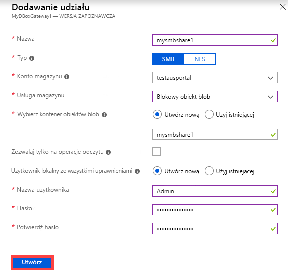

        Jeśli zaznaczysz opcję Zezwalaj tylko na operacje odczytu dla tego udziału danych, możesz określić użytkowników z uprawnieniami tylko do odczytu.
    - **W przypadku tworzenia udziału NFS** — należy podać **adresy IP dozwolonych klientów**, którzy mogą uzyskiwać dostęp do udziału.

        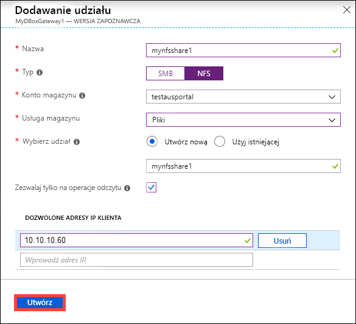

7. Kliknij pozycję **Utwórz**, aby utworzyć udział. Zostanie wyświetlone powiadomienie, że trwa tworzenie udziału. Po utworzeniu udziału z określonymi ustawieniami blok **Udziały** zostanie zaktualizowany, aby odzwierciedlić nowy udział.
 
## Usuwanie udziału

Wykonaj następujące czynności w witrynie Azure Portal, aby usunąć udział.

1. Na liście udziałów kliknij udział, który chcesz usunąć.

    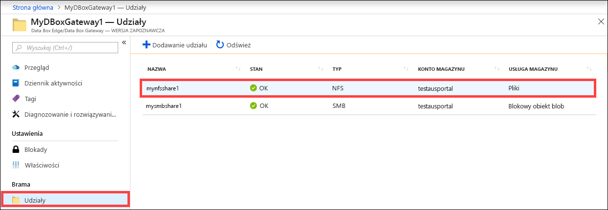

2. Kliknij polecenie **Usuń**. 

    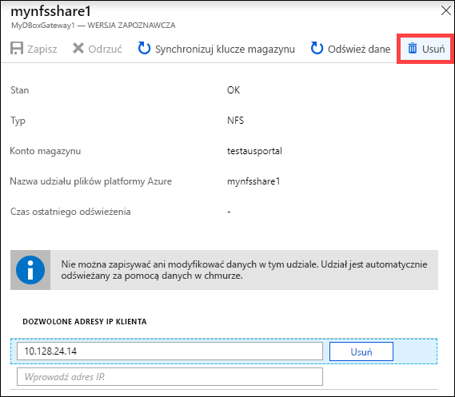

3. Po wyświetleniu monitu o potwierdzenie kliknij przycisk **Tak**.

    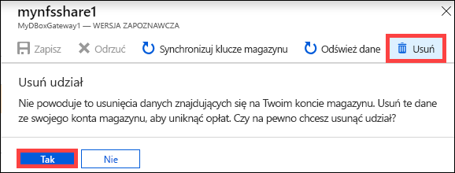

Lista udziałów zostanie zaktualizowana w celu uwzględnienia usuniętego udziału.

## Odświeżanie udziałów

Funkcja odświeżania umożliwia odświeżenie zawartości udziału lokalnego. Podczas odświeżania udziału inicjowane jest wyszukiwanie w celu odnalezienia wszystkich obiektów platformy Azure, w tym obiektów blob i plików, które zostały dodane do chmury po ostatnio przeprowadzonym odświeżaniu. Te dodatkowe pliki są następnie używane do odświeżenia zawartości udziału lokalnego na urządzeniu. 

Wykonaj następujące czynności w witrynie Azure Portal, aby odświeżyć udział.

1.  W witrynie Azure Portal przejdź do sekcji **Udziały**. Kliknij udział, który chcesz odświeżyć.

    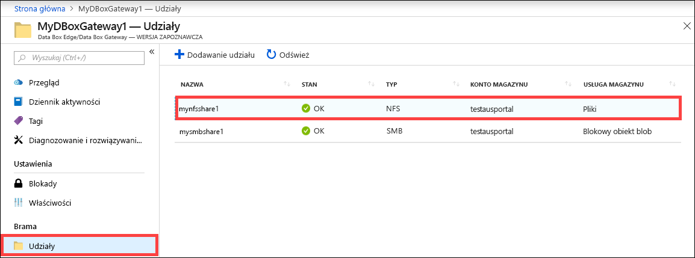

2.  Kliknij przycisk **Odśwież**. 

    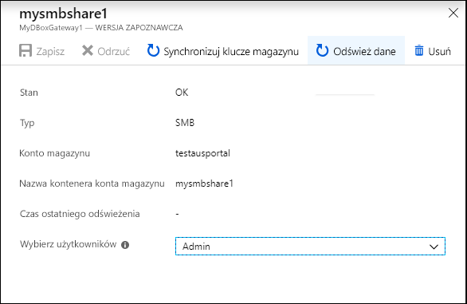
 
3.  Po wyświetleniu monitu o potwierdzenie kliknij przycisk **Tak**. Zadanie rozpoczyna odświeżanie zawartości udziału lokalnego. 

    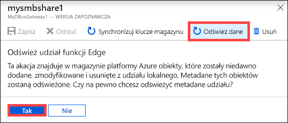
 
4.  W trakcie odświeżania opcja odświeżania jest wyszarzona w menu kontekstowym. Kliknij powiadomienie o zadaniu, aby wyświetlić stan zadania odświeżania.

5.  Czas odświeżania zależy od liczby plików w kontenerze platformy Azure, a także od liczby plików znajdujących się na urządzeniu. Po pomyślnym zakończeniu odświeżania znacznik czasu udziału zostanie zaktualizowany. Nawet w przypadku częściowego niepowodzenia odświeżania operacja zostanie uznana za zakończoną, a znacznik czasu zostanie zaktualizowany. 

    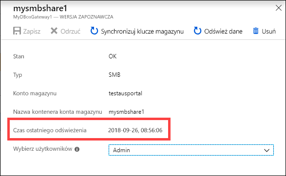
 
W przypadku awarii zostanie zgłoszony alert. Alert zawiera szczegółowe informacje o przyczynie awarii oraz zalecenia dotyczące rozwiązania problemu. Alert wskazuje również plik, który zawiera pełne podsumowanie awarii — w tym pliki, których nie udało się zaktualizować lub usunąć.

>[!IMPORTANT]
> W tej wersji zapoznawczej nie należy odświeżać więcej niż jednego udziału naraz.

## Synchronizowanie kluczy magazynu

Jeśli klucze konta magazynu zostały wymienione, należy zsynchronizować klucze dostępu do magazynu. Przeprowadzenie synchronizacji pozwala urządzeniu uzyskać najnowsze klucze do konta magazynu.

Wykonaj następujące czynności w witrynie Azure Portal, aby zsynchronizować klucz dostępu do magazynu.

1. W zasobie przejdź do sekcji **Przegląd**. 
2. Na liście udziałów kliknij udział skojarzony z kontem magazynu, które ma zostać zsynchronizowane. Kliknij przycisk **Synchronizuj klucz magazynu**. 

     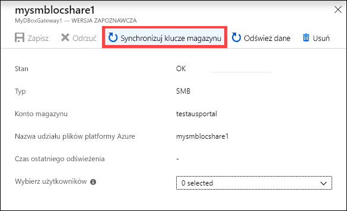

3. Po wyświetleniu monitu o potwierdzenie kliknij przycisk **Tak**. Po zakończeniu synchronizacji zamknij okno dialogowe.

     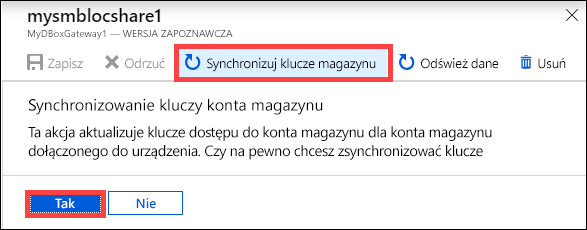

>[!NOTE]
> Wystarczy zrobić to raz dla danego konta magazynu. Nie trzeba powtarzać tej czynności dla wszystkich udziałów powiązanych z tym samym kontem magazynu.

## Następne kroki

- Dowiedz się, jak [Zarządzać użytkownikami w witrynie Azure Portal](data-box-gateway-manage-users.md).
