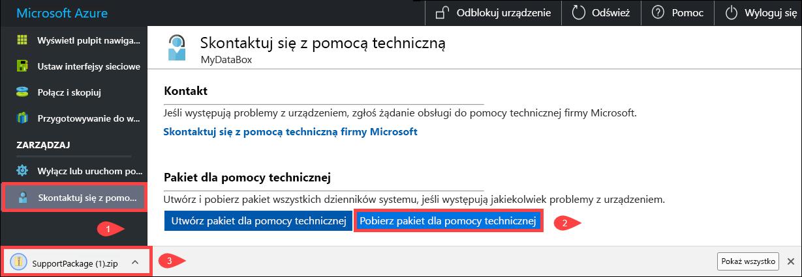
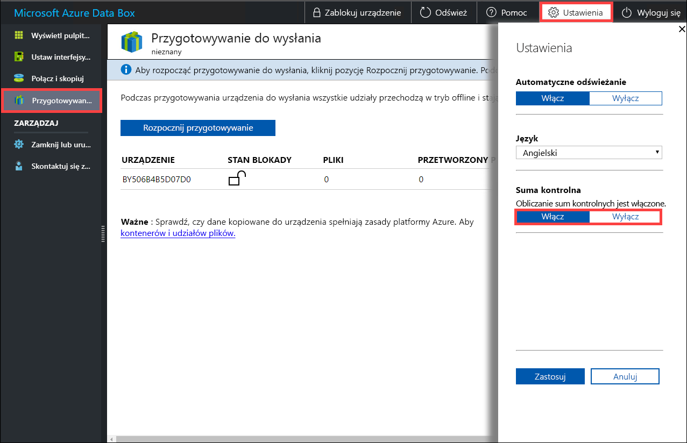

# <a name="use-the-local-web-ui-to-administer-your-data-box-and-data-box-heavy"></a>Użyj lokalnego interfejsu użytkownika sieci Web do administrowania urządzenie Data Box i Data Box Heavy

W tym artykule opisano niektóre zadania związane z konfiguracją i zarządzaniem, które można wykonywać na urządzeniach urządzenie Data Box i Data Box Heavy. Urządzeniami urządzenie Data Box i Data Box Heavy można zarządzać za pomocą interfejsu użytkownika Azure Portal oraz lokalnego interfejsu użytkownika sieci Web dla urządzenia. Ten artykuł dotyczy zadań, które można wykonywać za pomocą lokalnego internetowego interfejsu użytkownika.

Lokalny interfejs użytkownika sieci Web dla urządzenie Data Box i Data Box Heavy służy do wstępnej konfiguracji urządzenia. Możesz również użyć lokalnego interfejsu użytkownika sieci Web, aby zamknąć lub ponownie uruchomić urządzenie, uruchomić testy diagnostyczne, zaktualizować oprogramowanie, wyświetlić kopie dzienników i wygenerować pakiet dzienników dla pomoc techniczna firmy Microsoft. Na urządzeniu Data Box Heavy z dwoma niezależnymi węzłami możesz uzyskać dostęp do dwóch oddzielnych lokalnych interfejsów użytkownika sieci Web odpowiadających poszczególnym węzłom urządzenia.

W tym artykule zawarto następujące samouczki:

- Generowanie pakietu dla pomocy technicznej
- Zamykanie lub ponowne uruchamianie urządzenia
- Pobieranie zestawienia komponentów lub plików manifestu
- Wyświetlanie dostępnej pojemności urządzenia
- Pomijanie weryfikacji sumy kontrolnej

## <a name="generate-support-package"></a>Generowanie pakietu dla pomocy technicznej

Jeśli napotkasz jakiekolwiek problemy z urządzeniem, możesz utworzyć pakiet dla pomocy technicznej z dzienników systemu. Pomoc techniczna firmy Microsoft korzysta z tego pakietu podczas rozwiązywania problemów. Aby wygenerować pakiet pomocy technicznej, wykonaj następujące czynności:

1. W lokalnym internetowym interfejsie użytkownika przejdź do pozycji **Kontakt z pomocą techniczną** i kliknij przycisk **Tworzenie pakietu pomocy technicznej**.

    

2. Następuje zbieranie danych do pakietu dla pomocy technicznej. Ta operacja trwa kilka minut.

    

3. Po zakończeniu tworzenia pakietu dla pomocy technicznej kliknij przycisk **Pobierz pakiet dla pomocy technicznej**. 

    

4. Przejrzyj i wybierz lokalizację pobierania. Otwórz folder, aby wyświetlić jego zawartość.

    


## <a name="shut-down-or-restart-your-device"></a>Zamykanie lub ponowne uruchamianie urządzenia

Możesz zamknąć lub ponownie uruchomić urządzenie przy użyciu lokalnego interfejsu użytkownika sieci Web. Zaleca się, aby przed ponownym uruchomieniem przełączyć udziały w tryb offline na hoście, a następnie na urządzeniu. Minimalizuje to ryzyko uszkodzenia danych. Upewnij się, że kopiowanie danych nie jest w toku podczas wyłączania urządzenia.

Aby zamknąć urządzenie, wykonaj następujące czynności.

1. W lokalnym internetowym interfejsie użytkownika przejdź do pozycji **Zamknij lub uruchom ponownie**.
2. Kliknij przycisk **Zamknij**.

    

3. Po wyświetleniu monitu o potwierdzenie kliknij przycisk **OK**, aby kontynuować.

    

Aby ponownie włączyć wyłączone urządzenie, użyj przycisku zasilania na panelu przednim.

Aby ponownie uruchomić urządzenie Data Box, wykonaj następujące czynności.

1. W lokalnym internetowym interfejsie użytkownika przejdź do pozycji **Zamknij lub uruchom ponownie**.
2. Kliknij przycisk **Uruchom ponownie**.

    

3. Po wyświetleniu monitu o potwierdzenie kliknij przycisk **OK**, aby kontynuować.

   Urządzenie zostaje wyłączone i uruchomione ponownie.

## <a name="download-bom-or-manifest-files"></a>Pobieranie zestawienia komponentów lub plików manifestu

BOM lub pliki manifestu zawierają listę plików, które są kopiowane do urządzenie Data Box lub Data Box Heavy. Te pliki są generowane podczas przygotowywania urządzenia do wysłania.

Przed rozpoczęciem upewnij się, że urządzenie zostało wykonane **przygotowanie do wysłania** kroku. Wykonaj następujące kroki, aby pobrać zestawienie komponentów lub pliki manifestu:

1. Przejdź do lokalnego interfejsu użytkownika sieci Web dla Twojego urządzenia. Zobaczysz, że urządzenie zakończyło przygotowywanie do wysłania. Po zakończeniu przygotowywania urządzenia stan urządzenia ma wartość **Gotowe do wysyłki**.

    

2. Kliknij pozycję **Pobierz listę plików**, aby pobrać listę plików, które zostały skopiowane na urządzenie Data Box.

    

3. W Eksploratorze plików zauważysz, że jest generowana oddzielna lista plików w zależności od protokołu użytego do nawiązania połączenia z urządzeniem i od użytego typu magazynu usługi Azure Storage.

    

   Poniższa tabela zawiera mapowanie nazw plików na typ magazynu usługi Azure Storage i użyty protokół połączenia.

    |Nazwa pliku  |Typ magazynu usługi Azure Storage  |Użyty protokół połączenia |
    |---------|---------|---------|
    |databoxe2etest_BlockBlob.txt     |Blokowe obiekty blob         |SMB/NFS         |
    |databoxe2etest_PageBlob.txt     |Stronicowe obiekty blob         |SMB/NFS         |
    |databoxe2etest_AzFile-BOM.txt    |Azure Files         |SMB/NFS         |
    |databoxe2etest_PageBlock_Rest-BOM.txt     |Stronicowe obiekty blob         |REST        |
    |databoxe2etest_BlockBlock_Rest-BOM.txt    |Blokowe obiekty blob         |REST         |
    |mydbmdrg1_MDisk-BOM.txt    |Dysk zarządzany         |SMB/NFS         |
    |mydbmdrg2_MDisk-BOM.txt     |Dysk zarządzany         |SMB/NFS         |

Ta lista umożliwia weryfikację plików przekazanych do konta usługi Azure Storage po powrocie urządzenia Data Box do centrum danych platformy Azure. Poniżej przedstawiono przykładowy plik manifestu.

> [!NOTE]
> Na Data Box Heavy są obecne dwa zestawy list plików (pliki BOM) odpowiadające dwóm węzłom na urządzeniu.

```xml
<file size="52689" crc64="0x95a62e3f2095181e">\databox\media\data-box-deploy-copy-data\prepare-to-ship2.png</file>
<file size="22117" crc64="0x9b160c2c43ab6869">\databox\media\data-box-deploy-copy-data\connect-shares-file-explorer2.png</file>
<file size="57159" crc64="0x1caa82004e0053a4">\databox\media\data-box-deploy-copy-data\verify-used-space-dashboard.png</file>
<file size="24777" crc64="0x3e0db0cd1ad438e0">\databox\media\data-box-deploy-copy-data\prepare-to-ship5.png</file>
<file size="162006" crc64="0x9ceacb612ecb59d6">\databox\media\data-box-cable-options\cabling-dhcp-data-only.png</file>
<file size="155066" crc64="0x051a08d36980f5bc">\databox\media\data-box-cable-options\cabling-2-port-setup.png</file>
<file size="150399" crc64="0x66c5894ff328c0b1">\databox\media\data-box-cable-options\cabling-with-switch-static-ip.png</file>
<file size="158082" crc64="0xbd4b4c5103a783ea">\databox\media\data-box-cable-options\cabling-mgmt-only.png</file>
<file size="148456" crc64="0xa461ad24c8e4344a">\databox\media\data-box-cable-options\cabling-with-static-ip.png</file>
<file size="40417" crc64="0x637f59dd10d032b3">\databox\media\data-box-portal-admin\delete-order1.png</file>
<file size="33704" crc64="0x388546569ea9a29f">\databox\media\data-box-portal-admin\clone-order1.png</file>
<file size="5757" crc64="0x9979df75ee9be91e">\databox\media\data-box-safety\japan.png</file>
<file size="998" crc64="0xc10c5a1863c5f88f">\databox\media\data-box-safety\overload_tip_hazard_icon.png</file>
<file size="5870" crc64="0x4aec2377bb16136d">\databox\media\data-box-safety\south-korea.png</file>
<file size="16572" crc64="0x05b13500a1385a87">\databox\media\data-box-safety\taiwan.png</file>
<file size="999" crc64="0x3f3f1c5c596a4920">\databox\media\data-box-safety\warning_icon.png</file>
<file size="1054" crc64="0x24911140d7487311">\databox\media\data-box-safety\read_safety_and_health_information_icon.png</file>
<file size="1258" crc64="0xc00a2d5480f4fcec">\databox\media\data-box-safety\heavy_weight_hazard_icon.png</file>
<file size="1672" crc64="0x4ae5cfa67c0e895a">\databox\media\data-box-safety\no_user_serviceable_parts_icon.png</file>
<file size="3577" crc64="0x99e3d9df341b62eb">\databox\media\data-box-safety\battery_disposal_icon.png</file>
<file size="993" crc64="0x5a1a78a399840a17">\databox\media\data-box-safety\tip_hazard_icon.png</file>
<file size="1028" crc64="0xffe332400278f013">\databox\media\data-box-safety\electrical_shock_hazard_icon.png</file>
<file size="58699" crc64="0x2c411d5202c78a95">\databox\media\data-box-deploy-ordered\data-box-ordered.png</file>
<file size="46816" crc64="0x31e48aa9ca76bd05">\databox\media\data-box-deploy-ordered\search-azure-data-box1.png</file>
<file size="24160" crc64="0x978fc0c6e0c4c16d">\databox\media\data-box-deploy-ordered\select-data-box-option1.png</file>
<file size="115954" crc64="0x0b42449312086227">\databox\media\data-box-disk-deploy-copy-data\data-box-disk-validation-tool-output.png</file>
<file size="6093" crc64="0xadb61d0d7c6d4deb">\databox\data-box-cable-options.md</file>
<file size="6499" crc64="0x080add29add367d9">\databox\data-box-deploy-copy-data-via-nfs.md</file>
<file size="11089" crc64="0xc3ce6b13a4fe3001">\databox\data-box-deploy-copy-data-via-rest.md</file>
<file size="9126" crc64="0x820856b5a54321ad">\databox\data-box-overview.md</file>
<file size="10963" crc64="0x5e9a14f9f4784fd8">\databox\data-box-safety.md</file>
<file size="5941" crc64="0x8631d62fbc038760">\databox\data-box-security.md</file>
<file size="12536" crc64="0x8c8ff93e73d665ec">\databox\data-box-system-requirements-rest.md</file>
<file size="3220" crc64="0x7257a263c434839a">\databox\data-box-system-requirements.md</file>
<file size="2823" crc64="0x63db1ada6fcdc672">\databox\index.yml</file>
<file size="4364" crc64="0x62b5710f58f00b8b">\databox\data-box-local-web-ui-admin.md</file>
<file size="3603" crc64="0x7e34c25d5606693f">\databox\TOC.yml</file>
```

Ten plik zawiera listę wszystkich plików, które zostały skopiowane na urządzenie Data Box lub Data Box Heavy. W tym pliku wartość *crc64* odnosi się do sumy kontrolnej wygenerowanej dla odpowiadającego jej pliku.

## <a name="view-available-capacity-of-the-device"></a>Wyświetlanie dostępnej pojemności urządzenia

Aby wyświetlić dostępną i używaną pojemność urządzenia, można użyć jego pulpitu nawigacyjnego.

1. W lokalnym internetowym interfejsie użytkownika przejdź do pozycji **Wyświetl pulpit nawigacyjny**.
2. W obszarze **Połącz i skopiuj** jest wyświetlane wolne i zajęte miejsce na urządzeniu.

    

## <a name="skip-checksum-validation"></a>Pomijanie weryfikacji sumy kontrolnej

Suma kontrolna jest generowana domyślnie dla danych podczas przygotowywania do wysłania. W niektórych rzadkich przypadkach, w zależności od typu danych (małe rozmiary plików), wydajność może zostać zmniejszona. W takich przypadkach można pominąć generowanie sumy kontrolnej.

Zdecydowanie zaleca się, aby nie wyłączać sumy kontrolnej, chyba że jej generowanie ma znaczny wpływ na wydajność.

1. W prawym górnym rogu lokalnego interfejsu użytkownika sieci Web urządzenia przejdź do pozycji **Ustawienia**.

    

2. **Wyłącz** weryfikację sumy kontrolnej.
3. Kliknij przycisk **Zastosuj**.

## <a name="next-steps"></a>Następne kroki

- Dowiedz się, jak [zarządzać urządzenie Data Box i Data Box Heavy za pośrednictwem Azure Portal](data-box-portal-admin.md).

