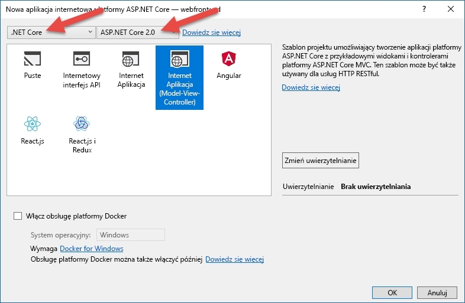
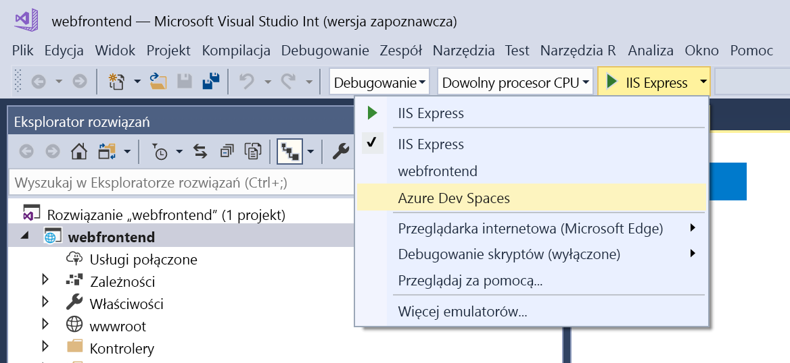
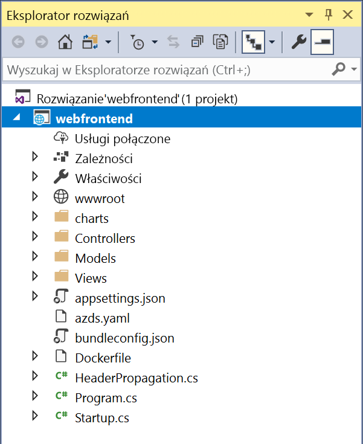

# Szybki start: tworzenie środowiska deweloperskiego Kubernetes za pomocą usługi Azure Dev Spaces (platforma .NET Core i program Visual Studio)

Ten przewodnik zawiera informacje na temat wykonywania następujących czynności:

- Tworzenie środowiska Kubernetes na platformie Azure zoptymalizowanego pod kątem programowania.
- Iteracyjne tworzenie kodu w kontenerach przy użyciu programu Visual Studio.

[!INCLUDE]

[!INCLUDE]

## Pobieranie narzędzi Visual Studio 
1. Zainstaluj najnowszą wersję programu [Visual Studio 2017](https://www.visualstudio.com/vs/).
1. Przy otwartym instalatorze programu Visual Studio upewnij się, że wybrano następujące obciążenie:
    * Tworzenie aplikacji na platformie ASP.NET i aplikacji internetowych
1. Zainstaluj [rozszerzenie programu Visual Studio dla usługi Azure Dev Spaces](https://aka.ms/get-azds-visualstudio).

Teraz możesz przystąpić do tworzenia aplikacji internetowej ASP.NET za pomocą programu Visual Studio.

## Tworzenie aplikacji sieci Web platformy ASP.NET

W programie Visual Studio 2017 utwórz nowy projekt. Obecnie projekt musi być **aplikacją internetową ASP.NET Core**. Nazwij projekt „**webfrontend**”.

Wybierz szablon **Aplikacja internetowa (Model-View-Controller)** i upewnij się, że na dwóch listach rozwijanych w górnej części okna dialogowego zostały wybrane pozycje **.NET Core** i **ASP.NET Core 2.0**. Kliknij przycisk **OK**, aby utworzyć projekt.

## Tworzenie środowiska deweloperskiego na platformie Azure

W usłudze Azure Dev Spaces możesz tworzyć środowiska deweloperskie oparte na środowisku Kubernetes, które są w pełni zarządzane przez platformę Azure i zoptymalizowane pod kątem tworzenia. Po otwarciu utworzonego przed chwilą projektu wybierz usługę **Azure Dev Spaces** z listy rozwijanej ustawień uruchamiania, jak pokazano poniżej.

W wyświetlonym oknie dialogowym upewnij się, że logujesz się przy użyciu odpowiedniego konta, a następnie wybierz istniejący klaster.

Na liście rozwijanej **Miejsce** zostaw na razie ustawienie domyślne `default`. Później dowiesz się więcej na temat tej opcji. Zaznacz pole wyboru **Publicznie dostępne**, aby aplikacja internetowa była dostępna za pośrednictwem publicznego punktu końcowego. To ustawienie nie jest wymagane, ale przyda się do zademonstrowania pewnych pojęć w dalszej części tego przewodnika. Nie przejmuj się — w każdym przypadku będzie można debugować witrynę internetową przy użyciu programu Visual Studio.

Kliknij przycisk **OK**, aby wybrać lub utworzyć klaster.

Jeśli wybierzesz klaster, który nie został skonfigurowany do pracy z usługą Azure Dev Spaces, zobaczysz komunikat z pytaniem, czy chcesz go skonfigurować.

Wybierz pozycję **OK**. 

W celu wykonania tej czynności zostanie uruchomione zadanie w tle. Ukończenie procedury zajmie kilka minut. Aby zobaczyć, czy zadanie jest w toku, umieść kursor myszy na ikonie **Zadania w tle** w lewym dolnym rogu paska stanu, jak pokazano na poniższej ilustracji.

> [!Note]
Dopóki środowisko deweloperskie nie zostanie pomyślnie utworzone, nie można debugować aplikacji.

## Przyglądanie się plikom dodanym do projektu
Czekając na utworzenie środowiska deweloperskiego, przyjrzyj się plikom, które zostały dodane do projektu podczas wybierania opcji korzystania ze środowiska deweloperskiego.

Najpierw zobaczysz, że został dodany folder o nazwie `charts`, a w tym folderze został utworzony szkielet [planu narzędzia Helm](https://docs.helm.sh) dla Twojej aplikacji. Te pliki służą do wdrażania aplikacji w środowisku deweloperskim.

Zobaczysz, że został dodany plik o nazwie `Dockerfile`. Ten plik zawiera informacje potrzebne do spakowania aplikacji w standardowym formacie Docker. Został także utworzony plik `HeaderPropagation.cs`, który omówimy w dalszej części przewodnika. 

Na koniec zobaczysz plik o nazwie `azds.yaml`, który zawiera informacje o konfiguracji wymagane przez środowisko deweloperskie, na przykład informacje o tym, czy aplikacja powinna być dostępna za pośrednictwem publicznego punktu końcowego.

## Debugowanie kontenera w środowisku Kubernetes
Po pomyślnym utworzeniu środowiska deweloperskiego możesz debugować aplikację. Ustaw punkt przerwania w kodzie, na przykład w wierszu 20 pliku `HomeController.cs`, w którym jest ustawiona zmienna `Message`. Naciśnij klawisz **F5**, aby rozpocząć debugowanie. 

Program Visual Studio będzie komunikować się ze środowiskiem deweloperskim w celu skompilowania i wdrożenia aplikacji, a następnie otworzy przeglądarkę z uruchomioną aplikacją internetową. Może się wydawać, że kontener działa lokalnie, ale faktycznie jest on uruchamiany w środowisku deweloperskim na platformie Azure. Przyczyną utworzenia adresu hosta lokalnego jest utworzenie przez usługę Azure Dev Spaces tymczasowego tunelu SSH w kontenerze uruchomionym na platformie Azure.

Kliknij link **Informacje** w górnej części strony, aby wyzwolić punkt przerwania. Masz pełny dostęp do informacji debugowania, takich jak stos wywołań, zmienne lokalne, informacje o wyjątkach itd., zupełnie jakby kod był wykonywany lokalnie.

## Następne kroki

> [!div class="nextstepaction"]
> [Working with multiple containers and team development (Praca z wieloma kontenerami i programowanie zespołowe)](get-started-netcore-visualstudio.md#call-another-container)