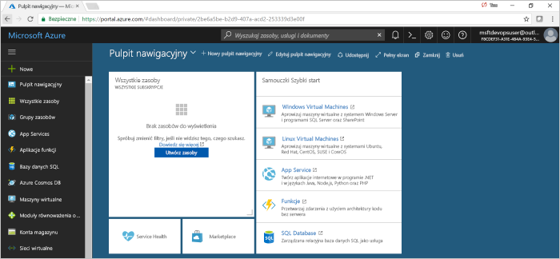
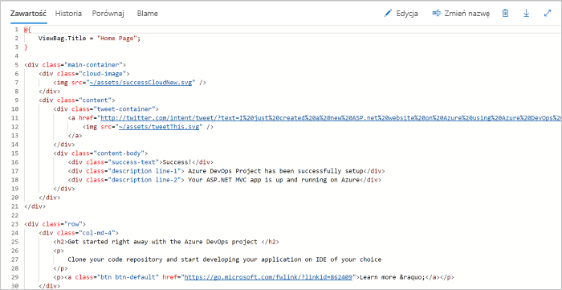

# Tworzenie potoku ciągłej integracji/ciągłego wdrażania dla platformy .NET za pomocą usługi DevOps Projects

Skonfiguruj proces ciągłej integracji i ciągłego dostarczania dla aplikacji platformy .NET Core lub ASP.NET w projekcie usługi Azure DevOps. Usługa DevOps Projects ułatwia początkową konfigurację potoku kompilacji i wydania w usłudze Azure Pipelines.

Jeśli nie masz subskrypcji platformy Azure, możesz uzyskać ją bezpłatnie za pośrednictwem programu [Visual Studio Dev Essentials](https://visualstudio.microsoft.com/dev-essentials/).

## Logowanie się do witryny Azure Portal

Usługa DevOps Projects tworzy potok ciągłej integracji/ciągłego wdrażania w usłudze Azure DevOps. Możesz utworzyć nową organizację usługi Azure DevOps lub użyć istniejącej organizacji. Usługa DevOps Projects tworzy również zasoby platformy Azure w wybranej subskrypcji platformy Azure.

1. Zaloguj się do [Portalu Microsoft Azure](https://portal.azure.com).

1. W lewym okienku wybierz ikonę **Utwórz zasób** na pasku nawigacyjnym po lewej stronie, a następnie wyszukaj hasło **DevOps Projects**.  

3.  Wybierz pozycję **Utwórz**.

    

## Wybieranie przykładowej aplikacji i usługi platformy Azure

1. Wybierz przykładową aplikację platformy .NET. Przykłady platformy .NET umożliwiają wybór struktury ASP.NET typu open source lub międzyplatformowej struktury .NET Core.

    

1. Wybierz strukturę aplikacji .NET Core.  
    Ten przykład to aplikacja ASP.NET Core MVC.
    
2. Wybierz opcję **Dalej**.  
    Domyślnym celem wdrożenia jest funkcja Web App on Windows.  Opcjonalnie możesz wybrać opcję Web App on Linux lub Web App for Containers.  Wybrana poprzednio struktura aplikacji decyduje o dostępnym w tym miejscu typie celu wdrożenia usługi platformy Azure.  
    
3. Pozostaw usługę domyślną, a następnie wybierz pozycję **Dalej**.

## Konfigurowanie usługi Azure DevOps i subskrypcji platformy Azure 

1. Utwórz bezpłatnie nową organizację usługi Azure DevOps lub wybierz istniejącą organizację.

    a. Wybierz nazwę projektu. 

    b. Wybierz lokalizację i subskrypcję platformy Azure, wybierz nazwę aplikacji, a następnie wybierz przycisk **Gotowe**.  
    Po kilku minutach w witrynie Azure Portal zostanie wyświetlony pulpit nawigacyjny usługi DevOps Projects. Aplikacja przykładowa zostanie skonfigurowana w repozytorium w organizacji usługi Azure DevOps, skompilowana i wdrożona na platformie Azure. Ten pulpit nawigacyjny zapewnia wgląd w repozytorium kodu, potok ciągłej integracji/ciągłego wdrażania i aplikację na platformie Azure.
    

2. Po prawej stronie pulpitu nawigacyjnego wybierz pozycję **Przeglądaj**, aby wyświetlić uruchomioną aplikację.

     

## Zatwierdzanie zmian kodu i wykonywanie ciągłej integracji/ciągłego wdrażania

 Usługa DevOps Projects utworzyła repozytorium Git w usłudze Azure Repos lub GitHub. Aby wyświetlić repozytorium i wprowadzić zmiany w kodzie aplikacji, wykonaj poniższe kroki:

1. Z lewej strony pulpitu nawigacyjnego usługi DevOps Projects wybierz link dla gałęzi **master**.  
Ten link otwiera widok nowo utworzonego repozytorium Git.

1. Aby wyświetlić adres URL klonowania repozytorium, wybierz pozycję **Klonuj** w prawym górnym rogu przeglądarki.  
Możesz sklonować repozytorium Git w wybranym środowisku IDE.  W kolejnych kilku krokach użyjesz przeglądarki internetowej, aby dokonać zmian w kodzie i zatwierdzić je bezpośrednio w gałęzi master.

1. W lewej części przeglądarki przejdź do pliku **Views/Home/index.cshtml**.

1. Wybierz pozycję **Edytuj** i wprowadź zmianę w nagłówku h2. Wpisz na przykład hasło **Zaczynamy pracę z usługą Azure DevOps Projects** lub wprowadź inną zmianę.

    

1. Wybierz pozycję **Zatwierdź**, a następnie zapisz zmiany.

1. W przeglądarce przejdź do pulpitu nawigacyjnego projektu usługi Azure DevOps.  W tym momencie powinna być widoczna trwająca kompilacja. Wprowadzone zmiany są automatycznie kompilowane i wdrażane za pośrednictwem potoku ciągłej integracji/ciągłego wdrażania.

## Badanie potoku ciągłej integracji/ciągłego wdrażania

W poprzednim kroku usługa Azure DevOps Projects automatycznie skonfigurowała pełny potok ciągłej integracji/ciągłego wdrażania. Możesz przeglądać i dostosowywać potok według potrzeb. Wykonaj poniższe kroki, aby zapoznać się z potokami kompilacji i wydania usługi Azure DevOps.

1. U góry pulpitu nawigacyjnego usługi DevOps Projects wybierz pozycję **Potoki kompilacji**.  
Ten link otwiera kartę przeglądarki i potok kompilacji usługi Azure DevOps dla nowego projektu.

1. Wybierz symbol wielokropka (...).  Ta akcja powoduje otwarcie menu, w którym możesz uruchomić kilka działań, takich jak dodawanie nowej kompilacji do kolejki, wstrzymywanie kompilacji i edytowanie potoku kompilacji.

1. Wybierz pozycję **Edit** (Edytuj).

    

1. W tym okienku możesz zapoznać się z różnymi zadaniami w potoku kompilacji.  
 W ramach kompilacji są wykonywane różne zadania, takie jak pobieranie źródeł z repozytorium Git, przywracanie zależności i publikowanie danych wyjściowych używanych do wdrożenia.

1. W górnej części potoku kompilacji wybierz jego nazwę.

1. Zmień nazwę potoku kompilacji na bardziej opisową, wybierz pozycję **Zapisz i dodaj do kolejki**, a następnie wybierz pozycję **Zapisz**.

1. W obszarze nazwy potoku kompilacji wybierz pozycję **Historia**.   
W okienku **Historia** zostanie wyświetlony dziennik inspekcji zmian ostatnio wprowadzonych w kompilacji.  Usługa Azure Pipelines śledzi wszelkie zmiany wprowadzone do potoku kompilacji i pozwala na porównanie wersji.

1. Wybierz pozycję **Wyzwalacze**.  
Usługa DevOps Projects automatycznie utworzyła wyzwalacz ciągłej integracji — każde zatwierdzenie w repozytorium uruchamia nową kompilację.  Opcjonalnie możesz zdecydować się dołączyć gałęzie do procesu ciągłej integracji lub je wykluczyć.

1. Wybierz pozycję **Przechowywanie**.  
W zależności od scenariusza możesz określić zasady przechowywania lub usuwania pewnej liczby kompilacji.

1. Wybierz pozycję **Kompilacja i wydanie**, a następnie wybierz pozycję **Wydania**.  
Usługa DevOps Projects tworzy potok wydania w celu zarządzania wdrożeniami na platformie Azure.

1.  Po lewej stronie wybierz symbol wielokropka (...) obok potoku wydania, a następnie wybierz pozycję **Edytuj**.  
Potok wydania zawiera potok, który definiuje proces tworzenia wydania.  

1. W obszarze **Artefakty** wybierz polecenie **Porzuć**.  Potok kompilacji przedstawiony w poprzednich krokach generuje dane wyjściowe używane na potrzeby artefaktu. 

1. Obok ikony **Porzuć** wybierz pozycję **Wyzwalacz ciągłego wdrażania**.  
Ten potok wydania ma włączony wyzwalacz ciągłego wdrażania, który przeprowadza wdrożenie za każdym razem, gdy jest dostępny nowy artefakt kompilacji. Opcjonalnie możesz wyłączyć wyzwalacz. Wtedy wdrożenia będą wymagać ręcznego wykonania.  

1. Po lewej stronie wybierz pozycję **Zadania**.   
Zadania to działania wykonywane w procesie wdrażania. W tym przykładzie zostało utworzone zadanie w celu wdrożenia w usłudze Azure App Service.

1. Po prawej stronie wybierz pozycję **Wyświetl wydania**. Ten widok przedstawia historię wersji.

1. Wybierz symbol wielokropka (...) obok jednego z wydań i wybierz pozycję **Otwórz**.  
Dostępnych jest kilka menu, z którymi możesz się zapoznać, na przykład podsumowanie wydań, skojarzone elementy robocze i testy.

1. Wybierz pozycję **Zatwierdzenia**.   
Ten widok przedstawia zatwierdzenia kodu skojarzone z konkretnym wdrożeniem. 

1. Wybierz pozycję **Dzienniki**.  
Dzienniki zawierają przydatne informacje na temat procesu wdrażania. Mogą być wyświetlane zarówno podczas wdrożeń, jak i po nich.

## Oczyszczanie zasobów

Gdy usługa Azure App Service i inne utworzone powiązane zasoby nie będą już potrzebne, możesz je usunąć. Użyj funkcji **Usuń** na pulpicie nawigacyjnym usługi DevOps Projects.

## Kolejne kroki

Aby dowiedzieć się więcej na temat modyfikowania potoków kompilacji i wydania w celu dopasowania ich do potrzeb Twojego zespołu, zapoznaj się z samouczkiem:

> [!div class="nextstepaction"]
> [Dostosowywanie procesu ciągłego wdrażania](https://docs.microsoft.com/azure/devops/pipelines/release/define-multistage-release-process?view=vsts)

## Filmy wideo

> [!VIDEO https://www.youtube.com/embed/itwqMf9aR0w]
