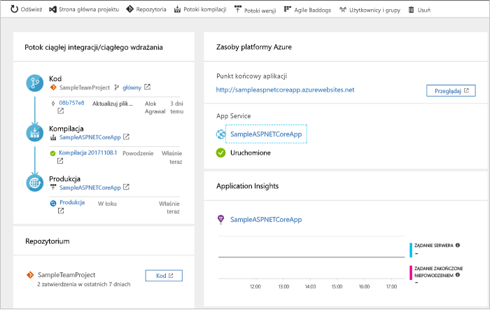
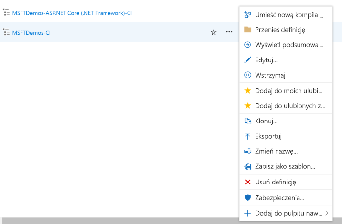

# Tworzenie potoku ciągłej integracji/ciągłego wdrażania dla platformy .NET przy użyciu usługi Azure DevOps Starter

Skonfiguruj ciągłą integrację (CI) i ciągłe dostarczanie (CD) dla aplikacji platformy .NET Core lub ASP.NET z DevOps Starter. DevOps Starter upraszcza konfigurację początkową potoku kompilacji i wydania w Azure Pipelines.

Jeśli nie masz subskrypcji platformy Azure, możesz uzyskać ją bezpłatnie za pośrednictwem programu [Visual Studio Dev Essentials](https://visualstudio.microsoft.com/dev-essentials/).

## Logowanie się do witryny Azure Portal

DevOps Starter tworzy potok ciągłej integracji/ciągłego wdrażania na platformie Azure DevOps. Możesz utworzyć nową organizację usługi Azure DevOps lub użyć istniejącej organizacji. DevOps Starter tworzy również zasoby platformy Azure w wybranej subskrypcji platformy Azure.

1. Zaloguj się do witryny [Microsoft Azure Portal](https://portal.azure.com).

1. W polu wyszukiwania wpisz **DevOps Starter**, a następnie wybierz opcję. Kliknij przycisk **Dodaj** , aby utworzyć nowy. 

    

## Wybieranie przykładowej aplikacji i usługi platformy Azure

1. Wybierz przykładową aplikację **.NET**. Przykłady platformy .NET umożliwiają wybór struktury ASP.NET typu open source lub międzyplatformowej struktury .NET Core.

   

2. Ten przykład to aplikacja ASP.NET Core MVC. Wybierz platformę aplikacji **.NET Core** , a następnie wybierz przycisk **dalej**.    
    
3. Wybierz pozycję **aplikacja sieci Web systemu Windows** jako element docelowy wdrożenia, a następnie wybierz pozycję **dalej**. Opcjonalnie możesz wybrać inne usługi platformy Azure dla danego wdrożenia. Wybrana wcześniej struktura aplikacji określa typ miejsca docelowego wdrożenia usługi platformy Azure, który jest dostępny tutaj.

## Konfigurowanie usługi Azure DevOps i subskrypcji platformy Azure 

1. Wprowadź **nazwę projektu**.

2. Utwórz nową organizację bezpłatnej **usługi Azure DevOps** lub wybierz istniejącą organizację z listy rozwijanej.

3. Wybierz swoją **subskrypcję platformy Azure**, wprowadź nazwę **aplikacji sieci Web** lub wybierz ją jako **domyślną.** Po kilku minutach w Azure Portal zostanie wyświetlona wartość przegląd wdrożenia DevOps Starter. 

4. Wybierz pozycję **Przejdź do zasobu** , aby wyświetlić pulpit nawigacyjny DevOps Starter. W prawym górnym rogu Przypnij **projekt** do pulpitu nawigacyjnego, aby uzyskać szybki dostęp. Przykładowa aplikacja jest skonfigurowana w repozytorium w **organizacji usługi Azure DevOps**. Kompilacja jest wykonywana, a Twoja aplikacja jest wdrażana na platformie Azure.

5. Pulpit nawigacyjny zapewnia wgląd do repozytorium kodu, potoku ciągłej integracji/ciągłego wdrażania i aplikacji na platformie Azure. W obszarze zasoby platformy Azure wybierz pozycję **Przeglądaj** , aby wyświetlić uruchomioną aplikację.

    

## Zatwierdzanie zmian kodu i wykonywanie ciągłej integracji/ciągłego wdrażania

DevOps Starter utworzył repozytorium Git w Azure Repos lub GitHub. Aby wyświetlić repozytorium i wprowadzić zmiany w kodzie aplikacji, wykonaj poniższe kroki:

1. Po lewej stronie pulpitu nawigacyjnego DevOps Starter wybierz link do gałęzi **głównej** . Ten link otwiera widok nowo utworzonego repozytorium Git.

2. W następnych kilku krokach można użyć przeglądarki sieci Web, aby wprowadzić zmiany w kodzie i zatwierdzić je bezpośrednio w gałęzi **głównej** . Możesz również sklonować repozytorium Git w ulubionym środowisku IDE, wybierając **klon** w prawym górnym rogu strony repozytorium. 

3. Po lewej stronie przejdź do struktury plików aplikacji do **Application/ASPNET-Core-dotnet-Core/Pages/index. cshtml**.

4. Wybierz pozycję **Edytuj** i wprowadź zmianę w nagłówku h2. Na przykład wpisz Rozpocznij od razu **z platformą Azure DevOps Starter** lub wprowadź inne zmiany.

      

5. Wybierz pozycję **Zatwierdź**, pozostaw komentarz i ponownie wybierz pozycję **Zatwierdź** .

6. W przeglądarce przejdź do pulpitu nawigacyjnego Starter usługi Azure DevOps.  W tym momencie powinna być widoczna trwająca kompilacja. Wprowadzone zmiany są automatycznie kompilowane i wdrażane za pośrednictwem potoku ciągłej integracji/ciągłego wdrażania.

## Badanie potoku ciągłej integracji/ciągłego wdrażania

W poprzednim kroku usługa Azure DevOps Starter automatycznie skonfigurowała pełny potok ciągłej integracji/ciągłego dostarczania. Możesz przeglądać i dostosowywać potok według potrzeb. Wykonaj poniższe kroki, aby zapoznać się z potokami kompilacji i wydania usługi Azure DevOps.

1. W górnej części pulpitu nawigacyjnego DevOps początkowy wybierz pozycję **potoki kompilacji**. Ten link otwiera kartę przeglądarki i potok kompilacji usługi Azure DevOps dla nowego projektu.

1. Wybierz wielokropek (...).  Ta akcja powoduje otwarcie menu, w którym można rozpocząć kilka działań, takich jak kolejkowanie nowej kompilacji, wstrzymywanie kompilacji i edytowanie potoku kompilacji.

1. Kliknij pozycję **Edytuj**.

    

1. W tym okienku możesz zapoznać się z różnymi zadaniami w potoku kompilacji. W ramach kompilacji są wykonywane różne zadania, takie jak pobieranie źródeł z repozytorium Git, przywracanie zależności i publikowanie danych wyjściowych używanych do wdrożenia.

1. W górnej części potoku kompilacji wybierz jego nazwę.

1. Zmień nazwę potoku kompilacji na bardziej opisową, wybierz pozycję **Zapisz i dodaj do kolejki**, a następnie wybierz pozycję **Zapisz**.

1. W obszarze nazwy potoku kompilacji wybierz pozycję **Historia**.   
W okienku **Historia** zostanie wyświetlony dziennik inspekcji zmian ostatnio wprowadzonych w kompilacji.  Usługa Azure Pipelines śledzi wszelkie zmiany wprowadzone do potoku kompilacji i pozwala na porównanie wersji.

1. Wybierz pozycję **Wyzwalacze**. DevOps Starter automatycznie utworzył wyzwalacz CI i każde zatwierdzenie do repozytorium uruchamia nową kompilację. Opcjonalnie możesz zdecydować się dołączyć gałęzie do procesu ciągłej integracji lub je wykluczyć.

1. Wybierz pozycję **Przechowywanie**. W zależności od scenariusza możesz określić zasady przechowywania lub usuwania pewnej liczby kompilacji.

1. Wybierz pozycję **Kompilacja i wydanie**, a następnie wybierz pozycję **Wydania**.  
DevOps Starter tworzy potok wydania do zarządzania wdrożeniami na platformie Azure.

1.  Po lewej stronie wybierz symbol wielokropka (...) obok potoku wydania, a następnie wybierz pozycję **Edytuj**. Potok wydania zawiera potok, który definiuje proces tworzenia wydania.  

1. W obszarze **Artefakty** wybierz polecenie **Porzuć**. Potok kompilacji przedstawiony w poprzednich krokach generuje dane wyjściowe używane na potrzeby artefaktu. 

1. Obok ikony **Porzuć** wybierz pozycję **Wyzwalacz ciągłego wdrażania**. Ten potok wydania ma włączony wyzwalacz ciągłego wdrażania, który przeprowadza wdrożenie za każdym razem, gdy jest dostępny nowy artefakt kompilacji. Opcjonalnie możesz wyłączyć wyzwalacz. Wtedy wdrożenia będą wymagać ręcznego wykonania.  

1. Po lewej stronie wybierz pozycję **Zadania**.  Zadania to działania wykonywane w procesie wdrażania. W tym przykładzie zostało utworzone zadanie w celu wdrożenia w usłudze Azure App Service.

1. Po prawej stronie wybierz pozycję **Wyświetl wydania**. Ten widok przedstawia historię wersji.

1. Wybierz symbol wielokropka (...) obok jednego z wydań i wybierz pozycję **Otwórz**. Dostępnych jest kilka menu, z którymi możesz się zapoznać, na przykład podsumowanie wydań, skojarzone elementy robocze i testy.

1. Wybierz pozycję **Zatwierdzenia**. Ten widok przedstawia zatwierdzenia kodu skojarzone z konkretnym wdrożeniem. 

1. Wybierz pozycję **dzienniki**. Dzienniki zawierają przydatne informacje na temat procesu wdrażania. Mogą być wyświetlane zarówno podczas wdrożeń, jak i po nich.

## Czyszczenie zasobów

Gdy usługa Azure App Service i inne utworzone powiązane zasoby nie będą już potrzebne, możesz je usunąć. Użyj funkcji **usuwania** na pulpicie nawigacyjnym DevOps Starter.

## Następne kroki

Aby dowiedzieć się więcej na temat modyfikowania potoków kompilacji i wydania w celu dopasowania ich do potrzeb Twojego zespołu, zapoznaj się z samouczkiem:

> [!div class="nextstepaction"]
> [Dostosowywanie procesu ciągłego wdrażania](https://docs.microsoft.com/azure/devops/pipelines/release/define-multistage-release-process?view=vsts)

## Filmy wideo

> [!VIDEO https://www.youtube.com/embed/itwqMf9aR0w]
