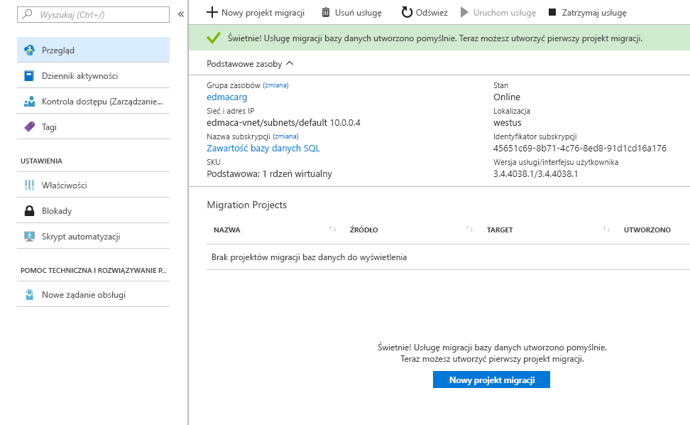

# Szybki start: tworzenie wystąpienia usługi Azure Database Migration Service przy użyciu witryny Azure Portal

W tym przewodniku szybki start utworzysz wystąpienie Azure Database Migration Service za pomocą Azure Portal.  Po utworzeniu wystąpienia można użyć go do migracji danych z SQL Server do Azure SQL Database.

Jeśli nie masz subskrypcji platformy Azure, przed rozpoczęciem utwórz [bezpłatne](https://azure.microsoft.com/free/) konto.

## Logowanie się do witryny Azure Portal

Otwórz przeglądarkę internetową, przejdź do witryny [Microsoft Azure Portal](https://portal.azure.com/), a następnie wprowadź swoje poświadczenia, aby zalogować się w portalu.

Widok domyślny to pulpit nawigacyjny usług.

> [!NOTE]
> Można utworzyć maksymalnie 10 wystąpień usługi DMS na subskrypcję. Jeśli potrzebujesz większej liczby wystąpień, Utwórz bilet pomocy technicznej.

## Rejestrowanie dostawcy zasobów

Przed utworzeniem pierwszego wystąpienia usługi Database Migration Service zarejestruj dostawcę zasobów Microsoft.DataMigration.

1. W witrynie Azure Portal wybierz pozycję **Wszystkie usługi**, a następnie wybierz pozycję **Subskrypcje**.

2. Wybierz subskrypcję, w której chcesz utworzyć wystąpienie Azure Database Migration Service, a następnie wybierz pozycję **dostawcy zasobów**.

3. Wyszukaj pozycję migracja, a następnie po prawej stronie **programu Microsoft. datamigration** wybierz pozycję **zarejestruj**.

    

## Tworzenie wystąpienia usługi

1. Wybierz pozycję +**Utwórz zasób** , aby utworzyć wystąpienie Azure Database Migration Service.

2. Wyszukaj w witrynie Marketplace hasło „migration”, wybierz pozycję **Azure Database Migration Service**, a następnie na ekranie **Azure Database Migration Service** wybierz pozycję **Utwórz**.

3. Na ekranie **Tworzenie usługi migracji**:

    - Wybierz **nazwę usługi** , która jest dopamiętana i unikatowa, aby zidentyfikować wystąpienie Azure Database Migration Service.
    - Wybierz **subskrypcję** platformy Azure, w której chcesz utworzyć wystąpienie.
    - Wybierz istniejącą **grupę zasobów** lub Utwórz nową.
    - Wybierz pozycję **Lokalizacja** położoną najbliżej Twojego serwera źródłowego lub docelowego.
    - Wybierz istniejącą **sieć wirtualną** lub utwórz ją.

        Sieć wirtualna zapewnia Azure Database Migration Service z dostępem do źródłowej bazy danych i środowiska docelowego.

        Aby uzyskać więcej informacji na temat sposobu tworzenia sieci wirtualnej w Azure Portal, zobacz artykuł [Tworzenie sieci wirtualnej przy użyciu Azure Portal](../virtual-network/quick-create-portal.md).

    - Wybierz opcję Podstawowa: 1 rdzeń wirtualny dla pozycji **Warstwa cenowa**.

        

4. Wybierz pozycję **Utwórz**.

    Po kilku chwilach wystąpienie usługi Azure Database Migration Service jest tworzone i gotowe do użycia. Azure Database Migration Service wyświetlane jak pokazano na poniższej ilustracji:

    

## Czyszczenie zasobów

Możesz wyczyścić zasoby utworzone w tym przewodniku Szybki start, usuwając [grupę zasobów platformy Azure](../azure-resource-manager/management/overview.md). Aby usunąć grupę zasobów, przejdź do utworzonego wystąpienia usługi Azure Database Migration Service. Wybierz nazwę w obszarze **Grupa zasobów**, a następnie wybierz pozycję **Usuń grupę zasobów**. Ta akcja spowoduje usunięcie wszystkich zasobów w grupie zasobów, a także usunięcie samej grupy.

## Następne kroki

> [!div class="nextstepaction"]
> [Migrowanie z programu SQL Server do usługi Azure SQL Database](tutorial-sql-server-to-azure-sql.md)