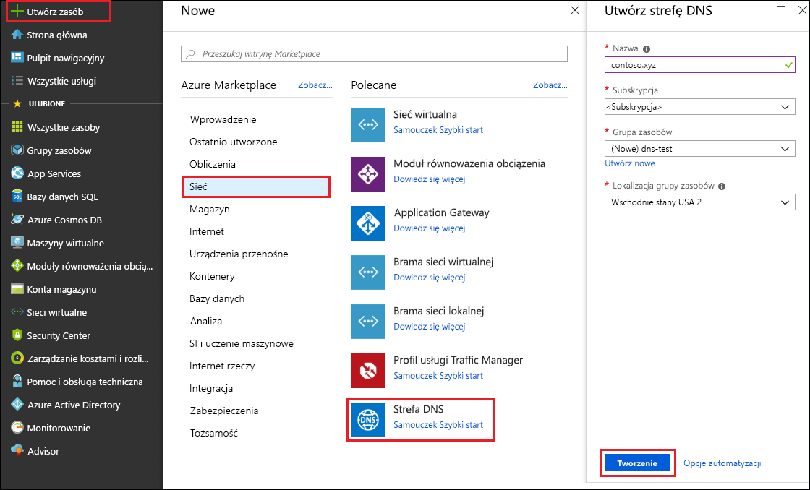

# <a name="quickstart-configure-azure-dns-for-name-resolution-using-the-azure-portal"></a>Szybki start: konfigurowanie usługi Azure DNS do rozpoznawania nazw w witrynie Azure Portal

 Możesz skonfigurować usługę Azure DNS do rozpoznawania nazw hostów w domenie publicznej. Na przykład w przypadku zakupu nazwy domeny contoso.com u rejestratora nazw domen możesz skonfigurować usługę Azure DNS tak, aby hostowała domenę contoso.com oraz rozpoznawała nazwę www.contoso.com jako adres IP serwera internetowego lub aplikacji internetowej.

Podczas pracy z tym przewodnikiem Szybki start utworzysz domenę testową, a następnie utworzysz rekord adresu o nazwie „www”, rozpoznawany jako adres IP 10.10.10.10.

Należy pamiętać, że wszystkie nazwy i adresy IP używane w tym przewodniku Szybki start są jedynie przykładami, a więc nie odzwierciedlają rzeczywistego scenariusza. Jednak w stosownych przypadkach rzeczywiste scenariusze również zostały opisane.

<!---
You can also perform these steps using [Azure PowerShell](dns-getstarted-powershell.md) or the cross-platform [Azure CLI](dns-getstarted-cli.md).
--->

Strefa DNS jest używana do hostowania wpisów DNS dla określonej domeny. Aby rozpocząć hostowanie domeny w usłudze Azure DNS, musisz utworzyć strefę DNS dla tej nazwy domeny. Każdy wpis (rekord) DNS domeny zostanie utworzony w tej strefie DNS. Poniższa procedura pokazuje, jak to zrobić.

Jeśli nie masz subskrypcji platformy Azure, przed rozpoczęciem utwórz [bezpłatne konto](https://azure.microsoft.com/free/?WT.mc_id=A261C142F).

## <a name="create-a-dns-zone"></a>Tworzenie strefy DNS

1. Zaloguj się do Portalu Azure.
2. W lewym górnym rogu kliknij kolejno pozycje **+ Utwórz zasób** i **Sieć**, a następnie kliknij pozycję **Strefa DNS**, aby otworzyć stronę **Tworzenie strefy DNS**.

    

4. Na stronie **Tworzenie strefy DNS** wprowadź następujące wartości, a następnie kliknij pozycję **Utwórz**:


   | **Ustawienie** | **Wartość** | **Szczegóły** |
   |---|---|---|
   |**Nazwa**|contoso.xyz|Nazwa strefy DNS dla tego przykładu. Na potrzeby tego przewodnika Szybki start możesz użyć dowolnie wybranej wartości, o ile taka wartość nie została jeszcze skonfigurowana na serwerach usługi Azure DNS. W rzeczywistym scenariuszu tą wartością byłaby domena kupiona u rejestratora nazw domen.|
   |**Subskrypcja**|[Twoja subskrypcja]|Wybierz subskrypcję, aby utworzyć w jej ramach strefę DNS.|
   |**Grupa zasobów**|**Utwórz nową:** dns-test|Utwórz grupę zasobów. Nazwa grupy zasobów musi być unikatowa w obrębie wybranej subskrypcji. |
   |**Lokalizacja**|Wschodnie stany USA||

Tworzenie strefy może potrwać kilka minut.

## <a name="create-a-dns-record"></a>Tworzenie rekordu DNS

Teraz możesz utworzyć nowy rekord adresu (rekord „A”). Rekordy A są używane do rozpoznawania nazwy hosta jako adresu IPv4.

1. W okienku **Ulubione** witryny Azure Portal kliknij pozycję **Wszystkie zasoby**. Na stronie Wszystkie zasoby kliknij strefę DNS **contoso.xyz**. Jeśli wybrana subskrypcja zawiera kilka zasobów, możesz wpisać **contoso.xyz** w polu **Filtruj według nazwy**, aby łatwo uzyskać dostęp do strefy DNS.

1. W górnej części strony **Strefa DNS** wybierz pozycję **+ Zestaw rekordów**, aby otworzyć stronę **Dodaj zestaw rekordów**.

1. Na stronie **Dodaj zestaw rekordów** wprowadź następujące wartości, a następnie kliknij przycisk **OK**. W tym przykładzie utworzysz rekord A.

   |**Ustawienie** | **Wartość** | **Szczegóły** |
   |---|---|---|
   |**Nazwa**|www|Nazwa rekordu. Jest to nazwa używana dla hosta, który ma być rozpoznawany jako określony adres IP.|
   |**Typ**|A| Typ rekordu DNS, który ma zostać utworzony. Rekordy A są najbardziej typowe, ale istnieją też inne typy rekordów, związane z serwerami pocztowymi (MX), adresami IPv6 (AAAA) itd. |
   |**Czas wygaśnięcia**|1|Czas wygaśnięcia żądania DNS. Określa czas, przez jaki serwery DNS i klienci mogą przechowywać odpowiedź w pamięci podręcznej.|
   |**Jednostka czasu wygaśnięcia**|hours|Pomiar wartości czasu wygaśnięcia.|
   |**Adres IP**|10.10.10.10| Ta wartość jest adresem IP rozpoznawanym przez rekord A. Jest po prostu wartość testowa dla tego przewodnika Szybki start. W rzeczywistym scenariuszu byłby to na przykład publiczny adres IP Twojego serwera internetowego.|


Ponieważ w tym przewodniku Szybki start nazwa domeny nie została faktycznie kupiona, nie trzeba konfigurować usługi Azure DNS jako serwera nazw u rejestratora nazw domen. Natomiast w rzeczywistym scenariuszu byłoby wskazane, aby każdy użytkownik w Internecie mógł rozpoznać nazwę Twojego hosta i połączyć się z serwerem lub aplikacją. Aby uzyskać więcej informacji na temat tego rzeczywistego scenariusza, zobacz [Delegowanie domeny do usługi Azure DNS](dns-delegate-domain-azure-dns.md).


## <a name="test-the-name-resolution"></a>Testowanie rozpoznawania nazw

Po utworzeniu strefy z rekordem A na potrzeby testów możesz przetestować rozpoznawanie nazw za pomocą narzędzia o nazwie nslookup. 

1. Najpierw należy zanotować serwery nazw usługi Azure DNS, które będą używane w narzędziu nslookup. 

   Serwery nazw dla strefy są wymienione na stronie **Przegląd** tej strefy DNS. Skopiuj nazwę jednego z serwerów nazw:

   

2. Teraz otwórz wiersz polecenia i uruchom następujące polecenie:

   ```
   nslookup <host name> <name server>
   
   For example:

   nslookup www.contoso.xyz ns1-08.azure-dns.com
   ```

Powinna zostać wyświetlona zawartość podobna do tej widocznej na poniższym zrzucie ekranu:


To potwierdza, że rozpoznawanie nazw działa poprawnie. Nazwa www.contoso.xyz jest rozpoznawana jako adres IP 10.10.10.10, zgodnie z ustawieniami!

## <a name="clean-up-resources"></a>Oczyszczanie zasobów

Jeśli zasoby utworzone w tym przewodniku Szybki start nie są już potrzebne, możesz je usunąć, usuwając grupę zasobów **dns-test**. W tym celu kliknij grupę zasobów **dns-test**, a następnie kliknij polecenie **Usuń grupę zasobów**.


## <a name="next-steps"></a>Następne kroki

> [!div class="nextstepaction"]
> [Create DNS records for a web app in a custom domain (Tworzenie rekordów DNS aplikacji internetowej w domenie niestandardowej)](./dns-web-sites-custom-domain.md)