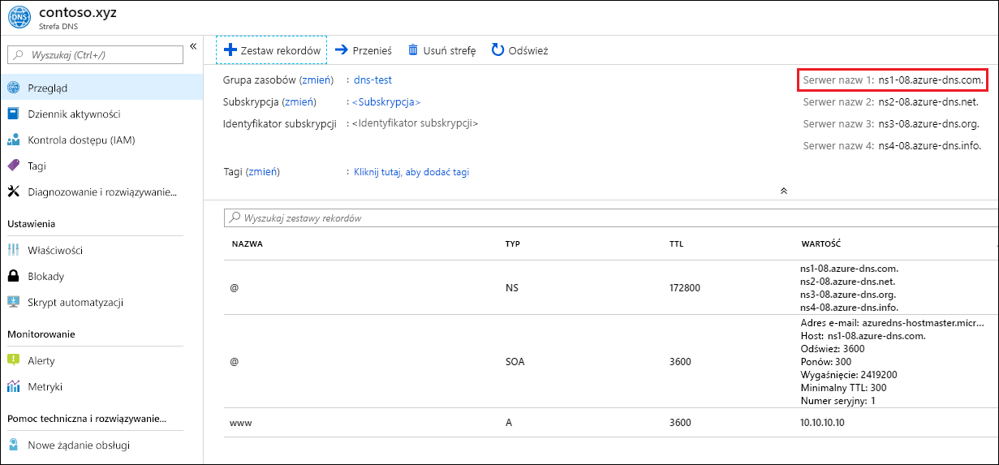

# <a name="quickstart-configure-azure-dns-for-name-resolution-by-using-the-portal"></a>Szybki start: konfigurowanie usługi Azure DNS do rozpoznawania nazw za pomocą portalu

Możesz skonfigurować usługę Azure DNS do rozpoznawania nazw hostów w domenie publicznej. Jeśli na przykład zakupiono nazwę domeny *contoso.com* u rejestratora nazw domen, możesz skonfigurować usługę Azure DNS tak, aby hostowała domenę *contoso.com* oraz rozpoznawała nazwę *www.contoso.com* jako adres IP serwera internetowego lub aplikacji internetowej.

Podczas pracy z tym przewodnikiem Szybki start utworzysz domenę testową, a następnie rekord adresu powodujący rozpoznawanie nazwy *www* jako adresu IP *10.10.10.10*.

>[!IMPORTANT]
>Wszystkie nazwy i adresy IP w tym przewodniku Szybki start są przykładowe i nie reprezentują rzeczywistych scenariuszy. Ten przewodnik Szybki start omawia także rzeczywiste skutki tam, gdzie takie występują.

<!---
You can also perform these steps using [Azure PowerShell](dns-getstarted-powershell.md) or the cross-platform [Azure CLI](dns-getstarted-cli.md).
--->

Jeśli nie masz subskrypcji platformy Azure, przed rozpoczęciem utwórz [bezpłatne konto](https://azure.microsoft.com/free/?WT.mc_id=A261C142F).

W przypadku wszystkich kroków wykonywanych w portalu należy się zalogować do [witryny Azure Portal](https://portal.azure.com).

## <a name="create-a-dns-zone"></a>Tworzenie strefy DNS

Strefa DNS zawiera wpisy DNS dla domeny. Aby rozpocząć hostowanie domeny w usłudze Azure DNS, należy utworzyć strefę DNS dla tej nazwy domeny. 

**Aby utworzyć strefę DNS:**

1. W lewym górnym rogu wybierz pozycję **Utwórz zasób**, a następnie **Sieć** i **Strefa DNS**.
   
1. Na stronie **Tworzenie strefy DNS** wpisz lub wybierz następujące wartości:
   
   - **Nazwa**: wpisz *contoso.xyz* dla przykładu w tym przewodniku Szybki start. Nazwa strefy DNS może być dowolną wartością, która nie jest już skonfigurowana na serwerach usługi Azure DNS. W rzeczywistym scenariuszu tą wartością byłaby domena kupiona u rejestratora nazw domen.
   - **Grupa zasobów**: wybierz pozycję **Utwórz nową**, wpisz wartość *dns-test* i wybierz pozycję **OK**. Nazwa grupy zasobów musi być unikatowa w ramach subskrypcji platformy Azure. 
   
1. Wybierz pozycję **Utwórz**.

   
   
Tworzenie strefy może potrwać kilka minut.

## <a name="create-a-dns-record"></a>Tworzenie rekordu DNS

Wpisy, czyli rekordy, DNS tworzy się dla domeny w strefie DNS. Utwórz nowy rekordu adresu, czyli rekord „A”, aby umożliwić rozpoznawanie nazwy hosta jako adresu IPv4.

**Aby utworzyć rekord „A”:**

1. W witrynie Azure Portal w obszarze **Wszystkie zasoby** otwórz strefę DNS **contoso.xyz** w grupie zasobów **dns-test**. Wartość *contoso.xyz* można wpisać w polu **Filtruj według nazwy**, aby łatwiej znaleźć strefę.

1. W górnej części strony **Strefa DNS** wybierz pozycję **+ Zestaw rekordów**.

1. Na stronie **Dodawanie zestawu rekordów** wpisz lub wybierz następujące wartości:

   - **Nazwa**: wpisz wartość *www*. Nazwa rekordu to nazwa hosta, która ma być rozpoznawana jako określony adres IP.
   - **Typ**: wybierz wartość **A**. Rekordy „A” są najczęściej używane, ale istnieją też inne typy rekordów: dla serwerów poczty e-mail („MX”), adresów IPv6 („AAAA”) itd. 
   - **Czas wygaśnięcia**: wpisz wartość *1*. *Czas wygaśnięcia* żądania DNS określa, jak długo serwery i klienci DNS mogą buforować odpowiedź.
   - **Jednostka czasu wygaśnięcia**: wybierz opcję **Godziny**. Jest to jednostka czasu dla wartości **Czas wygaśnięcia**. 
   - **Adres IP**: dla tego przykładu przewodnika Szybki start wpisz *10.10.10.10*. Ta wartość to adres IP rozpoznawany w przypadku nazwy rekordu. W rzeczywistym scenariuszu byłby to na przykład publiczny adres IP serwera internetowego.

Ponieważ ten przewodnik Szybki start nie korzysta z rzeczywistej domeny, nie ma potrzeby konfigurowania serwerów nazw usługi Azure DNS u rejestratora nazw domen. W przypadku rzeczywistej domeny celem byłoby umożliwienie każdej osobie w Internecie rozpoznania nazwy hosta w celu połączenia się z serwerem internetowym lub aplikacją. Odwiedzisz rejestratora nazw domen, aby zastąpić rekordy serwera nazw serwerami nazw usługi Azure DNS. Aby uzyskać więcej informacji, zobacz [Samouczek: hostowanie własnej domeny w usłudze Azure DNS](dns-delegate-domain-azure-dns.md#delegate-the-domain).

## <a name="test-the-name-resolution"></a>Testowanie rozpoznawania nazw

Po utworzeniu testowej strefy DNS z rekordem „A” możesz przetestować rozpoznawanie nazw za pomocą narzędzia o nazwie *nslookup*. 

**Aby przetestować rozpoznawanie nazw DNS:**

1. W witrynie Azure Portal w obszarze **Wszystkie zasoby** otwórz strefę DNS **contoso.xyz** w grupie zasobów **dns-test**. Wartość *contoso.xyz* można wpisać w polu **Filtruj według nazwy**, aby łatwiej znaleźć strefę.

1. Skopiuj jedną z nazw serwerów nazw z listy serwerów nazw na stronie **Przegląd**. 
   
   
   
   >[!NOTE]
   >W przypadku rzeczywistego scenariusza należałoby skopiować nazwy wszystkich czterech serwerów nazw wraz z końcowymi kropkami i użyć ich jako nowych nazw serwerów nazw usługi Azure DNS u rejestratora domen. Aby uzyskać więcej informacji, zobacz [Delegowanie domeny do usługi Azure DNS](dns-delegate-domain-azure-dns.md)
   
1. Otwórz wiersz polecenia i uruchom następujące polecenie:

   ```
   nslookup <host name> <name server name>
   ```
   
   Na przykład:
   
   ```
   nslookup www.contoso.xyz ns1-08.azure-dns.com.
   ```
   
   Powinna zostać wyświetlona treść podobna do tej na następującym ekranie:
   
   

Nazwa **www.contoso.xyz** jest rozpoznawana jako adres IP **10.10.10.10** zgodnie z konfiguracją. Taki wynik potwierdza, że rozpoznawanie nazw działa poprawnie. 

## <a name="clean-up-resources"></a>Oczyszczanie zasobów

Jeśli nie potrzebujesz już zasobów utworzonych w tym przewodniku Szybki start, usuń je, usuwając grupę zasobów **dns-test**. Otwórz grupę zasobów **dns-test**, a następnie wybierz polecenie **Usuń grupę zasobów**.

## <a name="next-steps"></a>Następne kroki

> [!div class="nextstepaction"]
> [Create DNS records for a web app in a custom domain (Tworzenie rekordów DNS aplikacji internetowej w domenie niestandardowej)](./dns-web-sites-custom-domain.md)