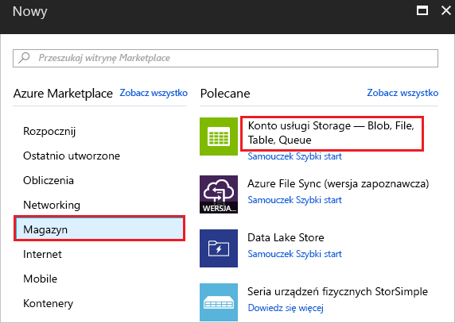
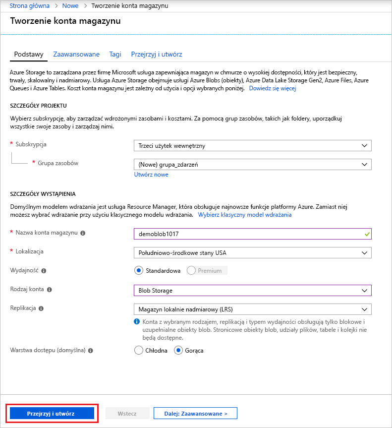
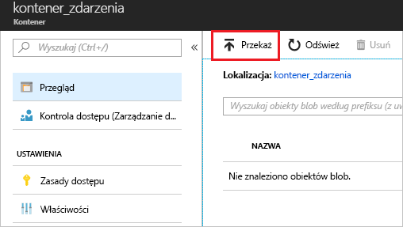

# Szybki Start: kierowanie zdarzeń magazynu obiektów BLOB do punktu końcowego sieci Web za pomocą Azure Portal

Azure Event Grid to usługa obsługi zdarzeń dla chmury. W tym artykule użyjesz witryny Azure Portal do utworzenia konta usługi Blob Storage, subskrybowania zdarzeń dla tego magazynu obiektów blob oraz wyzwalania zdarzenia w celu wyświetlenia wyników. Zazwyczaj użytkownik wysyła zdarzenia do punktu końcowego, w którym następuje przetwarzanie danych zdarzenia i są wykonywane akcje. Jednak aby uprościć ten artykuł, zdarzenia zostaną wysłane do aplikacji internetowej, która zbiera i wyświetla komunikaty.

[!INCLUDE [quickstarts-free-trial-note.md](../../includes/quickstarts-free-trial-note.md)]

Po zakończeniu przekonasz się, że dane zdarzenia zostały wysłane do aplikacji internetowej.

## Tworzenie konta magazynu

1. Zaloguj się do [Azure Portal](https://portal.azure.com/).

1. Aby utworzyć magazyn Blob Storage, wybierz pozycję **Utwórz zasób**. 

1. Wybierz pozycję **Storage**, aby filtrować według dostępnych opcji, a następnie wybierz pozycję **Konta usługi Storage — Blob, File, Table, Queue**.

   

   Aby zasubskrybować zdarzenia, należy utworzyć konto usługi Storage ogólnego przeznaczenia w wersji 2 lub konto usługi Blob Storage.
   
1. Na stronie **Tworzenie konta magazynu** wykonaj następujące czynności:
    1. Wybierz swoją subskrypcję platformy Azure. 
    2. W obszarze **Grupa zasobów**Utwórz nową grupę zasobów lub wybierz istniejącą. 
    3. Wprowadź nazwę konta magazynu. 
    4. Wybierz pozycję **Przegląd + utwórz**. 

           
    5. Na stronie **Recenzja i tworzenie** Sprawdź ustawienia, a następnie wybierz pozycję **Utwórz**. 

        >[!NOTE]
        > Tylko konta magazynu typu **StorageV2 (ogólnego przeznaczenia w wersji 2)** i **BlobStorage** obsługują integrację zdarzeń. **Magazyn (genral cel v1)** nie *obsługuje integracji* z programem Event Grid.

## Tworzenie punktu końcowego komunikatów

Przed zasubskrybowaniem zdarzeń w ramach usługi Blob Storage utwórzmy punkt końcowy dla komunikatów o zdarzeniach. Zazwyczaj w punkcie końcowym akcje są wykonywane na podstawie danych zdarzenia. Aby uprościć ten przewodnik Szybki Start, wdrożysz [wstępnie zbudowaną aplikację sieci Web](https://github.com/Azure-Samples/azure-event-grid-viewer), która będzie wyświetlać komunikaty o zdarzeniach. Wdrożone rozwiązanie zawiera plan usługi App Service, aplikację internetową usługi App Service i kod źródłowy z repozytorium GitHub.

1. Wybierz pozycję **Wdróż na platformie Azure** w celu wdrożenia rozwiązania w subskrypcji. 

   
2. Na stronie **wdrożenie niestandardowe** wykonaj następujące czynności: 
    1. W obszarze **Grupa zasobów**wybierz grupę zasobów, która została utworzona podczas tworzenia konta magazynu. Ułatwi to oczyszczenie po zakończeniu pracy z samouczkiem przez usunięcie grupy zasobów.  
    2. W polu **Nazwa lokacji**wprowadź nazwę aplikacji sieci Web.
    3. W polu **Nazwa planu hostingu**wpisz nazwę planu App Service, który będzie używany do hostowania aplikacji sieci Web.
    4. Zaznacz pole wyboru **Zgadzam się na powyższe warunki i postanowienia**. 
    5. Wybierz pozycję **Kup**. 

       
1. Wdrożenie może potrwać kilka minut. Wybierz pozycję alerty (ikona dzwonka) w portalu, a następnie wybierz pozycję **Przejdź do grupy zasobów**. 

    
4. Na stronie **Grupa zasobów** na liście zasobów wybierz utworzoną aplikację sieci Web. Zobaczysz również plan App Service i konto magazynu na tej liście. 

    
5. Na stronie **App Service** aplikacji sieci Web wybierz adres URL, aby przejść do witryny sieci Web. Adres URL powinien mieć następujący format: `https://<your-site-name>.azurewebsites.net` .
    
    

6. Upewnij się, że zobaczysz witrynę, ale żadne zdarzenia nie zostały jeszcze ogłoszone.

   

[!INCLUDE [event-grid-register-provider-portal.md](../../includes/event-grid-register-provider-portal.md)]

## Subskrybowanie usługi Blob Storage

Subskrybowanie tematu ma poinformować usługę Event Grid o tym, które zdarzenia chcesz śledzić i gdzie mają być one wysyłane.

1. W portalu przejdź do utworzonego wcześniej konta usługi Azure Storage. Z menu po lewej stronie wybierz pozycję **wszystkie zasoby** , a następnie wybierz konto magazynu. 
2. Na stronie **konto magazynu** wybierz pozycję **zdarzenia** z menu po lewej stronie. 
1. Wybierz kolejno pozycje **Więcej opcji** i **Element webhook**. Wysyłasz zdarzenia do aplikacji przeglądarki przy użyciu elementu webhook dla punktu końcowego. 

   
3. Na stronie **Tworzenie subskrypcji zdarzeń** wykonaj następujące czynności: 
    1. Wprowadź **nazwę** subskrypcji zdarzeń.
    2. Wprowadź **nazwę** **tematu systemowego**. Aby dowiedzieć się więcej na temat tematów systemowych, zobacz [Omówienie tematów systemowych](system-topics.md).

       
    2. Wybierz **element Hook sieci Web** dla **typu punktu końcowego**. 

       
4. W przypadku **punktu końcowego**kliknij pozycję **Wybierz punkt końcowy**, a następnie wprowadź adres URL aplikacji sieci Web i Dodaj adres `api/updates` URL strony głównej (na przykład: `https://spegridsite.azurewebsites.net/api/updates` ), a następnie wybierz pozycję **Potwierdź wybór**.

   
5. Teraz na stronie **Tworzenie subskrypcji zdarzeń** wybierz pozycję **Utwórz** , aby utworzyć subskrypcję zdarzeń. 

   

1. Wyświetl aplikację sieci Web ponownie i zwróć uwagę, że zdarzenie sprawdzania poprawności subskrypcji zostało do niej wysłane. Wybierz ikonę oka, aby rozwinąć dane zdarzenia. Usługa Event Grid wysyła zdarzenie weryfikacji, aby w punkcie końcowym mogło nastąpić sprawdzenie, czy dane zdarzenia mają być odbierane. Aplikacja internetowa zawiera kod do sprawdzania poprawności subskrypcji.

   

Teraz wyzwólmy zdarzenie, aby zobaczyć, jak usługa Event Grid dystrybuuje komunikat do punktu końcowego.

## Wysyłanie zdarzenia do punktu końcowego

Zdarzenie magazynu Blob Storage jest wyzwalane przez przekazanie pliku. Plik nie wymaga żadnej określonej zawartości. W artykule założono, że masz plik o nazwie testfile.txt, ale możesz użyć dowolnego pliku.

1. W Azure Portal przejdź do swojego konta usługi BLOB Storage, a następnie wybierz pozycję **Containers (kontenery** ) na stronie **Przegląd** .

   

1. Wybierz pozycję **+ Kontener**. Nadaj kontenerowi nazwę i użyj dowolnego poziomu dostępu, a następnie wybierz pozycję **Utwórz**. 

   

1. Wybierz nowy kontener.

   

1. Aby przekazać plik, wybierz pozycję **Przekaż**. Na stronie **przekazywanie obiektu BLOB** Przeglądaj i wybierz plik, który chcesz przekazać do testowania, a następnie wybierz pozycję **Przekaż** na tej stronie. 

   

1. Przejdź do pliku testowego i przekaż go.

1. Zdarzenie zostało wyzwolone, a usługa Event Grid wysłała komunikat do punktu końcowego skonfigurowanego podczas subskrybowania. Komunikat jest w formacie JSON i zawiera tablicę z co najmniej jednym zdarzeniem. W poniższym przykładzie komunikat JSON zawiera tablicę z jednym zdarzeniem. Wyświetl aplikację sieci Web i zwróć uwagę na to, że zostało odebrane zdarzenie **utworzone przez obiekt BLOB** . 

   

## Oczyszczanie zasobów

Jeśli zamierzasz kontynuować pracę z tym zdarzeniem, nie usuwaj zasobów utworzonych w tym artykule. W przeciwnym razie usuń zasoby utworzone w ramach tego artykułu.

Wybierz grupę zasobów, a następnie wybierz pozycję **Usuń grupę zasobów**.

## Następne kroki

Wiesz już, jak tworzyć tematy niestandardowe i subskrypcje zdarzeń. Dowiedz się więcej na temat tego, co może Ci ułatwić usługa Event Grid:

- [Event Grid — informacje](overview.md)
- [Kierowanie zdarzeń usługi Blob Storage do niestandardowego internetowego punktu końcowego](../storage/blobs/storage-blob-event-quickstart.md?toc=%2fazure%2fevent-grid%2ftoc.json)
- [Monitorowanie zmian maszyn wirtualnych za pomocą usług Azure Event Grid i Logic Apps](monitor-virtual-machine-changes-event-grid-logic-app.md)
- [Przesyłanie strumieniowe danych Big Data do magazynu danych](event-grid-event-hubs-integration.md)
