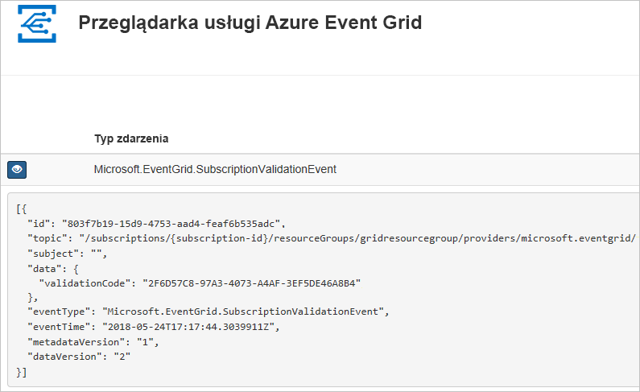

# <a name="create-and-route-custom-events-with-azure-powershell-and-event-grid"></a>Tworzenie i kierowanie zdarzeń niestandardowych za pomocą programu Azure PowerShell i usługi Event Grid

Azure Event Grid to usługa obsługi zdarzeń dla chmury. W tym artykule omówiono tworzenie tematu niestandardowego, subskrybowanie go i wyzwalanie zdarzenia w celu wyświetlenia wyniku za pomocą programu Azure PowerShell. Zazwyczaj użytkownik wysyła zdarzenia do punktu końcowego, w którym następuje przetwarzanie danych zdarzenia i są wykonywane akcje. Jednak aby uprościć ten artykuł, zdarzenia zostaną wysłane do aplikacji sieci Web, która zbiera i wyświetla komunikaty.

Po zakończeniu przekonasz się, że dane zdarzenia zostały wysłane do aplikacji sieci Web.


[!INCLUDE [quickstarts-free-trial-note.md](../../includes/quickstarts-free-trial-note.md)]

Ten artykuł wymaga używania najnowszej wersji programu Azure PowerShell. Jeśli konieczna będzie instalacja lub uaktualnienie, zobacz [Instalowanie i konfigurowanie programu Azure PowerShell](/powershell/azure/install-azurerm-ps).

## <a name="create-a-resource-group"></a>Tworzenie grupy zasobów

Tematy usługi Event Grid to zasoby platformy Azure i muszą być umieszczone w grupie zasobów platformy Azure. Grupa zasobów to kolekcja logiczna przeznaczona do wdrażania zasobów platformy Azure i zarządzania nimi.

Utwórz grupę zasobów na pomocą polecenia [New-AzureRmResourceGroup](/powershell/module/azurerm.resources/new-azurermresourcegroup).

Poniższy przykład obejmuje tworzenie grupy zasobów o nazwie *gridResourceGroup* w lokalizacji *westus2*.

```powershell-interactive
New-AzureRmResourceGroup -Name gridResourceGroup -Location westus2
```

[!INCLUDE [event-grid-register-provider-powershell.md](../../includes/event-grid-register-provider-powershell.md)]

## <a name="create-a-custom-topic"></a>Tworzenie tematu niestandardowego

Temat usługi Event Grid udostępnia zdefiniowany przez użytkownika punkt końcowy, w którym publikowane są zdarzenia. Poniższy przykład obejmuje tworzenie tematu niestandardowego w grupie zasobów. Zamień `<your-topic-name>` na unikatową nazwę tematu. Nazwa tematu musi być unikatowa, ponieważ stanowi część wpisu DNS.

```powershell-interactive
$topicname="<your-topic-name>"

New-AzureRmEventGridTopic -ResourceGroupName gridResourceGroup -Location westus2 -Name $topicname
```

## <a name="create-a-message-endpoint"></a>Tworzenie punktu końcowego komunikatów

Przed zasubskrybowaniem tematu utwórzmy punkt końcowy dla komunikatów o zdarzeniach. Zazwyczaj w punkcie końcowym akcje są wykonywane na podstawie danych zdarzenia. Aby uprościć ten przewodnik Szybki Start, wdrożysz [wstępnie zbudowaną aplikację sieci Web](https://github.com/Azure-Samples/azure-event-grid-viewer), która będzie wyświetlać komunikaty o zdarzeniach. Wdrożone rozwiązanie zawiera plan usługi App Service, aplikację internetową usługi App Service i kod źródłowy z repozytorium GitHub.

Zastąp `<your-site-name>` unikatową nazwą aplikacji sieci Web. Nazwa aplikacji sieci Web musi być unikatowa, ponieważ stanowi część wpisu DNS.

```powershell-interactive
$sitename="<your-site-name>"

New-AzureRmResourceGroupDeployment `
  -ResourceGroupName gridResourceGroup `
  -TemplateUri "https://raw.githubusercontent.com/Azure-Samples/azure-event-grid-viewer/master/azuredeploy.json" `
  -siteName $sitename `
  -hostingPlanName viewerhost
```

Wdrożenie może potrwać kilka minut. Po pomyślnym wdrożeniu należy wyświetlić aplikację sieci Web i upewnić się, że jest uruchomiona. W przeglądarce sieci Web przejdź do: `https://<your-site-name>.azurewebsites.net`

Powinna być widoczna witryna internetowa bez żadnych aktualnie wyświetlanych komunikatów.

## <a name="subscribe-to-a-topic"></a>Subskrybowanie tematu

Subskrybowanie tematu to dla usługi Event Grid informacja o tym, które zdarzenia chcesz śledzić i gdzie mają być one wysyłane. Poniższy przykład ilustruje subskrybowanie utworzonego tematu i przekazanie adresu URL z aplikacji sieci Web jako punktu końcowego dla powiadomień o zdarzeniach.

Punkt końcowy dla aplikacji sieci Web musi zawierać sufiks `/api/updates/`.

```powershell-interactive
$endpoint="https://$sitename.azurewebsites.net/api/updates"

New-AzureRmEventGridSubscription `
  -EventSubscriptionName demoViewerSub `
  -Endpoint $endpoint `
  -ResourceGroupName gridResourceGroup `
  -TopicName $topicname
```

Wyświetl aplikację sieci Web ponownie i zwróć uwagę, że zdarzenie sprawdzania poprawności subskrypcji zostało do niej wysłane. Wybierz ikonę oka, aby rozwinąć dane zdarzenia. Usługa Event Grid wysyła zdarzenie weryfikacji, aby w punkcie końcowym mogło nastąpić sprawdzenie, czy dane zdarzenia mają być odbierane. Aplikacja sieci Web zawiera kod do sprawdzania poprawności subskrypcji.



## <a name="send-an-event-to-your-topic"></a>Wysyłanie zdarzenia do tematu

Wyzwólmy zdarzenie, aby zobaczyć, jak usługa Event Grid dystrybuuje komunikat do punktu końcowego. Po pierwsze uzyskajmy adres URL i klucz dla tematu.

```powershell-interactive
$endpoint = (Get-AzureRmEventGridTopic -ResourceGroupName gridResourceGroup -Name $topicname).Endpoint
$keys = Get-AzureRmEventGridTopicKey -ResourceGroupName gridResourceGroup -Name $topicname
```

Aby uprościć ten artykuł, skonfiguruj przykładowe dane zdarzenia do wysłania do tematu niestandardowego. Zwykle dane zdarzenia są wysyłane przez aplikację lub usługę platformy Azure. W poniższym przykładzie użyto tabeli skrótów (Hashtable) do skonstruowania danych zdarzenia `htbody`, a następnie przekonwertowano je na poprawnie sformułowany obiekt ładunku JSON `$body`:

```powershell-interactive
$eventID = Get-Random 99999

#Date format should be SortableDateTimePattern (ISO 8601)
$eventDate = Get-Date -Format s

#Construct body using Hashtable
$htbody = @{
    id= $eventID
    eventType="recordInserted"
    subject="myapp/vehicles/motorcycles"
    eventTime= $eventDate   
    data= @{
        make="Ducati"
        model="Monster"
    }
    dataVersion="1.0"
}

#Use ConvertTo-Json to convert event body from Hashtable to JSON Object
#Append square brackets to the converted JSON payload since they are expected in the event's JSON payload syntax
$body = "["+(ConvertTo-Json $htbody)+"]"
```

Jeśli wyświetlisz `$body`, zobaczysz pełne zdarzenie. Element `data` danych JSON to ładunek zdarzenia. W tym polu można umieścić dowolną poprawnie sformułowaną zawartość JSON. Można też używać pola tematu do zaawansowanego routingu i filtrowania.

Teraz wyślij zdarzenie do swojego tematu.

```powershell-interactive
Invoke-WebRequest -Uri $endpoint -Method POST -Body $body -Headers @{"aeg-sas-key" = $keys.Key1}
```

Zdarzenie zostało wyzwolone, a usługa Event Grid wysłała komunikat do punktu końcowego skonfigurowanego podczas subskrybowania. Wyświetl aplikację sieci Web, aby wyświetlić właśnie wysłane zdarzenie.

```json
[{
  "id": "1807",
  "eventType": "recordInserted",
  "subject": "myapp/vehicles/motorcycles",
  "eventTime": "2018-01-25T15:58:13",
  "data": {
    "make": "Ducati",
    "model": "Monster"
  },
  "dataVersion": "1.0",
  "metadataVersion": "1",
  "topic": "/subscriptions/{subscription-id}/resourceGroups/{resource-group}/providers/Microsoft.EventGrid/topics/{topic}"
}]
```

## <a name="clean-up-resources"></a>Oczyszczanie zasobów

Jeśli zamierzasz kontynuować pracę z tym zdarzeniem lub aplikacją podglądu zdarzeń, nie usuwaj zasobów utworzonych w tym artykule. W przeciwnym razie użyj poniższego polecenia, aby usunąć zasoby utworzone w ramach tego artykułu.

```powershell
Remove-AzureRmResourceGroup -Name gridResourceGroup
```

## <a name="next-steps"></a>Następne kroki

Wiesz już, jak tworzyć tematy i subskrypcje zdarzeń. Dowiedz się więcej na temat tego, co może Ci ułatwić usługa Event Grid:

- [Event Grid — informacje](overview.md)
- [Kierowanie zdarzeń usługi Blob Storage do niestandardowego internetowego punktu końcowego](../storage/blobs/storage-blob-event-quickstart.md?toc=%2fazure%2fevent-grid%2ftoc.json)
- [Monitorowanie zmian maszyn wirtualnych za pomocą usług Azure Event Grid i Logic Apps](monitor-virtual-machine-changes-event-grid-logic-app.md)
- [Przesyłanie strumieniowe danych Big Data do magazynu danych](event-grid-event-hubs-integration.md)
