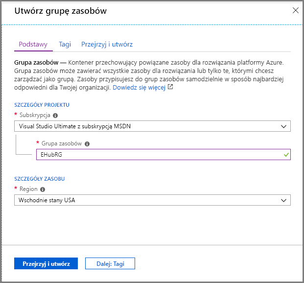
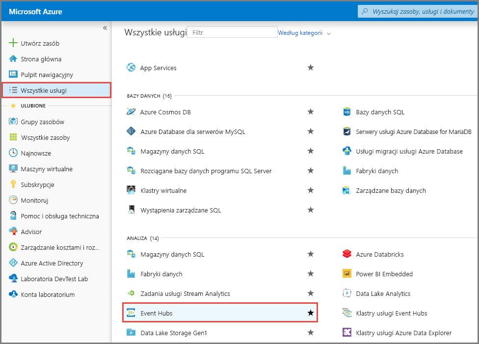
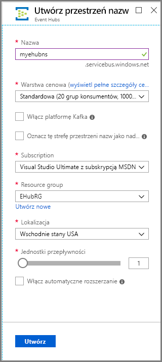
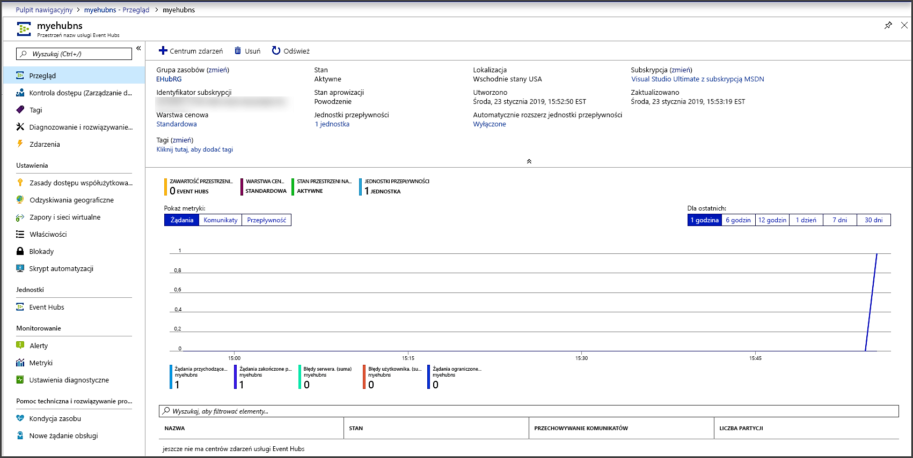
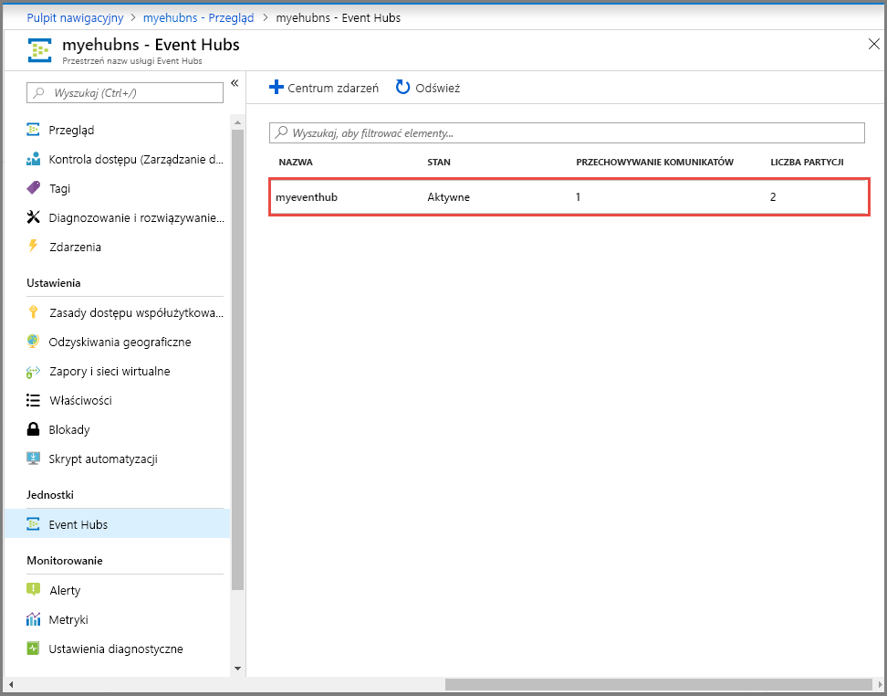

# Szybki start: tworzenie centrum zdarzeń przy użyciu witryny Azure Portal
Azure Event Hubs to platforma do pozyskiwania i strumieniowego przesyłania danych, która umożliwia odbieranie i przetwarzanie milionów zdarzeń na sekundę. Usługa Event Hubs pozwala przetwarzać i przechowywać zdarzenia, dane lub dane telemetryczne generowane przez rozproszone oprogramowanie i urządzenia. Dane wysłane do centrum zdarzeń mogą zostać przekształcone i zmagazynowane przy użyciu dowolnego dostawcy analityki czasu rzeczywistego lub adapterów przetwarzania wsadowego/magazynowania. Aby zapoznać się ze szczegółowym omówieniem usługi Event Hubs, zobacz [Omówienie usługi Event Hubs](event-hubs-about.md) i [Funkcje usługi Event Hubs](event-hubs-features.md).

W tym przewodniku Szybki start utworzysz centrum zdarzeń za pomocą witryny [Azure Portal](https://portal.azure.com).

## Wymagania wstępne

Aby ukończyć ten przewodnik Szybki start, upewnij się, że dysponujesz następującymi elementami:

- Subskrypcja platformy Azure. Jeśli nie masz subskrypcji, przed rozpoczęciem [utwórz bezpłatne konto](https://azure.microsoft.com/free/).
- [Visual Studio 2019)](https://www.visualstudio.com/vs) lub później.
- [Zestaw .NET Standard SDK](https://www.microsoft.com/net/download/windows) w wersji 2.0 lub nowszej.

## Utwórz grupę zasobów

Grupa zasobów to logiczna kolekcja zasobów platformy Azure. Wszystkie zasoby są wdrażane i zarządzane w ramach grupy zasobów. Aby utworzyć grupę zasobów:

1. Zaloguj się do [portalu Azure](https://portal.azure.com).
2. W lewym obszarze nawigacji kliknij pozycję **Grupy zasobów**. Następnie kliknij pozycję **Dodaj**.

   

2. W polu **Subskrypcja** wybierz nazwę subskrypcji platformy Azure, w której chcesz utworzyć grupę zasobów.
3. Wpisz unikatową **nazwę grupy zasobów**. System natychmiast sprawdzi, czy nazwa jest dostępna w aktualnie wybranej subskrypcji platformy Azure.
4. Wybierz **region** dla grupy zasobów.
5. Wybierz pozycję **Przegląd + utwórz**.

   
6. Na stronie **Przeglądanie + tworzenie** wybierz pozycję **Utwórz**. 

## Tworzenie przestrzeni nazw usługi Event Hubs

Przestrzeń nazw usługi Event Hubs udostępnia unikatowy kontener zakresu przywoływany przy użyciu jego w pełni kwalifikowanej nazwy domeny, w którym można utworzyć jedno lub wiele centrów zdarzeń. Aby utworzyć przestrzeń nazw w grupie zasobów przy użyciu portalu, wykonaj następujące akcje:

1. W witrynie Azure Portal kliknij pozycję **Utwórz zasób** w lewym górnym rogu ekranu.
2. Wybierz pozycję **Wszystkie usługi** w menu po lewej stronie, a następnie wybierz **gwiazdkę (`*`)** obok pozycji **Event Hubs** w kategorii **Analiza**. Upewnij się, że usługa **Event Hubs** została dodana do kategorii **ULUBIONE** w menu nawigacji po lewej stronie. 
    
   
3. Wybierz pozycję **Event Hubs** w obszarze **ULUBIONE** w menu nawigacji po lewej stronie, a następnie wybierz pozycję **Dodaj** na pasku narzędzi.

   
4. Na stronie **Tworzenie przestrzeni nazw** wykonaj następujące czynności:
    1. Wprowadź **nazwę** dla przestrzeni nazw. System od razu sprawdza, czy nazwa jest dostępna.
    2. Wybierz **warstwę cenową** (podstawowa lub standardowa).
    3. Zauważ, że opcja **Włącz Kafka** jest automatycznie włączona. Usługa Azure Event Hubs udostępnia punkt końcowy Kafka. Ten punkt końcowy umożliwia Event Hubsom przestrzeni nazw natywne zrozumienie protokołu komunikatów [Apache Kafka](https://kafka.apache.org/intro) i interfejsów API. Korzystając z tej możliwości, można komunikować się z centrami zdarzeń w taki sam sposób, jak w przypadku Kafka tematów bez zmiany klientów protokołu lub uruchamiania własnych klastrów. Event Hubs obsługuje [Apache Kafka wersje 1,0](https://kafka.apache.org/10/documentation.html) i nowsze.
    4. Wybierz **subskrypcję**, w ramach której chcesz utworzyć przestrzeń nazw.
    5. Wybierz istniejącą **grupę zasobów** lub Utwórz nową grupę zasobów. 
    4. Wybierz **lokalizację** dla przestrzeni nazw.
    5. Wybierz pozycję **Utwórz**. Może być konieczne odczekanie kilku minut, aby system przeprowadził pełną aprowizację zasobów.

       
5. Odśwież stronę usługi **Event Hubs**, aby wyświetlić przestrzeń nazw centrum zdarzeń. Możesz sprawdzić stan tworzenia centrum zdarzeń w alertach. 

    
6. Wybierz przestrzeń nazw. W portalu zostanie wyświetlona strona główna **przestrzeni nazw usługi Event Hubs**. 

   
    
## Tworzenie centrum zdarzeń

Aby utworzyć centrum zdarzeń w przestrzeni nazw, wykonaj następujące akcje:

1. Na stronie przestrzeni nazw usługi Event Hubs wybierz pozycję **Event Hubs** w menu po lewej stronie.
1. W górnej części okna kliknij pozycję **+ Centrum zdarzeń**.
   
    
1. Wpisz nazwę centrum zdarzeń, a następnie kliknij pozycję **Utwórz**.
   
    
4. Możesz sprawdzić stan tworzenia centrum zdarzeń w alertach. Po utworzeniu centrum zdarzeń będzie ono widoczne na liście centrów zdarzeń, jak pokazano na poniższej ilustracji:

    

Gratulacje! Za pomocą portalu utworzono przestrzeń nazw usługi Event Hubs i centrum zdarzeń w ramach tej przestrzeni nazw. 

## Następne kroki

W tym artykule utworzono grupę zasobów, przestrzeń nazw usługi Event Hubs i centrum zdarzeń. Aby uzyskać instrukcje krok po kroku dotyczące wysyłania zdarzeń do (lub) odbierania zdarzeń z centrum zdarzeń, zobacz samouczki **wysyłania i odbierania zdarzeń** : 

- [.NET Core](event-hubs-dotnet-standard-getstarted-send.md)
- [.NET Framework](event-hubs-dotnet-framework-getstarted-send.md)
- [Java](event-hubs-java-get-started-send.md)
- [Python](event-hubs-python-get-started-send.md)
- [Node.js](event-hubs-node-get-started-send.md)
- [Go](event-hubs-go-get-started-send.md)
- [C (tylko wysyłanie)](event-hubs-c-getstarted-send.md)
- [Apache Storm (tylko reecive)](event-hubs-storm-getstarted-receive.md)

[Azure portal]: https://portal.azure.com/
[3]: ./media/event-hubs-quickstart-portal/sender1.png
[4]: ./media/event-hubs-quickstart-portal/receiver1.png
