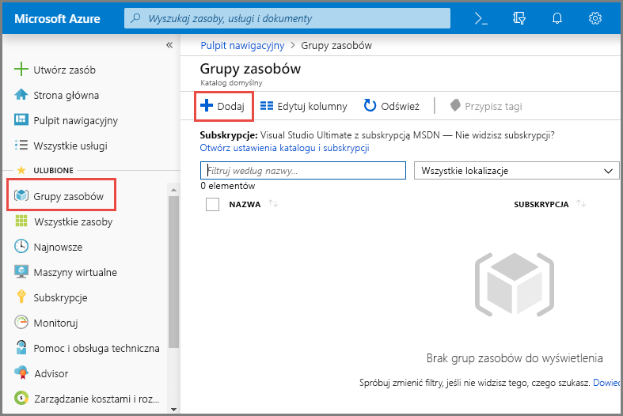
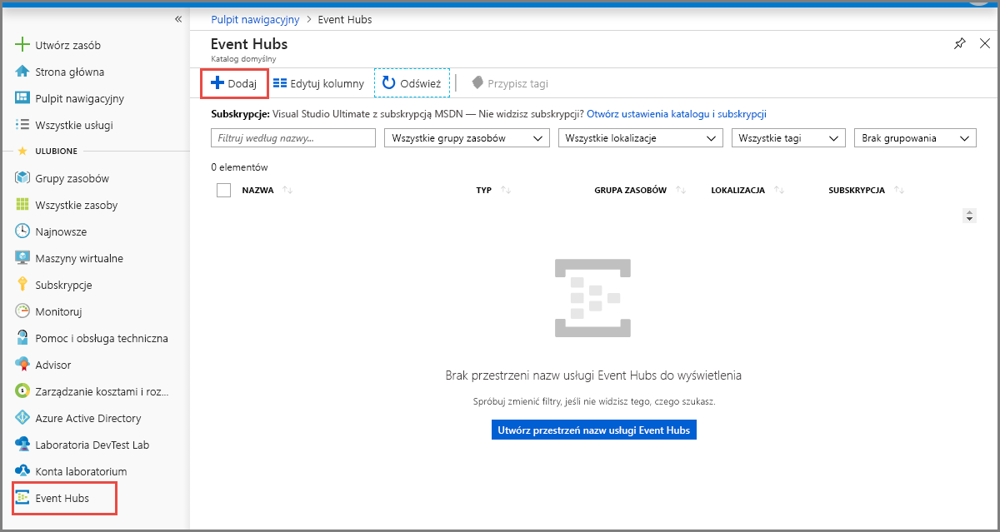
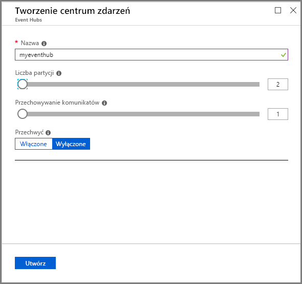

# Szybki start: tworzenie centrum zdarzeń przy użyciu witryny Azure Portal
Azure Event Hubs to platforma do pozyskiwania i strumieniowego przesyłania danych, która umożliwia odbieranie i przetwarzanie milionów zdarzeń na sekundę. Usługa Event Hubs pozwala przetwarzać i przechowywać zdarzenia, dane lub dane telemetryczne generowane przez rozproszone oprogramowanie i urządzenia. Dane wysłane do centrum zdarzeń mogą zostać przekształcone i zmagazynowane przy użyciu dowolnego dostawcy analityki czasu rzeczywistego lub adapterów przetwarzania wsadowego/magazynowania. Aby zapoznać się ze szczegółowym omówieniem usługi Event Hubs, zobacz [Omówienie usługi Event Hubs](event-hubs-about.md) i [Funkcje usługi Event Hubs](event-hubs-features.md).

W tym przewodniku Szybki start utworzysz centrum zdarzeń za pomocą witryny [Azure Portal](https://portal.azure.com).

## Wymagania wstępne

Aby ukończyć ten przewodnik Szybki start, upewnij się, że dysponujesz następującymi elementami:

- Subskrypcja platformy Azure. Jeśli go nie masz, przed rozpoczęciem [Utwórz bezpłatne konto](https://azure.microsoft.com/free/) .
- [Program Visual Studio 2019](https://www.visualstudio.com/vs) lub nowszy.
- [Zestaw .NET Standard SDK](https://www.microsoft.com/net/download/windows) w wersji 2.0 lub nowszej.

## Tworzenie grupy zasobów

Grupa zasobów to logiczna kolekcja zasobów platformy Azure. Wszystkie zasoby są wdrażane i zarządzane w ramach grupy zasobów. Aby utworzyć grupę zasobów:

1. Zaloguj się w witrynie [Azure Portal](https://portal.azure.com).
1. W lewym obszarze nawigacji kliknij pozycję **Grupy zasobów**. Następnie kliknij przycisk **Dodaj**.

   

1. W polu **Subskrypcja** wybierz nazwę subskrypcji platformy Azure, w której chcesz utworzyć grupę zasobów.
1. Wpisz unikatową **nazwę grupy zasobów**. System natychmiast sprawdzi, czy nazwa jest dostępna w aktualnie wybranej subskrypcji platformy Azure.
1. Wybierz **region** dla grupy zasobów.
1. Wybierz pozycję **Recenzja + Utwórz**.

   
1. Na stronie **Przeglądanie + tworzenie** wybierz pozycję **Utwórz**. 

## Tworzenie przestrzeni nazw usługi Event Hubs

Przestrzeń nazw usługi Event Hubs udostępnia unikatowy kontener zakresu przywoływany przy użyciu jego w pełni kwalifikowanej nazwy domeny, w którym można utworzyć jedno lub wiele centrów zdarzeń. Aby utworzyć przestrzeń nazw w grupie zasobów przy użyciu portalu, wykonaj następujące akcje:

1. W witrynie Azure Portal kliknij pozycję **Utwórz zasób** w lewym górnym rogu ekranu.
1. Wybierz pozycję **Wszystkie usługi** w menu po lewej stronie, a następnie wybierz **gwiazdkę (`*`)** obok pozycji **Event Hubs** w kategorii **Analiza**. Upewnij się, że usługa **Event Hubs** została dodana do kategorii **ULUBIONE** w menu nawigacji po lewej stronie. 
    
   
1. Wybierz pozycję **Event Hubs** w obszarze **ULUBIONE** w menu nawigacji po lewej stronie, a następnie wybierz pozycję **Dodaj** na pasku narzędzi.

   
1. Na stronie **Tworzenie przestrzeni nazw** wykonaj następujące czynności:  
   1. Wybierz **subskrypcję**, w ramach której chcesz utworzyć przestrzeń nazw.  
   1. Wybierz **grupę zasobów** utworzoną w poprzednim kroku.   
   1. Wprowadź **nazwę** dla przestrzeni nazw. System od razu sprawdza, czy nazwa jest dostępna.  
   1. Wybierz **lokalizację** dla przestrzeni nazw.      
   1. Wybierz **warstwę cenową** (podstawowa lub standardowa).    
   1. Pozostaw ustawienia **jednostek przepływności** . Aby dowiedzieć się więcej o jednostkach przepływności, zobacz [Event Hubs skalowalność](event-hubs-scalability.md#throughput-units).  
   1. Wybierz pozycję **Recenzja + Utwórz** w dolnej części strony.
      
      
   1. Na stronie **Recenzja i tworzenie** Sprawdź ustawienia, a następnie wybierz pozycję **Utwórz**. Zaczekaj na zakończenie wdrażania. 
      
      
      
   1. Na stronie **wdrażanie** wybierz pozycję **Przejdź do zasobu** , aby przejść do strony dla obszaru nazw. 
      
        
   1. Upewnij się, że na stronie **Event Hubs przestrzeni nazw** została wyświetlona podobna do poniższego przykładu:   
      
             

      > [!NOTE]
      > Usługa Azure Event Hubs udostępnia punkt końcowy Kafka. Ten punkt końcowy umożliwia Event Hubsom przestrzeni nazw natywne zrozumienie protokołu komunikatów [Apache Kafka](https://kafka.apache.org/intro) i interfejsów API. Korzystając z tej możliwości, można komunikować się z centrami zdarzeń w taki sam sposób, jak w przypadku Kafka tematów bez zmiany klientów protokołu lub uruchamiania własnych klastrów. Event Hubs obsługuje [Apache Kafka wersje 1,0](https://kafka.apache.org/10/documentation.html) i nowsze. Aby uzyskać więcej informacji, zobacz [Korzystanie z Event Hubs z aplikacji Apache Kafka](event-hubs-for-kafka-ecosystem-overview.md).
    
## Tworzenie centrum zdarzeń

Aby utworzyć centrum zdarzeń w przestrzeni nazw, wykonaj następujące akcje:

1. Na stronie przestrzeni nazw usługi Event Hubs wybierz pozycję **Event Hubs** w menu po lewej stronie.
1. W górnej części okna kliknij pozycję **+ Centrum zdarzeń**.
   
    
1. Wpisz nazwę centrum zdarzeń, a następnie kliknij pozycję **Utwórz**.
   
    
1. Możesz sprawdzić stan tworzenia centrum zdarzeń w alertach. Po utworzeniu centrum zdarzeń będzie ono widoczne na liście centrów zdarzeń, jak pokazano na poniższej ilustracji:

    

## Następne kroki

W tym artykule utworzono grupę zasobów, przestrzeń nazw usługi Event Hubs i centrum zdarzeń. Aby uzyskać instrukcje krok po kroku dotyczące wysyłania zdarzeń do (lub) odbierania zdarzeń z centrum zdarzeń, zobacz samouczki **wysyłania i odbierania zdarzeń** : 

- [.NET Core](get-started-dotnet-standard-send-v2.md)
- [Java](get-started-java-send-v2.md)
- [Python](get-started-python-send-v2.md)
- [JavaScript](get-started-node-send-v2.md)
- [Przejdź](event-hubs-go-get-started-send.md)
- [C (tylko wysyłanie)](event-hubs-c-getstarted-send.md)
- [Apache Storm (tylko odbieranie)](event-hubs-storm-getstarted-receive.md)

[Azure portal]: https://portal.azure.com/
[3]: ./media/event-hubs-quickstart-portal/sender1.png
[4]: ./media/event-hubs-quickstart-portal/receiver1.png
