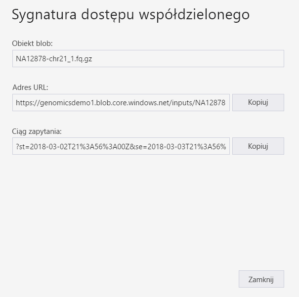
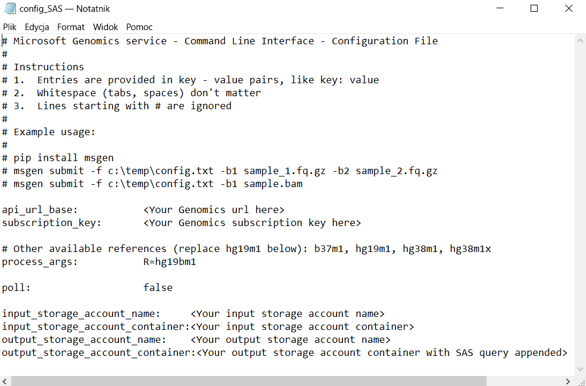

# <a name="submit-a-workflow-to-microsoft-genomics-using-a-sas-instead-of-a-storage-account-key"></a>Przesyłanie przepływu pracy do usługi Microsoft Genomics przy użyciu sygnatury dostępu współdzielonego zamiast klucza konta magazynu 

W tym artykule pokazano, jak przesłać przepływ pracy do usługi Microsoft Genomics przy użyciu pliku config. txt zawierającego [sygnatury dostępu współdzielonego (SAS)](https://docs.microsoft.com/azure/storage/common/storage-dotnet-shared-access-signature-part-1) zamiast kluczy konta magazynu. Ta funkcja może być przydatna, jeśli występują obawy związane z bezpieczeństwem dotyczące klucza konta magazynu widocznego w pliku config.txt. 

W tym artykule założono, że użytkownik zainstalował i uruchomił klienta `msgen` oraz że zna sposób korzystania z usługi Azure Storage. Jeśli przepływ pracy został pomyślnie przesłany przy użyciu dostarczonych przykładowych danych, możesz kontynuować pracę z tym artykułem. 

## <a name="what-is-a-sas"></a>Co to jest sygnatura dostępu współdzielonego?
[Sygnatura dostępu współdzielonego (SAS, shared access signature)](https://docs.microsoft.com/azure/storage/common/storage-dotnet-shared-access-signature-part-1) zapewnia delegowany dostęp do zasobów w ramach konta magazynu. Za pomocą sygnatury dostępu współdzielonego możesz udzielić dostępu do zasobów w ramach konta magazynu bez udostępniania kluczy konta. Jest to najbardziej istotna kwestia związana z używaniem sygnatur dostępu współdzielonego w aplikacjach — są one bezpiecznym sposobem udostępniania zasobów magazynu bez narażania kluczy konta.

Sygnatura dostępu współdzielonego przesyłana do usługi Microsoft Genomics powinna być [sygnaturą dostępu współdzielonego usługi](https://docs.microsoft.com/rest/api/storageservices/Constructing-a-Service-SAS) służącą do delegowania dostępu tylko do obiektu blob lub kontenera, w którym są przechowywane pliki wejściowe i wyjściowe. 

Identyfikator URI dla tokenu sygnatury dostępu współdzielonego na poziomie usługi składa się z identyfikatora URI do zasobu, dla którego sygnatura dostępu współdzielonego oddeleguje dostęp, po którym następuje token sygnatury dostępu współdzielonego. Token sygnatury dostępu współdzielonego to ciąg zapytania, który zawiera wszystkie informacje wymagane do uwierzytelniania tej sygnatury, a także określa zasób, uprawnienia dostępne na potrzeby dostępu, przedział czasu, przez który sygnatura jest prawidłowa, obsługiwany adres IP lub zakres adresów, z których mogą pochodzić żądania, obsługiwany protokół, za pomocą którego żądanie może zostać wykonane, opcjonalny identyfikator zasad dostępu powiązany z żądaniem, a także samą sygnaturę. 

## <a name="sas-needed-for-submitting-a-workflow-to-the-microsoft-genomics-service"></a>Sygnatura dostępu współdzielonego jest potrzebna do przesyłania przepływu pracy do usługi Microsoft Genomics
Dla każdego przepływu pracy przesyłanego do usługi Microsoft Genomics wymagane są co najmniej dwa tokeny sygnatur dostępu współdzielonego — jeden dla każdego pliku wejściowego i jeden dla kontenera danych wyjściowych.

Sygnatura dostępu współdzielonego dla plików wejściowych powinna mieć następujące właściwości:
 - Zakres (konto, kontener, obiekt blob): obiekt blob
 - Wygaśnięcie: 48 godzin od teraz
 - Uprawnienia: odczyt

Sygnatura dostępu współdzielonego dla kontenera danych wyjściowych powinna mieć następujące właściwości:
 - Zakres (konto, kontener, obiekt blob): kontener
 - Wygaśnięcie: 48 godzin od teraz
 - Uprawnienia: odczyt, zapis, usuwanie


## <a name="create-a-sas-for-the-input-files-and-the-output-container"></a>Tworzenie sygnatury dostępu współdzielonego dla plików wejściowych i kontenera danych wyjściowych
Istnieją dwa sposoby na utworzenie tokenu sygnatury dostępu współdzielonego: za pomocą eksploratora usługi Azure Storage lub programowo.  W przypadku pisania kodu można samodzielnie utworzyć sygnaturę dostępu współdzielonego lub użyć zestawu SDK usługi Azure Storage w preferowanym przez siebie języku.


### <a name="set-up-create-a-sas-using-azure-storage-explorer"></a>Konfigurowanie: tworzenie sygnatury dostępu współdzielonego za pomocą eksploratora usługi Azure Storage

[Eksplorator usługi Azure Storage](https://azure.microsoft.com/features/storage-explorer/) to narzędzie do zarządzania zasobami, które są przechowywane w usłudze Azure Storage.  Więcej informacji o sposobie używania eksploratora usługi Azure Storage można znaleźć [tutaj](https://docs.microsoft.com/azure/vs-azure-tools-storage-manage-with-storage-explorer).

Zakres sygnatury dostępu współdzielonego dla plików wejściowych powinien być ograniczony do określonego pliku wejściowego (obiekt blob). Aby utworzyć token sygnatury dostępu współdzielonego, postęp zgodnie z [tymi instrukcjami](https://docs.microsoft.com/azure/storage/blobs/storage-quickstart-blobs-storage-explorer). Po utworzeniu sygnatury dostępu współdzielonego zostanie udostępniony pełny adres URL z ciągiem zapytania oraz sam ciąg zapytania — możliwe jest skopiowanie tych elementów z ekranu.

 


### <a name="set-up-create-a-sas-programmatically"></a>Konfiguracja: programowe tworzenie SAS

Aby utworzyć sygnaturę dostępu współdzielonego przy użyciu zestawu SDK usługi Azure Storage, zapoznaj się z istniejącą dokumentacją w kilku językach, w tym [.NET](https://docs.microsoft.com/azure/storage/common/storage-dotnet-shared-access-signature-part-1), [Python](https://docs.microsoft.com/azure/storage/blobs/storage-python-how-to-use-blob-storage) i [Node.js](https://docs.microsoft.com/azure/storage/blobs/storage-nodejs-how-to-use-blob-storage). 

Aby utworzyć sygnaturę dostępu współdzielonego bez używania zestawu SDK, ciąg zapytania sygnatury dostępu współdzielonego może zostać bezpośrednio utworzony i zawierać wszystkie informacje wymagane do uwierzytelniania takiej sygnatury. W tych [instrukcjach](https://docs.microsoft.com/rest/api/storageservices/constructing-a-service-sas) szczegółowo opisano składniki ciągu zapytania sygnatury dostępu współdzielonego oraz sposób jego tworzenia. Wymagana sygnatura dostępu współdzielonego jest tworzona przez generowanie elementu HMAC przy użyciu informacji o uwierzytelnianiu obiektu blob/kontenera w sposób opisany w ramach tych [instrukcji](https://docs.microsoft.com/rest/api/storageservices/service-sas-examples).


## <a name="add-the-sas-to-the-configtxt-file"></a>Dodawanie sygnatury dostępu współdzielonego do pliku config.txt
Aby uruchomić przepływ pracy za pomocą usługi Microsoft Genomics przy użyciu ciągu zapytania sygnatury dostępu współdzielonego, przeprowadź edycję pliku config.txt w celu usunięcia kluczy z pliku config.txt. Następnie w przedstawiony sposób dołącz ciąg zapytania sygnatury dostępu współdzielonego (rozpoczynający się od znaku `?`) do nazwy kontenera danych wyjściowych. 



Użyj klienta języka Python usługi Microsoft Genomics, aby przesłać przepływ pracy przy użyciu następującego polecenia, dołączając odpowiedni ciąg zapytania sygnatury dostępu współdzielonego do poszczególnych nazw wejściowych obiektów blob:

```python
msgen submit -f [full path to your config file] -b1 [name of your first paired end read file, SAS query string appended] -b2 [name of your second paired end read file, SAS query string appended]
```

### <a name="if-adding-the-input-file-names-to-the-configtxt-file"></a>W przypadku dodawania nazw plików wejściowych do pliku config.txt
Alternatywnie możliwe jest dodanie sparowanych plików odczytów końcowych bezpośrednio do pliku config.txt z tokenami zapytania sygnatur dostępu współdzielonego dołączanymi w następujący sposób:


W tym przypadku użyj klienta języka Python usługi Microsoft Genomics, aby przesłać przepływ pracy przy użyciu następującego polecenia, pomijając polecenia `-b1` i `-b2`:

```python
msgen submit -f [full path to your config file] 
```

## <a name="next-steps"></a>Następne kroki
W tym artykule użyto tokenów sygnatur dostępu współdzielonego zamiast kluczy magazynu do przesłania przepływu pracy do usługi Microsoft Genomics za pośrednictwem klienta języka Python `msgen`. Aby uzyskać dodatkowe informacje o przesyłaniu przepływów pracy i innych poleceniach, których możesz użyć wraz z usługą Microsoft Genomics, zobacz [często zadawane pytania](frequently-asked-questions-genomics.md). 
