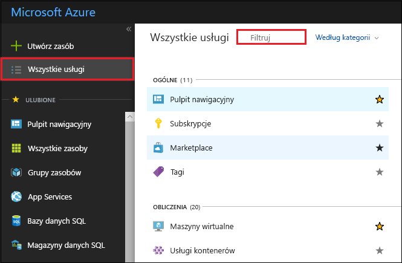
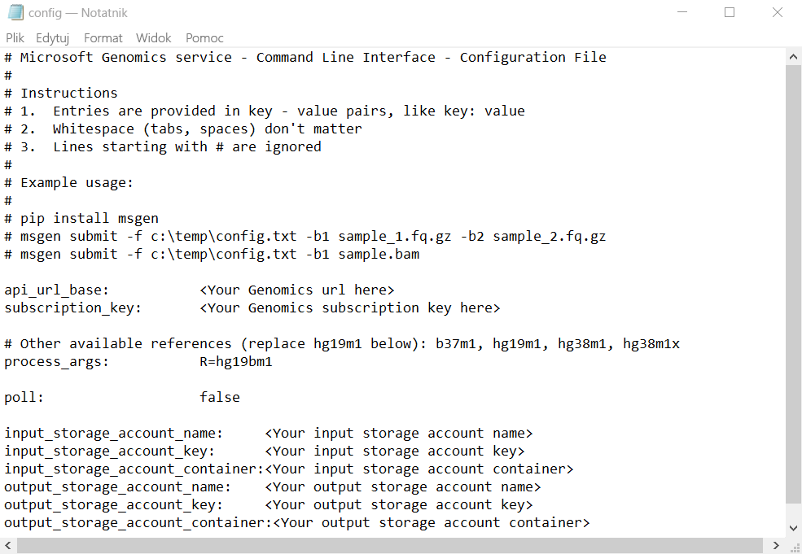

# <a name="quickstart-run-a-workflow-through-the-microsoft-genomics-service"></a>Szybki start: Uruchamianie przepływu za pośrednictwem usługi Microsoft Genomics

W tym przewodniku szybki start przekażesz dane wejściowe do konta usługi Azure Blob Storage i uruchomisz przepływ pracy za pośrednictwem usługi Microsoft Genomics przy użyciu klienta genomika języka Python. Microsoft Genomics to skalowalna, bezpieczna usługa umożliwiająca dodatkową analizę zapewniającą szybkie przetwarzanie genomów, począwszy od pierwotnych operacji odczytywania i tworzenia dopasowanych operacji odczytywania i wywołań odmian. 

## <a name="prerequisites"></a>Wymagania wstępne

- Konto platformy Azure z aktywną subskrypcją. [Utwórz konto bezpłatnie](https://azure.microsoft.com/free/?ref=microsoft.com&utm_source=microsoft.com&utm_medium=docs&utm_campaign=visualstudio). 
- Środowisko [Python 2.7.12 +](https://www.python.org/downloads/release/python-2714/), z `pip` zainstalowanym i `python` w ścieżce systemowej. Klient Microsoft Genomics nie jest zgodny z językiem Python 3. 

## <a name="set-up-create-a-microsoft-genomics-account-in-the-azure-portal"></a>Konfiguracja: tworzenie konta usługi Microsoft Genomics w witrynie Azure Portal

Aby utworzyć konto Microsoft Genomics, przejdź do [tworzenia konta genomika](https://portal.azure.com/#create/Microsoft.Genomics) w Azure Portal. Jeśli nie masz jeszcze subskrypcji platformy Azure, utwórz ją przed utworzeniem konta usługi Microsoft Genomics. 


Skonfiguruj konto usługi Genomics w sposób pokazany na wcześniejszej ilustracji, używając następujących informacji. 

 |**Ustawienie**          |  **Sugerowana wartość**  | **Opis pola** |
 |:-------------       |:-------------         |:----------            |
 |Subskrypcja         | Nazwa subskrypcji użytkownika|Jest to jednostka rozliczeniowa usług platformy Azure — aby uzyskać szczegółowe informacje o subskrypcji, zobacz [Subskrypcje](https://account.azure.com/Subscriptions) |      
 |Grupa zasobów       | MyResourceGroup       |  Grupy zasobów umożliwiają grupowanie wielu zasobów platformy Azure (konto magazynu, konto usługi Genomics itp.) w jednej grupie, co upraszcza zarządzanie. Aby uzyskać więcej informacji, zobacz [Grupy zasobów](../azure-resource-manager/management/overview.md#resource-groups). Prawidłowe nazwy grup zasobów opisano w artykule [Reguły nazewnictwa](/azure/architecture/best-practices/resource-naming) |
 |Nazwa konta         | MyGenomicsAccount     |Wybierz unikatowy identyfikator konta. Aby uzyskać informacje o prawidłowych nazwach, zobacz [Reguły nazewnictwa](/azure/architecture/best-practices/resource-naming) |
 |Lokalizacja                   | Zachodnie stany USA 2                    |    Usługa jest dostępna w regionach: Zachodnie stany USA 2, Europa Zachodnia i Azja Południowo-Wschodnia |

Możesz wybrać opcję **powiadomienia** na górnym pasku menu, aby monitorować proces wdrażania.


Aby uzyskać więcej informacji na temat Microsoft Genomics, zobacz [co to jest Microsoft Genomics?](overview-what-is-genomics.md)

## <a name="set-up-install-the-microsoft-genomics-python-client"></a>Konfiguracja: instalacja klienta Microsoft Genomics Python

Należy zainstalować zarówno Język Python, jak i Microsoft Genomics klienta języka Python `msgen` w środowisku lokalnym. 

### <a name="install-python"></a>Instalowanie języka Python

Microsoft Genomics klienta języka Python jest zgodny z językiem Python 2.7.12 lub nowszą wersją 2.7. XX. 2.7.14 jest sugerowaną wersją. Pliki do pobrania możesz znaleźć [tutaj](https://www.python.org/downloads/release/python-2714/). 

> [!IMPORTANT]
> Język Python 3.x nie jest zgodny z językiem Python 2.7.xx.  `msgen` jest aplikacją w języku Python 2,7. W przypadku uruchamiania `msgen` upewnij się, że aktywne środowisko Python korzysta z systemu Python. XX w wersji 2.7. Podczas próby użycia `msgen` z wersją języka Python 3. x mogą wystąpić błędy.

### <a name="install-the-microsoft-genomics-python-client-msgen"></a>Instalowanie klienta Microsoft Genomics Python `msgen`

`pip`Zainstaluj klienta Microsoft Genomics przy użyciu języka Python `msgen` . W poniższych instrukcjach przyjęto, że python2. x znajduje się już w ścieżce systemowej. Jeśli występują problemy z `pip` nierozpoznaną instalacją, należy dodać Język Python i podfolder scripts do ścieżki systemowej.

```
pip install --upgrade --no-deps msgen
pip install msgen
```

Jeśli nie chcesz instalować `msgen` jako plików binarnych w całym systemie i modyfikować pakietów w języku Python obejmujących system, użyj `–-user` flagi z `pip` .
W przypadku korzystania z instalacji lub setup.py na podstawie pakietu wymagane jest zainstalowanie wszystkich wymaganych pakietów.

### <a name="test-msgen-python-client"></a>Test `msgen` klienta języka Python
Aby przetestować Microsoft Genomics klienta, Pobierz plik konfiguracji z konta genomika. W Azure Portal przejdź do swojego konta genomika, wybierając pozycję **wszystkie usługi** w lewym górnym rogu, a następnie wyszukując i wybierając pozycję genomika konta.



Wybierz właśnie utworzone konto genomiki, przejdź do opcji **klucze dostępu** i Pobierz plik konfiguracji.


Przetestuj działanie klienta Microsoft Genomics Python przy użyciu następującego polecenia:

```Python
msgen list -f "<full path where you saved the config file>"
```

## <a name="create-a-microsoft-azure-storage-account"></a>Utwórz konto Microsoft Azure Storage 
Usługa Microsoft Genomics oczekuje przechowywania danych wejściowych w formie blokowych obiektów blob na koncie magazynu platformy Azure. Usługa również zapisuje pliki wyjściowe jako blokowe obiekty blob w kontenerze określonym przez użytkownika na koncie magazynu platformy Azure. Pliki wejściowe i wyjściowe mogą znajdować się w różnych kontach magazynu.
Jeśli masz już dane na koncie magazynu platformy Azure, musisz tylko upewnić się, że znajdują się w tej samej lokalizacji co konto usługi Genomics. W przeciwnym razie opłaty za ruch wychodzący są naliczane podczas uruchamiania usługi Microsoft Genomics. Jeśli jeszcze nie masz konta usługi Azure Storage, musisz utworzyć je i przekazać dane. Więcej informacji o kontach usługi Azure Storage można znaleźć [tutaj](../storage/common/storage-account-create.md), w tym o tym, czym jest konto magazynu i jakie usługi zapewnia. Aby utworzyć konto usługi Azure Storage, przejdź do okna [Utwórz konto magazynu](https://portal.azure.com/#create/Microsoft.StorageAccount-ARM) w Azure Portal.  


Skonfiguruj konto magazynu przy użyciu następujących informacji, jak pokazano na poprzedniej ilustracji. Używaj większości opcji standardowych dla konta magazynu, określając tylko, że konto jest BlobStorage, a nie ogólnego przeznaczenia. Magazyn obiektów blob może być 2–5 razy szybszy w przypadku pobierania i przekazywania.  Zalecany jest domyślny model wdrażania Azure Resource Manager.  

 |**Ustawienie**          |  **Sugerowana wartość**  | **Opis pola** |
 |:-------------------------       |:-------------         |:----------            |
 |Subskrypcja         | Twoja subskrypcja platformy Azure |Aby uzyskać szczegółowe informacje o subskrypcji, zobacz [Subskrypcje](https://account.azure.com/Subscriptions) |      
 |Grupa zasobów       | MyResourceGroup       |  Możesz wybrać tę samą grupę zasobów, która jest taka sama jak konto genomika. W przypadku prawidłowych nazw grup zasobów zobacz [reguły nazewnictwa](/azure/architecture/best-practices/resource-naming) |
 |Nazwa konta magazynu         | MyStorageAccount     |Wybierz unikatowy identyfikator konta. Poprawne nazwy można znaleźć w temacie [reguły nazewnictwa](/azure/architecture/best-practices/resource-naming) |
 |Lokalizacja                  | Zachodnie stany USA 2                  | Użyj tej samej lokalizacji co lokalizacja konta genomika, aby zmniejszyć opłaty za ruch wychodzący i skrócić opóźnienia.  | 
 |Wydajność                  | Standardowa                   | Wartość domyślna to Standardowa. Aby uzyskać więcej informacji na temat kont magazynu w warstwach Standardowa i Premium, zobacz [wprowadzenie do usługi Microsoft Azure Storage](../storage/common/storage-introduction.md)    |
 |Rodzaj konta       | BlobStorage       |  Magazyn obiektów blob może być 2–5 razy szybszy od konta ogólnego przeznaczenia w przypadku pobierania i przekazywania. |
 |Replikacja                  | Magazyn lokalnie nadmiarowy                  | Magazyn lokalnie nadmiarowy replikuje dane w centrum danych w regionie, w którym utworzono konto magazynu. Aby uzyskać więcej informacji, zobacz [Replikacja usługi Azure Storage](../storage/common/storage-redundancy.md)    |
 |Warstwa dostępu                  | Gorąca                   | Gorąca warstwa dostępu oznacza, że dostęp do obiektów na koncie magazynu będzie uzyskiwany częściej.    |

Następnie wybierz pozycję **Recenzja + Utwórz** , aby utworzyć konto magazynu. Podobnie jak w przypadku tworzenia konta genomiki, możesz wybrać opcję **powiadomienia** na górnym pasku menu, aby monitorować proces wdrażania. 

## <a name="upload-input-data-to-your-storage-account"></a>Przekazywanie danych wejściowych do konta magazynu

Usługa Microsoft Genomics oczekuje sparowanych odczytów końcowych (plików fastq lub BAM) jako plików wejściowych. Możesz przekazać własne dane lub eksplorować publicznie dostępne dane przykładowe. Jeśli chcesz użyć publicznie dostępnych danych przykładowych, są one hostowane tutaj:

[https://msgensampledata.blob.core.windows.net/small/chr21_1.fq.gz](https://msgensampledata.blob.core.windows.net/small/chr21_1.fq.gz)
[https://msgensampledata.blob.core.windows.net/small/chr21_2.fq.gz](https://msgensampledata.blob.core.windows.net/small/chr21_2.fq.gz)

Na koncie magazynu musisz utworzyć jeden kontener obiektów blob na dane wejściowe oraz drugi kontener obiektów blob na dane wyjściowe.  Przekaż dane wejściowe do kontenera wejściowych obiektów blob. Do tego celu można użyć różnych narzędzi, w tym [Eksplorator usługi Microsoft Azure Storage](https://azure.microsoft.com/features/storage-explorer/), [BlobPorter](https://github.com/Azure/blobporter)lub [AzCopy](../storage/common/storage-use-azcopy-v10.md?toc=%252fazure%252fstorage%252fblobs%252ftoc.json). 

## <a name="run-a-workflow-through-the-microsoft-genomics-service-using-the-msgen-python-client"></a>Uruchamianie przepływu pracy za pośrednictwem usługi Microsoft Genomics przy użyciu `msgen` klienta języka Python

Aby uruchomić przepływ pracy za pomocą usługi Microsoft Genomics, edytuj plik *config.txt* w celu określenia docelowego i wyjściowego kontenera magazynu dla danych.
Otwórz plik *config.txt* pobrany z konta genomiki. Sekcje, które należy określić, to klucz subskrypcji oraz sześć elementów u dołu, nazwa konta magazynu, klucz i nazwa kontenera dla danych wejściowych i wyjściowych. Te informacje można znaleźć, przechodząc do okna Azure Portal, aby **uzyskać dostęp do kluczy** konta magazynu, lub bezpośrednio z Eksplorator usługi Azure Storage.  



Jeśli chcesz uruchomić GATK4, ustaw `process_name` parametr na `gatk4` .

Domyślnie usługa Genomics generuje pliki VCF. Jeśli chcesz, aby dane wyjściowe gVCF zamiast danych wyjściowych VCF (odpowiednik `-emitRefConfidence` w GATK 3. x i `emit-ref-confidence` w GATK 4. x), Dodaj `emit_ref_confidence` parametr do *config.txt* i ustaw go na `gvcf` , jak pokazano na powyższym rysunku.  Aby zmienić z powrotem na dane wyjściowe VCF, usuń je z pliku *config.txt* lub ustaw `emit_ref_confidence` parametr na `none` . 

`bgzip` jest narzędziem, które kompresuje plik VCF lub gvcf i `tabix` tworzy indeks dla skompresowanego pliku. Domyślnie usługa genomiki jest uruchamiana `bgzip` po wykonaniu polecenia `tabix` ". g. vcf", ale nie uruchamia tych narzędzi domyślnie dla danych wyjściowych ". vcf". Po uruchomieniu usługa tworzy pliki ". gz" (bgzip Output) i ". TBI" (Tabix Output). Argument jest wartością logiczną, która jest domyślnie ustawiona na false dla danych wyjściowych ". vcf" i domyślnie ma wartość true dla danych wyjściowych ". g. vcf". Aby użyć w wierszu polecenia, określ `-bz` lub `--bgzip-output` AS `true` (Run bgzip and Tabix) lub `false` . Aby użyć tego argumentu w pliku *config.txt* , Dodaj `bgzip_output: true` plik lub `bgzip_output: false` do pliku.

### <a name="submit-your-workflow-to-the-microsoft-genomics-service-using-the-msgen-python-client"></a>Przesyłanie przepływu pracy do usługi Microsoft Genomics przy użyciu `msgen` klienta języka Python

Użyj klienta Microsoft Genomics Python, aby przesłać przepływ pracy przy użyciu następującego polecenia:

```python
msgen submit -f [full path to your config file] -b1 [name of your first paired end read] -b2 [name of your second paired end read]
```

Możesz wyświetlić stan przepływów pracy przy użyciu następującego polecenia: 
```python
msgen list -f c:\temp\config.txt 
```

Po zakończeniu przepływu pracy można wyświetlić pliki wyjściowe na koncie usługi Azure Storage w skonfigurowanym kontenerze danych wyjściowych. 

## <a name="next-steps"></a>Następne kroki

W tym artykule zostały przekazane przykładowe dane wejściowe do usługi Azure Storage i przesłano przepływ pracy do usług Microsoft Genomics za pomocą `msgen` klienta języka Python. Aby dowiedzieć się więcej o innych typach plików wejściowych, które mogą być używane z usługą Microsoft Genomics, zobacz następujące strony: [sparowany FASTQ](quickstart-input-pair-FASTQ.md)  |  [BAM](quickstart-input-BAM.md)  |  [Multiple FASTQ lub BAM](quickstart-input-multiple.md). Możesz również zapoznać się z tym samouczkiem, korzystając z naszego [przykładu Azure Notebooks](https://aka.ms/genomicsnotebook) , pobierając plik "Genomika samouczka. ipynb" i korzystając z czytnika notesu, takiego jak [Jupyter](../notebooks/tutorial-create-run-jupyter-notebook.md) , aby otworzyć plik i uruchomić go.