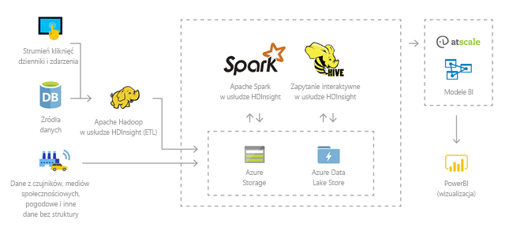
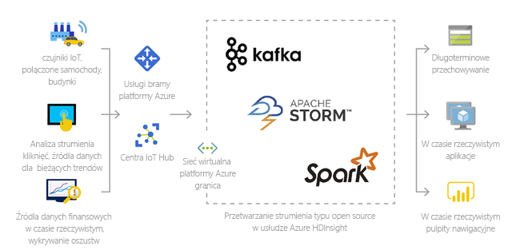
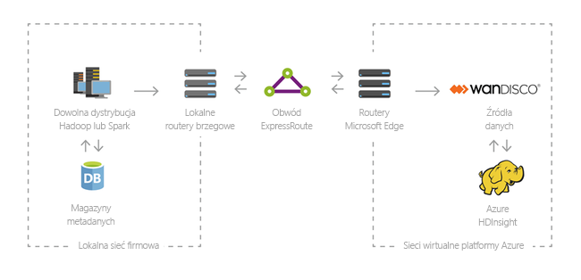

# Co to jest usługa Azure HDInsight oraz stos technologii Hadoop?

Ten artykuł zawiera wprowadzenie do usługi Apache Hadoop w usłudze Azure HDInsight. Azure HDInsight jest w pełni zarządzaną usługą analityczną typu „open source” o szerokim zakresie, z przeznaczeniem dla przedsiębiorstw. Można używać z nią struktur typu „open source” takich jak Hadoop, Spark, Hive, LLAP, Kafka, Storm, R i nie tylko. 

[!INCLUDE [hdinsight-price-change](../../../includes/hdinsight-enhancements.md)]

## Co to jest usługa HDInsight oraz stos technologii Hadoop?

[Apache Hadoop](http://hadoop.apache.org/) to oryginalna struktura typu „open source” do przetwarzania rozproszonego i analizy zestawów danych big data w klastrach. Stos technologii Hadoop obejmuje powiązane oprogramowanie i narzędzia, w tym Apache Hive, HBase, Spark, Kafka i wiele innych.

Usługa Azure HDInsight jest dystrybucją w chmurze składników usługi Hadoop z platformy [Hortonworks Data Platform (HDP)](https://hortonworks.com/products/data-center/hdp/). Usługa Azure HDInsight ułatwia i przyspiesza przetwarzanie ogromnych ilości danych przy jednoczesnej minimalizacji kosztów. Można używać z nią najpopularniejszych platform typu „open source” takich jak Hadoop, Spark, Hive, LLAP, Kafka, Storm, R i nie tylko. Za pomocą tych platform można realizować rozmaite scenariusze związane z wyodrębnianiem, transformacją i ładowaniem danych, magazynowaniem danych, uczeniem maszynowym oraz Internetem rzeczy (IoT).

Aby wyświetlić dostępne składniki stosu technologii Hadoop w usłudze HDInsight, zobacz [Components and versions available with HDInsight][component-versioning] (Składniki i wersje dostępne w usłudze HDInsight). Aby dowiedzieć się więcej o platformie Hadoop w usłudze HDInsight, zobacz [stronę z opisem funkcji platformy Azure w usłudze HDInsight](https://azure.microsoft.com/services/hdinsight/).

## Co to są dane big data?

Dane big data są gromadzone szybciej, w większych ilościach i bardziej różnorodnych formatach niż kiedykolwiek wcześniej. Dzielą się one na historyczne (przechowywane) lub dostępne w czasie rzeczywistym (przesyłane strumieniowo ze źródła). Zobacz [Scenariusze użycia usługi HDInsight](#scenarios-for-using-hdinsight), aby zapoznać się z najpopularniejszymi przypadkami użycia danych big data.

## Dlaczego warto używać platformy Hadoop w usłudze HDInsight?

W tej sekcji wymieniono możliwości usługi Azure HDInsight.

|Możliwości  |Opis  |
|---------|---------|
|Natywna usługa w chmurze     |     Usługa Azure HDInsight umożliwia tworzenie na platformie Azure klastrów zoptymalizowanych dla technologii [Hadoop](apache-hadoop-linux-tutorial-get-started.md),  [Spark](../spark/apache-spark-jupyter-spark-sql.md),  [zapytania interakcyjnego (LLAP)](../interactive-query/apache-interactive-query-get-started.md),  [Kafka](../kafka/apache-kafka-get-started.md),  [Storm](../storm/apache-storm-tutorial-get-started-linux.md),  [HBase](../hbase/apache-hbase-tutorial-get-started-linux.md) i  [usług ML](../r-server/r-server-get-started.md). Usługa HDInsight zapewnia również kompleksową umowę dotyczącą poziomu usług dla wszystkich obciążeń produkcyjnych.  |
|Niskie koszty i skalowalność     | Usługa HDInsight umożliwia [skalowanie](../hdinsight-administer-use-portal-linux.md)  obciążeń w górę lub w dół. Możesz obniżyć koszty,  [tworząc klastry na żądanie](../hdinsight-hadoop-create-linux-clusters-adf.md) i płacąc wyłącznie za rzeczywiste użycie. Możesz także tworzyć potoki danych w celu operacjonalizacji zadań. Oddzielenie obliczeń i magazynu zapewnia wyższą wydajność i elastyczność. |
|Bezpieczeństwo i zgodność    | Usługa HDInsight umożliwia ochronę zasobów danych przedsiębiorstwa przy użyciu usługi [Azure Virtual Network](../hdinsight-extend-hadoop-virtual-network.md), [szyfrowania](../hdinsight-hadoop-create-linux-clusters-with-secure-transfer-storage.md) oraz integracji z usługą [Azure Active Directory](../domain-joined/apache-domain-joined-introduction.md). Usługa HDInsight spełnia również najpopularniejsze branżowe i rządowe [normy zgodności](https://azure.microsoft.com/overview/trusted-cloud).        |
|Monitorowanie    | Usługa Azure HDInsight jest zintegrowana z usługą [Azure Log Analytics](../hdinsight-hadoop-oms-log-analytics-tutorial.md), zapewniając jeden interfejs, za pomocą którego można monitorować wszystkie swoje klastry.        |
|Globalna dostępność | Usługa HDInsight jest dostępna w większej liczbie  [regionów](https://azure.microsoft.com/regions/services/)  niż jakiekolwiek inne rozwiązanie do analizy danych big data. Usługa Azure HDInsight jest również dostępna w ramach chmur Azure Government, Azure (Chiny) i Azure (Niemcy), dzięki czemu odpowiada na potrzeby Twojego przedsiębiorstwa w najważniejszych obszarach suwerenności. |  
|Produktywność     |  Usługa Azure HDInsight umożliwia korzystanie z zaawansowanych narzędzi zapewniających produktywność w usłudze Hadoop i na platformie Spark w ramach preferowanego środowiska deweloperskiego. Może to być na przykład środowisko [Visual Studio](apache-hadoop-visual-studio-tools-get-started.md), [VSCode](../hdinsight-for-vscode.md), [Eclipse](../spark/apache-spark-eclipse-tool-plugin.md) oraz [IntelliJ](../spark/apache-spark-intellij-tool-plugin.md) w języku Scala, Python, R, Java i .NET. Analitycy danych mogą także współpracować przy użyciu popularnych notesów, takich jak [Jupyter](../spark/apache-spark-jupyter-notebook-kernels.md) i [Zeppelin](../spark/apache-spark-zeppelin-notebook.md).    |
|Rozszerzalność     |  Klastry usługi HDInsight można rozszerzać za pomocą zainstalowanych składników (Hue, Presto itp.), używając [akcji skryptów](../hdinsight-hadoop-customize-cluster-linux.md), [dodając węzły brzegowe](../hdinsight-apps-use-edge-node.md) lub [integrując je z innymi certyfikowanymi aplikacjami do przetwarzania danych big data](../hdinsight-apps-install-applications.md). Usługa HDInsight umożliwia bezproblemową integrację z najpopularniejszymi rozwiązaniami danych big data oraz wdrażanie za pomocą [jednego kliknięcia](https://azure.microsoft.com/services/hdinsight/partner-ecosystem/).|

## Scenariusze użycia usługi HDInsight

Usługa Azure HDInsight może być używana w wielu różnych scenariuszach związanych z przetwarzaniem danych big data. Dzielą się one na dane historyczne (już zebrane i przechowywane) oraz dostępne w czasie rzeczywistym (przesyłane strumieniowo bezpośrednio ze źródła). Scenariusze związane z przetwarzaniem takich danych można podzielić na następujące kategorie: 

### Przetwarzanie wsadowe (ETL)

Wyodrębnianie, transformacja, ładowanie (ETL, extraction, transformation, and loading) to proces wyodrębniania danych ze strukturą lub bez struktury z heterogenicznych źródeł danych. Dane te są następnie przekształcane do formatu strukturalnego i ładowane do magazynu danych. Przekształcone dane mogą być używane do analizy lub magazynowania danych.

### Magazynowanie danych

Przy użyciu usługi HDInsight można wykonywać interakcyjne zapytania w skali petabajtów względem danych ze strukturą lub bez struktury w dowolnym formacie. Można także tworzyć modele łączące je z narzędziami analizy biznesowej. Aby uzyskać więcej informacji, [przeczytaj tę historię klienta](https://customers.microsoft.com/story/milliman). 

### Internet rzeczy (IoT)

Przy użyciu usługi HDInsight można przetwarzać dane przesyłane strumieniowo, odbierane w czasie rzeczywistym z różnych urządzeń. Aby uzyskać więcej informacji, [przeczytaj ten wpis w blogu platformy Azure, w którym zapowiadana jest publiczna wersja zapoznawcza platformy Apache Kafka w usłudze HDInsight z usługą Azure Managed Disks](https://azure.microsoft.com/blog/announcing-public-preview-of-apache-kafka-on-hdinsight-with-azure-managed-disks/).

 

### Nauka o danych

Przy użyciu usługi HDInsight można tworzyć aplikacje wyodrębniające z danych kluczowe informacje. Dodatkowo można zastosować usługę Azure Machine Learning, aby przewidywać przyszłe tendencje biznesowe. Aby uzyskać więcej informacji, [przeczytaj tę historię klienta](https://customers.microsoft.com/story/pros).

### Połączenie hybrydowe

Za pomocą usługi HDInsight możesz rozszerzyć istniejącą lokalną infrastrukturę przetwarzania danych big data na platformę Azure, aby korzystać z zaawansowanych funkcji analizy w chmurze.

## Typy klastrów w usłudze HDInsight
Usługa HDInsight zawiera określone typy klastrów i oferuje możliwości dostosowywania klastra, takie jak dodawanie składników, narzędzi i języków. W usłudze HDInsight dostępne są następujące typy klastrów:

* **[Apache Hadoop](https://wiki.apache.org/hadoop)**: platforma korzystająca z systemu [HDFS](#hdfs), zarządzania zasobami [YARN](#yarn) i prostego modelu programowania [MapReduce](#mapreduce) do celów równoległego przetwarzania i analizowania danych partii.

* **[Apache Spark](http://spark.apache.org/)**: platforma przetwarzania równoległego typu open source, która obsługuje przetwarzanie w pamięci, umożliwiające zwiększenie wydajności aplikacji do analizy danych big data. Zobacz temat [Przegląd: platforma Apache Spark w usłudze HDInsight](../spark/apache-spark-overview.md).

* **[Apache HBase](http://hbase.apache.org/)**: baza danych NoSQL oparta na platformie Hadoop, która zapewnia dostęp losowy i wysoki poziom spójności w przypadku dużych ilości danych z częściową strukturą lub bez struktury — potencjalnie miliardów wierszy pomnożonych przez miliony kolumn. Zobacz temat [Co to jest usługa HBase w usłudze HDInsight?](../hbase/apache-hbase-overview.md)

* **[Usługi ML](https://msdn.microsoft.com/microsoft-r/rserver)**: serwer przeznaczony do hostowania równoległych, rozproszonych procesów języka R oraz zarządzania nimi. Umożliwia on analitykom danych, statystykom i programistom języka R dostęp na żądanie do skalowalnych, rozproszonych metod analizy w usłudze HDInsight. Zobacz [Omówienie usług ML w usłudze HDInsight](../r-server/r-server-overview.md).

* **[Apache Storm](https://storm.incubator.apache.org/)**: rozproszony system obliczeniowy działający w czasie rzeczywistym do szybkiego przetwarzania dużych strumieni danych. Storm jest oferowany jako zarządzany klaster w usłudze HDInsight. Zobacz temat [Analyze real-time sensor data using Storm and Hadoop](../storm/apache-storm-sensor-data-analysis.md) (Analizowanie danych czujnika w czasie rzeczywistym przy użyciu platform Storm i Hadoop).

* **[Zapytanie interakcyjne Apache (Live Long and Process) w wersji zapoznawczej](https://cwiki.apache.org/confluence/display/Hive/LLAP)**: buforowanie w pamięci umożliwiające interaktywne i szybsze zapytania programu Hive. Zobacz temat [Use Interactive Query in HDInsight](../interactive-query/apache-interactive-query-get-started.md) (Używanie zapytań interakcyjnych w usłudze HDInsight).

* **[Apache Kafka](https://kafka.apache.org/)**: platforma typu open source, która służy do tworzenia potoków danych przesyłanych strumieniowo i aplikacji do obsługi tych danych. Platforma Kafka obejmuje również funkcję kolejki komunikatów, która umożliwia publikowanie i subskrybowanie strumieni danych. Zobacz temat [Introduction to Apache Kafka on HDInsight](../kafka/apache-kafka-introduction.md) (Wprowadzenie do platformy Apache Kafka w usłudze HDInsight).

## Składniki typu open source w usłudze HDInsight

Usługa Azure HDInsight umożliwia tworzenie klastrów przy użyciu platform typu open source, takich jak Hadoop, Spark, Hive, LLAP, Kafka, Storm, HBase i R. Klastry te zawierają domyślnie inne składniki typu open source, takie jak [Ambari](https://github.com/apache/ambari/blob/trunk/ambari-server/docs/api/v1/index.md), [Avro](http://avro.apache.org/docs/current/spec.html), [Hive](http://hive.apache.org), [HCatalog](https://cwiki.apache.org/confluence/display/Hive/HCatalog/), [Mahout](https://mahout.apache.org/), [MapReduce](http://wiki.apache.org/hadoop/MapReduce), [YARN](http://hadoop.apache.org/docs/current/hadoop-yarn/hadoop-yarn-site/YARN.html), [Phoenix](http://phoenix.apache.org/), [Pig](http://pig.apache.org/), [Sqoop](http://sqoop.apache.org/), [Tez](http://tez.apache.org/), [Oozie](http://oozie.apache.org/) czy [ZooKeeper](http://zookeeper.apache.org/).  

## Języki programowania w usłudze HDInsight
Klastry HDInsight, takie jak Spark, HBase, Kafka, Hadoop i inne, obsługują wiele języków programowania. Niektóre z nich nie są instalowane domyślnie. W przypadku bibliotek, modułów lub pakietów niezainstalowanych domyślnie [do instalacji składnika należy użyć akcji skryptu](../hdinsight-hadoop-script-actions-linux.md).

|Język programowania  |Informacje  |
|---------|---------|
|Domyślna obsługa języka programowania     | Domyślnie klastry usługi HDInsight obsługują języki:<ul><li>Java</li><li>Python</li></ul> Dodatkowe języki można zainstalować przy użyciu [akcji skryptu](../hdinsight-hadoop-script-actions-linux.md).       |
|Języki maszyny wirtualnej Java (JVM)     | Wiele języków innych niż Java można uruchamiać za pomocą maszyny wirtualnej Java (JVM). Jednak do uruchomienia niektórych z tych języków mogą być potrzebne dodatkowe składniki zainstalowane w klastrze. W klastrach usługi HDInsight są obsługiwane następujące języki działające w oparciu o JVM: <ul><li>Clojure</li><li>Jython (Python dla platformy Java)</li><li>Scala</li></ul>     |
|Języki specyficzne dla platformy Hadoop     | Klastry HDInsight obsługują następujące języki specyficzne dla stosu technologii Hadoop: <ul><li>Pig Latin do zadań Pig</li><li>HiveQL do zadań Hive oraz SparkSQL</li></ul>        |
 

## Analiza biznesowa w usłudze HDInsight
Znane narzędzia do analizy biznesowej (BI, business intelligence) pobierają, analizują i raportują dane zintegrowane z usługą HDInsight przy użyciu dodatku Power Query lub sterownika Microsoft Hive ODBC:

* [Apache Spark BI using data visualization tools with Azure HDInsight (Analiza biznesowa przy użyciu platformy Apache Spark i narzędzi do wizualizacji danych w usłudze Azure HDInsight)](../spark/apache-spark-use-bi-tools.md)

* [Visualize Hive data with Microsoft Power BI in Azure HDInsight (Wizualizowanie danych programu Hive przy użyciu usługi Microsoft Power BI w usłudze Azure HDInsight)](apache-hadoop-connect-hive-power-bi.md) 

* [Visualize Interactive Query Hive data with Power BI in Azure HDInsight (Wizualizowanie danych programu Hive zapytania bezpośredniego przy użyciu usługi Power BI w usłudze Azure HDInsight)](../interactive-query/apache-hadoop-connect-hive-power-bi-directquery.md)

* [Łączenie programu Excel z usługą Hadoop za pomocą funkcji Power Query](apache-hadoop-connect-excel-power-query.md) (wymaga systemu Windows) 

* [Łączenie programu Excel z usługą Hadoop przy użyciu sterownika Microsoft Hive ODBC](apache-hadoop-connect-excel-hive-odbc-driver.md) (wymaga systemu Windows) 

* [Korzystanie z usług SQL Server Analysis Services za pomocą usługi HDInsight](https://msdn.microsoft.com/library/dn749857.aspx)

* [Korzystanie z usług SQL Server Reporting Services za pomocą usługi HDInsight](https://msdn.microsoft.com/library/dn749856.aspx)

## Następne kroki

W tym artykule przedstawiono usługę Azure HDInsight i omówiono udostępnianie usługi Hadoop oraz innych typów klastrów na platformie Azure. Przejdź do następnego artykułu, aby dowiedzieć się, jak utworzyć klaster Apache Hadoop w usłudze HDInsight.

> [!div class="nextstepaction"]
> [Tworzenie klastra Hadoop w usłudze HDInsight](apache-hadoop-linux-create-cluster-get-started-portal.md)

[component-versioning]: ../hdinsight-component-versioning.md
[zookeeper]: http://zookeeper.apache.org/
