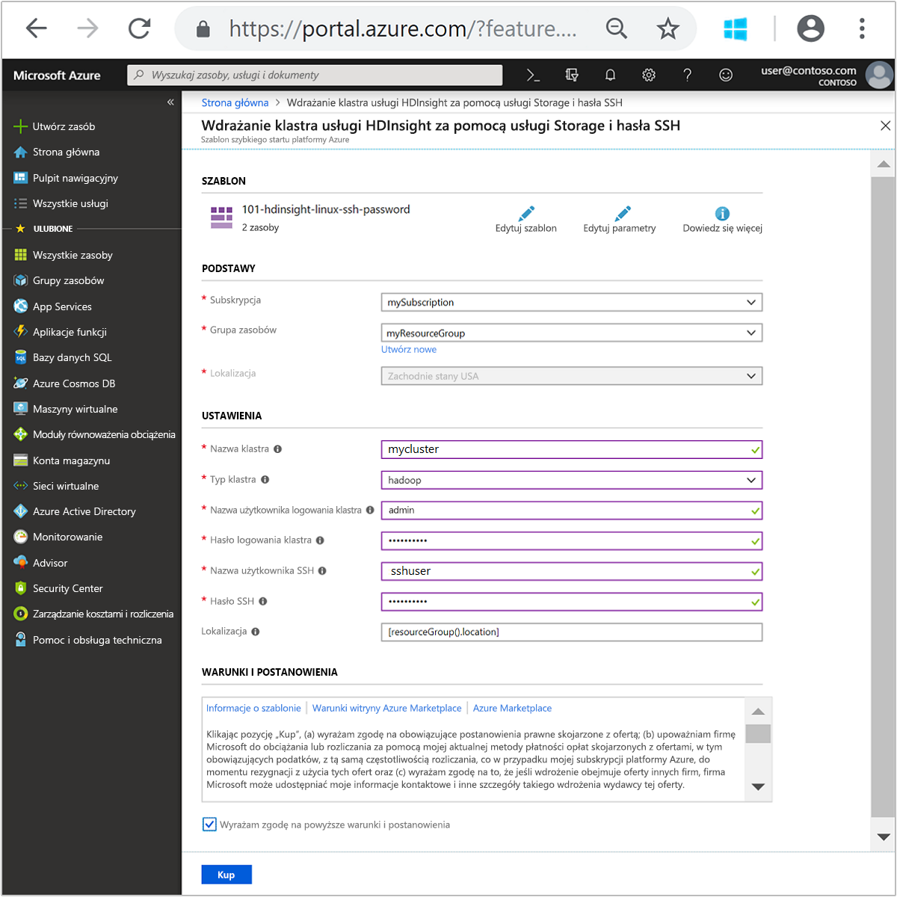

# Szybki start: tworzenie klastra Apache Hadoop w usłudze Azure HDInsight przy użyciu szablonu Menedżera zasobów

W tym przewodniku Szybki start można użyć szablonu usługi Azure Resource Manager do utworzenia klastra [Apache Hadoop](./apache-hadoop-introduction.md) w usłudze Azure HDInsight. Hadoop był oryginalną platformą open source do rozproszonego przetwarzania i analizy dużych zbiorów danych w klastrach. Ekosystem Hadoop obejmuje powiązane oprogramowanie i narzędzia, w tym Apache Hive, Apache HBase, Spark, Kafka i wiele innych.

[!INCLUDE [About Azure Resource Manager](../../../includes/resource-manager-quickstart-introduction.md)]
  
Obecnie usługa HDInsight obejmuje [siedem różnych typów klastrów](../hdinsight-overview.md#cluster-types-in-hdinsight). Każdy typ klastra obsługuje inny zestaw składników. Wszystkie typy klastrów obsługują technologię Hive. Aby uzyskać listę obsługiwanych składników w usłudze HDInsight, zobacz artykuł [Nowości w wersjach klastra Hadoop dostarczanych z usługą HDInsight](../hdinsight-component-versioning.md)  

Jeśli nie masz subskrypcji platformy Azure, utwórz [bezpłatne konto](https://azure.microsoft.com/free/?WT.mc_id=A261C142F) przed rozpoczęciem.

## Tworzenie klastra Apache Hadoop

### Przejrzyj szablon

Szablon używany w tym przewodniku Szybki start pochodzi z [szablonów szybki start platformy Azure](https://github.com/Azure/azure-quickstart-templates/tree/master/101-hdinsight-linux-ssh-password).

:::code language="json" source="~/quickstart-templates/101-hdinsight-linux-ssh-password/azuredeploy.json" range="1-148":::

Dwa zasoby platformy Azure są zdefiniowane w szablonie:

* [Microsoft.Storage/storageKonta:](https://docs.microsoft.com/azure/templates/microsoft.storage/storageaccounts)tworzenie konta usługi Azure Storage.
* [Microsoft.HDInsight/cluster](https://docs.microsoft.com/azure/templates/microsoft.hdinsight/clusters): tworzenie klastra HDInsight.

### Wdrożenie szablonu

1. Wybierz przycisk **Wdrażanie na platformie Azure** poniżej, aby zalogować się na platformę Azure i otworzyć szablon Menedżera zasobów.

    

1. Wprowadź lub wybierz poniższe wartości:

    |Właściwość  |Opis  |
    |---------|---------|
    |Subskrypcja|Z listy rozwijanej wybierz subskrypcję platformy Azure, która jest używana dla klastra.|
    |Grupa zasobów|Z listy rozwijanej wybierz istniejącą grupę zasobów lub wybierz pozycję **Utwórz nowy**.|
    |Lokalizacja|Wartość zostanie automatycznie wypełniona lokalizacją używaną dla grupy zasobów.|
    |Nazwa klastra|Podaj globalnie unikatową nazwę. W tym szablonie należy używać tylko małych liter i cyfr.|
    |Typ klastra | Wybierz **hadoop**. |
    |Nazwa użytkownika logowania klastra|Podaj nazwę użytkownika, domyślnie jest **admin**.|
    |Hasło logowania klastra|Podaj hasło. Hasło musi mieć co najmniej 10 znaków i musi zawierać co najmniej jedną cyfrę, jedną wielką literę i jedną wielką literę, jedną znak niealtalumeryczny (z wyjątkiem znaków " " ). |
    |Nazwa użytkownika Ssh|Podaj nazwę użytkownika, domyślnie jest **sshuser**|
    |Hasło Ssh|Podaj hasło.|

    Niektóre właściwości zostały umieszczone w kodzie w szablonie.  Te wartości można skonfigurować z szablonu. Aby uzyskać więcej informacji o tych właściwościach, zobacz artykuł [Create Hadoop clusters in HDInsight](../hdinsight-hadoop-provision-linux-clusters.md) (Tworzenie klastrów platformy Hadoop w usłudze HDInsight).

    > [!NOTE]  
    > Te wartości muszą być unikatowe i zgodne z wytycznymi dotyczącymi nazewnictwa. Szablon nie wykonuje testów walidacyjnych. Jeśli okaże się, że podane wartości są już używane lub nie są zgodne z wytycznymi, po przesłaniu szablonu wystąpi błąd.  

    

1. Zapoznaj się z **regulaminem**. Następnie wybierz **zgadzam się z warunkami określonymi powyżej,** a następnie **zakup.** Otrzymasz powiadomienie, że wdrożenie jest w toku. Utworzenie klastra trwa około 20 minut.

## Przeglądanie wdrożonych zasobów

Po utworzeniu klastra otrzymasz powiadomienie **o pomyślnym wdrożeniu** z łączem **Przejdź do zasobu.** Strona Grupa zasobów będzie zawierać listę nowego klastra usługi HDInsight oraz domyślny magazyn skojarzony z klastrem. Każdy klaster ma konto [usługi Azure Storage](../hdinsight-hadoop-use-blob-storage.md) lub zależność konta usługi Azure Data Lake [Storage.](../hdinsight-hadoop-use-data-lake-store.md) Jest on określany jako domyślne konto magazynu. Klaster USŁUGI HDInsight i jego domyślne konto magazynu muszą być współlokowane w tym samym regionie platformy Azure. Usunięcie klastrów nie powoduje usunięcia konta magazynu.

> [!NOTE]  
> Aby uzyskać inne metody tworzenia klastra i opis właściwości używane w tym przewodniku Szybki start, zobacz [Tworzenie klastrów HDInsight](../hdinsight-hadoop-provision-linux-clusters.md).

## Oczyszczanie zasobów

Po zakończeniu szybkiego startu można usunąć klaster. Dzięki funkcji HDInsight dane są przechowywane w usłudze Azure Storage, dzięki czemu można bezpiecznie usunąć klaster, gdy nie jest używany. Naliczana jest również opłata za klaster HDInsight, nawet jeśli nie jest używana. Ponieważ opłaty za klaster są wielokrotnie większe niż opłaty za magazyn, ma ekonomiczny sens usuwanie klastrów, gdy nie są używane.

> [!NOTE]  
> Jeśli chcesz *natychmiast* przejść do następnego samouczka, aby dowiedzieć się, jak uruchomić operacje ETL przy użyciu usługi Hadoop w usłudze HDInsight, warto zachować działający klaster. To dlatego, że w tutorialu trzeba ponownie utworzyć klaster Hadoop. Jeśli jednak nie chcesz od razu przechodzić do następnego samouczka, musisz teraz usunąć klaster.

W witrynie Azure Portal przejdź do klastra i wybierz pozycję **Usuń**.

Dodatkowo możesz wybrać nazwę grupy zasobów, aby otworzyć stronę grupy zasobów, a następnie wybrać pozycję **Usuń grupę zasobów**. Usuwając grupę zasobów, można usunąć zarówno klaster HDInsight, jak i domyślne konto magazynu.

## Następne kroki

W tym przewodniku Szybki start dowiesz się, jak utworzyć klaster Apache Hadoop w usłudze HDInsight przy użyciu szablonu Menedżera zasobów. W następnym artykule dowiesz się, jak przeprowadzić operację wyodrębniania, transformacji i ładowania (ETL, extract, transform, and load) przy użyciu usługi Hadoop w usłudze HDInsight.

> [!div class="nextstepaction"]
> [Wyodrębnianie, przekształcanie i ładowanie danych przy użyciu interaktywnej kwerendy w programie HDInsight](../interactive-query/interactive-query-tutorial-analyze-flight-data.md)
