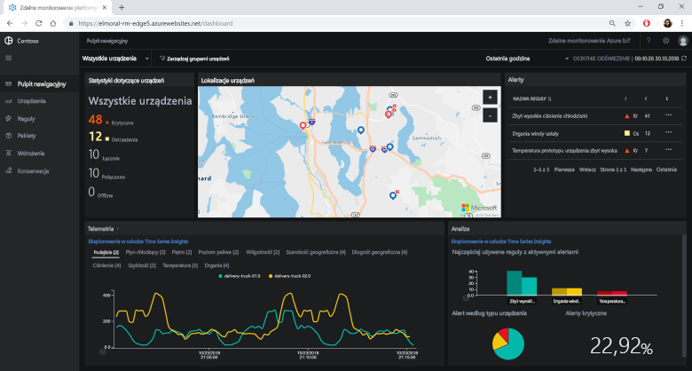
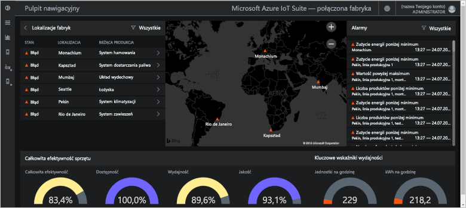

# Co to są akceleratory rozwiązań Azure IoT?

Oparte na chmurze rozwiązanie IoT zazwyczaj używa niestandardowego kodu i usług w chmurze do zarządzania łącznością urządzeń, przetwarzaniem i analizą danych oraz prezentacją.

Akceleratory rozwiązań IoT to kompletne, gotowe do wdrożenia rozwiązania IoT, w których zaimplementowano typowe scenariusze IoT. Te scenariusze to na przykład zdalne monitorowanie, połączona fabryka, konserwacja predykcyjna i symulacja urządzenia. Podczas wdrażania akceleratora rozwiązania uwzględniane są wszystkie wymagane usługi w chmurze wraz z wszelkim wymaganym kodem aplikacji.

Akceleratory rozwiązań to punkty wyjścia do Twoich własnych rozwiązań IoT. Kod źródłowy wszystkich akceleratorów rozwiązań jest typu open source i jest dostępny w witrynie GitHub. Zachęcamy do pobrania i dostosowania akceleratorów rozwiązań do swoich potrzeb.

Akceleratory rozwiązań mogą również służyć do nauki przed utworzeniem własnego niestandardowego rozwiązania IoT od podstaw. W akceleratorach rozwiązań zaimplementowano sprawdzone praktyki dla opartych na chmurze rozwiązań IoT, do których należy się stosować.

Kod aplikacji każdego akceleratora rozwiązania obejmuje aplikację internetową, która umożliwia zarządzanie akceleratorem rozwiązania.

## Obsługiwane scenariusze IoT

Obecnie dostępne do wdrożenia są cztery akceleratory rozwiązań:

### Zdalne monitorowanie

[Akcelerator rozwiązania do monitorowania zdalnego](iot-accelerators-remote-monitoring-sample-walkthrough.md) umożliwia zbieranie danych telemetrycznych z urządzeń zdalnych i sterowanie nimi. Przykładowe urządzenia to systemy chłodzenia zamontowane w placówce klienta lub zawory w odległych przepompowniach.

Za pomocą pulpitu nawigacyjnego zdalnego monitorowania można wyświetlać dane telemetryczne z połączonych urządzeń, aprowizować nowe urządzenia lub uaktualniać oprogramowanie układowe połączonych urządzeń:

### Połączona fabryka

[Akcelerator rozwiązań Połączona fabryka](iot-accelerators-connected-factory-features.md) umożliwia zbieranie danych telemetrycznych z zasobów przemysłowych korzystających z interfejsu [OPC Unified Architecture](https://opcfoundation.org/about/opc-technologies/opc-ua/) oraz sterowanie nimi. Zasoby przemysłowe mogą obejmować stanowiska montażu i testowania na fabrycznej linii produkcyjnej.

Pulpit nawigacyjny połączonej fabryki umożliwia monitorowanie urządzeń przemysłowych i zarządzanie nimi:

### Konserwacja zapobiegawcza

[Akcelerator rozwiązań Konserwacja predykcyjna](iot-accelerators-predictive-walkthrough.md) umożliwia przewidywanie, kiedy urządzenie zdalne ulegnie awarii, dzięki czemu można przeprowadzić konserwację przed awarią tego urządzenia. Akcelerator rozwiązania używa algorytmów uczenia maszynowego do przewidywania awarii na podstawie danych telemetrycznych z urządzenia. Przykładowe urządzenia to silniki lotnicze lub windy.

Za pomocą pulpitu nawigacyjnego konserwacji predykcyjnej można wyświetlać analizę konserwacji predykcyjnej:

### Symulacja urządzenia

[Akcelerator rozwiązań Symulacja urządzenia](iot-accelerators-device-simulation-overview.md) umożliwia uruchamianie symulowanych urządzeń, które generują realistyczne dane telemetryczne. Za pomocą tego akceleratora rozwiązania możesz przetestować zachowanie innych akceleratorów rozwiązań oraz własnych niestandardowych rozwiązań IoT.

Za pomocą aplikacji internetowej symulacji urządzenia można konfigurować i uruchamiać symulacje:

## Zasady projektowania

Wszystkie akceleratory rozwiązań zaprojektowano zgodnie z tymi samymi zasadami i pod kątem tych samych celów. Zgodnie z projektem mają one być:

* **Skalowalne** — umożliwiać łączenie milionów połączonych urządzeń oraz zarządzać nimi.
* **Rozszerzalne** — dzięki czemu można je dostosowywać do własnych wymagań.
* **Zrozumiałe** — pozwalają poznać sposób, w jaki działają i jak są implementowane.
* **Modułowe** — pozwalają wymieniać usługi w celu skorzystania z alternatyw.
* **Bezpieczne** — łączą zabezpieczenia platformy Azure z wbudowanymi funkcjami łączności i zabezpieczeń urządzeń.

## Architektury i języki

Pierwotne akceleratory rozwiązań zostały napisane przy użyciu platformy .NET oraz architektury Model-View-Controller (MVC). Firma Microsoft aktualizuje akceleratory rozwiązań do nowej architektury mikrousług. W poniższej tabeli przedstawiono bieżący stan akceleratorów rozwiązań z linkami do repozytoriów GitHub:

| Akcelerator rozwiązania   | Architektura  | Języki     |
| ---------------------- | ------------- | ------------- |
| Zdalne monitorowanie      | Mikrousługi | [Java](https://github.com/Azure/azure-iot-pcs-remote-monitoring-java) i [.NET](https://github.com/Azure/azure-iot-pcs-remote-monitoring-dotnet) |
| Konserwacja zapobiegawcza | MVC           | [.NET](https://github.com/Azure/azure-iot-predictive-maintenance)          |
| Połączona fabryka      | MVC           | [.NET](https://github.com/Azure/azure-iot-connected-factory)          |
| Symulacja urządzenia      | Mikrousługi | [.NET](https://github.com/Azure/device-simulation-dotnet)          |

Aby dowiedzieć się więcej na temat architektury mikrousług, zobacz [Wprowadzenie do architektury referencyjnej usługi Azure IoT](https://docs.microsoft.com/azure/architecture/reference-architectures/iot/).

## Opcje wdrożenia

Akceleratory rozwiązań można wdrażać z witryny [akceleratorów rozwiązań usługi Microsoft Azure IoT](https://www.azureiotsolutions.com/Accelerators#) lub przy użyciu wiersza polecenia.

Akcelerator rozwiązania do monitorowania zdalnego można wdrażać w następujących konfiguracjach:

* **Standardowa:** rozwinięte wdrożenie infrastruktury na potrzeby opracowywania wdrożenia produkcyjnego. Mikrousługi są wdrażane na kilku maszynach wirtualnych platformy Azure za pomocą usługi Azure Container Service. Platforma Kubernetes zarządza kontenerami aparatu Docker, w których są hostowane poszczególne mikrousługi.
* **Podstawowa:** tańsza wersja przeznaczona do celów demonstracyjnych i do testowania wdrożenia. Wszystkie mikrousługi są wdrażane na jednej maszynie wirtualnej platformy Azure.
* **Lokalna:** wdrożenie na maszynie lokalnej na potrzeby testowania i opracowywania. W tym podejściu mikrousługi są wdrażane w lokalnym kontenerze Docker, a także nawiązywane jest połączenie z usługą IoT Hub i Azure Cosmos DB oraz usługami Azure Storage w chmurze.

Kosztem działania akceleratora rozwiązań jest łączny [koszt działania używanych przez niego podstawowych usług platformy Azure](https://azure.microsoft.com/pricing). Szczegóły używanych usług platformy Azure są widoczne podczas wybierania opcji wdrażania.

## Następne kroki

Aby wypróbować jeden z akceleratorów rozwiązań usługi IoT, zapoznaj się z przewodnikami Szybki start:

* [Testowanie rozwiązania do monitorowania zdalnego](quickstart-remote-monitoring-deploy.md)
* [Testowanie rozwiązania połączonej fabryki](quickstart-connected-factory-deploy.md)
* [Testowanie rozwiązania do konserwacji predykcyjnej](quickstart-predictive-maintenance-deploy.md)
* [Testowanie rozwiązania do symulacji urządzeń](quickstart-device-simulation-deploy.md)
