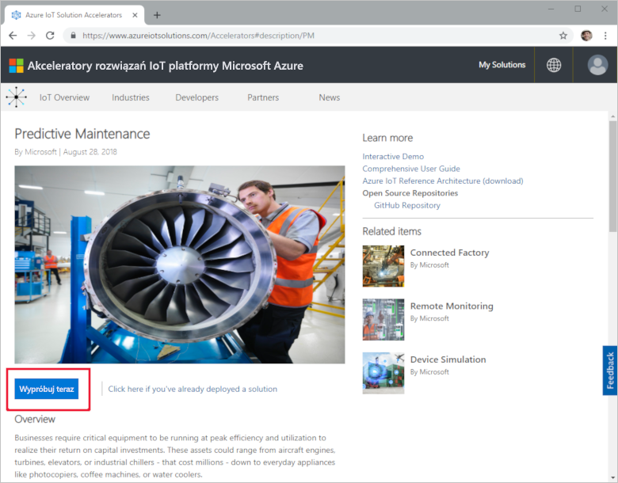
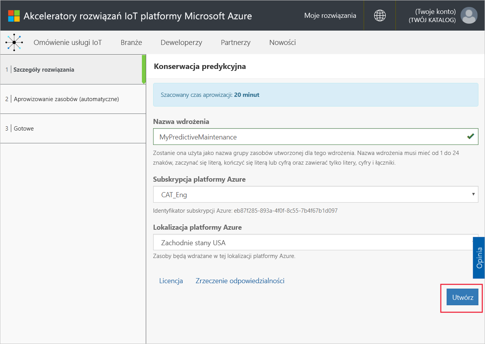
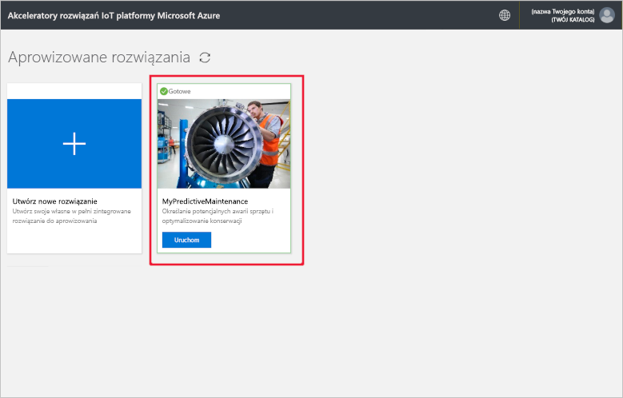
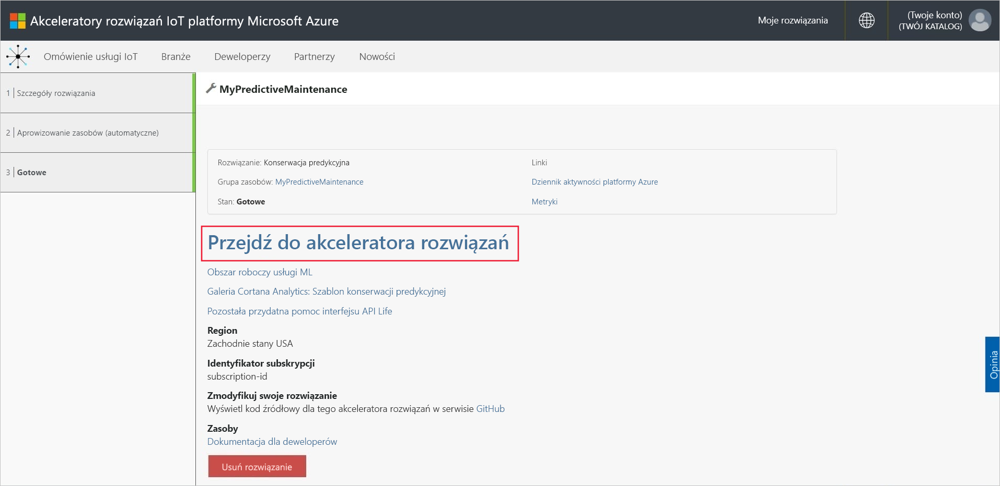
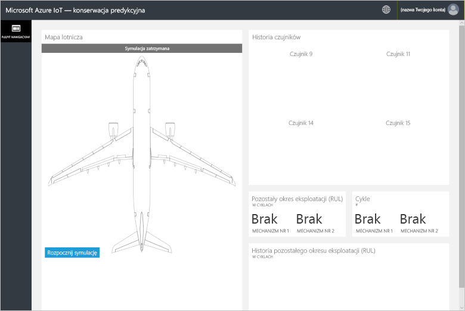
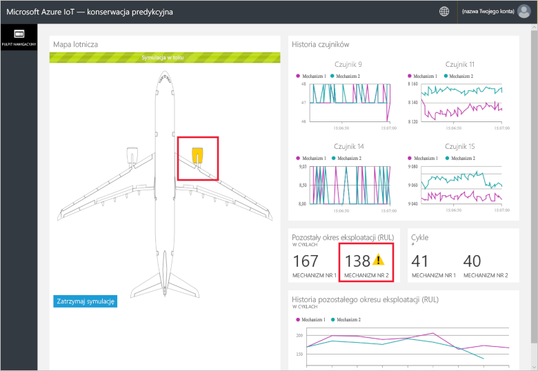

# Szybki start: wypróbowywanie opartego na chmurze rozwiązania pod kątem przeprowadzania analizy konserwacji predykcyjnej na połączonych urządzeniach

W tym przewodniku Szybki start pokazano, jak wdrożyć akcelerator rozwiązań Azure IoT do konserwacji predykcyjnej, aby uruchomić opartą na chmurze symulację konserwacji predykcyjnej. Po wdrożeniu akceleratora rozwiązań na stronie **Pulpit nawigacyjny** rozwiązania możesz uruchomić analizę konserwacji predykcyjnej względem danych pochodzących z symulowanego silnika samolotu. Ten akcelerator rozwiązań może posłużyć jako punkt wyjścia dla własnej implementacji lub do nauki.

W symulacji Fabrikam to regionalny przewoźnik lotniczy, ukierunkowany na zapewnienie doskonałej obsługi klientów przy zachowaniu konkurencyjnych cen. Jedną z przyczyn powodujących opóźnienia lotów są kwestie związane z obsługą techniczną samolotów. Dotyczy to w szczególności konserwacji silników. Firma Fabrikam musi za wszelką cenę zapobiegać awariom silników podczas lotu, zatem przeprowadza regularne przeglądy sprzętu i tworzy odpowiedni harmonogram konserwacji. Jednak występują różnice dotyczące stopnia zużycia silników samolotów. Zdarzają się przypadki wykonania prac konserwacyjnych, które nie były konieczne. Co więcej, pojawiają się problemy, które mogą prowadzić do uziemienia danego samolotu, dopóki nie zostanie przeprowadzona konserwacja. Te problemy mogą powodować kosztowne opóźnienia, zwłaszcza jeśli samolot znajduje się w lokalizacji, w której nie są dostępne części zamienne lub odpowiednio wykwalifikowany personel.

Silniki samolotów linii Fabrikam są wyposażone w czujniki, które monitorują stan silnika podczas lotu. Firma Fabrikam przez wiele lat zbierała dane dotyczące działania i awarii silników z tych czujników. Korzystając z tych danych, analitycy z firmy Fabrikam opracowali model umożliwiający przewidywanie pozostałego okresu eksploatacji (RUL) silnika samolotu. Model korzysta z zależności między danymi pochodzącymi z czterech czujników w silniku a zużyciem silnika, które może prowadzić do wystąpienia awarii. Firma Fabrikam wciąż regularnie przeprowadza przeglądy bezpieczeństwa, ale teraz dysponuje również modelami, które umożliwiają obliczenie pozostałego okresu eksploatacji poszczególnych silników po każdym locie. Pozwala to przewidywać przyszłe awarie i odpowiednio wcześniej zaplanować prace konserwacyjne w celu zminimalizowania czasu obsługi naziemnej samolotów. Ten proces umożliwia zmniejszenie kosztów operacyjnych przy jednoczesnym zapewnieniu bezpieczeństwa pasażerów i załóg.

Do wykonania kroków tego przewodnika Szybki start jest potrzebna aktywna subskrypcja platformy Azure.

Jeśli nie masz subskrypcji platformy Azure, przed rozpoczęciem utwórz [bezpłatne konto](https://azure.microsoft.com/free/?WT.mc_id=A261C142F).

## Wdrażanie rozwiązania

W przypadku wdrażania akceleratora rozwiązania w ramach subskrypcji platformy Azure musisz ustawić niektóre opcje konfiguracji.

Przejdź do witryny [Akceleratory rozwiązań IoT platformy Microsoft Azure](https://www.azureiotsolutions.com) i zaloguj się przy użyciu poświadczeń konta platformy Azure.

Kliknij kafelek **Konserwacja predykcyjna**. Na kafelku **Konserwacja predykcyjna** kliknij pozycję **Wypróbuj teraz**:

Na stronie **Tworzenie rozwiązania Konserwacja predykcyjna** wprowadź unikatową **Nazwę rozwiązania** dla Twojego akceleratora rozwiązań konserwacji predykcyjnej. W tym przewodniku Szybki start używamy nazwy **MyPredictiveMaintenance**.

W polach **Subskrypcja** i **Region** wybierz wartości, których chcesz użyć do wdrożenia akceleratora rozwiązania. Zwykle jest wybierany region znajdujący się najbliżej. W tym przewodniku Szybki start używamy subskrypcji **Visual Studio Enterprise** i regionu **Wschodnie stany USA**. Musisz być [użytkownikiem lub administratorem globalnym](iot-accelerators-permissions.md) w ramach subskrypcji.

Kliknij pozycję **Utwórz** aby rozpocząć wdrażanie. Ten proces trwa co najmniej pięć minut:

## Logowanie się do rozwiązania

Po zakończeniu wdrożenia w Twojej subskrypcji platformy Azure na kafelku rozwiązania zostanie wyświetlony zielony znacznik wyboru i tekst **Gotowe**. Teraz możesz zalogować się do pulpitu nawigacyjnego akceleratora rozwiązań do konserwacji predykcyjnej.

Na stronie **Aprowizowane rozwiązania** kliknij nowy akcelerator rozwiązań do konserwacji predykcyjnej.

 Na wyświetlonej stronie możesz przejrzeć informacje o akceleratorze rozwiązań. Wybierz pozycję **Przejdź do własnego akceleratora rozwiązań**, aby wyświetlić swój akcelerator rozwiązań konserwacji predykcyjnej:

Kliknij pozycję **Zaakceptuj**, aby zaakceptować żądanie uprawnień. W przeglądarce zostanie wyświetlony pulpit nawigacyjny rozwiązania do konserwacji predykcyjnej:

Kliknij pozycję **Rozpocznij symulację**, aby uruchomić symulację. Na pulpicie nawigacyjnym zostanie wyświetlona liczba cykli, historia danych z czujników i pozostały okres eksploatacji wraz z historią:

Jeśli wartość pozostałego czasu eksploatacji jest mniejsza niż 160 (arbitralna wartość progowa dla celów demonstracyjnych), w portalu rozwiązania zostanie wyświetlony symbol ostrzeżenia obok pozostałego czasu eksploatacji. Dodatkowo w portalu rozwiązania silnik samolotu zostanie wyróżniony kolorem żółtym. Zwróć uwagę na to, jak pozostały czas eksploatacji ma ogólną tendencję zniżkową ze skokami w górę i w dół. Takie zachowanie wynika z dokładności modelu i różnych czasów trwania cykli.

Pełna symulacja, obejmująca 148 cykli, trwa około 35 minut. Pozostały czas eksploatacji po raz pierwszy osiąga wartość progową równą 160 po upływie około 5 minut, a oba silniki osiągają wartości progowe po upływie około 8 minut.

W trakcie symulacji obejmującej 148 cykli jest przetwarzany pełny zestaw danych, co prowadzi do określenia końcowej liczby cykli i wartości pozostałego czasu eksploatacji.

Symulację można zatrzymać w dowolnym momencie, ale kliknięcie przycisku **Rozpocznij symulację** powoduje ponowne uruchomienie symulacji od początku zestawu danych.

## Oczyszczanie zasobów

Jeśli planujesz dalsze działanie, akcelerator rozwiązań do konserwacji predykcyjnej powinien pozostać wdrożony.

Jeśli akcelerator rozwiązań nie jest już potrzebny, usuń go na stronie [Aprowizowane rozwiązania](https://www.azureiotsolutions.com/Accelerators#dashboard), wybierając go, a następnie klikając pozycję **Usuń rozwiązanie**:

## Kolejne kroki

W tym przewodniku Szybki start wdrożono akcelerator rozwiązań do konserwacji predykcyjnej i uruchomiono symulację.

Aby dowiedzieć się więcej na temat akceleratora rozwiązań i symulowanych silników samolotów, przejdź do następującego artykułu.

> [!div class="nextstepaction"]
> [Omówienie akceleratora rozwiązań do konserwacji zapobiegawczej](iot-accelerators-predictive-walkthrough.md)
