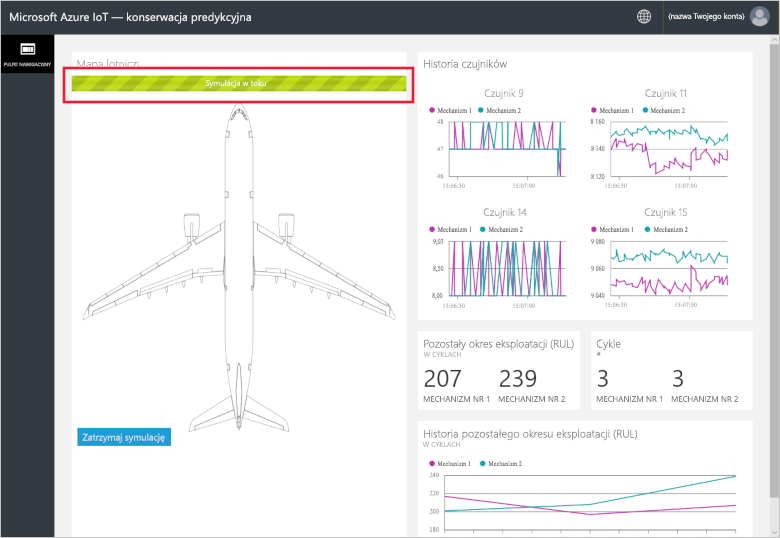
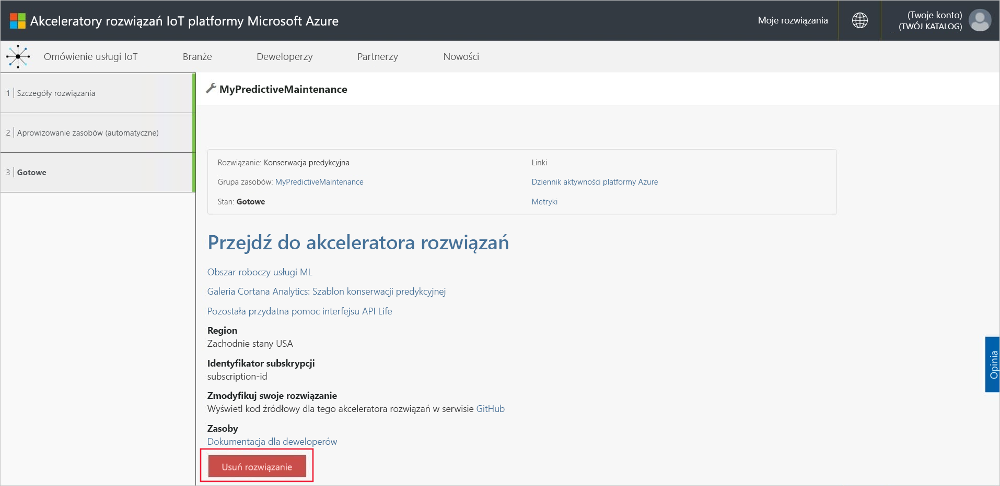

# Szybki start: wdrażanie opartego na chmurze rozwiązania w celu przeprowadzenia analizy konserwacji predykcyjnej na połączonych urządzeniach

W tym przewodniku Szybki start pokazano, jak wdrożyć akcelerator rozwiązań Azure IoT do konserwacji predykcyjnej do użycia jako oparte na chmurze rozwiązanie do konserwacji predykcyjnej dla urządzeń IoT. Po wdrożeniu akceleratora rozwiązań na stronie **Pulpit nawigacyjny** rozwiązania możesz uruchomić symulację z użyciem danych silnika samolotu.

Fabrikam to regionalny przewoźnik lotniczy, ukierunkowany na zapewnienie doskonałej obsługi klientów przy zachowaniu konkurencyjnych cen. Jedną z przyczyn powodujących opóźnienia lotów są kwestie związane z obsługą techniczną samolotów. Dotyczy to w szczególności konserwacji silników. Firma Fabrikam musi za wszelką cenę zapobiegać awariom silników podczas lotu, zatem przeprowadza regularne przeglądy sprzętu i tworzy odpowiedni harmonogram konserwacji. Jednak występują różnice dotyczące stopnia zużycia silników samolotów. Zdarzają się przypadki wykonania prac konserwacyjnych, które nie były konieczne. Co więcej, pojawiają się problemy, które mogą prowadzić do uziemienia danego samolotu, dopóki nie zostanie przeprowadzona konserwacja. Te problemy mogą powodować kosztowne opóźnienia, zwłaszcza jeśli samolot znajduje się w lokalizacji, w której nie są dostępne części zamienne lub odpowiednio wykwalifikowany personel.

Silniki samolotów linii Fabrikam są wyposażone w czujniki, które monitorują stan silnika podczas lotu. Zbierane przez całe lata dane dotyczące pracy i awarii silników umożliwiły inżynierom danych w firmie Fabrikam opracowanie modelu przewidywania pozostałego okresu eksploatacji (RUL) silnika samolotu. Model korzysta z zależności między danymi pochodzącymi z czterech czujników w silniku a zużyciem silnika, które może prowadzić do wystąpienia awarii. Firma Fabrikam wciąż regularnie przeprowadza przeglądy w celu zapewnienia bezpieczeństwa, ale teraz dysponuje również modelami, które umożliwiają obliczenie pozostałego okresu eksploatacji poszczególnych silników po każdym locie. Pozwala to przewidywać przyszłe awarie i planować prace konserwacyjne, co umożliwia firmie Fabrikam zminimalizowanie czasu obsługi naziemnej samolotów i zmniejszenie kosztów operacyjnych przy jednoczesnym zapewnieniu bezpieczeństwa pasażerów i załóg.

## Wymagania wstępne

Do wykonania kroków tego przewodnika Szybki start jest potrzebna aktywna subskrypcja platformy Azure.

Jeśli nie masz subskrypcji platformy Azure, przed rozpoczęciem utwórz [bezpłatne konto](https://azure.microsoft.com/free/?WT.mc_id=A261C142F).

## Wdrażanie rozwiązania

W przypadku wdrażania akceleratora rozwiązania w ramach subskrypcji platformy Azure musisz ustawić niektóre opcje konfiguracji.

Zaloguj się do witryny [azureiotsolutions.com](https://www.azureiotsolutions.com/Accelerators) przy użyciu poświadczeń konta platformy Azure.

Kliknij pozycję **Wypróbuj teraz** na kafelku **Konserwacja predykcyjna**.

Na stronie **Tworzenie rozwiązania Konserwacja predykcyjna** wprowadź unikatową **Nazwę rozwiązania** dla Twojego akceleratora rozwiązań konserwacji predykcyjnej.

W polach **Subskrypcja** i **Region** wybierz wartości, których chcesz użyć do wdrożenia akceleratora rozwiązania. Zwykle jest wybierany region znajdujący się najbliżej. Musisz być [użytkownikiem lub administratorem globalnym](iot-accelerators-permissions.md) w ramach subskrypcji.

Kliknij pozycję **Utwórz rozwiązanie** aby rozpocząć wdrażanie. Ten proces trwa co najmniej pięć minut:

## Logowanie się do rozwiązania

Po ukończeniu wdrażania w ramach subskrypcji platformy Azure możesz zalogować się do pulpitu nawigacyjnego akceleratora rozwiązań do konserwacji predykcyjnej.

Na stronie **Aprowizowane rozwiązania** kliknij nowy akcelerator rozwiązań do konserwacji predykcyjnej. W wyświetlonym panelu możesz przejrzeć informacje o akceleratorze rozwiązań. Wybierz pozycję **Pulpit nawigacyjny rozwiązania**, aby wyświetlić akcelerator rozwiązań do konserwacji predykcyjnej:

Kliknij pozycję **Zaakceptuj**, aby zaakceptować żądanie uprawnień. W przeglądarce zostanie wyświetlony pulpit nawigacyjny rozwiązania do konserwacji predykcyjnej:

Kliknij pozycję **Rozpocznij symulację**, aby uruchomić symulację. Na pulpicie nawigacyjnym zostanie wyświetlona liczba cykli, historia danych z czujników i pozostały okres eksploatacji wraz z historią:

Jeśli wartość pozostałego czasu eksploatacji jest mniejsza niż 160 (arbitralna wartość progowa dla celów demonstracyjnych), w portalu rozwiązania zostanie wyświetlony symbol ostrzeżenia obok pozostałego czasu eksploatacji. Dodatkowo w portalu rozwiązania silnik samolotu zostanie wyróżniony kolorem żółtym. Zwróć uwagę na to, jak pozostały czas eksploatacji ma ogólną tendencję zniżkową ze skokami w górę i w dół. Takie zachowanie wynika z dokładności modelu i różnych czasów trwania cykli.

Pełna symulacja, obejmująca 148 cykli, trwa około 35 minut. Pozostały czas eksploatacji po raz pierwszy osiąga wartość progową równą 160 po upływie około 5 minut, a oba silniki osiągają wartości progowe po upływie około 8 minut.

W trakcie symulacji obejmującej 148 cykli jest przetwarzany pełny zestaw danych, co prowadzi do określenia końcowej liczby cykli i wartości pozostałego czasu eksploatacji.

Symulację można zatrzymać w dowolnym momencie, ale kliknięcie przycisku **Rozpocznij symulację** powoduje ponowne uruchomienie symulacji od początku zestawu danych.

## Oczyszczanie zasobów

Jeśli planujesz dalsze działanie, akcelerator rozwiązań do konserwacji predykcyjnej powinien pozostać wdrożony.

Jeśli akcelerator rozwiązania nie jest już potrzebny, usuń go na stronie [Aprowizowane rozwiązania](https://www.azureiotsolutions.com/Accelerators#dashboard):

## Następne kroki

W tym przewodniku Szybki start wdrożono akcelerator rozwiązań do konserwacji predykcyjnej i uruchomiono symulację.

Aby dowiedzieć się więcej na temat akceleratora rozwiązań, zobacz artykuł.

> [!div class="nextstepaction"]
> [Omówienie akceleratora rozwiązań do konserwacji zapobiegawczej](iot-accelerators-predictive-walkthrough.md)
