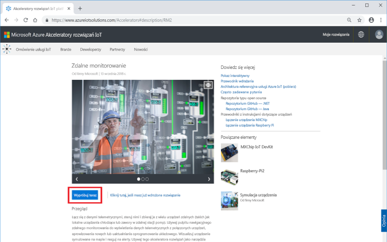
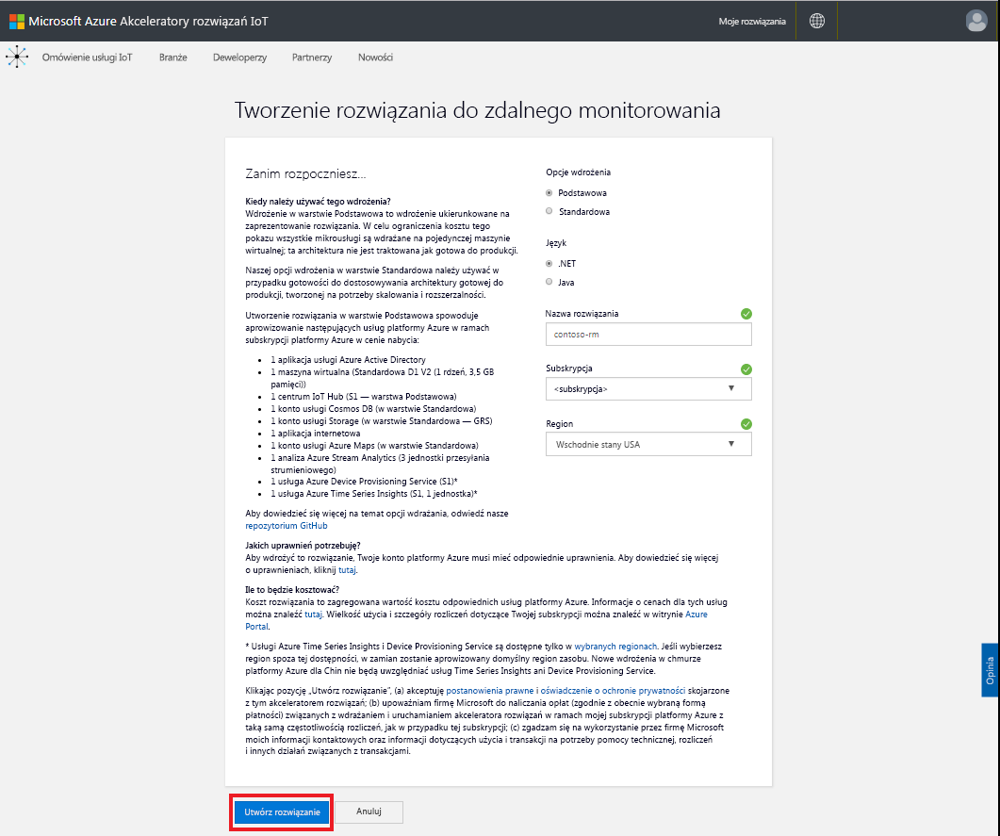
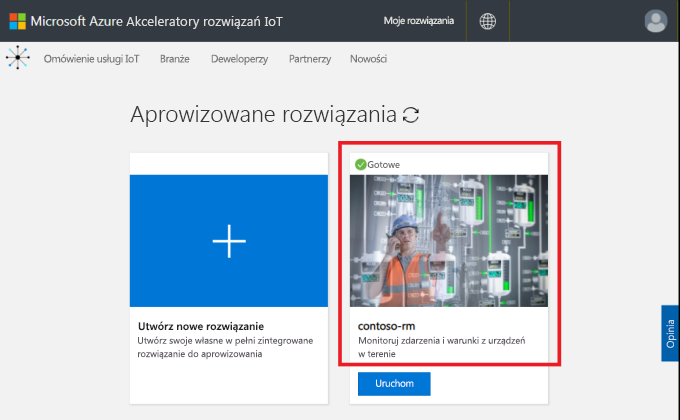
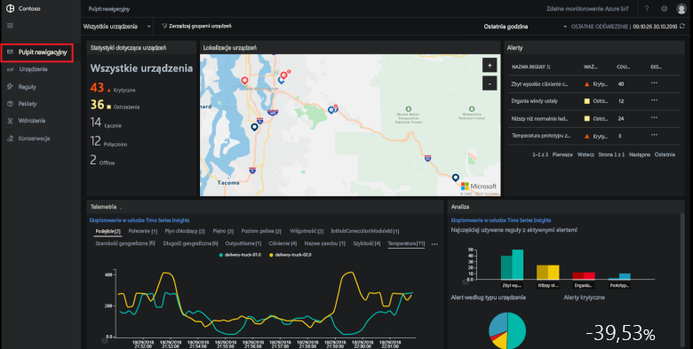
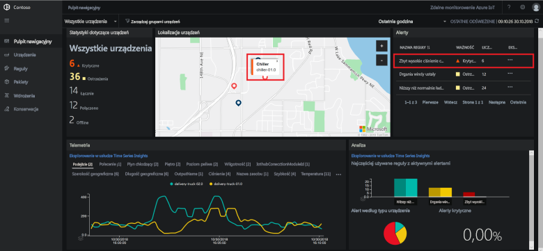
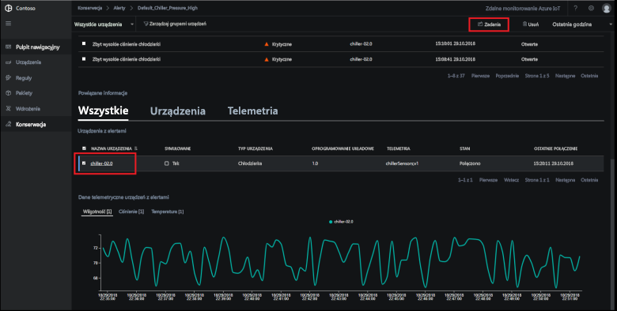
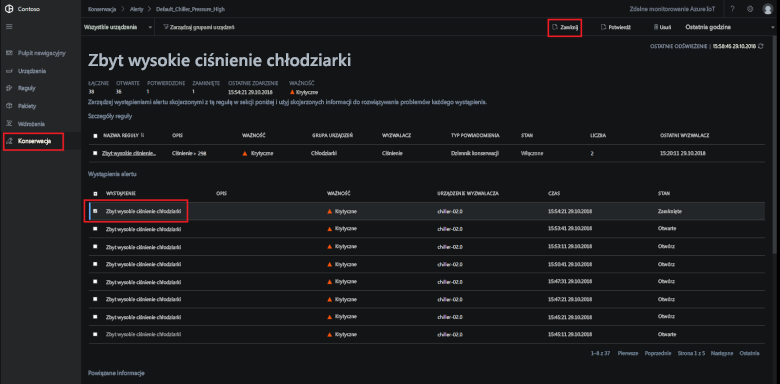
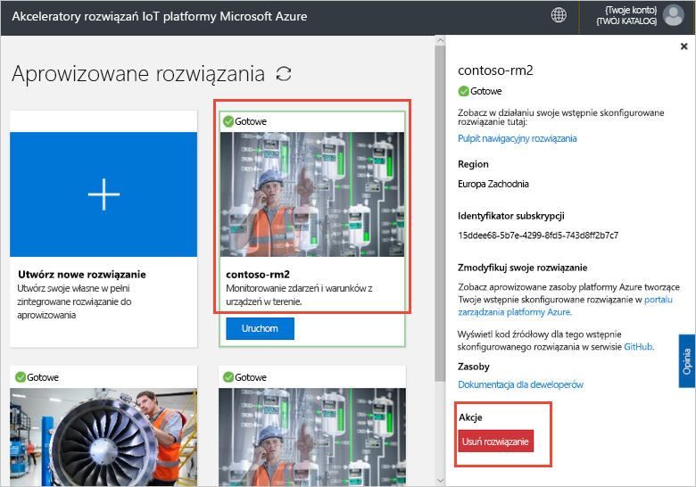

# Szybki start: Testowanie opartego na chmurze rozwiązania do monitorowania zdalnego

W tym przewodniku Szybki start pokazano, jak wdrożyć akcelerator rozwiązania do monitorowania zdalnego usługi Azure IoT. W tym rozwiązaniu opartym na chmurze użyjesz strony **Pulpit nawigacyjny**, aby wyświetlić urządzenia symulowane na mapie, i strony **Konserwacja**, aby zareagować na alert dotyczący ciśnienia z symulowanego urządzenia typu „chiller” (chłodziarki). Ten akcelerator rozwiązań może posłużyć jako punkt wyjścia dla własnej implementacji lub do nauki.

W początkowym wdrożeniu akcelerator rozwiązań jest skonfigurowany dla firmy o nazwie Contoso. Jako operator w firmie Contoso zarządzasz różnego typu urządzeniami, takimi jak chłodziarki, wdrożonymi w różnych środowiskach fizycznych. Chłodziarka wysyła dane telemetryczne dotyczące temperatury, wilgotności i ciśnienia do akceleratora rozwiązania do monitorowania zdalnego.

Ten przewodnik szybkiego startu wdroży **podstawowe** wersję akceleratora rozwiązań do celów testowych i demonstracyjnych, które minimalizuje koszty. Aby uzyskać więcej informacji na temat różnych wersji, można wdrożyć zobacz [wdrożeń podstawowa i standardowa](iot-accelerators-remote-monitoring-deploy-cli.md#basic-and-standard-deployments).

Do wykonania kroków tego przewodnika Szybki start jest potrzebna aktywna subskrypcja platformy Azure.

Jeśli nie masz subskrypcji platformy Azure, przed rozpoczęciem utwórz [bezpłatne konto](https://azure.microsoft.com/free/?WT.mc_id=A261C142F).

## Wdrażanie rozwiązania

W przypadku wdrażania akceleratora rozwiązań w ramach subskrypcji platformy Azure musisz ustawić niektóre opcje konfiguracji.

Zaloguj się do witryny [azureiotsolutions.com](https://www.azureiotsolutions.com/Accelerators) przy użyciu poświadczeń konta platformy Azure.

Kliknij kafelek **Zdalne monitorowanie**. Na stronie **Zdalne monitorowanie** kliknij pozycję **Wypróbuj teraz**:

Wybierz  **C# Mikrousług** jako **opcje wdrażania**. Java i C# implementacji mają te same funkcje.

W polu **Nazwa rozwiązania** wprowadź unikatową nazwę akceleratora rozwiązania do monitorowania zdalnego. W tym przewodniku Szybki start używamy nazwy **contoso-rm**.

W polach **Subskrypcja** i **Region** wybierz wartości, których chcesz użyć do wdrożenia akceleratora rozwiązania. Zwykle jest wybierany region znajdujący się najbliżej. W tym przewodniku Szybki start używamy regionu **Wschodnie stany USA**.
Możesz wybrać opcję **Visual Studio Enterprise**, ale w tym celu musisz być [administratorem globalnym lub użytkownikiem](iot-accelerators-permissions.md).

Aby rozpocząć wdrożenie, kliknij pozycję **Utwórz**. Ten proces trwa co najmniej pięć minut:

## Logowanie się do rozwiązania

Po zakończeniu wdrożenia w Twojej subskrypcji platformy Azure na kafelku rozwiązania zostanie wyświetlony zielony znacznik wyboru i tekst **Gotowe**. Teraz możesz zalogować się do pulpitu nawigacyjnego akceleratora rozwiązania do monitorowania zdalnego.

Na stronie **Aprowizowane rozwiązania** kliknij nowy akcelerator rozwiązania do monitorowania zdalnego:

Możesz przejrzeć informacje o akceleratorze rozwiązania do monitorowania zdalnego w wyświetlonym panelu. Wybierz pozycję **Przejdź do własnego akceleratora rozwiązania**, aby wyświetlić akcelerator rozwiązania do monitorowania zdalnego:

Kliknij pozycję **Zaakceptuj**, aby zaakceptować żądanie uprawnień. W przeglądarce zostanie wyświetlony pulpit nawigacyjny rozwiązania do monitorowania zdalnego:

## Wyświetlanie urządzeń

Pulpit nawigacyjny rozwiązania przedstawia następujące informacje o symulowanych urządzeniach firmy Contoso:

* Panel **Statystyki urządzeń** zawiera podsumowanie alertów i łączną liczbę urządzeń. W domyślnym wdrożeniu firma Contoso ma 10 urządzeń symulowanych różnych typów.

* Panel **Lokalizacje urządzeń** pokazuje lokalizacje fizyczne urządzeń. Kolor pinezki wskazuje, czy są dostępne alerty z urządzenia.

* Panel **Alerty** podaje szczegółowe informacje o alertach z urządzeń.

* Panel **Telemetria** pokazuje dane telemetryczne z urządzeń. Możesz wyświetlać różne strumienie telemetrii, klikając typy telemetrii u góry.

* Panel **Analiza** przedstawia połączone informacje o alertach z urządzeń.

## Odpowiadanie na alert

Operator w firmie Contoso może monitorować urządzenia na pulpicie nawigacyjnym rozwiązania. Panel **Statystyki urządzeń** wskazuje obecność alertów krytycznych, a w panelu **Alerty** widać, że większość z nich pochodzi z chłodziarki. W przypadku chłodziarek firmy Contoso ciśnienie wewnętrzne ponad 250 PSI wskazuje, że urządzenie nie działa poprawnie.

### Identyfikowanie problemu

Na stronie **Pulpit nawigacyjny** w panelu **Alerty** jest wyświetlany alert **Zbyt duże ciśnienie chłodziarki**. Chłodziarka jest reprezentowana przez czerwoną pinezkę na mapie (może być konieczne przesunięcie i powiększenie widoku na mapie):

W panelu **Alerty** kliknij pozycję **...** w kolumnie **Eksploruj** obok reguły **Zbyt duże ciśnienie chłodziarki**. Ta akcja spowoduje przejście do strony **Konserwacja** — można na niej wyświetlić szczegóły reguły, która wyzwoliła alert.

Na stronie konserwacji **Zbyt duże ciśnienie chłodziarki** są wyświetlane szczegóły reguły, która wyzwoliła alerty. Ponadto przedstawia czas wystąpienia alertów i urządzenie, które je wyzwoliło:

Zidentyfikowano problem, który wyzwolił alert, i skojarzone urządzenie. Następne kroki umożliwiają operatorowi potwierdzenie alertu i rozwiązanie problemu.

### Rozwiązywanie problemu

Aby pokazać innym operatorom, że pracujesz nad alertem, zaznacz go, a następnie zmień wartość ustawienia **Stan alertu** na wartość **Potwierdzono**:

Wartość w kolumnie stanu zmieni się na **Potwierdzono**.

Aby wykonać działanie dotyczące chłodziarki, przewiń w dół do pozycji **Informacje pokrewne**, wybierz chłodziarkę z listy **Urządzenia z alertami**, a następnie wybierz pozycję **Zadania**:

W panelu **Zadania** wybierz pozycję **Uruchom metodę** a następnie metodę **EmergencyValveRelease**. Dodaj nazwę zadania **ChillerPressureRelease** i kliknij przycisk **Zastosuj**. Te ustawienia pozwalają utworzyć dla Ciebie zadanie, które jest wykonywane natychmiast.

Aby wyświetlić stan zadania, wróć do strony **Konserwacja** i wyświetl listę zadań w widoku **Zadania**. Może być konieczne odczekaj kilka sekund, zanim zobaczysz, że zadanie zostało uruchomione:

### Sprawdzanie, czy ciśnienie wróciło do normalnego poziomu

Aby wyświetlić dane telemetryczne dotyczące ciśnienia chłodziarki, przejdź do strony **Pulpit nawigacyjny**, wybierz pozycję **Ciśnienie** w panelu telemetrii i upewnij się, że chłodziarka **chiller-02.0** ma normalne ciśnienie:

Aby zamknąć zdarzenie, przejdź do strony **Konserwacja**, wybierz alert i ustaw stan **Zamknięto**:

Wartość w kolumnie stanu zmieni się na **Zamknięto**.

## Oczyszczanie zasobów

Jeśli zamierzasz przejść do samouczków, nie usuwaj wdrożenia akceleratora rozwiązania do monitorowania zdalnego.

Jeśli akcelerator rozwiązań nie jest już potrzebny, usuń go na stronie [Aprowizowane rozwiązania](https://www.azureiotsolutions.com/Accelerators#dashboard), wybierając go, a następnie klikając pozycję **Usuń rozwiązanie**:

## Następne kroki

W tym przewodniku Szybki start wdrożono akcelerator rozwiązania do monitorowania zdalnego i wykonano zadanie monitorowania przy użyciu urządzeń symulowanych w domyślnym wdrożeniu firmy Contoso.

Aby dowiedzieć się więcej na temat akceleratora rozwiązań korzystającego z urządzeń symulowanych, przejdź do następującego samouczka.

> [!div class="nextstepaction"]
> [Samouczek: Monitorowanie urządzeń IoT](iot-accelerators-remote-monitoring-monitor.md)