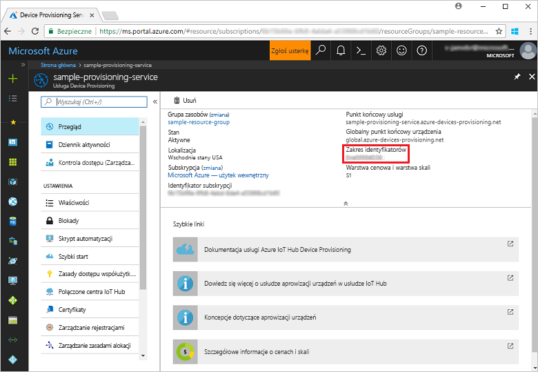

# <a name="create-and-provision-a-simulated-tpm-device-using-c-device-sdk-for-iot-hub-device-provisioning-service"></a>Tworzenie i aprowizowanie symulowanego urządzenia TPM za pomocą zestawu SDK języka C# dla usługi IoT Hub Device Provisioning

[!INCLUDE [iot-dps-selector-quick-create-simulated-device-tpm](../../includes/iot-dps-selector-quick-create-simulated-device-tpm.md)]

Te kroki pokazują, jak skompilować przykładowe symulowane urządzenie TPM zestawu SDK języka C# usługi Azure IoT Hub na maszynie deweloperskiej z systemem operacyjnym Windows i połączyć to urządzenie symulowane z usługą Device Provisioning i Twoim centrum IoT Hub. Przykład kodu używa symulatora modułu Windows TPM jako [sprzętowego modułu zabezpieczeń (HSM, hardware security module)](https://azure.microsoft.com/blog/azure-iot-supports-new-security-hardware-to-strengthen-iot-security/) urządzenia. 

Pamiętaj, aby wcześniej wykonać kroki przedstawione w części [Konfigurowanie usługi IoT Hub Device Provisioning Service za pomocą witryny Azure Portal](./quick-setup-auto-provision.md).

<a id="setupdevbox"></a>
## <a name="prepare-the-development-environment"></a>Przygotowywanie środowiska deweloperskiego 

1. Upewnij się, że na maszynie jest zainstalowany [zestaw SDK dla platformy .NET Core](https://www.microsoft.com/net/download/windows). 

1. Upewnij się, że na swojej maszynie masz zainstalowane oprogramowanie `git` i że jest ono dodane do zmiennych środowiskowych dostępnych z okna poleceń. Zobacz stronę z [narzędziami klienckimi Git organizacji Software Freedom Conservancy](https://git-scm.com/download/), aby uzyskać najnowszą wersję narzędzi `git` do zainstalowania, które obejmują powłokę **Git Bash**, czyli aplikację wiersza polecenia, która może służyć do interakcji z lokalnym repozytorium Git. 

4. Otwórz wiersz polecenia lub powłokę Git Bash. Sklonuj repozytorium GitHub Azure IoT SDK for C#:
    
    ```cmd
    git clone --recursive https://github.com/Azure/azure-iot-sdk-csharp.git
    ```

## <a name="provision-the-simulated-device"></a>Aprowizowanie urządzenia symulowanego


1. Zaloguj się w witrynie Azure Portal. Kliknij przycisk **Wszystkie zasoby** w menu po lewej stronie i otwórz swoją usługę Device Provisioning Service. Z poziomu bloku **Przegląd** zanotuj wartość **_Zakres identyfikatorów_**.

     


2. W wierszu polecenia zmień katalogi na katalog projektu dla przykładu aprowizacji urządzenia TPM.

    ```cmd
    cd .\azure-iot-sdk-csharp\provisioning\device\samples\ProvisioningDeviceClientTpm
    ```

2. Wpisz następujące polecenie, aby skompilować i uruchomić przykład aprowizacji urządzenia TPM. Zastąp wartość `<IDScope>` zakresem identyfikatorów Twojej usługi aprowizacji. 

    ```cmd
    dotnet run <IDScope>
    ```

1. W oknie polecenia zostaną wyświetlone wartości **_Klucz poręczenia_**, **_Identyfikator rejestracji_** i **_Identyfikator urządzenia_** potrzebne do zarejestrowania urządzenia. Zapisz te wartości. 
   > [!NOTE]
   > Nie pomyl okna zawierającego dane wyjściowe polecenia z oknem zawierającym dane wyjściowe z symulatora modułu TPM. Może być konieczne kliknięcie okna polecenia, aby wyświetlić je na pierwszym planie.

     


4. W witrynie Azure Portal w bloku podsumowania usługi Device Provisioning wybierz pozycję **Zarządzaj rejestracjami**. Wybierz kartę **Indywidualne rejestracje** i kliknij u góry przycisk **Dodaj**. 

5. W obszarze **Dodaj wpis listy rejestracji** wprowadź następujące informacje:
    - Wybierz opcję **TPM** jako *Mechanizm* poświadczania tożsamości.
    - Wprowadź dane w polach *Identyfikator rejestracji* i *Klucz poręczenia* dla urządzenia TPM. 
    - Opcjonalnie wybierz centrum IoT połączone z Twoją usługą aprowizacji.
    - Wprowadź unikatowy identyfikator urządzenia. Możesz wprowadzić identyfikator urządzenia sugerowany w przykładowych danych wyjściowych lub wprowadzić własny. W przypadku używania własnego identyfikatora unikaj korzystania z danych poufnych podczas nadawania nazwy. 
    - Zaktualizuj pole **Początkowy stan bliźniaczej reprezentacji urządzenia** za pomocą wybranej konfiguracji początkowej dla urządzenia.
    - Gdy skończysz, kliknij przycisk **Zapisz**. 

      

   Po pomyślnej rejestracji *Identyfikator rejestracji* Twojego urządzenia pojawi się na liście na karcie *Indywidualne rejestracje*. 

6. Naciśnij klawisz Enter, aby zarejestrować symulowane urządzenie. Zwróć uwagę na komunikaty symulujące uruchamianie urządzenia i łączenie z usługą Device Provisioning Service w celu pobrania informacji z Twojego centrum IoT. 

1. Upewnij się, że urządzenie zostało zaaprowizowane. Po pomyślnej aprowizacji symulowanego urządzenia w centrum IoT Hub powiązanym z Twoją usługą aprowizacji identyfikator urządzenia będzie widoczny w centrum w bloku **Urządzenia IoT**. 

     

    Jeśli zmienisz wartość w polu *Początkowy stan bliźniaczej reprezentacji urządzenia* z domyślnej na inną we wpisie rejestracji dla Twojego urządzenia, może to spowodować pobranie z centrum żądanego stanu reprezentacji bliźniaczej i odpowiednie do niego działanie. Aby uzyskać więcej informacji, zobacz [Opis bliźniaczej reprezentacji urządzenia w usłudze IoT Hub oraz sposoby jej używania](../iot-hub/iot-hub-devguide-device-twins.md)


## <a name="clean-up-resources"></a>Oczyszczanie zasobów

Jeśli planujesz dalszą pracę z przykładem klienta urządzenia i eksplorowanie go, nie czyść zasobów utworzonych w ramach tego przewodnika Szybki start. Jeśli nie planujesz kontynuować pracy, wykonaj poniższe kroki, aby usunąć wszystkie zasoby utworzone w ramach tego przewodnika Szybki start.

1. Zamknij okno danych wyjściowych przykładu klienta urządzenia na swojej maszynie.
1. Zamknij okno symulatora modułu TPM na swojej maszynie.
1. W witrynie Azure Portal w menu po lewej stronie kliknij pozycję **Wszystkie zasoby**, a następnie wybierz swoją usługę Device Provisioning Service. U góry bloku **Wszystkie zasoby** kliknij pozycję **Usuń**.  
1. W witrynie Azure Portal w menu po lewej stronie kliknij pozycję **Wszystkie zasoby**, a następnie wybierz swoje centrum IoT. U góry bloku **Wszystkie zasoby** kliknij pozycję **Usuń**.  

## <a name="next-steps"></a>Następne kroki

W tym przewodniku Szybki start na Twojej maszynie zostało utworzone symulowane urządzenie TPM, które zostało zaaprowizowane do Twojego centrum IoT przy użyciu usługi IoT Hub Device Provisioning. Aby dowiedzieć się, jak zarejestrować urządzenie TPM programowo, przejdź do przewodnika Szybki start dotyczącego programowej rejestracji urządzenia TPM. 

> [!div class="nextstepaction"]
> [Przewodnik Szybki start platformy Azure — rejestrowanie urządzenia TPM w usłudze Azure IoT Hub Device Provisioning](quick-enroll-device-tpm-csharp.md)
