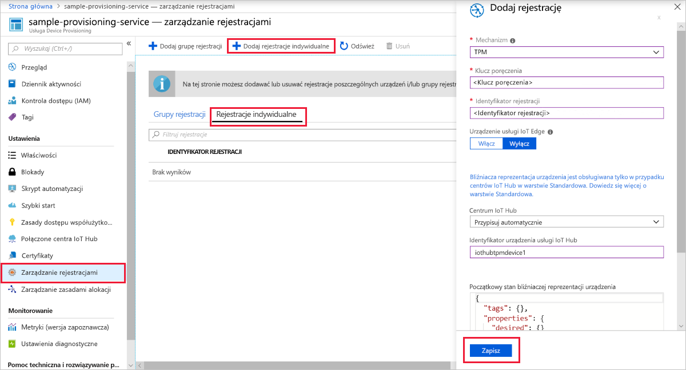
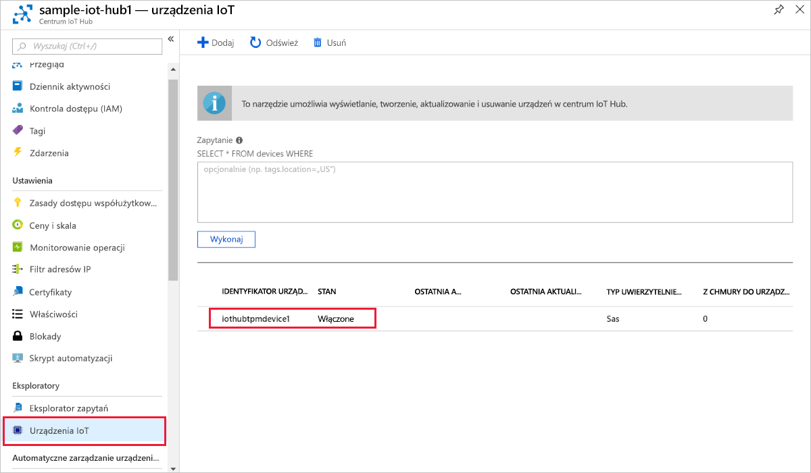

# <a name="quickstart-create-and-provision-a-simulated-tpm-device-using-c-device-sdk-for-iot-hub-device-provisioning-service"></a>Szybki start: tworzenie i aprowizowanie symulowanego urządzenia TPM przy użyciu sdk urządzenia języka C# dla usługi inicjowania obsługi administracyjnej urządzeń usługi IoT Hub

[!INCLUDE [iot-dps-selector-quick-create-simulated-device-tpm](../../includes/iot-dps-selector-quick-create-simulated-device-tpm.md)]

Te kroki pokazują, jak symulować urządzenie TPM na maszynie deweloperskiej z systemem operacyjnym Windows przy użyciu [przykładów usługi Azure IoT dla języka C#](https://github.com/Azure-Samples/azure-iot-samples-csharp). Ten przykład obejmuje także połączenie symulowanego urządzenia z usługą IoT Hub przy użyciu usługi Device Provisioning. 

Przykład kodu używa symulatora modułu Windows TPM jako [sprzętowego modułu zabezpieczeń (HSM, hardware security module)](https://azure.microsoft.com/blog/azure-iot-supports-new-security-hardware-to-strengthen-iot-security/) urządzenia. 

Jeśli nie znasz procesu automatycznego udostępniania, zapoznaj się również z [koncepcjami automatycznego inicjowania obsługi administracyjnej.](concepts-auto-provisioning.md) Pamiętaj również, aby wcześniej wykonać kroki przedstawione w części [Konfigurowanie usługi IoT Hub Device Provisioning za pomocą witryny Azure Portal](./quick-setup-auto-provision.md). 

Usługa Azure IoT Device Provisioning obsługuje dwa typy rejestracji:

- [Grupy rejestracji](concepts-service.md#enrollment-group): służą do rejestrowania wielu pokrewnych urządzeń.
- [Rejestracje indywidualne](concepts-service.md#individual-enrollment): służą do rejestrowania pojedynczych urządzeń.

W tym artykule przedstawiono rejestracje indywidualne.

[!INCLUDE [IoT Device Provisioning Service basic](../../includes/iot-dps-basic.md)]

<a id="setupdevbox"></a>
## <a name="prepare-the-development-environment"></a>Przygotowywanie środowiska deweloperskiego 

1. Upewnij się, że masz na komputerze zainstalowany [pakiet .NET Core 2.1 SDK lub nowszy.](https://www.microsoft.com/net/download/windows) 

1. Upewnij się, że na swojej maszynie masz zainstalowane oprogramowanie `git` i że jest ono dodane do zmiennych środowiskowych dostępnych z okna poleceń. Zobacz stronę z [narzędziami klienckimi Git organizacji Software Freedom Conservancy](https://git-scm.com/download/), aby uzyskać najnowszą wersję narzędzi `git` do zainstalowania, które obejmują powłokę **Git Bash**, czyli aplikację wiersza polecenia, która może służyć do interakcji z lokalnym repozytorium Git. 

1. Otwórz wiersz polecenia lub powłokę Git Bash. Sklonuj repozytorium GitHub Azure IoT Samples for C#:

    ```cmd
    git clone https://github.com/Azure-Samples/azure-iot-samples-csharp.git
    ```

## <a name="provision-the-simulated-device"></a>Aprowizowanie urządzenia symulowanego

1. Zaloguj się do Portalu Azure. Wybierz przycisk **Wszystkie zasoby** w menu po lewej stronie i otwórz usługę inicjowania obsługi urządzeń. Na **przegląd bloku,** należy zwrócić uwagę na wartość **_zakresu identyfikatora._**

     

1. W wierszu polecenia zmień katalogi na katalog projektu dla przykładu aprowizacji urządzenia TPM.

    ```cmd
    cd .\azure-iot-samples-csharp\provisioning\Samples\device\TpmSample
    ```

1. Wpisz następujące polecenie, aby skompilować i uruchomić przykład aprowizacji urządzenia TPM. Zastąp wartość `<IDScope>` zakresem identyfikatorów Twojej usługi aprowizacji. 

    ```cmd
    dotnet run <IDScope>
    ```

    To polecenie spowoduje uruchomienie symulatora mikroukładu urządzenia TPM w osobnym wierszu polecenia. W systemie Windows może wystąpić alert zabezpieczeń systemu Windows z pytaniem, czy program Simulator.exe ma umożliwić komunikację w sieciach publicznych. Na potrzeby tego przykładu można anulować żądanie.

1. W oryginalnym oknie polecenia jest wyświetlany **_klucz Poręczenia,_** **_identyfikator rejestracji_** i sugerowany identyfikator **_urządzenia_** potrzebny do rejestracji urządzenia. Zanotuj te wartości. Użyjesz tych wartości do utworzenia rejestracji indywidualnej w wystąpieniu usługi Device Provisioning. 
   > [!NOTE]
   > Nie pomyl okna zawierającego dane wyjściowe polecenia z oknem zawierającym dane wyjściowe z symulatora modułu TPM. Może być konieczne wybranie oryginalnego okna polecenia, aby przenieść je na pierwszy plan.

     

1. W witrynie Azure portal z menu Usługa inicjowania obsługi administracyjnej urządzeń wybierz polecenie **Zarządzaj rejestracjami**. Wybierz kartę **Rejestracje indywidualne** i wybierz przycisk **Dodaj rejestrację indywidualną** u góry. 

1. W panelu **Dodawanie rejestracji** wprowadź następujące informacje:
   - Wybierz opcję **TPM** jako *Mechanizm* poświadczania tożsamości.
   - Wprowadź identyfikator *rejestracji* i *klucz poręczenia dla* urządzenia TPM na podstawie wartości, które zostały wcześniej odnotowane.
   - Wybierz centrum IoT połączone z Twoją usługą aprowizacji.
   - Opcjonalnie można podać następujące informacje:
       - Wprowadź unikatowy *identyfikator urządzenia* (możesz użyć sugerowanego lub podać własny). Nadając nazwę urządzeniu, unikaj korzystania z danych poufnych. Jeśli nie zdecydujesz się go podać, identyfikator rejestracji zostanie użyty do zidentyfikowania urządzenia.
       - Zaktualizuj pole **Początkowy stan bliźniaczej reprezentacji urządzenia** za pomocą wybranej konfiguracji początkowej dla urządzenia.
   - Po zakończeniu naciśnij przycisk **Zapisz.** 

       

   Po pomyślnej rejestracji *Identyfikator rejestracji* Twojego urządzenia pojawi się na liście na karcie *Indywidualne rejestracje*. 

1. Naciśnij *klawisz Enter* w oknie polecenia (w oknie, w które wyświetlany był klucz **_poręczenia,_** identyfikator **_rejestracji_** i sugerowany **_identyfikator urządzenia),_** aby zarejestrować symulowane urządzenie. Zwróć uwagę na komunikaty symulujące uruchamianie urządzenia i łączenie z usługą Device Provisioning Service w celu pobrania informacji z Twojego centrum IoT. 

1. Upewnij się, że urządzenie zostało zaaprowizowane. Po pomyślnym inicjowaniu obsługi administracyjnej symulowanego urządzenia do centrum IoT hub połączone z usługą inicjowania obsługi administracyjnej identyfikator urządzenia jest wyświetlany na bloku **urządzeń IoT** koncentratora. 

     

    Jeśli zmienisz wartość w polu *Początkowy stan bliźniaczej reprezentacji urządzenia* z domyślnej na inną we wpisie rejestracji dla Twojego urządzenia, może to spowodować pobranie z centrum żądanego stanu reprezentacji bliźniaczej i odpowiednie do niego działanie. Aby uzyskać więcej informacji, zobacz [Opis bliźniaczej reprezentacji urządzenia w usłudze IoT Hub oraz sposoby jej używania](../iot-hub/iot-hub-devguide-device-twins.md).

## <a name="clean-up-resources"></a>Oczyszczanie zasobów

Jeśli planujesz kontynuować pracę i eksplorowanie przykładu klienta urządzenia, nie czyścić zasobów utworzonych w tym przewodniku Szybki start. Jeśli nie zamierzasz kontynuować, wykonaj następujące kroki, aby usunąć wszystkie zasoby utworzone przez ten przewodnik Szybki start.

1. Zamknij okno danych wyjściowych przykładu klienta urządzenia na swojej maszynie.
1. Zamknij okno symulatora modułu TPM na swojej maszynie.
1. Z menu po lewej stronie w witrynie Azure portal wybierz **pozycję Wszystkie zasoby,** a następnie wybierz usługę inicjowania obsługi urządzeń. W górnej części bloku **Przegląd** naciśnij klawisz **Delete** u góry okienka.  
1. Z menu po lewej stronie w witrynie Azure portal wybierz **pozycję Wszystkie zasoby,** a następnie wybierz centrum IoT Hub. W górnej części bloku **Przegląd** naciśnij klawisz **Delete** u góry okienka.  

## <a name="next-steps"></a>Następne kroki

W tym przewodniku Szybki start utworzono symulowane urządzenie modułu TPM na komputerze i zainicjowano jego obsługę w centrum IoT przy użyciu usługi inicjowania obsługi administracyjnej urządzeń usługi IoT Hub. Aby dowiedzieć się, jak programowo zarejestrować urządzenie modułU TPM, przejdź do szybkiego startu w celu uzyskania programowej rejestracji urządzenia modułu TPM. 

> [!div class="nextstepaction"]
> [Szybki start platformy Azure — rejestrowanie urządzenia modułu TPM w usłudze inicjowania obsługi administracyjnej urządzeń usługi Azure IoT Hub](quick-enroll-device-tpm-csharp.md)
