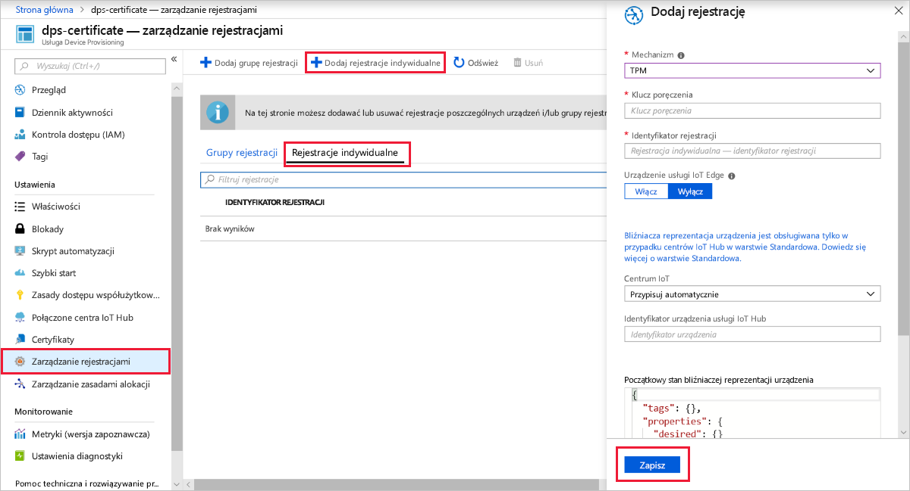
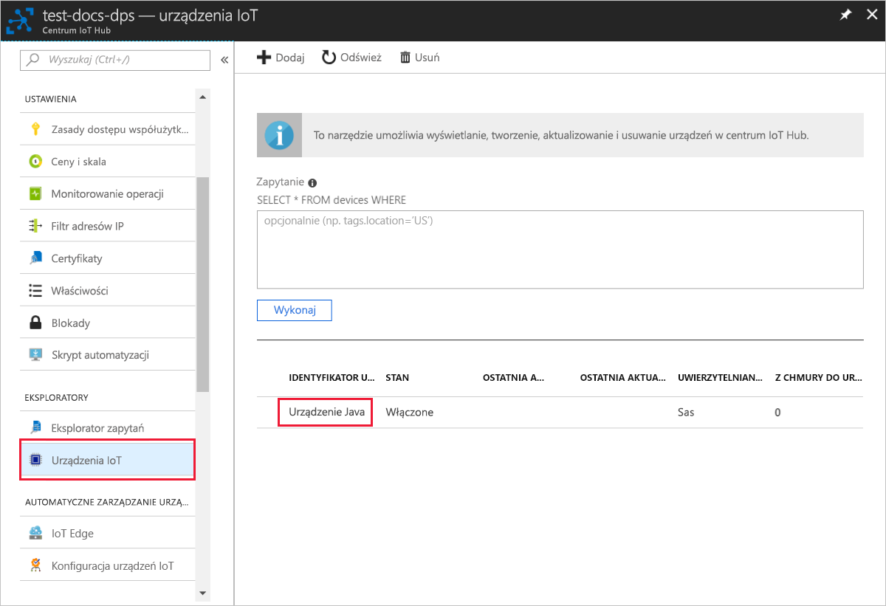

# <a name="quickstart-create-and-provision-a-simulated-tpm-device-using-java-device-sdk-for-azure-iot-hub-device-provisioning-service"></a>Szybki start: tworzenie i aprowizowanie symulowanego urządzenia TPM przy użyciu zestawu SDK urządzenia Java dla usługi inicjowania obsługi administracyjnej usługi Azure IoT Hub

[!INCLUDE [iot-dps-selector-quick-create-simulated-device-tpm](../../includes/iot-dps-selector-quick-create-simulated-device-tpm.md)]

W tym przewodniku Szybki start utworzysz symulowane urządzenie IoT na komputerze z systemem Windows. Symulowane urządzenie zawiera symulator modułu TPM jako sprzętowy moduł zabezpieczeń (HSM). Przykładowy kod Java urządzenia służy do łączenia tego symulowanego urządzenia z centrum IoT przy użyciu indywidualnej rejestracji w usłudze inicjowania obsługi administracyjnej (DPS).

## <a name="prerequisites"></a>Wymagania wstępne

- Przegląd [koncepcji automatycznego inicjowania obsługi administracyjnej](concepts-auto-provisioning.md).
- Zakończenie [konfigurowania usługi inicjowania obsługi administracyjnej urządzeń w centrum IoT za pomocą witryny Azure portal](./quick-setup-auto-provision.md).
- Konto platformy Azure z aktywną subskrypcją. [Utwórz jeden za darmo](https://azure.microsoft.com/free/?ref=microsoft.com&utm_source=microsoft.com&utm_medium=docs&utm_campaign=visualstudio).
- [Zestaw java se development 8](https://aka.ms/azure-jdks).
- [Maven](https://maven.apache.org/install.html).
- [Git](https://git-scm.com/download/).

[!INCLUDE [IoT Device Provisioning Service basic](../../includes/iot-dps-basic.md)]

## <a name="prepare-the-environment"></a>Przygotowywanie środowiska 

1. Upewnij się, że na maszynie zainstalowano środowisko [Java SE Development Kit 8](https://aka.ms/azure-jdks).

1. Pobierz i zainstaluj pakiet [Maven](https://maven.apache.org/install.html).

1. Upewnij się, że na swojej maszynie masz zainstalowane oprogramowanie `git` i że jest ono dodane do zmiennych środowiskowych dostępnych z okna poleceń. Zobacz stronę z [narzędziami klienckimi Git organizacji Software Freedom Conservancy](https://git-scm.com/download/), aby uzyskać najnowszą wersję narzędzi `git` do zainstalowania, które obejmują powłokę **Git Bash**, czyli aplikację wiersza polecenia, która może służyć do interakcji z lokalnym repozytorium Git. 

1. Otwórz wiersz polecenia. Sklonuj repozytorium GitHub dla przykładu kodu symulacji urządzenia.
    
    ```cmd/sh
    git clone https://github.com/Azure/azure-iot-sdk-java.git --recursive
    ```

1. Uruchom symulator [modułu TPM,](https://docs.microsoft.com/windows/device-security/tpm/trusted-platform-module-overview) aby być [modułem HSM](https://azure.microsoft.com/blog/azure-iot-supports-new-security-hardware-to-strengthen-iot-security/) dla symulowanego urządzenia. Kliknij pozycję **Zezwól na dostęp**, aby zezwolić na wprowadzanie zmian ustawień _Zapory systemu Windows_. Nasłuchuje on przez gniazdo na portach 2321 i 2322. Nie zamykaj tego okna; musisz zachować ten symulator uruchomiony do końca tego przewodnika szybki start. 

    ```cmd/sh
    .\azure-iot-sdk-java\provisioning\provisioning-tools\tpm-simulator\Simulator.exe
    ```

    

1. W osobnym wierszu polecenia przejdź do folderu głównego i skompiluj przykładowe zależności.

    ```cmd/sh
    cd azure-iot-sdk-java
    mvn install -DskipTests=true
    ```

1. Przejdź do folderu przykładów.

    ```cmd/sh
    cd provisioning/provisioning-samples/provisioning-tpm-sample
    ```

1. Zaloguj się do witryny Azure portal, wybierz przycisk **Wszystkie zasoby** w menu po lewej stronie i otwórz usługę inicjowania obsługi administracyjnej urządzeń. Zanotuj _zakres identyfikatora_ i _globalny punkt końcowy usługi inicjowania obsługi administracyjnej_.

    

1. Edytuj, `src/main/java/samples/com/microsoft/azure/sdk/iot/ProvisioningTpmSample.java` aby uwzględnić _zakres identyfikatora_ i _globalny punkt końcowy usługi inicjowania obsługi administracyjnej,_ jak wspomniano wcześniej.  

    ```java
    private static final String idScope = "[Your ID scope here]";
    private static final String globalEndpoint = "[Your Provisioning Service Global Endpoint here]";
    private static final ProvisioningDeviceClientTransportProtocol PROVISIONING_DEVICE_CLIENT_TRANSPORT_PROTOCOL = ProvisioningDeviceClientTransportProtocol.HTTPS;
    ```
    Zapisz plik.

1. Użyj następujących poleceń, aby utworzyć projekt, przejść do folderu docelowego i wykonać utworzony plik jar. Zastąp symbol zastępczy `version` wersją oprogramowania Java.

    ```cmd/sh
    mvn clean install
    cd target
    java -jar ./provisioning-tpm-sample-{version}-with-deps.jar
    ```

1. Rozpocznie się działanie programu. Zanotuj _klucz poręczenia i_ _identyfikator rejestracji_ dla następnej sekcji i pozostaw program uruchomiony.

    
    

## <a name="create-a-device-enrollment-entry"></a>Tworzenie wpisu rejestracji urządzenia

Usługa Azure IoT Device Provisioning obsługuje dwa typy rejestracji:

- [Grupy rejestracji](concepts-service.md#enrollment-group): służą do rejestrowania wielu pokrewnych urządzeń.
- [Rejestracje indywidualne:](concepts-service.md#individual-enrollment)służy do rejestrowania jednego urządzenia.

W tym artykule przedstawiono rejestracje indywidualne.

1. Zaloguj się do witryny Azure portal, wybierz przycisk **Wszystkie zasoby** w menu po lewej stronie i otwórz usługę inicjowania obsługi administracyjnej urządzeń.

1. Z menu Usługa inicjowania obsługi administracyjnej urządzeń wybierz polecenie **Zarządzaj rejestracjami**. Wybierz kartę **Rejestracje indywidualne** i wybierz przycisk **Dodaj rejestrację indywidualną** u góry. 

1. W panelu **Dodawanie rejestracji** wprowadź następujące informacje:
   - Wybierz opcję **TPM** jako *Mechanizm* poświadczania tożsamości.
   - Wprowadź identyfikator *rejestracji* i *klucz poręczenia dla* urządzenia TPM na podstawie wartości, które zostały wcześniej odnotowane.
   - Wybierz centrum IoT połączone z Twoją usługą aprowizacji.
   - Opcjonalnie można podać następujące informacje:
       - Wprowadź unikatowy *identyfikator urządzenia*. Nadając nazwę urządzeniu, unikaj korzystania z danych poufnych. Jeśli nie zdecydujesz się go podać, identyfikator rejestracji zostanie użyty do zidentyfikowania urządzenia.
       - Zaktualizuj pole **Początkowy stan bliźniaczej reprezentacji urządzenia** za pomocą wybranej konfiguracji początkowej dla urządzenia.
   - Po zakończeniu naciśnij przycisk **Zapisz.** 

       

   Po pomyślnej rejestracji *Identyfikator rejestracji* Twojego urządzenia pojawia się na liście na karcie *Indywidualne rejestracje*. 


## <a name="simulate-the-device"></a>Symulowanie urządzenia

1. W oknie polecenia z uruchomionym przykładowym kodem Java na komputerze naciśnij klawisz *Enter,* aby kontynuować uruchamianie aplikacji. Zwróć uwagę na komunikaty symulujące uruchamianie urządzenia i łączenie z usługą Device Provisioning Service w celu pobrania informacji z Twojego centrum IoT.  

    

1. Po pomyślnym inicjowaniu obsługi administracyjnej symulowanego urządzenia do centrum IoT hub połączone z usługą inicjowania obsługi administracyjnej identyfikator urządzenia jest wyświetlany na bloku **urządzeń IoT** koncentratora.

     

    Jeśli zmienisz wartość w polu *Początkowy stan bliźniaczej reprezentacji urządzenia* z domyślnej na inną we wpisie rejestracji dla Twojego urządzenia, może to spowodować pobranie z centrum żądanego stanu reprezentacji bliźniaczej i odpowiednie do niego działanie. Aby uzyskać więcej informacji, zobacz [Opis bliźniaczej reprezentacji urządzenia w usłudze IoT Hub oraz sposoby jej używania](../iot-hub/iot-hub-devguide-device-twins.md).


## <a name="clean-up-resources"></a>Oczyszczanie zasobów

Jeśli planujesz kontynuować pracę i eksplorowanie przykładu klienta urządzenia, nie czyścić zasobów utworzonych w tym przewodniku Szybki start. Jeśli nie zamierzasz kontynuować, wykonaj następujące kroki, aby usunąć wszystkie zasoby utworzone przez ten przewodnik Szybki start.

1. Zamknij okno danych wyjściowych przykładu klienta urządzenia na swojej maszynie.
1. Zamknij okno symulatora modułu TPM na swojej maszynie.
1. Z menu po lewej stronie w witrynie Azure portal wybierz **pozycję Wszystkie zasoby,** a następnie wybierz usługę inicjowania obsługi urządzeń. Otwórz bloku **Zarządzaj rejestracjami** dla usługi, a następnie wybierz kartę **Rejestracje indywidualne.** Zaznacz pole wyboru obok *identyfikatora REJESTRACJI* urządzenia zarejestrowanego w tym przewodniku Szybki start, a następnie naciśnij przycisk **Usuń** u góry okienka. 
1. Z menu po lewej stronie w witrynie Azure portal wybierz **pozycję Wszystkie zasoby,** a następnie wybierz centrum IoT Hub. Otwórz blok **Urządzenia IoT** dla koncentratora, zaznacz pole wyboru obok *identyfikatora URZĄDZENIA* urządzenia zarejestrowanego w tym przewodniku Szybki start, a następnie naciśnij przycisk **Usuń** u góry okienka.

## <a name="next-steps"></a>Następne kroki

W tym przewodniku Szybki start utworzono symulowane urządzenie modułu TPM na komputerze i zainicjowano jego obsługę w centrum IoT przy użyciu usługi inicjowania obsługi administracyjnej urządzeń usługi IoT Hub. Aby dowiedzieć się, jak programowo zarejestrować urządzenie modułU TPM, przejdź do szybkiego startu w celu uzyskania programowej rejestracji urządzenia modułu TPM. 

> [!div class="nextstepaction"]
> [Szybki start platformy Azure — rejestrowanie urządzenia modułu TPM w usłudze inicjowania obsługi administracyjnej urządzeń usługi Azure IoT Hub](quick-enroll-device-tpm-java.md)
