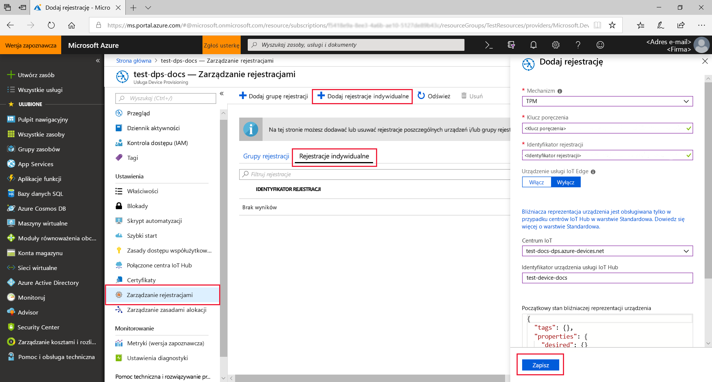
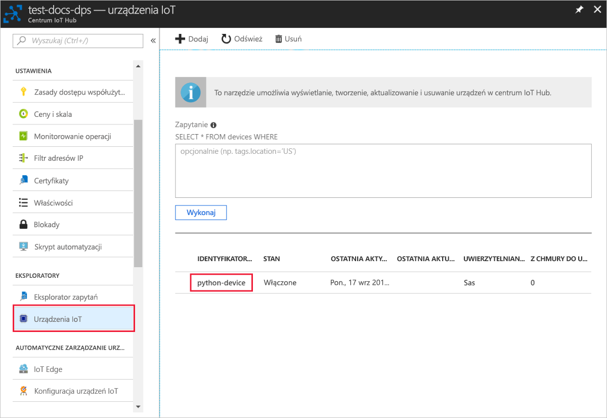

# <a name="quickstart-create-and-provision-a-simulated-tpm-device-using-python-device-sdk-for-iot-hub-device-provisioning-service"></a>Szybki start: tworzenie i aprowizowanie symulowanego urządzenia TPM przy użyciu sdk urządzenia Języka Python dla usługi inicjowania obsługi administracyjnej usługi ioT Hub

[!INCLUDE [iot-dps-selector-quick-create-simulated-device-tpm](../../includes/iot-dps-selector-quick-create-simulated-device-tpm.md)]

W tym przewodniku Szybki start utworzysz symulowane urządzenie IoT na komputerze z systemem Windows. Symulowane urządzenie zawiera symulator modułu TPM jako sprzętowy moduł zabezpieczeń (HSM). Przykładowy kod języka Python używasz do łączenia tego symulowanego urządzenia z centrum IoT przy użyciu indywidualnej rejestracji za pomocą usługi inicjowania obsługi administracyjnej (DPS).

## <a name="prerequisites"></a>Wymagania wstępne

- Przegląd [koncepcji automatycznego inicjowania obsługi administracyjnej](concepts-auto-provisioning.md).
- Zakończenie [konfigurowania usługi inicjowania obsługi administracyjnej urządzeń w centrum IoT za pomocą witryny Azure portal](./quick-setup-auto-provision.md).
- Konto platformy Azure z aktywną subskrypcją. [Utwórz jeden za darmo](https://azure.microsoft.com/free/?ref=microsoft.com&utm_source=microsoft.com&utm_medium=docs&utm_campaign=visualstudio).
- [Visual Studio 2015+](https://visualstudio.microsoft.com/vs/) z tworzeniem pulpitu w języku C++.
- [CMake system kompilacji](https://cmake.org/download/).
- [Git](https://git-scm.com/download/).

> [!IMPORTANT]
> Ten artykuł dotyczy tylko przestarzałego SDK języka Python w języku Python. Klienci urządzeń i usług usługi usługi inicjowania obsługi urządzeń Iot Hub nie są jeszcze dostępne w wersji 2. Zespół jest obecnie ciężko pracuje, aby doprowadzić V2 do parytetu funkcji.

[!INCLUDE [IoT Device Provisioning Service basic](../../includes/iot-dps-basic.md)]

## <a name="prepare-the-environment"></a>Przygotowywanie środowiska 

1. Upewnij się, że zainstalowano [program Visual Studio](https://visualstudio.microsoft.com/vs/) 2015 lub nowsze, z włączonym obciążeniem "Tworzenie pulpitu z C++" dla instalacji programu Visual Studio.

1. Pobierz i zainstaluj [system kompilacji CMake](https://cmake.org/download/).

1. Upewnij się, że na swojej maszynie masz zainstalowane oprogramowanie `git` i że jest ono dodane do zmiennych środowiskowych dostępnych z okna poleceń. Zobacz stronę z [narzędziami klienckimi Git organizacji Software Freedom Conservancy](https://git-scm.com/download/), aby uzyskać najnowszą wersję narzędzi `git` do zainstalowania, które obejmują powłokę **Git Bash**, czyli aplikację wiersza polecenia, która może służyć do interakcji z lokalnym repozytorium Git. 

1. Otwórz wiersz polecenia lub powłokę Git Bash. Sklonuj repozytorium GitHub dla przykładu kodu symulacji urządzenia:
    
    ```cmd/sh
    git clone --single-branch --branch v1-deprecated https://github.com/Azure/azure-iot-sdk-python.git --recursive
    ```

1. Utwórz folder w swojej lokalnej kopii tego repozytorium GitHub dla procesu kompilacji CMake. 

    ```cmd/sh
    cd azure-iot-sdk-python/c
    mkdir cmake
    cd cmake
    ```

1. Przykład kodu korzysta z symulatora modułu Windows TPM. Uruchom następujące polecenie, aby włączyć uwierzytelnianie tokenu sygnatury dostępu współdzielonego. Polecenie to generuje także rozwiązanie programu Visual Studio dla symulowanego urządzenia.

    ```cmd/sh
    cmake -Duse_prov_client:BOOL=ON -Duse_tpm_simulator:BOOL=ON ..
    ```

1. W osobnym wierszu polecenia przejdź do folderu symulatora modułu TPM i uruchom symulator [modułu TPM](https://docs.microsoft.com/windows/device-security/tpm/trusted-platform-module-overview) jako [moduł HSM](https://azure.microsoft.com/blog/azure-iot-supports-new-security-hardware-to-strengthen-iot-security/) dla symulowanego urządzenia. Kliknij pozycję **Zezwól na dostęp**. Nasłuchuje on przez gniazdo na portach 2321 i 2322. Nie należy zamykać tego okna polecenia; musisz zachować ten symulator uruchomiony do końca tego przewodnika szybki start. 

    ```cmd/sh
    .\azure-iot-sdk-python\c\provisioning_client\deps\utpm\tools\tpm_simulator\Simulator.exe
    ```

    


## <a name="create-a-device-enrollment-entry"></a>Tworzenie wpisu rejestracji urządzenia

Usługa Azure IoT Device Provisioning obsługuje dwa typy rejestracji:

- [Grupy rejestracji](concepts-service.md#enrollment-group): służą do rejestrowania wielu pokrewnych urządzeń.
- [Rejestracje indywidualne:](concepts-service.md#individual-enrollment)służy do rejestrowania jednego urządzenia.

W tym artykule przedstawiono rejestracje indywidualne.

1. Otwórz rozwiązanie wygenerowane w folderze programu *cmake* o nazwie `azure_iot_sdks.sln` i skompiluj je w programie Visual Studio.

1. Kliknij prawym przyciskiem myszy projekt **tpm_device_provision** i wybierz pozycję **Ustaw jako projekt startowy**. Uruchom rozwiązanie. W oknie danych wyjściowych jest wyświetlany **_klucz Poręczenia i_** **_identyfikator rejestracji_** potrzebny do rejestracji urządzenia. Zapisz te wartości. 

    

1. Zaloguj się do witryny Azure portal, wybierz przycisk **Wszystkie zasoby** w menu po lewej stronie i otwórz usługę inicjowania obsługi administracyjnej urządzeń.

1. Z menu Usługa inicjowania obsługi administracyjnej urządzeń wybierz polecenie **Zarządzaj rejestracjami**. Wybierz kartę **Rejestracje indywidualne** i wybierz przycisk **Dodaj rejestrację indywidualną** u góry. 

1. W panelu **Dodawanie rejestracji** wprowadź następujące informacje:
   - Wybierz opcję **TPM** jako *Mechanizm* poświadczania tożsamości.
   - Wprowadź identyfikator *rejestracji* i *klucz poręczenia dla* urządzenia TPM na podstawie wartości, które zostały wcześniej odnotowane.
   - Wybierz centrum IoT połączone z Twoją usługą aprowizacji.
   - Opcjonalnie można podać następujące informacje:
       - Wprowadź unikatowy *identyfikator urządzenia*. Nadając nazwę urządzeniu, unikaj korzystania z danych poufnych. Jeśli nie zdecydujesz się go podać, identyfikator rejestracji zostanie użyty do zidentyfikowania urządzenia.
       - Zaktualizuj pole **Początkowy stan bliźniaczej reprezentacji urządzenia** za pomocą wybranej konfiguracji początkowej dla urządzenia.
   - Po zakończeniu naciśnij przycisk **Zapisz.** 

       

   Po pomyślnej rejestracji *Identyfikator rejestracji* Twojego urządzenia pojawi się na liście na karcie *Indywidualne rejestracje*. 


## <a name="simulate-the-device"></a>Symulowanie urządzenia

1. Pobierz i zainstaluj środowisko [Python 2.x lub 3.x](https://www.python.org/downloads/). Upewnij się, że używasz 32-bitowej lub 64-bitowej instalacji zgodnie z wymaganiami konfiguracji. Po wyświetleniu monitu podczas instalacji upewnij się, że język Python został dodany do zmiennych środowiskowych specyficznych dla platformy.
    - Zainstaluj [Pakiet redystrybucyjny języka Visual C++](https://support.microsoft.com/help/2977003/the-latest-supported-visual-c-downloads) (jeśli używasz systemu operacyjnego Windows) umożliwiający korzystanie z natywnych bibliotek DLL języka Python.

1. Postępuj zgodnie z [tymi instrukcjami](https://github.com/Azure/azure-iot-sdk-python/blob/v1-deprecated/doc/python-devbox-setup.md), aby skompilować pakiety języka Python.

   > [!NOTE]
   > W przypadku korzystania ze skryptu `build_client.cmd` pamiętaj, aby użyć flagi `--use-tpm-simulator`.
   > 
   > [!NOTE]
   > Jeśli korzystasz z systemu `pip`, zainstaluj również pakiet `azure-iot-provisioning-device-client`. Pamiętaj, że wydane pakiety PIP korzystają z rzeczywistych modułów TPM, a nie z symulatora. Aby użyć symulatora, należy przeprowadzić kompilowanie ze źródła przy użyciu flagi `--use-tpm-simulator`.

1. Przejdź do folderu z przykładami.

    ```cmd/sh
    cd azure-iot-sdk-python/provisioning_device_client/samples
    ```

1. Korzystając ze zintegrowanego środowiska projektowego Python, poddaj edycji skrypt python o nazwie **provisioning\_device\_client\_sample.py**. Zmodyfikuj zmienne *GLOBAL\_PROV\_URI* i *ID\_SCOPE* do wartości wymienionych wcześniej. Upewnij się również, że zmienna *SECURITY\_DEVICE\_TYPE* ma ustawioną wartość `ProvisioningSecurityDeviceType.TPM`

    ```python
    GLOBAL_PROV_URI = "{globalServiceEndpoint}"
    ID_SCOPE = "{idScope}"
    SECURITY_DEVICE_TYPE = ProvisioningSecurityDeviceType.TPM
    PROTOCOL = ProvisioningTransportProvider.HTTP
    ```

    

1. Uruchom przykład. 

    ```cmd/sh
    python provisioning_device_client_sample.py
    ```

1. Zwróć uwagę na komunikaty symulujące uruchamianie urządzenia i łączenie z usługą Device Provisioning Service w celu pobrania informacji z Twojego centrum IoT. 

    

1. Po pomyślnym inicjowaniu obsługi administracyjnej symulowanego urządzenia do centrum IoT hub połączone z usługą inicjowania obsługi administracyjnej identyfikator urządzenia jest wyświetlany na bloku **urządzeń IoT** koncentratora.

     

    Jeśli zmienisz wartość w polu *Początkowy stan bliźniaczej reprezentacji urządzenia* z domyślnej na inną we wpisie rejestracji dla Twojego urządzenia, może to spowodować pobranie z centrum żądanego stanu reprezentacji bliźniaczej i odpowiednie do niego działanie. Aby uzyskać więcej informacji, zobacz [Opis bliźniaczych urządzeń i używanie ich w Uorce IoT](../iot-hub/iot-hub-devguide-device-twins.md)


## <a name="clean-up-resources"></a>Oczyszczanie zasobów

Jeśli planujesz kontynuować pracę i eksplorowanie przykładu klienta urządzenia, nie czyścić zasobów utworzonych w tym przewodniku Szybki start. Jeśli nie zamierzasz kontynuować, wykonaj następujące kroki, aby usunąć wszystkie zasoby utworzone przez ten przewodnik Szybki start.

1. Zamknij okno danych wyjściowych przykładu klienta urządzenia na swojej maszynie.
1. Zamknij okno symulatora modułu TPM na swojej maszynie.
1. Z menu po lewej stronie w witrynie Azure portal wybierz **pozycję Wszystkie zasoby,** a następnie wybierz usługę inicjowania obsługi urządzeń. Otwórz bloku **Zarządzaj rejestracjami** dla usługi, a następnie wybierz kartę **Rejestracje indywidualne.** Zaznacz pole wyboru obok *identyfikatora REJESTRACJI* urządzenia zarejestrowanego w tym przewodniku Szybki start, a następnie naciśnij przycisk **Usuń** u góry okienka. 
1. Z menu po lewej stronie w witrynie Azure portal wybierz **pozycję Wszystkie zasoby,** a następnie wybierz centrum IoT Hub. Otwórz blok **Urządzenia IoT** dla koncentratora, zaznacz pole wyboru obok *identyfikatora URZĄDZENIA* urządzenia zarejestrowanego w tym przewodniku Szybki start, a następnie naciśnij przycisk **Usuń** u góry okienka.

## <a name="next-steps"></a>Następne kroki

W tym przewodniku Szybki start utworzono symulowane urządzenie modułu TPM na komputerze i zainicjowano jego obsługę w centrum IoT przy użyciu usługi inicjowania obsługi administracyjnej urządzeń usługi IoT Hub. Aby dowiedzieć się, jak programowo zarejestrować urządzenie modułU TPM, przejdź do szybkiego startu w celu uzyskania programowej rejestracji urządzenia modułu TPM. 

> [!div class="nextstepaction"]
> [Szybki start platformy Azure — rejestrowanie urządzenia modułu TPM w usłudze inicjowania obsługi administracyjnej urządzeń usługi Azure IoT Hub](quick-enroll-device-tpm-python.md)
