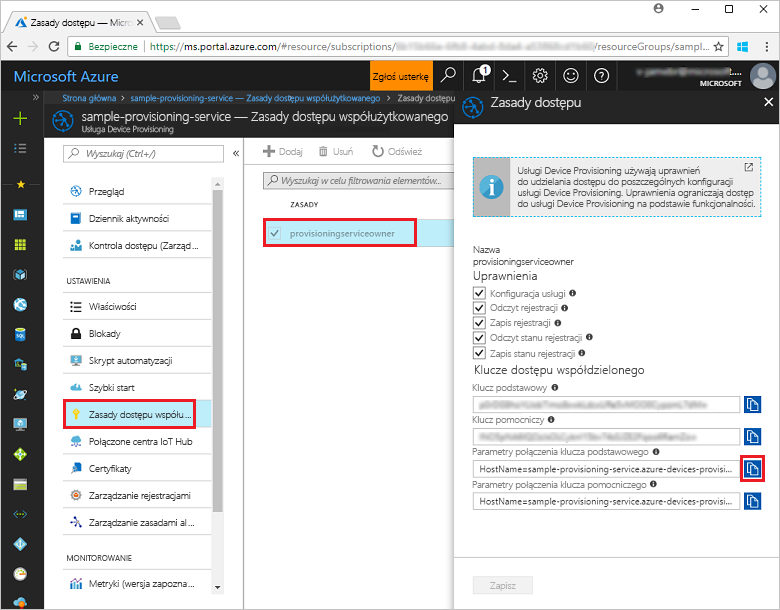
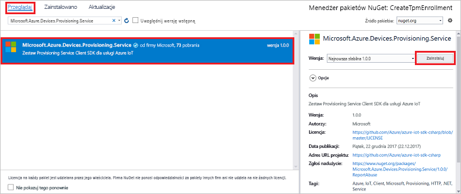
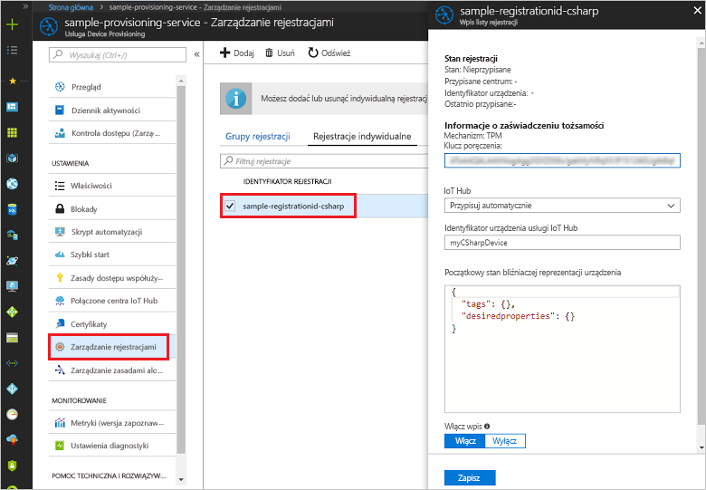

# <a name="enroll-tpm-device-to-iot-hub-device-provisioning-service-using-c-service-sdk"></a>Rejestrowanie urządzenia TPM w usłudze IoT Hub Device Provisioning przy użyciu zestawu SDK usługi C#

[!INCLUDE [iot-dps-selector-quick-enroll-device-tpm](../../includes/iot-dps-selector-quick-enroll-device-tpm.md)]


W tych instrukcjach pokazano, jak programowo utworzyć rejestrację indywidualną dla urządzenia TPM w usłudze Azure IoT Hub Device Provisioning przy użyciu [zestawu SDK usługi C#](https://github.com/Azure/azure-iot-sdk-csharp) i przykładowej aplikacji .NET Core w języku C#. Opcjonalnie można zarejestrować symulowane urządzenie TPM w usłudze aprowizacji przy użyciu tego wpisu rejestracji indywidualnej. Mimo iż ta procedura działa zarówno na maszynach z systemem Windows, jak i Linux, w tym artykule używana jest maszyna deweloperska z systemem Windows.

## <a name="prepare-the-development-environment"></a>Przygotowywanie środowiska deweloperskiego

1. Upewnij się, że na Twojej maszynie jest zainstalowany program [Visual Studio 2017](https://www.visualstudio.com/vs/). 
2. Upewnij się, że na maszynie jest zainstalowany [zestaw SDK dla platformy .NET Core](https://www.microsoft.com/net/download/windows). 
3. Pamiętaj, aby wcześniej wykonać kroki przedstawione w części [Konfigurowanie usługi IoT Hub Device Provisioning za pomocą witryny Azure Portal](./quick-setup-auto-provision.md).
4. (Opcjonalnie) Jeśli chcesz zarejestrować symulowane urządzenie na końcu tego przewodnika Szybki start, postępuj zgodnie z instrukcjami z sekcji [Tworzenie i aprowizowanie symulowanego urządzenia TPM za pomocą zestawu SDK usługi C#](quick-create-simulated-device-tpm-csharp.md) do kroku, w którym uzyskujesz klucz poręczenia dla urządzenia. Zanotuj klucz poręczenia, identyfikator rejestracji i, opcjonalnie, identyfikator urządzenia. Te informacje będą potrzebne w dalszej części tego przewodnika Szybki start. **Nie wykonuj kroków tworzenia rejestracji indywidualnej przy użyciu witryny Azure Portal.**

## <a name="get-the-connection-string-for-your-provisioning-service"></a>Uzyskiwanie parametrów połączenia usługi aprowizacji

Na potrzeby przykładu w tym przewodniku Szybki start będą potrzebne parametry połączenia usługi aprowizacji.
1. Zaloguj się w witrynie Azure Portal, kliknij przycisk **Wszystkie zasoby** w menu po lewej stronie i otwórz swoją usługę Device Provisioning. 
2. Kliknij pozycję **Zasady dostępu współużytkowanego**, a następnie kliknij odpowiednie zasady dostępu, aby otworzyć ich właściwości. W oknie **Zasady dostępu** skopiuj i zanotuj parametry połączenia klucza podstawowego. 

    

## <a name="create-the-individual-enrollment-sample"></a>Tworzenie przykładowej rejestracji indywidualnej 

Kroki opisane w tej sekcji przedstawiają sposób tworzenia aplikacji konsolowej .NET Core, która dodaje rejestrację indywidualną urządzenia TPM do usługi aprowizacji. Wprowadzając pewne modyfikacje, za pomocą tych kroków można również utworzyć aplikację konsolową [Windows IoT Core](https://developer.microsoft.com/en-us/windows/iot) służącą do dodawania rejestracji indywidualnej. Aby dowiedzieć się więcej na temat programowania w systemie IoT Core, zobacz [dokumentację dla deweloperów systemu Windows IoT Core](https://docs.microsoft.com/en-us/windows/iot-core/).
1. W programie Visual Studio dodaj projekt aplikacji konsolowej .NET Core w języku Visual C# do nowego rozwiązania, używając szablonu projektu **Aplikacja konsolowa (.NET Core)**. Upewnij się, że program .NET Framework jest w wersji 4.5.1 lub nowszej. Nadaj projektowi nazwę **CreateTpmEnrollment**.

    

2. W Eksploratorze rozwiązań kliknij prawym przyciskiem myszy projekt **CreateTpmEnrollment**, a następnie kliknij pozycję **Zarządzaj pakietami NuGet**.
3. W oknie **Menedżer pakietów NuGet** wybierz opcję **Przeglądaj**, wyszukaj pozycję **Microsoft.Azure.Devices.Provisioning.Service**, wybierz opcję **Zainstaluj**, aby zainstalować pakiet **Microsoft.Azure.Devices.Provisioning.Service**, i zaakceptuj warunki użytkowania. Ta procedura spowoduje pobranie, zainstalowanie i dodanie odwołania do pakietu NuGet [zestawu SDK klienta usługi aprowizacji usługi Azure IoT](https://www.nuget.org/packages/Microsoft.Azure.Devices.Provisioning.Service/) oraz jego zależności.

    

4. Dodaj następujące instrukcje `using` po istniejących instrukcjach `using` na początku pliku **Program.cs**:
   
   ```csharp
   using System.Threading.Tasks;
   using Microsoft.Azure.Devices.Provisioning.Service;
   ```
    
5. Dodaj następujące pola do klasy **Program**:  
   - Zamień wartość zastępczą **ProvisioningConnectionString** na parametry połączenia usługi aprowizacji, dla której ma zostać utworzona rejestracja.
   - Opcjonalnie możesz zmienić identyfikator rejestracji, klucz poręczenia, identyfikator urządzenia i stan aprowizowania. 
   - Jeśli do aprowizowania symulowanego urządzenia korzystasz z instrukcji z przewodnika Szybki start [Tworzenie i aprowizowanie symulowanego urządzenia TPM za pomocą zestawu SDK usługi C#](quick-create-simulated-device-tpm-csharp.md), zastąp klucz poręczenia i identyfikator rejestracji wartościami zanotowanymi w tym przewodniku Szybki start. Identyfikator urządzenia można zastąpić wartością sugerowaną w tym przewodniku Szybki start, można użyć własnej wartości lub użyć wartości domyślnej z tego przykładu.
        
   ```csharp
   private static string ProvisioningConnectionString = "{Your provisioning service connection string}";
   private const string RegistrationId = "sample-registrationid-csharp";
   private const string TpmEndorsementKey =
       "AToAAQALAAMAsgAgg3GXZ0SEs/gakMyNRqXXJP1S124GUgtk8qHaGzMUaaoABgCAAEMAEAgAAAAAAAEAxsj2gUS" +
       "cTk1UjuioeTlfGYZrrimExB+bScH75adUMRIi2UOMxG1kw4y+9RW/IVoMl4e620VxZad0ARX2gUqVjYO7KPVt3d" +
       "yKhZS3dkcvfBisBhP1XH9B33VqHG9SHnbnQXdBUaCgKAfxome8UmBKfe+naTsE5fkvjb/do3/dD6l4sGBwFCnKR" +
       "dln4XpM03zLpoHFao8zOwt8l/uP3qUIxmCYv9A7m69Ms+5/pCkTu/rK4mRDsfhZ0QLfbzVI6zQFOKF/rwsfBtFe" +
       "WlWtcuJMKlXdD8TXWElTzgh7JS4qhFzreL0c1mI0GCj+Aws0usZh7dLIVPnlgZcBhgy1SSDQMQ==";
       
   // Optional parameters
   private const string OptionalDeviceId = "myCSharpDevice";
   private const ProvisioningStatus OptionalProvisioningStatus = ProvisioningStatus.Enabled;
   ```
    
6. Dodaj następującą metodę do klasy **Program**.  Ten kod tworzy wpis rejestracji indywidualnej, a następnie wywołuje metodę **CreateOrUpdateIndividualEnrollmentAsync** względem obiektu **ProvisioningServiceClient**, aby dodać rejestrację indywidualną do usługi aprowizacji.
   
   ```csharp
   public static async Task RunSample()
   {
       Console.WriteLine("Starting sample...");

       using (ProvisioningServiceClient provisioningServiceClient =
               ProvisioningServiceClient.CreateFromConnectionString(ProvisioningConnectionString))
       {
           #region Create a new individualEnrollment config
           Console.WriteLine("\nCreating a new individualEnrollment...");
           Attestation attestation = new TpmAttestation(TpmEndorsementKey);
           IndividualEnrollment individualEnrollment =
                   new IndividualEnrollment(
                           RegistrationId,
                           attestation);

           // The following parameters are optional. Remove them if you don't need them.
           individualEnrollment.DeviceId = OptionalDeviceId;
           individualEnrollment.ProvisioningStatus = OptionalProvisioningStatus;
           #endregion

           #region Create the individualEnrollment
           Console.WriteLine("\nAdding new individualEnrollment...");
           IndividualEnrollment individualEnrollmentResult =
               await provisioningServiceClient.CreateOrUpdateIndividualEnrollmentAsync(individualEnrollment).ConfigureAwait(false);
           Console.WriteLine("\nIndividualEnrollment created with success.");
           Console.WriteLine(individualEnrollmentResult);
           #endregion
        
       }
   }
   ```
       
7. Na koniec zastąp treść metody **Main** następującymi wierszami:
   
   ```csharp
   RunSample().GetAwaiter().GetResult();
   Console.WriteLine("\nHit <Enter> to exit ...");
   Console.ReadLine();
   ```
        
8. Skompiluj rozwiązanie.

## <a name="run-the-individual-enrollment-sample"></a>Uruchamianie przykładowej rejestracji indywidualnej
  
1. Uruchom przykład w programie Visual Studio, aby utworzyć rejestrację indywidualną dla urządzenia TPM.
 
2. Po pomyślnym utworzeniu nowej rejestracji indywidualnej w oknie polecenia zostaną wyświetlone jej właściwości.

    

3. Aby sprawdzić, czy rejestracja indywidualna została utworzona, w bloku podsumowania usługi Device Provisioning witryny Azure Portal wybierz pozycję **Zarządzanie rejestracjami**, a następnie wybierz kartę **Rejestracje indywidualne**. Powinien zostać wyświetlony nowy wpis rejestracji odpowiadający identyfikatorowi rejestracji użytemu w przykładzie. Kliknij wpis, aby zweryfikować klucz poręczenia oraz inne właściwości wpisu.

    
 
4. (Opcjonalnie) Jeśli wykonywano kroki z przewodnika Szybki start [Tworzenie i aprowizowanie symulowanego urządzenia TPM za pomocą zestawu SDK usługi C#](quick-create-simulated-device-tpm-csharp.md), można kontynuować wykonywanie pozostałych czynności z tego przewodnika, aby zarejestrować urządzenie symulowane. Pomiń kroki tworzenia rejestracji indywidualnej przy użyciu witryny Azure Portal.

## <a name="clean-up-resources"></a>Oczyszczanie zasobów
Jeśli planujesz eksplorować przykładową usługę C#, nie usuwaj zasobów utworzonych w tym przewodniku Szybki start. Jeśli nie planujesz kontynuować pracy, wykonaj poniższe kroki, aby usunąć wszystkie zasoby utworzone w ramach tego przewodnika Szybki start.

1. Zamknij okno danych wyjściowych przykładu C# na swojej maszynie.
2. Przejdź do usługi Device Provisioning w witrynie Azure Portal, kliknij pozycję **Zarządzanie rejestracjami**, a następnie wybierz kartę **Rejestracje indywidualne**. Wybierz *Identyfikator rejestracji* wpisu rejestracji utworzonego w ramach tego przewodnika Szybki start i kliknij przycisk **Usuń** w górnej części bloku. 
3. Jeśli wykonywano kroki z przewodnika Szybki start [Tworzenie i aprowizowanie symulowanego urządzenia TPM za pomocą zestawu SDK usługi C#](quick-create-simulated-device-tpm-csharp.md) w celu utworzenia symulowanego urządzenia TPM, należy wykonać następujące czynności: 

    1. Zamknij okno symulatora modułu TPM i przykładowe okno danych wyjściowych urządzenia symulowanego.
    2. W witrynie Azure Portal przejdź do usługi IoT Hub, w której zaaprowizowano urządzenie. W menu po lewej stronie w obszarze **Eksploratory** kliknij pozycję **Urządzenia IoT**, zaznacz pole wyboru obok urządzenia, a następnie kliknij przycisk **Usuń** w górnej części okna.
 
## <a name="next-steps"></a>Następne kroki
W tym przewodniku Szybki start utworzono programowo wpis rejestracji indywidualnej dla urządzenia TPM oraz opcjonalnie na komputerze utworzono symulowane urządzenie TPM, które zaaprowizowano do Twojego centrum IoT przy użyciu usługi Azure IoT Hub Device Provisioning. Aby uzyskać dokładne informacje na temat aprowizowania urządzeń, przejdź do samouczka poświęconego konfiguracji usługi Device Provisioning Service w witrynie Azure portal. 
 
> [!div class="nextstepaction"]
> [Samouczki dla usługi Azure IoT Hub Device Provisioning Service](./tutorial-set-up-cloud.md)

