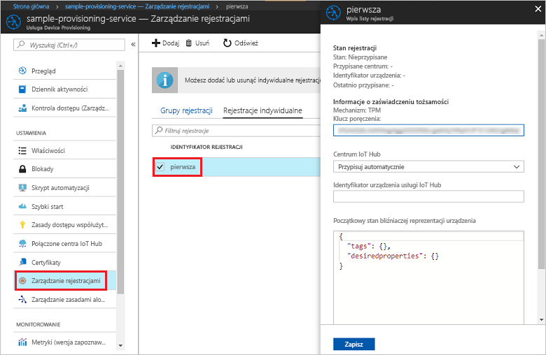

# <a name="quickstart-enroll-tpm-device-to-iot-hub-device-provisioning-service-using-nodejs-service-sdk"></a>Szybki start: rejestrowanie urządzenia TPM w usłudze inicjowania obsługi administracyjnej urządzeń usługi IoT Hub przy użyciu sdk usługi Node.js

[!INCLUDE [iot-dps-selector-quick-enroll-device-tpm](../../includes/iot-dps-selector-quick-enroll-device-tpm.md)]

W tym przewodniku Szybki start programowo utwórz indywidualną rejestrację dla urządzenia TPM w usłudze inicjowania obsługi administracyjnej urządzeń usługi Azure IoT Hub przy użyciu zestawu SDK usługi Node.js i przykładowej aplikacji Node.js. Opcjonalnie można zarejestrować symulowane urządzenie TPM w usłudze aprowizacji przy użyciu tego wpisu rejestracji indywidualnej.

## <a name="prerequisites"></a>Wymagania wstępne

- Zakończenie [konfigurowania usługi inicjowania obsługi administracyjnej urządzeń usługi Usługi obsługi urządzeń usługi IoT Hub za pomocą witryny Azure portal](./quick-setup-auto-provision.md).
- Konto platformy Azure z aktywną subskrypcją. [Utwórz jeden za darmo](https://azure.microsoft.com/free/?ref=microsoft.com&utm_source=microsoft.com&utm_medium=docs&utm_campaign=visualstudio).
- [Node.js v4.0+](https://nodejs.org). Ten szybki start instaluje [sdk usługi Node.js](https://github.com/Azure/azure-iot-sdk-node) poniżej.
- Klucz potwierdzenia (opcjonalnie). Wykonaj kroki opisane w [tworzenie i aprowizować symulowane urządzenie,](quick-create-simulated-device.md) dopóki nie otrzymasz klucza. Nie należy tworzyć rejestracji indywidualnej przy użyciu witryny Azure portal.

## <a name="create-the-individual-enrollment-sample"></a>Tworzenie przykładowej rejestracji indywidualnej 

 
1. Z poziomu okna polecenia w folderze roboczym uruchom następujące polecenie:
  
    ```cmd\sh
    npm install azure-iot-provisioning-service
    ```  

2. Za pomocą edytora tekstu utwórz plik **create_individual_enrollment.js** w folderze roboczym. Dodaj następujący kod do pliku i zapisz go:

    ```
    'use strict';

    var provisioningServiceClient = require('azure-iot-provisioning-service').ProvisioningServiceClient;

    var serviceClient = provisioningServiceClient.fromConnectionString(process.argv[2]);
    var endorsementKey = process.argv[3];

    var enrollment = {
      registrationId: 'first',
      attestation: {
        type: 'tpm',
        tpm: {
          endorsementKey: endorsementKey
        }
      }
    };

    serviceClient.createOrUpdateIndividualEnrollment(enrollment, function(err, enrollmentResponse) {
      if (err) {
        console.log('error creating the individual enrollment: ' + err);
      } else {
        console.log("enrollment record returned: " + JSON.stringify(enrollmentResponse, null, 2));
      }
    });
    ```

## <a name="run-the-individual-enrollment-sample"></a>Uruchamianie przykładowej rejestracji indywidualnej
  
1. Do uruchomienia przykładu będą potrzebne parametry połączenia usługi aprowizacji. 
    1. Zaloguj się do witryny Azure portal, wybierz przycisk **Wszystkie zasoby** w menu po lewej stronie i otwórz usługę inicjowania obsługi administracyjnej urządzeń. 
    2. Wybierz **pozycję Zasady dostępu współdzielonego**, a następnie wybierz zasadę dostępu, której chcesz użyć do otwarcia jej właściwości. W oknie **Zasady dostępu** skopiuj i zanotuj parametry połączenia klucza podstawowego. 

        


2. Wymagany jest również klucz poręczenia dla danego urządzenia. Jeśli w celu utworzenia symulowanego urządzenia TPM wykonano kroki z sekcji [Tworzenie i aprowizowanie symulowanego urządzenia](quick-create-simulated-device.md) przewodnika Szybki start, użyj klucza utworzonego dla tego urządzenia. W przeciwnym razie, aby utworzyć przykładową rejestrację indywidualną, można użyć następującego klucza poręczenia dostarczonego z [zestawem SDK usługi Node.js:](https://github.com/Azure/azure-iot-sdk-node)

    ```
    AToAAQALAAMAsgAgg3GXZ0SEs/gakMyNRqXXJP1S124GUgtk8qHaGzMUaaoABgCAAEMAEAgAAAAAAAEAxsj2gUScTk1UjuioeTlfGYZrrimExB+bScH75adUMRIi2UOMxG1kw4y+9RW/IVoMl4e620VxZad0ARX2gUqVjYO7KPVt3dyKhZS3dkcvfBisBhP1XH9B33VqHG9SHnbnQXdBUaCgKAfxome8UmBKfe+naTsE5fkvjb/do3/dD6l4sGBwFCnKRdln4XpM03zLpoHFao8zOwt8l/uP3qUIxmCYv9A7m69Ms+5/pCkTu/rK4mRDsfhZ0QLfbzVI6zQFOKF/rwsfBtFeWlWtcuJMKlXdD8TXWElTzgh7JS4qhFzreL0c1mI0GCj+Aws0usZh7dLIVPnlgZcBhgy1SSDQMQ==
    ```

3. Aby utworzyć rejestrację indywidualną dla urządzenia TPM, uruchom następujące polecenie (z uwzględnieniem cudzysłowów wokół argumentów polecenia):
 
     ```cmd\sh
     node create_individual_enrollment.js "<the connection string for your provisioning service>" "<endorsement key>"
     ```
 
3. Po pomyślnym utworzeniu nowej rejestracji indywidualnej w oknie polecenia zostaną wyświetlone jej właściwości.

     

4. Sprawdź, czy rejestracja indywidualna została utworzona. W witrynie Azure Portal w bloku podsumowania usługi Device Provisioning wybierz pozycję **Zarządzaj rejestracjami**. Wybierz kartę **Rejestracje indywidualne** i wybierz nowy wpis rejestracji (*pierwszy),* aby zweryfikować klucz poręczenia i inne właściwości wpisu.

     
 
Jeśli po utworzeniu rejestracji indywidualnej dla urządzenia TPM chcesz zarejestrować symulowane urządzenie, możesz wykonać pozostałe kroki z sekcji [Tworzenie i aprowizowanie symulowanego urządzenia](quick-create-simulated-device.md). Pamiętaj, aby pominąć kroki, aby utworzyć rejestrację indywidualną przy użyciu witryny Azure portal w tym przewodniku Szybki start.

## <a name="clean-up-resources"></a>Oczyszczanie zasobów
Jeśli planujesz eksplorować przykłady usługi Node.js, nie czyścić zasobów utworzonych w tym przewodniku Szybki start. Jeśli nie zamierzasz kontynuować, wykonaj następujące kroki, aby usunąć wszystkie zasoby utworzone przez ten przewodnik Szybki start.

1. Zamknij okno danych wyjściowych przykładu środowiska Node.js na swojej maszynie.
1. Jeśli utworzono symulowane urządzenie TPM, zamknij okno symulatora modułu TPM.
2. Przejdź do usługi inicjowania obsługi urządzeń w portalu Azure, wybierz pozycję **Zarządzaj rejestracjami**, a następnie wybierz kartę **Rejestracje indywidualne.** Zaznacz pole wyboru obok *identyfikatora rejestracji* dla wpisu rejestracji utworzonego przy użyciu tego przewodnika Szybki start, a następnie naciśnij przycisk **Usuń** u góry okienka. 
 
## <a name="next-steps"></a>Następne kroki
W tym przewodniku Szybki start programowo utworzono indywidualny wpis rejestracji dla urządzenia TPM i opcjonalnie utworzono symulowane urządzenie modułu TPM na komputerze i udostępniono go do centrum IoT przy użyciu usługi inicjowania obsługi administracyjnej urządzeń usługi Azure IoT Hub. Aby uzyskać dokładne informacje na temat aprowizowania urządzeń, przejdź do samouczka poświęconego konfiguracji usługi Device Provisioning Service w witrynie Azure portal. 
 
> [!div class="nextstepaction"]
> [Samouczki dla usługi Azure IoT Hub Device Provisioning Service](./tutorial-set-up-cloud.md)