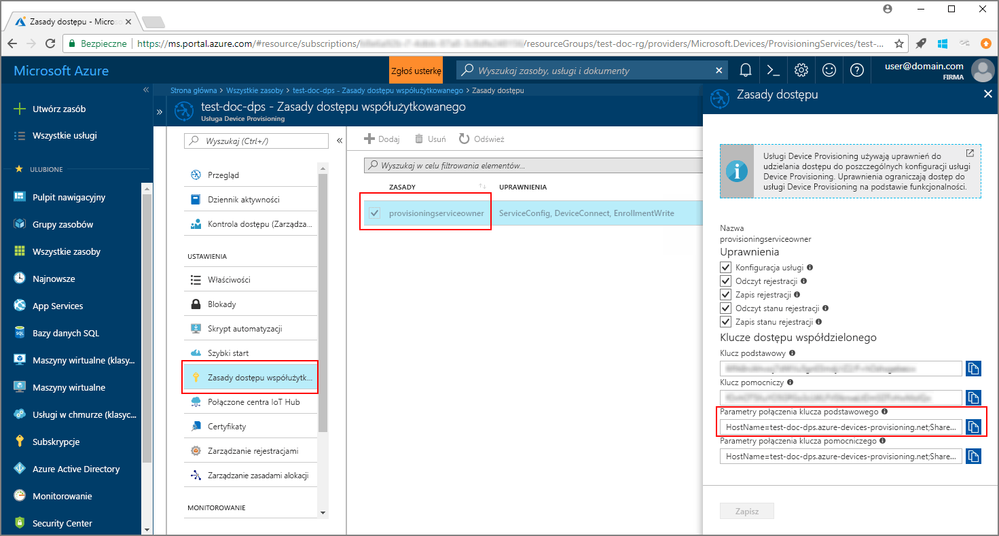
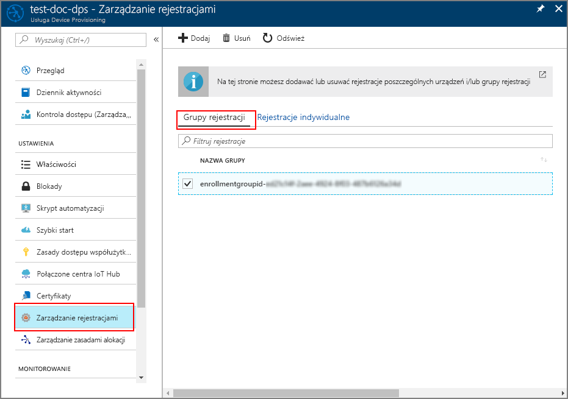

# <a name="enroll-x509-devices-to-iot-hub-device-provisioning-service-using-java-service-sdk"></a>Rejestrowanie urządzenia X.509 w usłudze IoT Hub Device Provisioning przy użyciu zestawu SDK usługi Java

[!INCLUDE [iot-dps-selector-quick-enroll-device-x509](../../includes/iot-dps-selector-quick-enroll-device-x509.md)]

Znajdują się tu instrukcje programowego rejestrowania grupy symulowanych urządzeń X.509 w usłudze Azure IoT Hub Device Provisioning przy użyciu [zestawu SDK usługi Java](https://azure.github.io/azure-iot-sdk-java/service/) za pomocą przykładowej aplikacji Java. Mimo że zestaw SDK usługi Java działa zarówno na komputerach z systemami Windows, jak i Linux, w tym artykule w celu zaprezentowania procesu rejestracji użyto komputera deweloperskiego z systemem Windows.

Pamiętaj, aby wcześniej [skonfigurować usługę IoT Hub Device Provisioning za pomocą witryny Azure Portal](./quick-setup-auto-provision.md).

<a id="setupdevbox"></a>

## <a name="prepare-the-development-environment"></a>Przygotowywanie środowiska deweloperskiego 

1. Upewnij się, że na maszynie zainstalowano środowisko [Java SE Development Kit 8](http://www.oracle.com/technetwork/java/javase/downloads/jdk8-downloads-2133151.html). 

2. Skonfiguruj zmienne środowiskowe instalacji języka Java. Zmienna `PATH` powinna zawierać pełną ścieżkę do katalogu *jdk1.8.x\bin*. Jeśli jest to pierwsza instalacja języka Java na komputerze, utwórz nową zmienną środowiskową o nazwie `JAVA_HOME` i ustaw ją na pełną ścieżkę do katalogu *jdk1.8.x*. Na komputerze z systemem Windows ten katalog znajduje się zwykle w folderze *C:\\Program Files\\Java\\*, a zmienne środowiskowe można tworzyć lub edytować po wyszukaniu frazy **Edytuj zmienne środowiskowe systemu** w **Panelu sterowania** komputera z systemem Windows. 

  Aby sprawdzić poprawność skonfigurowania języka Java na komputerze, możesz uruchomić następujące polecenie w oknie polecenia:

    ```cmd\sh
    java -version
    ```

3. Pobierz pakiet [Maven 3](https://maven.apache.org/download.cgi) i wyodrębnij go na swoim komputerze. 

4. Zmodyfikuj zmienną środowiskową `PATH`, aby wskazywała na folder *apache-maven-3.x.x\\bin* znajdujący się w folderze, do którego wyodrębniono pakiet Maven. Poprawność zainstalowania pakietu Maven można potwierdzić, uruchamiając to polecenie w oknie polecenia:

    ```cmd\sh
    mvn --version
    ```

5. Upewnij się, że na swojej maszynie masz zainstalowane oprogramowanie [git](https://git-scm.com/download/) i że jest ono dodane do zmiennej środowiskowej `PATH`. 


<a id="javasample"></a>

## <a name="download-and-modify-the-java-sample-code"></a>Pobieranie i modyfikowanie przykładowego kodu Java

W tej sekcji przedstawiono sposób dodawania szczegółów aprowizacji urządzenia X.509 do przykładowego kodu. 

1. Otwórz wiersz polecenia. Sklonuj repozytorium GitHub na potrzeby przykładowego kodu rejestracji urządzenia przy użyciu zestawu SDK usługi Java:
    
    ```cmd\sh
    git clone https://github.com/Azure/azure-iot-sdk-java.git --recursive
    ```

2. W pobranym kodzie źródłowym przejdź do folderu przykładu **_azure-iot-sdk-java/provisioning/provisioning-samples/service-enrollment-group-sample_**. Otwórz plik **_/src/main/java/samples/com/microsoft/azure/sdk/iot/ServiceEnrollmentGroupSample.java_** w dowolnym edytorze i dodaj następujące szczegółowe informacje:

    1. Dodaj ciąg `[Provisioning Connection String]` dla usługi aprowizacji z portalu, jako pokazano poniżej:
        1. Przejdź do usługi aprowizacji w witrynie [Azure Portal](https://portal.azure.com). 
        2. Otwórz **Zasady dostępu współużytkowanego** i wybierz zasadę, która ma uprawnienie *EnrollmentWrite*.
        3. Skopiuj **Parametry połączenia klucza podstawowego**. 

              

        4. W przykładowym pliku kodu **_ServiceEnrollmentGroupSample.java_** zastąp ciąg `[Provisioning Connection String]` **parametrami połączenia klucza podstawowego**.

            ```Java
            private static final String PROVISIONING_CONNECTION_STRING = "[Provisioning Connection String]";
            ```

    2. Dodaj certyfikat główny dla grupy urządzeń. Jeśli potrzebujesz przykładowego certyfikatu głównego, użyj narzędzia _Generator certyfikatów X.509_ w następujący sposób:
        1. W oknie polecenia przejdź do folderu **_azure-iot-sdk-java/provisioning/provisioning-tools/provisioning-x509-cert-generator_**.
        2. Skompiluj narzędzie, uruchamiając następujące polecenie:

                ```cmd\sh
                mvn clean install
                ```

        4. Uruchom narzędzie przy użyciu następujących poleceń:

                ```cmd\sh
                cd target
                java -jar ./provisioning-x509-cert-generator-{version}-with-deps.jar
                ```

        5. Po wyświetleniu monitu można opcjonalnie wprowadzić _nazwę pospolitą_ dla certyfikatów.
        6. To narzędzie generuje lokalnie **Certyfikat klienta**, **Klucz prywatny certyfikatu klienta** oraz **Certyfikat główny**.
        7. Skopiuj **Certyfikat główny** razem z wierszami **_-----BEGIN CERTIFICATE-----_** i **_-----END CERTIFICATE-----_**. 
        8. Przypisz wartość **certyfikatu głównego** do parametru **PUBLIC_KEY_CERTIFICATE_STRING** w sposób przedstawiony poniżej:

                ```Java
                private static final String PUBLIC_KEY_CERTIFICATE_STRING =
                        "-----BEGIN CERTIFICATE-----\n" +
                        "XXXXXXXXXXXXXXXXXXXXXXXXXXXXXXXXXXXXXXXXXXXXXXXXXXXXXXXXXXXXXXXX\n" +
                        "XXXXXXXXXXXXXXXXXXXXXXXXXXXXXXXXXXXXXXXXXXXXXXXXXXXXXXXXXXXXXXXX\n" +
                        "XXXXXXXXXXXXXXXXXXXXXXXXXXXXXXXXXXXXXXXXXXXXXXXXXXXXXXXXXXXXXXXX\n" +
                        "XXXXXXXXXXXXXXXXXXXXXXXXXXXXXXXXXXXXXXXXXXXXXXXXXXXXXXXXXXXXXXXX\n" +
                        "XXXXXXXXXXXXXXXXXXXXXXXXXXXXXXXXXXXXXXXXXXXXXXXXXXXXXXXXXXXXXXXX\n" +
                        "XXXXXXXXXXXXXXXXXXXXXXXXXXXXXXXXXXXXXXXXXXXXXXXXXXXXXXXXXXXXXXXX\n" +
                        "XXXXXXXXXXXXXXXXXXXXXXXXXXXXXXXXXXXXXXXXXXXXXXXXXXXXXXXXXXXXXXXX\n" +
                        "XXXXXXXXXXXXXXXXXXXXXXXXXXXXXXXXXXXXXXXXXXXXXXXXXXXXXXXXXXXXXXXX\n" +
                        "XXXXXXXXXXXXXXXXXXXXXXXXXXXXXXXXXXXXXXXXXXXXXXXXXXXXXXXXXXXXXXXX\n" +
                        "XXXXXXXXXXXXXXXXXXXXXXXXXXXXXXXXXXXXXXXXXXXXXXXXXXXXXXXXXXXXXXXX\n" +
                        "-----END CERTIFICATE-----\n";
                ```

        9. Zamknij okno polecenia lub wprowadź **n** po wyświetleniu monitu o *kod weryfikacyjny*. 
 
    3. Opcjonalnie możesz skonfigurować usługę aprowizacji za pośrednictwem przykładowego kodu:
        - Aby dodać tę konfigurację do przykładu, wykonaj następujące kroki:
            1. Przejdź do centrum IoT połączonego z usługą aprowizacji w witrynie [Azure Portal](https://portal.azure.com). Otwórz kartę **Przegląd** centrum i skopiuj wartość pola **Nazwa hosta**. Przypisz tę **nazwę hosta** do parametru *IOTHUB_HOST_NAME*.

                ```Java
                private static final String IOTHUB_HOST_NAME = "[Host name].azure-devices.net";
                ```
            2. Przypisz przyjazną nazwę do parametru *DEVICE_ID* i zachowaj dla parametru *PROVISIONING_STATUS* wartość domyślną *ENABLED*. 

        - LUB, jeśli nie chcesz konfigurować usługi aprowizacji, oznacz jako komentarze bądź usuń następujące instrukcje w pliku _ServiceEnrollmentGroupSample.java_:

            ```Java
            enrollmentGroup.setIotHubHostName(IOTHUB_HOST_NAME);                // Optional parameter.
            enrollmentGroup.setProvisioningStatus(ProvisioningStatus.ENABLED);  // Optional parameter.
            ```

    4. Przejrzyj przykładowy kod. Tworzy on, aktualizuje i usuwa rejestrację grupową urządzeń X.509 oraz tworzy do niej zapytanie. Aby sprawdzić poprawność rejestracji w portalu, tymczasowo oznacz jako komentarz następujące wiersze kodu na końcu pliku _ServiceEnrollmentGroupSample.java_:

        ```Java
        // ************************************** Delete info of enrollmentGroup ***************************************
        System.out.println("\nDelete the enrollmentGroup...");
        provisioningServiceClient.deleteEnrollmentGroup(enrollmentGroupId);
        ```

    5. Zapisz plik _ServiceEnrollmentGroupSample.java_. 
 

<a id="runjavasample"></a>

## <a name="build-and-run-sample-group-enrollment"></a>Kompilowanie i uruchamianie przykładowej rejestracji grupowej

1. Otwórz okno polecenia i przejdź do folderu **_azure-iot-sdk-java/provisioning/provisioning-samples/service-enrollment-group-sample_**.

2. Skompiluj przykładowy kod za pomocą tego polecenia:

    ```cmd\sh
    mvn install -DskipTests
    ```

   To polecenie pobiera pakiet Maven [`com.microsoft.azure.sdk.iot.provisioning.service`](https://www.mvnrepository.com/artifact/com.microsoft.azure.sdk.iot.provisioning/provisioning-service-client) na komputer. Ten pakiet zawiera pliki binarne zestawu SDK usługi Java wymagane przez przykładowy kod na potrzeby kompilacji. W przypadku uruchomienia narzędzia _Generator certyfikatów X.509_ w poprzedniej sekcji ten pakiet będzie już pobrany na Twoim komputerze. 

3. Uruchom przykładowy kod przy użyciu tych poleceń w oknie polecenia:

    ```cmd\sh
    cd target
    java -jar ./service-enrollment-group-sample-{version}-with-deps.jar
    ```

4. Sprawdź poprawność rejestracji w oknie danych wyjściowych.

5. Przejdź do usługi aprowizacji w witrynie Azure Portal. Kliknij pozycję **Zarządzanie rejestracjami**. Zauważ, że grupa urządzeń X.509 jest wyświetlana na karcie **Grupy rejestracji** z automatycznie wygenerowaną *NAZWĄ GRUPY*. 

      

## <a name="modifications-to-enroll-a-single-x509-device"></a>Modyfikacje wymagane w celu zarejestrowania pojedynczego urządzenia X.509

Aby zarejestrować pojedyncze urządzenie X.509, zmodyfikuj kod przykładowy *rejestracji indywidualnej* używany w sekcji [Rejestrowanie urządzenia TPM w usłudze IoT Hub Device Provisioning przy użyciu zestawu SDK usługi Java](quick-enroll-device-tpm-java.md#javasample) w następujący sposób:

1. Skopiuj *nazwę pospolitą* certyfikatu klienta X.509 do schowka. Jeśli chcesz użyć narzędzia _Generator certyfikatów X.509_ jak pokazano w [poprzedzającej sekcji z przykładowym kodem](#javasample), wprowadź _nazwę pospolitą_ certyfikatu lub użyj identyfikatora domyślnego **microsoftriotcore**. Użyj tej **nazwy pospolitej** jako wartości zmiennej *REGISTRATION_ID*. 

    ```Java
    // Use common name of your X.509 client certificate
    private static final String REGISTRATION_ID = "[RegistrationId]";
    ```

2. Zmień nazwę zmiennej *TPM_ENDORSEMENT_KEY* na *PUBLIC_KEY_CERTIFICATE_STRING*. Skopiuj certyfikat klienta lub wartość z obszaru **Certyfikat klienta** z danych wyjściowych narzędzia _Generator certyfikatów X.509_ jako wartość zmiennej *PUBLIC_KEY_CERTIFICATE_STRING*. 

    ```Java
    // Rename the variable *TPM_ENDORSEMENT_KEY* as *PUBLIC_KEY_CERTIFICATE_STRING*
    private static final String PUBLIC_KEY_CERTIFICATE_STRING =
            "-----BEGIN CERTIFICATE-----\n" +
            "XXXXXXXXXXXXXXXXXXXXXXXXXXXXXXXXXXXXXXXXXXXXXXXXXXXXXXXXXXXXXXXX\n" +
            "XXXXXXXXXXXXXXXXXXXXXXXXXXXXXXXXXXXXXXXXXXXXXXXXXXXXXXXXXXXXXXXX\n" +
            "XXXXXXXXXXXXXXXXXXXXXXXXXXXXXXXXXXXXXXXXXXXXXXXXXXXXXXXXXXXXXXXX\n" +
            "XXXXXXXXXXXXXXXXXXXXXXXXXXXXXXXXXXXXXXXXXXXXXXXXXXXXXXXXXXXXXXXX\n" +
            "XXXXXXXXXXXXXXXXXXXXXXXXXXXXXXXXXXXXXXXXXXXXXXXXXXXXXXXXXXXXXXXX\n" +
            "XXXXXXXXXXXXXXXXXXXXXXXXXXXXXXXXXXXXXXXXXXXXXXXXXXXXXXXXXXXXXXXX\n" +
            "XXXXXXXXXXXXXXXXXXXXXXXXXXXXXXXXXXXXXXXXXXXXXXXXXXXXXXXXXXXXXXXX\n" +
            "XXXXXXXXXXXXXXXXXXXXXXXXXXXXXXXXXXXXXXXXXXXXXXXXXXXXXXXXXXXXXXXX\n" +
            "XXXXXXXXXXXXXXXXXXXXXXXXXXXXXXXXXXXXXXXXXXXXXXXXXXXXXXXXXXXXXXXX\n" +
            "XXXXXXXXXXXXXXXXXXXXXXXXXXXXXXXXXXXXXXXXXXXXXXXXXXXXXXXXXXXXXXXX\n" +
            "-----END CERTIFICATE-----\n";
    ```
3. W funkcji **main** zastąp wiersz `Attestation attestation = new TpmAttestation(TPM_ENDORSEMENT_KEY);` następującym ciągiem, aby użyć certyfikatu klienta X.509:
    ```Java
    Attestation attestation = X509Attestation.createFromClientCertificates(PUBLIC_KEY_CERTIFICATE_STRING);
    ```

4. Zapisz, skompiluj i uruchom przykładowy plik *rejestracji indywidualnej*, korzystając z procedury z sekcji [Kompilowanie i uruchamianie przykładowego kodu na potrzeby rejestracji indywidualnej](quick-enroll-device-tpm-java.md#runjavasample).


## <a name="clean-up-resources"></a>Oczyszczanie zasobów
Jeśli planujesz eksplorować przykładową usługę Java, nie usuwaj zasobów utworzonych w tym przewodniku Szybki start. Jeśli nie planujesz kontynuować pracy, wykonaj poniższe kroki, aby usunąć wszystkie zasoby utworzone w ramach tego przewodnika Szybki start.

1. Zamknij okno danych wyjściowych przykładowej usługi Java na swojej maszynie.
1. Zamknij okno _Generator certyfikatów X509_ na swojej maszynie.
1. Przejdź do usługi Device Provisioning w witrynie Azure Portal, kliknij pozycję **Zarządzanie rejestracjami**, a następnie wybierz kartę **Grupy rejestracji**. Wybierz *NAZWĘ GRUPY* urządzeń X.509 zarejestrowanych w ramach tego przewodnika Szybki start i kliknij przycisk **Usuń** u góry bloku.  

## <a name="next-steps"></a>Następne kroki
W tym przewodniku Szybki start zarejestrowano symulowaną grupę urządzeń X.509 w usłudze Device Provisioning. Aby uzyskać dokładne informacje na temat aprowizowania urządzeń, przejdź do samouczka poświęconego konfiguracji usługi Device Provisioning Service w witrynie Azure portal. 

> [!div class="nextstepaction"]
> [Samouczki dla usługi Azure IoT Hub Device Provisioning Service](./tutorial-set-up-cloud.md)
