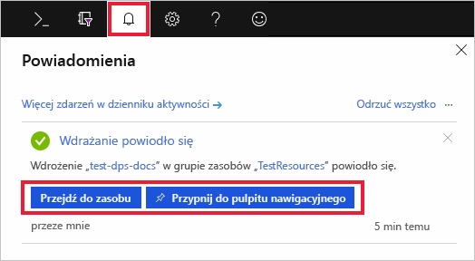

# Konfigurowanie usługi IoT Hub Device Provisioning (wersja zapoznawcza) w witrynie Azure Portal

W tych krokach pokazano, jak w portalu skonfigurować zasoby platformy Azure w chmurze na potrzeby aprowizowania posiadanych urządzeń. Ten artykuł zawiera instrukcje tworzenia centrum IoT Hub, tworzenia nowego wystąpienia usługi IoT Hub Device Provisioning Service oraz łączenia obu usług ze sobą. 

Jeśli nie masz subskrypcji platformy Azure, przed rozpoczęciem utwórz [bezpłatne konto](https://azure.microsoft.com/free/?WT.mc_id=A261C142F).

## Tworzenie centrum IoT Hub

[!INCLUDE [iot-hub-include-create-hub](../../includes/iot-hub-include-create-hub.md)]

## Tworzenie nowego wystąpienia dla usługi IoT Hub Device Provisioning Service

1. Kliknij przycisk **Utwórz zasób** (+) znajdujący się w lewym górnym rogu witryny Azure Portal.

2. *Wyszukaj w witrynie Marketplace* **usługę Device Provisioning Service**. Wybierz pozycję **Usługa IoT Hub Device Provisioning** i kliknij przycisk **Utwórz**. 

3. Podaj następujące informacje dotyczące nowego wystąpienia usługi Device Provisioning Service, a następnie kliknij pozycję **Utwórz**.

    * **Nazwa:** podaj unikatową nazwę nowego wystąpienia usługi Device Provisioning Service. Jeśli wprowadzona nazwa jest dostępna, zostanie wyświetlony zielony znacznik wyboru.
    * **Subskrypcja:** wybierz subskrypcję, która ma zostać użyta do utworzenia tego wystąpienia usługi Device Provisioning Service.
    * **Grupa zasobów:** w tym polu możesz utworzyć nową grupę zasobów lub wybrać istniejącą grupę, w której ma znajdować się nowe wystąpienie. Wybierz tę grupę zasobów, w której znajduje się utworzone wcześniej centrum IoT Hub, na przykład **TestResources**. Dzięki umieszczeniu wszystkich powiązanych zasobów w jednej grupie można nimi zarządzać jednocześnie. Na przykład usunięcie grupy zasobów powoduje usunięcie wszystkich zasobów w tej grupie. Więcej informacji można znaleźć w temacie [Używanie grup zasobów do zarządzania zasobami platformy Azure](../azure-resource-manager/resource-group-portal.md).
    * **Lokalizacja:** wybierz lokalizację znajdującą się najbliżej Twoich urządzeń.

        

4. Kliknij przycisk powiadomienia, aby monitorować proces tworzenia wystąpienia zasobu. Po pomyślnym wdrożeniu usługi kliknij pozycję **Przypnij do pulpitu nawigacyjnego**, a następnie kliknij pozycję **Przejdź do zasobu**.

    

## Połącz centrum IoT ze swoją usługą Device Provisioning Service

W tej sekcji dodasz konfigurację wystąpienia usługi Device Provisioning Service. Ta konfiguracja określa centrum IoT Hub, dla którego będą aprowizowane urządzenia.

1. Kliknij przycisk **Wszystkie zasoby** w menu po lewej stronie witryny Azure Portal. Wybierz wystąpienie usługi Device Provisioning Service utworzone we wcześniejszej sekcji.  

2. W bloku podsumowania usługi Device Provisioning Service wybierz pozycję **Połączone centra IoT**. Kliknij przycisk **+ Dodaj** widoczny u góry. 

3. Na stronie **Dodawanie linku do centrum IoT Hub** wprowadź następujące informacje, aby połączyć nowe wystąpienie usługi Device Provisioning Service z centrum IoT Hub. Następnie kliknij przycisk **Zapisz**. 

    * **Subskrypcja:** wybierz subskrypcję zawierającą centrum IoT Hub, które chcesz połączyć z nowym wystąpieniem usługi Device Provisioning Service.
    * **Centrum IoT Hub:** wybierz centrum IoT Hub, które chcesz połączyć z nowym wystąpieniem usługi Device Provisioning Service.
    * **Zasady dostępu:** wybierz **iothubowner** jako poświadczenia do nawiązania połączenia z centrum IoT Hub.  

        

3. Teraz wybrane centrum powinno być widoczne w bloku **Powiązane centra IoT**. Aby wyświetlić blok **Połączone centra IoT Hub**, może być konieczne kliknięcie przycisku **Odśwież**.

## Oczyszczanie zasobów

Inne przewodniki Szybki start w tej kolekcji bazują na tym przewodniku. Jeśli planujesz kontynuować pracę z kolejnymi przewodnikami Szybki start lub samouczkami, nie usuwaj zasobów utworzonych w tym przewodniku Szybki start. Jeśli nie planujesz kontynuować pracy, wykonaj następujące kroki, aby usunąć wszystkie zasoby utworzone w witrynie Azure Portal w ramach tego przewodnika Szybki start.

1. W witrynie Azure Portal w menu po lewej stronie kliknij pozycję **Wszystkie zasoby**, a następnie wybierz swoją usługę Device Provisioning Service. U góry bloku **Wszystkie zasoby** kliknij pozycję **Usuń**.  
2. W witrynie Azure Portal w menu po lewej stronie kliknij pozycję **Wszystkie zasoby**, a następnie wybierz swoje centrum IoT. U góry bloku **Wszystkie zasoby** kliknij pozycję **Usuń**.  

## Następne kroki

W tym przewodniku Szybki start zostały wdrożone centrum IoT i wystąpienie usługi Device Provisioning Service, po czym te dwa zasoby zostały połączone ze sobą. Aby dowiedzieć się, jak za pomocą tej konfiguracji zaaprowizować symulowane urządzenie, przejdź do przewodnika Szybki start omawiającego tworzenie symulowanego urządzenia.

> [!div class="nextstepaction"]
> [Przewodnik Szybki start z tworzeniem symulowanego urządzenia](./quick-create-simulated-device.md)
