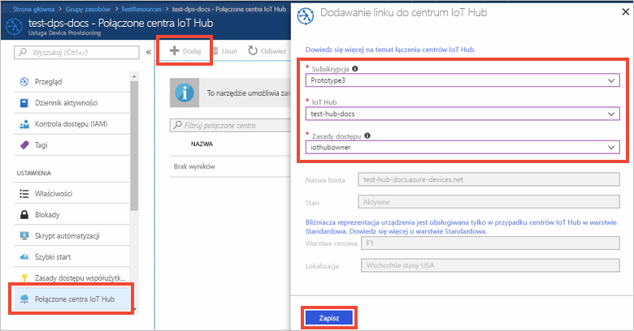

# Quickstart: Set up the IoT Hub Device Provisioning Service with the Azure portal

W tych krokach pokazano, jak w portalu skonfigurować zasoby platformy Azure w chmurze na potrzeby aprowizowania posiadanych urządzeń. Ten artykuł zawiera instrukcje tworzenia centrum IoT Hub, tworzenia nowego wystąpienia usługi IoT Hub Device Provisioning Service oraz łączenia obu usług ze sobą. 

Jeśli nie masz subskrypcji platformy Azure, przed rozpoczęciem utwórz [bezpłatne konto](https://azure.microsoft.com/free/?WT.mc_id=A261C142F).

## Tworzenie centrum IoT Hub

[!INCLUDE [iot-hub-include-create-hub](../../includes/iot-hub-include-create-hub.md)]

## Tworzenie nowego wystąpienia dla usługi IoT Hub Device Provisioning Service

1. Select the **+ Create a resource** button again.

2. *Search the Marketplace* for the **Device Provisioning Service**. Select **IoT Hub Device Provisioning Service** and hit the **Create** button. 

3. Provide the following information for your new Device Provisioning Service instance and hit **Create**.

    * **Nazwa:** podaj unikatową nazwę nowego wystąpienia usługi Device Provisioning Service. Jeśli wprowadzona nazwa jest dostępna, zostanie wyświetlony zielony znacznik wyboru.
    * **Subskrypcja**: wybierz subskrypcję, która ma zostać użyta do utworzenia tego wystąpienia usługi Device Provisioning Service.
    * **Grupa zasobów:** w tym polu możesz utworzyć nową grupę zasobów lub wybrać istniejącą grupę, w której ma znajdować się nowe wystąpienie. Wybierz tę grupę zasobów, w której znajduje się utworzone wcześniej centrum IoT Hub, na przykład **TestResources**. Dzięki umieszczeniu wszystkich powiązanych zasobów w jednej grupie można nimi zarządzać jednocześnie. Na przykład usunięcie grupy zasobów powoduje usunięcie wszystkich zasobów w tej grupie. Aby uzyskać więcej informacji, zobacz [Zarządzanie grupami zasobów usługi Azure Resource Manager](../azure-resource-manager/manage-resource-groups-portal.md).
    * **Lokalizacja**: wybierz lokalizację znajdującą się najbliżej Twoich urządzeń.

        

4. Select the notification button to monitor the creation of the resource instance. Once the service is successfully deployed, select **Pin to dashboard**, and then **Go to resource**.

    

## Link the IoT hub and your Device Provisioning Service

In this section, you will add a configuration to the Device Provisioning Service instance. Ta konfiguracja określa centrum IoT Hub, dla którego będą aprowizowane urządzenia.

1. Select the **All resources** button from the left-hand menu of the Azure portal. Wybierz wystąpienie usługi Device Provisioning Service utworzone we wcześniejszej sekcji.  

2. From the Device Provisioning Service's menu, select **Linked IoT hubs**. Hit the **+ Add** button seen at the top. 

3. Na stronie **Dodawanie linku do centrum IoT Hub** wprowadź następujące informacje, aby połączyć nowe wystąpienie usługi Device Provisioning Service z centrum IoT Hub. Then hit **Save**. 

    * **Subskrypcja:** wybierz subskrypcję zawierającą centrum IoT Hub, które chcesz połączyć z nowym wystąpieniem usługi Device Provisioning Service.
    * **Centrum IoT Hub:** wybierz centrum IoT Hub, które chcesz połączyć z nowym wystąpieniem usługi Device Provisioning Service.
    * **Zasady dostępu:** wybierz **iothubowner** jako poświadczenia do nawiązania połączenia z centrum IoT Hub.  

        

3. Teraz wybrane centrum powinno być widoczne w bloku **Powiązane centra IoT**. You might need to hit **Refresh** for it to show up.

## Oczyszczanie zasobów

Inne przewodniki Szybki start w tej kolekcji bazują na tym przewodniku. Jeśli planujesz kontynuować pracę z kolejnymi przewodnikami Szybki start lub samouczkami, nie usuwaj zasobów utworzonych w tym przewodniku Szybki start. Jeśli nie planujesz kontynuować pracy, wykonaj następujące czynności, aby usunąć wszystkie zasoby utworzone w witrynie Azure Portal w ramach tego przewodnika Szybki start.

1. From the left-hand menu in the Azure portal, select **All resources** and then select your Device Provisioning Service. At the top of the device detail pane, select **Delete**.  
2. From the left-hand menu in the Azure portal, select **All resources** and then select your IoT hub. At the top of the hub detail pane, select **Delete**.  

## Następne kroki

In this quickstart, you’ve deployed an IoT hub and a Device Provisioning Service instance, and linked the two resources. To learn how to use this setup to provision a simulated device, continue to the quickstart for creating a simulated device.

> [!div class="nextstepaction"]
> [Quickstart to create a simulated device](./quick-create-simulated-device.md)
