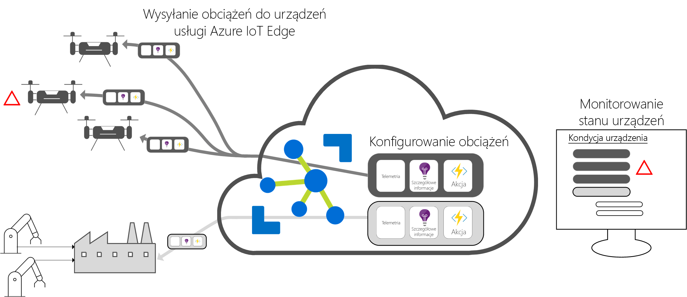

# Co to jest usługa Azure IoT Edge

Usługa IoT Edge przenosi analizę w chmurze i niestandardową logikę biznesową na urządzenia, aby Twoja organizacja mogła skoncentrować się na szczegółowych informacjach dotyczących działalności zamiast na zarządzaniu danymi. Skonfiguruj oprogramowanie IoT, wdrażając je na urządzeniach za pomocą standardowych kontenerów i monitorując wszystko z poziomu chmury.

>[!NOTE]
>Usługa Azure IoT Edge jest dostępna w warstwie Bezpłatna oraz Standardowa usługi IoT Hub. Warstwa Bezpłatna służy wyłącznie do testowania i oceny. Aby uzyskać więcej informacji na temat warstw Podstawowa i Standardowa, zobacz [Jak wybrać właściwą warstwę usługi IoT Hub](../iot-hub/iot-hub-scaling.md).

Dzięki analizie wzrasta wartość biznesowa w rozwiązaniach IoT, ale nie wszystkie operacje analizy muszą być wykonywane w chmurze. Aby urządzenie reagowało na sytuacje awaryjne tak szybko, jak to możliwe, możesz przeprowadzać wykrywanie anomalii na samym urządzeniu. Podobnie jeśli chcesz obniżyć koszty przepustowości i uniknąć przesyłania terabajtów danych pierwotnych, czyszczenie i agregację danych możesz przeprowadzać lokalnie. Następnie możesz wysłać szczegółowe informacje do chmury na potrzeby analizy. 

Usługa Azure IoT Edge obejmuje trzy składniki:
* Moduły usługi IoT Edge to kontenery, które uruchamiają usługi platformy Azure, usługi innych firm lub Twój własny kod. Moduły są wdrażane na urządzeniach usługi IoT Edge i wykonywane lokalnie na tych urządzeniach. 
* Środowisko uruchomieniowe usługi IoT Edge działa na każdym urządzeniu usługi IoT Edge i zarządza wdrożonymi na nim modułami. 
* Interfejs chmurowy umożliwia zdalne monitorowanie urządzeń usługi IoT Edge i zarządzanie nimi.

## Moduły usługi IoT Edge

Moduły usługi IoT Edge to jednostki wykonywania, zaimplementowane jako kontenery zgodne z platformą Docker, które uruchamiają logikę biznesową na urządzeniach brzegowych. Wiele modułów można skonfigurować do komunikowania się ze sobą i w ten sposób utworzyć potok przetwarzania danych. Aby zapewnić szczegółowe informacje w trybie offline i na urządzeniach brzegowych, możesz opracować moduły niestandardowe lub spakować niektóre usługi platformy Azure w moduły. 

### Sztuczna inteligencja na urządzeniach brzegowych

Usługa Azure IoT Edge pozwala na wdrożenie kompleksowego przetwarzania zdarzeń, uczenia maszynowego, rozpoznawania obrazów i innych możliwości SI o wysokiej wartości bez samodzielnego ich tworzenia. Wszystkie usługi platformy Azure, takie jak Azure Functions, Azure Stream Analytics i Azure Machine Learning mogą być uruchamiane lokalnie za pomocą usługi Azure IoT Edge. Jednak nie trzeba ograniczać się do usług platformy Azure. Każdy może utworzyć moduły SI i udostępnić je społeczności do użycia za pośrednictwem witryny Azure Marketplace. 

### Model dostarczania własnego kodu

Usługa Azure IoT Edge obsługuje również wdrażanie własnego kodu na urządzeniach. Usługa Azure IoT Edge korzysta z tego samego modelu programowania co inne usługi Azure IoT. Ten sam kod można uruchomić na urządzeniu lub w chmurze. Usługa Azure IoT Edge obsługuje zarówno system Linux, jak i Windows, więc możesz tworzyć kod na wybraną platformę. Obsługiwane języki to Java, .NET Core 2.0, Node.js, C i Python, dzięki czemu deweloperzy mogą tworzyć kod w znanym języku i używać istniejącej logiki biznesowej.

## Środowisko uruchomieniowe usługi IoT Edge

Środowisko uruchomieniowe usługi Azure IoT Edge umożliwia stosowanie logiki niestandardowej i logiki w chmurze na urządzeniach usługi IoT Edge. Działa ono na urządzeniu usługi IoT Edge oraz wykonuje operacje zarządzania i komunikacji. Środowisko uruchomieniowe wykonuje kilka zadań:

* Instaluje i aktualizuje pakiety robocze na urządzeniu.
* Utrzymuje standardy zabezpieczeń usługi Azure IoT Edge na urządzeniu.
* Zapewnia nieprzerwane działanie modułów usługi IoT Edge.
* Przesyła raporty o kondycji modułów do chmury na potrzeby zdalnego monitorowania.
* Zarządza komunikacją między podrzędnymi urządzeniami liścia usługi IoT Edge, między modułami na urządzeniu usługi IoT Edge oraz między urządzeniem usługi IoT Edge a chmurą.

Sposób używania urządzenia usługi Azure IoT Edge zależy od Ciebie. Środowisko uruchomieniowe jest często używane do wdrażania funkcji SI w bramach, które agregują i przetwarzają dane z innych urządzeń lokalnych. Jednak taki model wdrażania to tylko jedna z możliwości. Urządzenia liścia również mogą być urządzeniami usługi Azure IoT Edge, niezależnie od tego, czy są połączone z bramą, czy bezpośrednio z chmurą.

Środowisko uruchomieniowe usługi Azure IoT Edge działa na wielu różnych urządzeniach IoT, aby umożliwić używanie go na wiele różnych sposobów. Obsługuje zarówno system operacyjny Linux, jak i Windows oraz tworzy abstrakcję szczegółów sprzętu. Zastosuj urządzenie mniejsze niż Raspberry Pi 3, jeśli nie przetwarzasz dużych ilości danych, lub użyj serwera przemysłowego, aby uruchamiać obciążenia intensywnie korzystające z zasobów.

## Interfejs chmurowy usługi IoT Edge

Zarządzanie cyklem życia oprogramowania w przypadku urządzeń korporacyjnych jest skomplikowane. Zarządzanie cyklem życia oprogramowania w przypadku milionów heterogenicznych urządzeń IoT jest jeszcze trudniejsze. Obciążenia muszą być tworzone i konfigurowane dla konkretnego typu urządzenia, wdrażane na dużą skalę na milionach urządzeń w Twoim rozwiązaniu i monitorowane, aby wyłapywać nieprawidłowo funkcjonujące urządzenia. Tych działań nie można wykonywać dla poszczególnych urządzeń. Muszą być wykonywane na dużą skalę.

Usługa Azure IoT Edge bezproblemowo integruje się z akceleratorami rozwiązań Azure IoT w celu zapewnienia jednej warstwy kontroli na potrzeby rozwiązania. Usługi w chmurze umożliwiają:

* Tworzenie i konfigurowanie obciążeń do uruchamiania na określonym typie urządzenia.
* Wysyłanie obciążeń do zestawu urządzeń.
* Monitorowanie obciążeń działających na urządzeniach w terenie.

## Następne kroki

Wypróbuj te koncepcje w praktyce, [wdrażając usługę IoT Edge na symulowanym urządzeniu](quickstart.md).