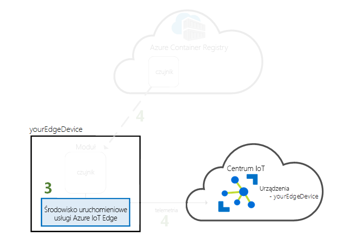
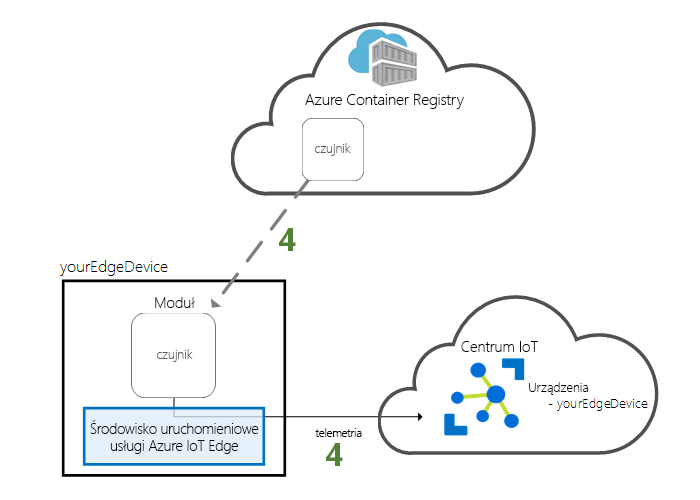

# <a name="quickstart-deploy-your-first-iot-edge-module-from-the-azure-portal-to-a-windows-device---preview"></a>Szybki start: wdrażanie pierwszego modułu IoT Edge z witryny Azure Portal do urządzenia z systemem Windows — wersja zapoznawcza

W tym przewodniku Szybki start użyjesz interfejsu chmury usługi Azure IoT Edge do zdalnego wdrożenia wstępnie utworzonego kodu na urządzeniu z usługą IoT Edge. Aby wykonać to zadanie, użyj najpierw urządzenia z systemem Windows do symulacji urządzenia usługi IoT Edge, co pozwoli wdrożyć na nim moduł.

W tym przewodniku Szybki start zawarto informacje na temat wykonywania następujących czynności:

1. Tworzenie centrum IoT Hub.
2. Rejestrowanie urządzenia usługi IoT Edge w centrum IoT Hub.
3. Instalowanie i uruchamianie środowiska uruchomieniowego usługi IoT Edge na urządzeniu.
4. Zdalne wdrażanie modułu na urządzeniu usługi IoT Edge i wysyłanie telemetrii do usługi IoT Hub.


Moduł wdrażany podczas pracy z tym przewodnikiem Szybki start to symulowany czujnik generujący dane dotyczące temperatury, wilgotności i ciśnienia. Z wykonanej tutaj pracy będziesz korzystać w pozostałych samouczkach usługi Azure IoT Edge, wdrażając moduły do analizy symulowanych danych na potrzeby biznesowe.

>[!NOTE]
>Środowisko uruchomieniowe usługi IoT Edge w systemie Windows jest dostępne w [publicznej wersji zapoznawczej](https://azure.microsoft.com/support/legal/preview-supplemental-terms/).

Jeśli nie masz aktywnej subskrypcji platformy Azure, przed rozpoczęciem utwórz [bezpłatne konto](https://azure.microsoft.com/free).

[!INCLUDE [cloud-shell-try-it.md](../../includes/cloud-shell-try-it.md)]

Podczas wykonywania wielu kroków tego przewodnika Szybki start jest używany interfejs wiersza polecenia platformy Azure, a usługa Azure IoT ma rozszerzenie umożliwiające włączenie dodatkowych funkcji.

Dodaj rozszerzenie usługi Azure IoT do wystąpienia usługi Cloud Shell.

   ```azurecli-interactive
   az extension add --name azure-cli-iot-ext
   ```

## <a name="prerequisites"></a>Wymagania wstępne

Zasoby w chmurze:

* Grupa zasobów do zarządzania wszystkimi zasobami używanymi w tym przewodniku Szybki start.

   ```azurecli-interactive
   az group create --name IoTEdgeResources --location westus
   ```

Urządzenie usługi IoT Edge:

* Komputer lub maszyna wirtualna z systemem Windows, która będzie działać jako urządzenie usługi IoT Edge. Użyj obsługiwanej wersji systemu Windows:
  * Windows 10 lub nowszy
  * Windows Server 2016 lub nowszy
* Jeśli jest to komputer z systemem Windows, upewnij się, że spełnia on [wymagania systemowe](https://docs.microsoft.com/virtualization/hyper-v-on-windows/reference/hyper-v-requirements) funkcji Hyper-V.
* Jeśli jest to maszyna wirtualna, włącz [zagnieżdżoną wirtualizację](https://docs.microsoft.com/virtualization/hyper-v-on-windows/user-guide/nested-virtualization) i przydziel co najmniej 2 GB pamięci.
* Zainstaluj aplikację [Docker for Windows](https://docs.docker.com/docker-for-windows/install/) i upewnij się, że jest uruchomiona.

> [!TIP]
> Podczas konfiguracji platformy Docker możesz używać kontenerów systemu Windows lub kontenerów systemu Linux. W tym przewodniku Szybki start opisano sposób konfigurowania środowiska uruchomieniowego usługi IoT Edge do użycia z kontenerami systemu Linux.

## <a name="create-an-iot-hub"></a>Tworzenie centrum IoT Hub

Rozpocznij pracę z przewodnikiem Szybki start, tworząc centrum IoT Hub za pomocą interfejsu wiersza polecenia platformy Azure.


W tym przewodniku Szybki start wystarcza warstwa bezpłatna usługi IoT Hub. Jeśli w przeszłości używano usługi IoT Hub i masz już utworzone bezpłatne centrum, możesz używać tego centrum IoT Hub. Każda subskrypcja może zawierać tylko jedno bezpłatne centrum IoT Hub.

Poniższy kod tworzy bezpłatne centrum **F1** w grupie zasobów **IoTEdgeResources**. Zastąp nazwę *{hub_name}* unikatową nazwą centrum IoT Hub.

   ```azurecli-interactive
   az iot hub create --resource-group IoTEdgeResources --name {hub_name} --sku F1
   ```

   Jeśli wystąpi błąd, ponieważ w subskrypcji jest już jedno bezpłatne centrum, zmień jednostkę SKU na **S1**. Jeśli wystąpi błąd polegający na niedostępności nazwy centrum IoT Hub, oznacza to, że ktoś inny ma już centrum o takiej nazwie. Wypróbuj nową nazwę. 

## <a name="register-an-iot-edge-device"></a>Rejestrowanie urządzenia usługi IoT Edge

Zarejestruj urządzenie usługi IoT Edge, korzystając z nowo utworzonego centrum IoT Hub.


Utwórz tożsamość urządzenia symulowanego, aby umożliwić mu komunikowanie się z centrum IoT Hub. Tożsamość urządzenia jest przechowywana w chmurze. Aby skojarzyć urządzenie fizyczne z tożsamością urządzenia, używane są unikatowe parametry połączenia.

Ponieważ urządzenia usługi IoT Edge zachowują się inaczej niż typowe urządzenia IoT, a także mogą być inaczej zarządzane, zadeklaruj tę tożsamość jako należącą do urządzenia usługi IoT Edge za pomocą flagi `--edge-enabled`. 

1. W powłoce chmury platformy Azure wprowadź poniższe polecenie, aby utworzyć urządzenie o nazwie **myEdgeDevice** w swoim centrum.

   ```azurecli-interactive
   az iot hub device-identity create --device-id myEdgeDevice --hub-name {hub_name} --edge-enabled
   ```

   Jeśli wystąpi błąd dotyczący kluczy zasad iothubowner, upewnij się, że usługa Cloud Shell działa, bazując na najnowszej wersji rozszerzenia azure-cli-iot-ext. 

2. Pobierz parametry połączenia danego urządzenia, które łączy urządzenie fizyczne z tożsamością w usłudze IoT Hub.

   ```azurecli-interactive
   az iot hub device-identity show-connection-string --device-id myEdgeDevice --hub-name {hub_name}
   ```

3. Skopiuj parametry połączenia i zapisz je. Za pomocą tej wartości skonfigurujesz środowisko uruchomieniowe usługi IoT Edge w następnej sekcji.

## <a name="install-and-start-the-iot-edge-runtime"></a>Instalowanie i uruchamianie środowiska uruchomieniowego usługi IoT Edge

Zainstaluj środowisko uruchomieniowe usługi Azure IoT Edge na urządzeniu usługi IoT Edge i skonfiguruj je przy użyciu parametrów połączenia urządzenia.


Środowisko uruchomieniowe usługi IoT Edge jest wdrażane na wszystkich urządzeniach usługi IoT Edge. Składa się ono z trzech składników. **Demon zabezpieczeń usługi IoT Edge** jest uruchamiany przy każdym uruchomieniu urządzenia Edge przez rozpoczęciu działania agenta usługi IoT Edge. Agent usługi **IoT Edge** ułatwia wdrażanie i monitorowanie modułów na urządzeniu usługi IoT Edge, w tym centrum usługi IoT Edge. **Centrum usługi IoT Edge** zarządza komunikacją między modułami na urządzeniu usługi IoT Edge oraz między urządzeniem a usługą IoT Hub.

Podczas instalowania środowiska uruchomieniowego pojawi się prośba o podanie parametrów połączenia urządzenia. Użyj parametrów pobranych za pomocą wiersza polecenia platformy Azure. Za pomocą tych parametrów urządzenie fizyczne jest kojarzone z tożsamością urządzenia usługi IoT Edge na platformie Azure.

Instrukcje w tej sekcji służą do konfigurowania środowiska uruchomieniowego usługi IoT Edge przy użyciu kontenerów systemu Linux. Jeśli chcesz używać kontenerów systemu Windows, zobacz [Install Azure IoT Edge runtime on Windows to use with Windows containers (Instalowanie środowiska uruchomieniowego usługi Azure IoT Edge w systemie Windows do użycia z kontenerami systemu Windows)](how-to-install-iot-edge-windows-with-windows.md).

### <a name="connect-to-your-iot-edge-device"></a>Nawiązywanie połączenia z urządzeniem usługi IoT Edge

Wszystkie kroki opisane w tej sekcji są wykonywane na urządzeniu usługi IoT Edge. Jeśli jako urządzenia usługi IoT Edge używasz swojej własnej maszyny, możesz pominąć tę część. Jeśli używasz maszyny wirtualnej lub dodatkowego sprzętu, należy teraz nawiązać połączenie z tą maszyną. 

### <a name="download-and-install-the-iot-edge-service"></a>Pobieranie i instalowanie usługi IoT Edge

Pobierz i zainstaluj środowisko uruchomieniowe usługi IoT Edge za pomocą programu PowerShell. Do skonfigurowania urządzenia użyj parametrów połączenia urządzenia pobranych z usługi IoT Hub.

1. Na urządzeniu usługi IoT Edge uruchom program PowerShell jako administrator.

2. Pobierz i zainstaluj usługę IoT Edge na swoim urządzeniu.

   ```powershell
   . {Invoke-WebRequest -useb aka.ms/iotedge-win} | Invoke-Expression; `
   Install-SecurityDaemon -Manual -ContainerOs Linux
   ```

3. Po wyświetleniu prośby o podanie wartości **DeviceConnectionString**, wpisz parametry skopiowane w poprzedniej sekcji. Nie dołączaj znaków cudzysłowów otaczających parametry połączenia.

### <a name="view-the-iot-edge-runtime-status"></a>Wyświetlanie stanu środowiska uruchomieniowego usługi IoT Edge

Sprawdź, czy środowisko uruchomieniowe zostało pomyślnie zainstalowane i skonfigurowane.

1. Sprawdź stan usługi IoT Edge.

   ```powershell
   Get-Service iotedge
   ```

2. Jeśli potrzebujesz rozwiązać problem z usługą, pobierz jej dzienniki.

   ```powershell
   # Displays logs from today, newest at the bottom.

   Get-WinEvent -ea SilentlyContinue `
    -FilterHashtable @{ProviderName= "iotedged";
      LogName = "application"; StartTime = [datetime]::Today} |
    select TimeCreated, Message |
    sort-object @{Expression="TimeCreated";Descending=$false} |
    format-table -autosize -wrap
   ```

3. Wyświetl wszystkie moduły uruchomione na urządzeniu usługi IoT Edge. Ponieważ usługa została właśnie uruchomiona po raz pierwszy, tylko moduł **edgeAgent** powinien być widoczny jako uruchomiony. Moduł edgeAgent jest uruchamiany domyślnie i pomaga w instalowaniu i uruchamianiu dodatkowych modułów wdrażanych na urządzeniu.

   ```powershell
   iotedge list
   ```

   

Urządzenie usługi IoT Edge jest teraz skonfigurowane. Jest ono gotowe do uruchamiania modułów wdrożonych w chmurze.

## <a name="deploy-a-module"></a>Wdrażanie modułu

Zarządzając urządzeniem usługi Azure IoT Edge z chmury, wdróż moduł przesyłający dane telemetryczne do centrum IoT Hub.


[!INCLUDE [iot-edge-deploy-module](../../includes/iot-edge-deploy-module.md)]

## <a name="view-generated-data"></a>Wyświetlanie wygenerowanych danych

W tym przewodniku Szybki start utworzono nowe urządzenie usługi IoT Edge i zainstalowano na nim środowisko uruchomieniowe usługi IoT Edge. Następnie użyto witryny Azure Portal do wypchnięcia modułu usługi IoT Edge do uruchomienia na urządzeniu bez konieczności wprowadzenia zmian na samym urządzeniu. W tym przypadku wypchnięty moduł tworzy dane środowiskowe, których można użyć na potrzeby samouczków.

Upewnij się, że moduł wdrożony z chmury jest uruchomiony na urządzeniu usługi IoT Edge.

```powershell
iotedge list
```

   

Wyświetl komunikaty wysyłane z modułu tempSensor do chmury.

```powershell
iotedge logs tempSensor -f
```

  

Możesz również wyświetlić komunikaty odbierane przez centrum IoT przy użyciu [rozszerzenia zestawu narzędzi usługi Azure IoT dla programu Visual Studio Code](https://marketplace.visualstudio.com/items?itemName=vsciot-vscode.azure-iot-toolkit). 

## <a name="clean-up-resources"></a>Oczyszczanie zasobów

Jeśli chcesz przejść do samouczków dotyczących usługi IoT Edge, możesz użyć urządzenia, które zostało zarejestrowane i skonfigurowane w ramach tego przewodnika Szybki start. Jeśli nie, możesz usunąć utworzone zasoby platformy Azure oraz usunąć z urządzenia środowisko uruchomieniowe usługi IoT Edge.

### <a name="delete-azure-resources"></a>Usuwanie zasobów platformy Azure

Jeśli maszyna wirtualna i centrum IoT Hub zostały utworzone w nowej grupie zasobów, możesz usunąć tę grupę i wszystkie powiązane zasoby. Sprawdź dokładnie zawartość grupy zasobów, aby się upewnić, że nie ma w niej żadnych elementów, które chcesz zachować. Jeśli nie chcesz usuwać całej grupy, możesz usunąć poszczególne zasoby.

Usuń grupę **IoTEdgeResources**.

   ```azurecli-interactive
   az group delete --name IoTEdgeResources
   ```

### <a name="remove-the-iot-edge-runtime"></a>Usuwanie środowiska uruchomieniowego usługi IoT Edge

Jeśli planujesz korzystanie z urządzenia usługi IoT Edge na potrzeby przyszłych testów, ale chcesz, aby moduł tempSensor przestał wysyłać dane do centrum IoT Hub, gdy nie jest używane, użyj poniższego polecenia w celu zatrzymania usługi IoT Edge.

   ```powershell
   Stop-Service iotedge -NoWait
   ```

Gdy wszystko będzie gotowe do ponownego rozpoczęcia testowania, możesz ponownie uruchomić usługę

   ```powershell
   Start-Service iotedge
   ```

Jeśli chcesz usunąć instalacje z urządzenia, użyj poniższych poleceń.  

Usuń środowisko uruchomieniowe usługi IoT Edge.

   ```powershell
   . {Invoke-WebRequest -useb aka.ms/iotedge-win} | Invoke-Expression; `
   Uninstall-SecurityDaemon
   ```

Po usunięciu środowiska uruchomieniowego usługi IoT Edge utworzone przez nie kontenery zostaną zatrzymane, ale pozostaną na urządzeniu. Wyświetl wszystkie kontenery.

   ```powershell
   docker ps -a
   ```

Usuń kontenery utworzone na urządzeniu przez środowisko uruchomieniowe usługi IoT Edge. Zmień nazwę kontenera tempSensor, jeśli została użyta inna nazwa.

   ```powershell
   docker rm -f tempSensor
   docker rm -f edgeHub
   docker rm -f edgeAgent
   ```
   
## <a name="next-steps"></a>Następne kroki

W tym przewodniku Szybki start utworzono nowe urządzenie usługi IoT Edge i wdrożono na nim kod przy użyciu interfejsu usługi Azure IoT Edge w chmurze. Masz teraz urządzenie testowe generujące dane pierwotne dotyczące jego otoczenia.

Wszystko jest gotowe, aby kontynuować pracę, korzystając ze wszystkich innych samouczków, i dowiedzieć, jak usługa Azure IoT Edge może ułatwiać przekształcanie tych danych w analizy biznesowe na urządzeniach brzegowych.

> [!div class="nextstepaction"]
> [Filtrowanie danych czujnika przy użyciu funkcji platformy Azure](tutorial-deploy-function.md)
