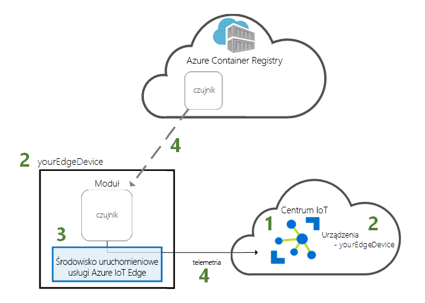
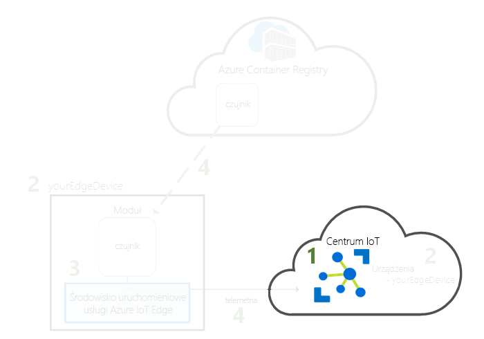
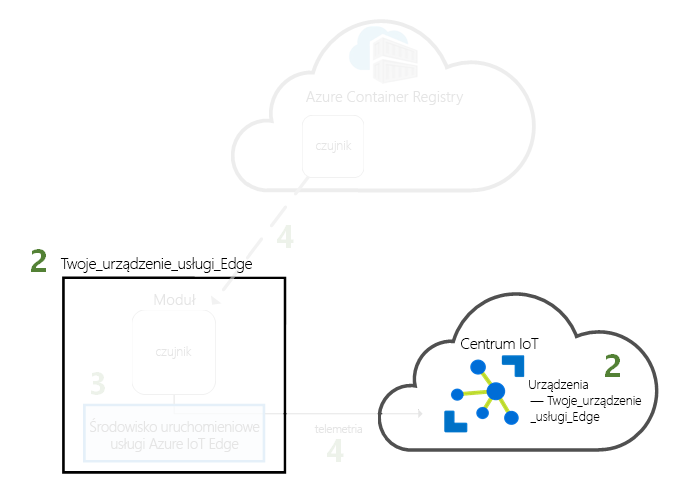

# <a name="quickstart-deploy-your-first-iot-edge-module-from-the-azure-portal-to-a-windows-device---preview"></a>Szybki start: wdrażanie pierwszego modułu IoT Edge z witryny Azure Portal na urządzeniu z systemem Windows — wersja zapoznawcza

W tym przewodniku Szybki start użyjesz interfejsu chmury usługi Azure IoT Edge do zdalnego wdrożenia wstępnie utworzonego kodu na urządzeniu z usługą IoT Edge. Aby wykonać to zadanie, najpierw utworzyć i skonfigurować maszynę wirtualną Windows do działania w formie urządzenia usługi IoT Edge, następnie można wdrożyć modułu do niego.

W tym przewodniku Szybki start zawarto informacje na temat wykonywania następujących czynności:

1. Tworzenie centrum IoT Hub.
2. Rejestrowanie urządzenia usługi IoT Edge w centrum IoT Hub.
3. Instalowanie i uruchamianie środowiska uruchomieniowego usługi IoT Edge na urządzeniu.
4. Zdalne wdrażanie modułu na urządzeniu usługi IoT Edge i wysyłanie telemetrii do usługi IoT Hub.



Moduł wdrażany podczas pracy z tym przewodnikiem Szybki start to symulowany czujnik generujący dane dotyczące temperatury, wilgotności i ciśnienia. Z wykonanej tutaj pracy będziesz korzystać w pozostałych samouczkach usługi Azure IoT Edge, wdrażając moduły do analizy symulowanych danych na potrzeby biznesowe.

> [!NOTE]
> Środowisko uruchomieniowe usługi IoT Edge w systemie Windows jest dostępne w [publicznej wersji zapoznawczej](https://azure.microsoft.com/support/legal/preview-supplemental-terms/).

Jeśli nie masz aktywnej subskrypcji platformy Azure, przed rozpoczęciem utwórz [bezpłatne konto](https://azure.microsoft.com/free).

[!INCLUDE [cloud-shell-try-it.md](../../includes/cloud-shell-try-it.md)]

Podczas wykonywania wielu kroków tego przewodnika Szybki start jest używany interfejs wiersza polecenia platformy Azure, a usługa Azure IoT ma rozszerzenie umożliwiające włączenie dodatkowych funkcji.

Dodaj rozszerzenie usługi Azure IoT do wystąpienia usługi Cloud Shell.

   ```azurecli-interactive
   az extension add --name azure-cli-iot-ext
   ```

## <a name="prerequisites"></a>Wymagania wstępne

Zasoby w chmurze:

* Grupa zasobów do zarządzania wszystkimi zasobami używanymi w tym przewodniku Szybki start.

   ```azurecli-interactive
   az group create --name IoTEdgeResources --location westus2
   ```

Urządzenie usługi IoT Edge:

* Maszyna wirtualna Windows jako urządzenia usługi IoT Edge. Można utworzyć tej maszyny wirtualnej, używając następującego polecenia, zastępując *{password}* z bezpiecznym hasłem:

  ```azurecli-interactive
  az vm create --resource-group IoTEdgeResources --name EdgeVM --image MicrosoftWindowsDesktop:Windows-10:rs5-pro:latest --admin-username azureuser --admin-password {password} --size Standard_DS1_v2
  ```

  Utworzenie i uruchomienie nowej maszyny wirtualnej może zająć kilka minut. Następnie możesz pobrać plik protokołu RDP do użytku podczas nawiązywania połączenia z maszyną wirtualną:

  1. Przejdź do swojej nowej maszyny wirtualnej Windows w witrynie Azure portal.
  1. Wybierz przycisk **Połącz**.
  1. Na **RDP** zaznacz **Pobierz plik RDP**.

  Otwórz ten plik za pomocą połączenia pulpitu zdalnego nawiązać połączenia z programem Windows maszyny wirtualnej przy użyciu nazwy administratora i hasła określony za pomocą `az vm create` polecenia.

## <a name="create-an-iot-hub"></a>Tworzenie centrum IoT Hub

Rozpocznij pracę z przewodnikiem Szybki start od utworzenia centrum IoT za pomocą interfejsu wiersza polecenia platformy Azure.



W tym przewodniku Szybki start wystarcza warstwa bezpłatna usługi IoT Hub. Jeśli w przeszłości używano usługi IoT Hub i masz już utworzone bezpłatne centrum, możesz używać tego centrum IoT Hub. Każda subskrypcja może zawierać tylko jedno bezpłatne centrum IoT Hub.

Poniższy kod tworzy bezpłatne centrum **F1** w grupie zasobów **IoTEdgeResources**. Zastąp nazwę *{hub_name}* unikatową nazwą centrum IoT Hub.

   ```azurecli-interactive
   az iot hub create --resource-group IoTEdgeResources --name {hub_name} --sku F1
   ```

   Jeśli wystąpi błąd, ponieważ w subskrypcji jest już jedno bezpłatne centrum, zmień jednostkę SKU na **S1**. Jeśli wystąpi błąd polegający na niedostępności nazwy centrum IoT Hub, oznacza to, że ktoś inny ma już centrum o takiej nazwie. Wypróbuj nową nazwę.

## <a name="register-an-iot-edge-device"></a>Rejestrowanie urządzenia usługi IoT Edge

Zarejestruj urządzenie usługi IoT Edge, korzystając z nowo utworzonego centrum IoT Hub.


Utwórz tożsamość urządzenia symulowanego, aby umożliwić mu komunikowanie się z centrum IoT Hub. Tożsamość urządzenia jest przechowywana w chmurze. Aby skojarzyć urządzenie fizyczne z tożsamością urządzenia, używane są unikatowe parametry połączenia.

Ponieważ urządzenia usługi IoT Edge zachowują się inaczej niż typowe urządzenia IoT, a także mogą być inaczej zarządzane, zadeklaruj tę tożsamość jako należącą do urządzenia usługi IoT Edge za pomocą flagi `--edge-enabled`.

1. W powłoce chmury platformy Azure wprowadź poniższe polecenie, aby utworzyć urządzenie o nazwie **myEdgeDevice** w swoim centrum.

   ```azurecli-interactive
   az iot hub device-identity create --device-id myEdgeDevice --hub-name {hub_name} --edge-enabled
   ```

   Jeśli wystąpi błąd dotyczący kluczy zasad iothubowner, upewnij się, że usługa Cloud Shell działa, bazując na najnowszej wersji rozszerzenia azure-cli-iot-ext.

2. Pobierz parametry połączenia danego urządzenia, które łączy urządzenie fizyczne z tożsamością w usłudze IoT Hub.

   ```azurecli-interactive
   az iot hub device-identity show-connection-string --device-id myEdgeDevice --hub-name {hub_name}
   ```

3. Skopiuj wartość klucza `connectionString` z danych wyjściowych JSON i zapisz ją. Ta wartość to parametry połączenia urządzenia. Za pomocą tych parametrów połączenia skonfigurujesz środowisko uruchomieniowe usługi IoT Edge w następnej sekcji.

   

## <a name="install-and-start-the-iot-edge-runtime"></a>Instalowanie i uruchamianie środowiska uruchomieniowego usługi IoT Edge

Zainstaluj środowisko uruchomieniowe usługi Azure IoT Edge na urządzeniu usługi IoT Edge i skonfiguruj je przy użyciu parametrów połączenia urządzenia.


Środowisko uruchomieniowe usługi IoT Edge jest wdrażane na wszystkich urządzeniach usługi IoT Edge. Składa się ono z trzech składników. **Demon zabezpieczeń usługi IoT Edge** jest uruchamiany przy każdym uruchomieniu urządzenia IoT Edge przez rozpoczęcie działania agenta usługi IoT Edge. **Agent usługi IoT Edge** ułatwia wdrażanie i monitorowanie modułów na urządzeniu usługi IoT Edge, w tym centrum usługi IoT Edge. **Centrum usługi IoT Edge** obsługuje komunikację między modułami na urządzeniu usługi IoT Edge oraz między urządzeniem a usługą IoT Hub.

Skrypt instalacji zawiera także aparat kontenera o nazwie Moby, który zarządza obrazami kontenerów na urządzeniu usługi IoT Edge.

Podczas instalowania środowiska uruchomieniowego pojawi się prośba o podanie parametrów połączenia urządzenia. Użyj parametrów pobranych za pomocą wiersza polecenia platformy Azure. Za pomocą tych parametrów urządzenie fizyczne jest kojarzone z tożsamością urządzenia usługi IoT Edge na platformie Azure.

### <a name="connect-to-your-iot-edge-device"></a>Nawiązywanie połączenia z urządzeniem usługi IoT Edge

Kroki opisane w tej sekcji, wszystkie wykonane na urządzeniu usługi IoT Edge, którą chcesz połączyć do tej maszyny wirtualnej, teraz za pomocą pulpitu zdalnego.

### <a name="prepare-your-device-for-containers"></a>Przygotuj urządzenie dla kontenerów

Skrypt instalacji automatycznie zainstaluje aparat Moby na urządzeniu z systemem, przed zainstalowaniem usługi IoT Edge. Przygotuj urządzenie, włączając funkcję kontenerów.

1. Na pasku rozpoczęcia wyszukiwania **Windows Włącz lub wyłącz funkcje** , a następnie otwórz program Panelu sterowania.
1. Znajdź i zaznacz **kontenery**.
1. Kliknij przycisk **OK**.

Po zakończeniu, należy ponownie uruchomić Windows, aby zmiany zaczęły obowiązywać, ale możesz to zrobić z poziomu sesji usług pulpitu zdalnego, zamiast ponownego uruchamiania maszyny wirtualnej w witrynie Azure portal.

### <a name="download-and-install-the-iot-edge-service"></a>Pobieranie i instalowanie usługi IoT Edge

Pobierz i zainstaluj środowisko uruchomieniowe usługi IoT Edge za pomocą programu PowerShell. Do skonfigurowania urządzenia użyj parametrów połączenia urządzenia pobranych z usługi IoT Hub.

1. Na urządzeniu usługi IoT Edge uruchom program PowerShell jako administrator.

2. Pobierz i zainstaluj usługę IoT Edge na swoim urządzeniu.

   ```powershell
   . {Invoke-WebRequest -useb aka.ms/iotedge-win} | Invoke-Expression; `
   Install-SecurityDaemon -Manual -ContainerOs Windows
   ```

3. Po wyświetleniu prośby o podanie wartości **DeviceConnectionString**, wpisz parametry skopiowane w poprzedniej sekcji. Nie dołączaj znaków cudzysłowów otaczających parametry połączenia.

### <a name="view-the-iot-edge-runtime-status"></a>Wyświetlanie stanu środowiska uruchomieniowego usługi IoT Edge

Sprawdź, czy środowisko uruchomieniowe zostało pomyślnie zainstalowane i skonfigurowane.

1. Sprawdź stan usługi IoT Edge.

   ```powershell
   Get-Service iotedge
   ```

2. Jeśli potrzebujesz rozwiązać problem z usługą, pobierz jej dzienniki.

   ```powershell
   # Displays logs from today, newest at the bottom.

   Get-WinEvent -ea SilentlyContinue `
    -FilterHashtable @{ProviderName= "iotedged";
      LogName = "application"; StartTime = [datetime]::Today} |
    select TimeCreated, Message |
    sort-object @{Expression="TimeCreated";Descending=$false} |
    format-table -autosize -wrap
   ```

3. Wyświetl wszystkie moduły uruchomione na urządzeniu usługi IoT Edge. Ponieważ usługa została właśnie uruchomiona po raz pierwszy, tylko moduł **edgeAgent** powinien być widoczny jako uruchomiony. Moduł edgeAgent jest uruchamiany domyślnie i pomaga w instalowaniu i uruchamianiu dodatkowych modułów wdrażanych na urządzeniu.

   ```powershell
   iotedge list
   ```

   

Może upłynąć kilka minut, aż do ukończenia instalacji i moduł usługi IoT Edge agenta, aby rozpocząć.

Urządzenie usługi IoT Edge jest teraz skonfigurowane. Jest ono gotowe do uruchamiania modułów wdrożonych w chmurze.

## <a name="deploy-a-module"></a>Wdrażanie modułu

Zarządzając urządzeniem usługi Azure IoT Edge z chmury, wdróż moduł przesyłający dane telemetryczne do centrum IoT Hub.


[!INCLUDE [iot-edge-deploy-module](../../includes/iot-edge-deploy-module.md)]

## <a name="view-generated-data"></a>Wyświetlanie wygenerowanych danych

W tym przewodniku Szybki start zarejestrowano nowe urządzenie usługi IoT Edge i zainstalowano na nim środowisko uruchomieniowe usługi IoT Edge. Następnie użyto witryny Azure Portal do wdrożenia modułu usługi IoT Edge w celu uruchomienia go na urządzeniu bez konieczności wprowadzenia zmian na samym urządzeniu.

W tym przypadku wypchnięty moduł tworzy dane przykładowe, których można użyć na potrzeby testowania. Moduł symulowanego czujnika temperatury generuje dane środowiskowe, których można użyć do testowania później. Symulowany czujnik monitoruje maszynę i środowisko wokół maszyny. Na przykład ten czujnik może być umieszczony w serwerowni, w hali fabrycznej lub na turbinie wiatrowej. Komunikat zawiera temperaturę i wilgotność otoczenia, temperaturę maszyny, ciśnienie oraz znacznik czasu. W samouczkach usługi IoT Edge dane utworzone przez ten moduł są używane jako dane testowe do analizy.

Upewnij się, że moduł wdrożony z chmury jest uruchomiony na urządzeniu usługi IoT Edge.

```powershell
iotedge list
```

   

Wyświetl komunikaty wysyłane z modułu czujnika temperatury do chmury.

```powershell
iotedge logs SimulatedTemperatureSensor -f
```

   >[!TIP]
   >Przy odwoływaniu się do nazw modułów w poleceniach usługi IoT Edge jest rozróżniana wielkość liter.

   

Możesz również wyświetlić komunikaty odbierane przez centrum IoT Hub przy użyciu [rozszerzenia zestawu narzędzi usługi Azure IoT Hub dla programu Visual Studio Code](https://marketplace.visualstudio.com/items?itemName=vsciot-vscode.azure-iot-toolkit) (wcześniej nazywane rozszerzeniem zestawu narzędzi usługi Azure IoT).

## <a name="clean-up-resources"></a>Oczyszczanie zasobów

Jeśli chcesz przejść do samouczków dotyczących usługi IoT Edge, możesz użyć urządzenia, które zostało zarejestrowane i skonfigurowane w ramach tego przewodnika Szybki start. W przeciwnym razie możesz usunąć zasoby platformy Azure, które zostały utworzone, aby uniknąć naliczania opłat.

Jeśli maszyna wirtualna i centrum IoT Hub zostały utworzone w nowej grupie zasobów, możesz usunąć tę grupę i wszystkie powiązane zasoby. Sprawdź dokładnie zawartość grupy zasobów, aby się upewnić, że nie ma w niej żadnych elementów, które chcesz zachować. Jeśli nie chcesz usuwać całej grupy, możesz usunąć poszczególne zasoby.

Usuń grupę **IoTEdgeResources**.

```azurecli-interactive
az group delete --name IoTEdgeResources
```

## <a name="next-steps"></a>Kolejne kroki

W tym przewodniku Szybki start utworzono urządzenie usługi IoT Edge i wdrożono na nim kod przy użyciu interfejsu usługi Azure IoT Edge w chmurze. Masz teraz urządzenie testowe generujące dane pierwotne dotyczące jego otoczenia.

Następnym krokiem jest, aby skonfigurować lokalne Środowisko deweloperskie, dzięki czemu możesz rozpocząć tworzenie usługi IoT Edge moduły, które uruchamiają logikę biznesową. 

> [!div class="nextstepaction"]
> [Zacznij programować moduły usługi IoT Edge dla urządzeń Windows](tutorial-develop-for-windows.md)
