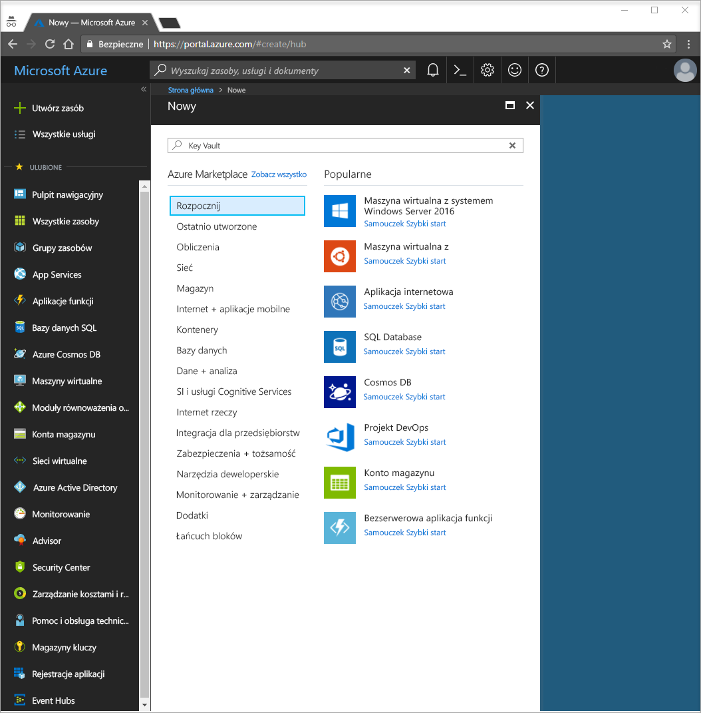
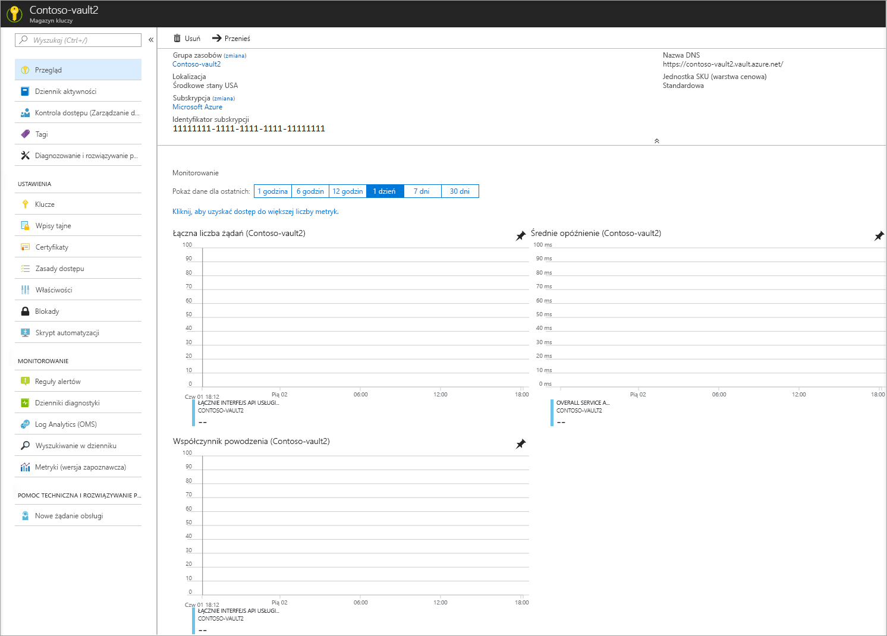

# Szybki start: konfigurowanie i pobieranie wpisów tajnych z usługi Key Vault przy użyciu witryny Azure Portal

Azure Key Vault to usługa w chmurze, która działa jako bezpieczny magazyn wpisów tajnych. Możesz bezpiecznie przechowywać klucze, hasła, certyfikaty oraz inne wpisy tajne. Aby uzyskać więcej informacji na temat usługi Key Vault, możesz zapoznać się z [omówieniem](key-vault-overview.md). Magazyny kluczy platformy Azure można tworzyć oraz nimi zarządzać za pośrednictwem witryny Azure Portal. W tym przewodniku Szybki start opisano tworzenie magazynu kluczy, a następnie umieszczanie w nim wpisu tajnego.

Jeśli nie masz subskrypcji platformy Azure, przed rozpoczęciem utwórz [bezpłatne konto](https://azure.microsoft.com/free/?WT.mc_id=A261C142F).

## Logowanie się do platformy Azure

Zaloguj się do witryny Azure Portal na stronie http://portal.azure.com.

## Tworzenie magazynu

1. Wybierz opcję **Utwórz zasób** w lewym górnym rogu witryny Azure Portal

    
2. W polu wyszukiwania wpisz **Key Vault**.
3. Na liście wyników wybierz pozycję **Key Vault**.
4. W sekcji Key Vault, wybierz przycisk **Utwórz**.
5. W sekcji **Tworzenie magazynu kluczy** podaj następujące informacje:
    - **Nazwa**: w tym przewodniku Szybki start użyjemy nazwy **Contoso vault2**. W swoim teście musisz podać unikatową nazwę.
    - **Subskrypcja**: wybierz subskrypcję, której będziesz używać w tym przewodniku Szybki start.
    - W obszarze **Grupa zasobów** wybierz pozycję **Utwórz nową**, a następnie wprowadź nazwę grupy zasobów.
    - W menu rozwijanym **Lokalizacja** wybierz lokalizację.
    - Zaznacz pole wyboru **Przypnij do pulpitu nawigacyjnego**.
    - Dla pozostałych opcji zostaw wartości domyślne.
6. Po podaniu powyższych informacje wybierz przycisk **Utwórz**.

Zanotuj dwie poniższe właściwości:

* **Nazwa magazynu**: w tym przykładzie jest to **Contoso-Vault2**. Użyjesz tej nazwy w innych krokach.
* **Identyfikator URI magazynu**: w tym przykładzie jest to https://contoso-vault2.vault.azure.net/. Aplikacje korzystające z magazynu za pomocą jego interfejsu API REST muszą używać tego identyfikatora URI.

Twoje konto platformy Azure jest teraz jedynym kontem z uprawnieniami do wykonywania jakichkolwiek operacji na tym nowym magazynie.

## Dodawanie wpisu tajnego do usługi Key Vault

Aby dodać wpis tajny do magazynu, wystarczy tylko wykonać kilka dodatkowych czynności. W tym przypadku dodamy hasło, którego będzie mogła używać aplikacja. Hasło ma nazwę **ExamplePassword** i jest w nim przechowywana wartość **Pa$$w0rd**.

1. Na stronie właściwości usługi Key Vault wybierz pozycję **Wpisy tajne**.
2. Kliknij pozycję **Wygeneruj/zaimportuj**.
3. Na ekranie **Tworzenie wpisu tajnego** wybierz następujące opcje:
    - **Opcje przekazywania**: Ręcznie.
    - **Nazwa**: ExamplePassword.
    - **Wartość**: Pa$$w0rd.
    - Dla pozostałych opcji zostaw wartości domyślne. Kliknij pozycję **Utwórz**.

Gdy otrzymasz komunikat o pomyślnym utworzeniu wpisu tajnego, możesz kliknąć go na liście. Zostaną wtedy wyświetlone niektóre jego właściwości. Jeśli klikniesz bieżącą wersję, zostanie wyświetlona wartość określona w poprzednim kroku.

## Oczyszczanie zasobów

Inne przewodniki Szybki start i samouczki usługi Key Vault bazują na tym przewodniku. Jeśli planujesz korzystać z kolejnych przewodników Szybki start i samouczków, pozostaw te zasoby na swoim miejscu.
Jeśli nie będą Ci one już potrzebne, usuń grupę zasobów, a zostanie także usunięta usługa Key Vault i pokrewne zasoby. Aby usunąć grupę zasobów za pośrednictwem portalu:

1. Wprowadź nazwę grupy zasobów w polu wyszukiwania w górnej części portalu. Gdy w wynikach wyszukiwania zobaczysz grupę zasobów używaną w tym przewodniku Szybki start, wybierz ją.
2. Wybierz pozycję **Usuń grupę zasobów**.
3. W polu **WPISZ NAZWĘ GRUPY ZASOBÓW:** wpisz nazwę grupy zasobów i wybierz pozycję **Usuń**.

## Następne kroki

W tym przewodniku Szybki start opisano tworzenie usługi Key Vault i umieszczanie w niej wpisu tajnego. Aby dowiedzieć się więcej na temat usługi Key Vault i sposobu jej używania z aplikacjami, przejdź do samouczka dla aplikacji internetowych współdziałających z usługą Key Vault.

> [!div class="nextstepaction"]
> Aby dowiedzieć się, jak odczytać wpis tajny z usługi Key Vault za pomocą aplikacji sieci Web korzystającej z tożsamości usługi zarządzanej, przejdź do samouczka [Konfigurowanie aplikacji internetowej platformy Azure w celu odczytu wpisu tajnego z usługi Key Vault](tutorial-web-application-keyvault.md).
