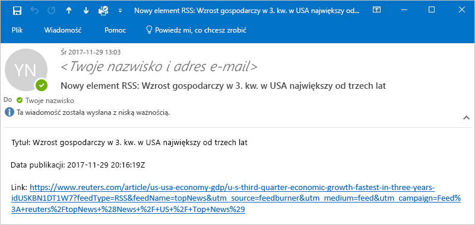
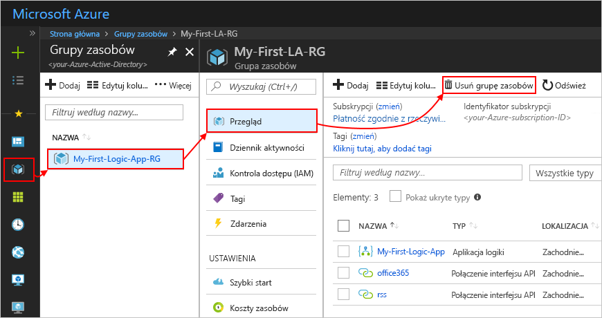
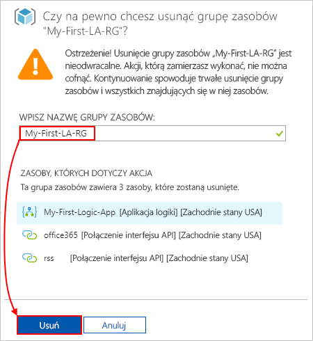

# Szybki Start: Tworzenie pierwszego zautomatyzowanego przepływu pracy integracji przy użyciu Azure Logic Apps-Azure Portal

W tym przewodniku szybki start przedstawiono podstawowe ogólne pojęcia związane z tworzeniem pierwszego przepływu pracy przy użyciu [Azure Logic Apps](logic-apps-overview.md), takich jak tworzenie pustej aplikacji logiki, Dodawanie wyzwalacza i akcji, a następnie testowanie aplikacji logiki. W tym przewodniku szybki start utworzysz aplikację logiki, która regularnie sprawdza kanał informacyjny RSS witryny sieci Web pod kątem nowych elementów. Jeśli istnieją nowe elementy, aplikacja logiki wysyła wiadomość e-mail dotyczącą każdego elementu. Po ukończeniu aplikacja logiki będzie ogólnie wyglądać jak ten przepływ pracy:

W tym scenariuszu potrzebna jest subskrypcja platformy Azure lub można [utworzyć bezpłatne konto platformy Azure](https://azure.microsoft.com/free/?WT.mc_id=A261C142F)— konto e-mail z usługi obsługiwanej przez Azure Logic Apps, na przykład Office 365 Outlook, Outlook.com lub gmail. W przypadku innych obsługiwanych usług poczty e-mail [Przejrzyj listę łączników tutaj](/connectors/). W tym przykładzie aplikacja logiki korzysta z konta służbowego. Jeśli używasz innej usługi poczty e-mail, ogólne kroki są takie same, ale interfejs użytkownika może się nieco różnić.

> [!IMPORTANT]
> Jeśli chcesz korzystać z łącznika usługi Gmail, tylko konta firmowe z zestawu G-Suite mogą używać tego łącznika bez ograniczeń w usłudze Logic Apps. Jeśli masz konto użytkownika usługi Gmail, możesz użyć tego łącznika z tylko określonymi usługami zatwierdzonymi przez firmę Google lub możesz [utworzyć aplikację kliencką Google, która będzie używana do uwierzytelniania za pomocą łącznika usługi Gmail](/connectors/gmail/#authentication-and-bring-your-own-application). Aby uzyskać więcej informacji, zobacz [zabezpieczenia danych i zasady ochrony prywatności dla łączników Google w Azure Logic Apps](../connectors/connectors-google-data-security-privacy-policy.md).

## Tworzenie aplikacji logiki

1. Zaloguj się do [witryny Azure Portal](https://portal.azure.com) przy użyciu poświadczeń konta Azure.

1. W polu wyszukiwania Azure Portal wprowadź wartość `logic apps` , a następnie wybierz pozycję **Logic Apps**.

   

1. Na stronie **Logic Apps** wybierz pozycję **Dodaj**.

   

1. W okienku **aplikacja logiki** podaj szczegółowe informacje o aplikacji logiki, jak pokazano poniżej.

   

   | Właściwość | Wartość | Opis |
   |----------|-------|-------------|
   | **Nazwa** | <*Logic-App-Name*> | Nazwa aplikacji logiki, która musi być unikatowa w różnych regionach i może zawierać tylko litery, cyfry, łączniki ( `-` ), podkreślenia ( `_` ), nawiasy ( `(` , `)` ) i kropki ( `.` ). W tym przykładzie zastosowano "My-First-Logic-App". |
   | **Subskrypcja** | <*Azure — nazwa subskrypcji*> | Nazwa subskrypcji platformy Azure |
   | **Grupa zasobów** | <*Azure-Resource-Group-Name*> | Nazwa [grupy zasobów platformy Azure](../azure-resource-manager/management/overview.md), która musi być unikatowa w różnych regionach i służy do organizowania powiązanych zasobów. W tym przykładzie jest stosowana wartość "My-First-LA-RG". |
   | **Lokalizacja** | <*Platforma Azure — region*> | Region, w którym są przechowywane informacje o aplikacji logiki. W tym przykładzie zastosowano "zachodnie stany USA". |
   | **Log Analytics** | Wyłączone | Ustawienie **Wyłączone** umożliwia rejestrowanie w celach diagnostycznych. |
   ||||

1. Gdy wszystko będzie gotowe, wybierz pozycję **Przegląd + Utwórz**. Potwierdź podane szczegóły, a następnie wybierz pozycję **Utwórz**.

1. Po pomyślnym wdrożeniu aplikacji przez platformę Azure wybierz pozycję **Przejdź do zasobu**.

   

   Możesz też znaleźć i wybrać aplikację logiki, wpisując nazwę w polu wyszukiwania.

   Zostanie otwarty Projektant aplikacji usługi Logic Apps wyświetlający stronę z wprowadzającym wideo i najczęściej używanymi wyzwalaczami. W obszarze **Szablony** wybierz pozycję **Pusta aplikacja logiki**.

   

Następnie dodaj [wyzwalacz](../logic-apps/logic-apps-overview.md#logic-app-concepts), który będzie aktywowany po pojawieniu się nowego elementu w kanale informacyjnym RSS. Każda aplikacja logiki musi rozpoczynać się od wyzwalacza, który jest aktywowany w momencie wystąpienia konkretnego zdarzenia lub spełnienia określonego warunku. Za każdym razem, gdy wyzwala wyzwalacz, aparat Azure Logic Apps tworzy wystąpienie aplikacji logiki, które uruchamia i uruchamia przepływ pracy.

## Dodawanie wyzwalacza RSS

1. W **Projektancie aplikacji logiki**, w polu wyszukiwania zaznacz **wszystko**.

1. Aby znaleźć łącznik RSS, w polu wyszukiwania wpisz `rss` . Z listy Wyzwalacze wybierz wyzwalacz RSS, **gdy zostanie opublikowany element kanału informacyjnego**.

   

1. Podaj informacje dla wyzwalacza zgodnie z opisem w tym kroku:

   

   | Właściwość | Wartość | Opis |
   |----------|-------|-------------|
   | **Adres URL źródła danych RSS** | <*RSS-źródło — adres URL*> | Link do źródła danych RSS, które chcesz monitorować. W tym przykładzie użyto kanału informacyjnego RSS arkusza ściennego w `https://feeds.a.dj.com/rss/RSSMarketsMain.xml` , ale jeśli chcesz, możesz użyć własnego adresu URL źródła danych RSS. |
   | **Interwał** | 1 | Liczba interwałów do odczekania między sprawdzaniami |
   | **Częstotliwość** | Minuta | Jednostka czasu dla każdego interwału między sprawdzaniami |
   ||||

   Interwał i częstotliwość określają harmonogram wyzwalacza aplikacji logiki. Ta aplikacja logiki sprawdza kanał informacyjny co minutę.

1. Aby teraz zwinąć szczegóły wyzwalacza, kliknij wewnątrz paska tytułu wyzwalacza.

   

1. Zapisz aplikację logiki. Na pasku narzędzi projektanta wybierz pozycję **Zapisz**.

Twoja aplikacja logiki jest już aktywna, ale nie robi niczego poza sprawdzaniem źródła danych RSS. Dodaj więc akcję reagującą na aktywowanie wyzwalacza.

## Dodaj akcję "Wyślij wiadomość e-mail"

Teraz Dodaj [akcję](../logic-apps/logic-apps-overview.md#logic-app-concepts) , która wysyła wiadomość e-mail po pojawieniu się nowego elementu w kanale informacyjnym RSS.

1. W obszarze wyzwalacz **po opublikowaniu elementu kanału informacyjnego** wybierz pozycję **nowy krok**.

   

1. W obszarze **Wybierz akcję** i pole wyszukiwania wybierz pozycję **wszystkie**.

1. W polu wyszukiwania wprowadź, `send an email` Aby można było znaleźć łączniki, które oferują tę akcję. Aby odfiltrować listę akcji do określonej aplikacji lub usługi, możesz najpierw wybrać tę aplikację lub usługę.

   Jeśli na przykład używasz konta służbowego firmy Microsoft i chcesz korzystać z pakietu Office 365 Outlook, wybierz pozycję **office 365 Outlook**. Lub, jeśli używasz osobistego konto Microsoft, możesz wybrać pozycję Outlook.com. Ten przykład kontynuuje działanie z pakietem Office 365 Outlook:

   

   Teraz można łatwiej znaleźć i wybrać akcję, która ma zostać użyta, na przykład `send an email` :

   

1. Jeśli wybrany łącznik poczty e-mail będzie monitował o uwierzytelnienie tożsamości, wykonaj ten krok teraz, aby utworzyć połączenie między aplikacją logiki a usługą poczty e-mail.

   > [!NOTE]
   > W tym konkretnym przykładzie ręcznie uwierzytelniasz swoją tożsamość. Jednak łączniki, które wymagają uwierzytelniania, różnią się w typach uwierzytelniania, które są przez nie obsługiwane. Dostępne są również opcje konfigurowania sposobu obsługi uwierzytelniania. Na przykład w przypadku używania szablonów Azure Resource Manager do wdrożenia można Sparametryzuj i poprawić zabezpieczenia danych wejściowych, które mają być często lub łatwo zmieniane, takie jak informacje o połączeniu. Więcej informacji można znaleźć w następujących tematach:
   >
   > * [Parametry szablonu dla wdrożenia](../logic-apps/logic-apps-azure-resource-manager-templates-overview.md#template-parameters)
   > * [Autoryzuj połączenia OAuth](../logic-apps/logic-apps-deploy-azure-resource-manager-templates.md#authorize-oauth-connections)
   > * [Uwierzytelnianie dostępu za pomocą tożsamości zarządzanych](../logic-apps/create-managed-service-identity.md)
   > * [Uwierzytelnianie połączeń dla wdrożenia aplikacji logiki](../logic-apps/logic-apps-azure-resource-manager-templates-overview.md#authenticate-connections)

1. W akcji **Wyślij wiadomość e-mail** Określ informacje, które mają zostać uwzględnione w wiadomości e-mail.

   1. W polu **Do** wprowadź adres e-mail adresata. Do celów testowych możesz użyć swojego adresu e-mail.

      Na razie zignoruj wyświetloną listę **Dodaj zawartość dynamiczną**. Po kliknięciu wewnątrz niektórych pól edycji ta lista zostanie wyświetlona i zostaną wyświetlone wszystkie dostępne wyjścia z poprzedniego kroku, których można użyć jako danych wejściowych dla bieżącej akcji.

   1. W polu **Temat** wprowadź następujący tekst ze spacją na końcu: `New RSS item: `

      

   1. Z listy **Dodaj zawartość dynamiczną** wybierz pozycję **tytuł źródła**danych, który jest wyprowadzany z wyzwalacza, "po opublikowaniu elementu kanału informacyjnego", który sprawia, że tytuł elementu RSS jest dostępny do użycia.

      

      > [!TIP]
      > Jeśli na liście zawartości dynamicznej nie ma żadnych danych wyjściowych z wyzwalacza "gdy element kanału informacyjnego jest opublikowany", obok nagłówka akcji wybierz pozycję **Zobacz więcej**.
      > 
      > 

      Gdy wszystko będzie gotowe, temat wiadomości e-mail będzie wyglądać następująco:

      

      Jeśli w projektancie pojawi się pętla „For each”, oznacza to, że wybrano token dla tablicy, na przykład token **categories-Item**. W przypadku takiego typu tokenów projektant automatycznie dodaje pętlę do akcji, która odwołuje się do tego tokenu. W ten sposób Twoja aplikacja logiki wykonuje tę samą akcję dla każdego elementu tablicy. Aby usunąć pętlę, wybierz **wielokropek** (**...**) na pasku tytułu pętli, a następnie wybierz pozycję **Usuń**.

   1. W polu **Treść** wprowadź następujący tekst i wybierz widoczne tokeny dla treści wiadomości e-mail. Aby dodać puste wiersze w polu edycji, naciśnij klawisze Shift + Enter.

      

      | Właściwość | Opis |
      |----------|-------------|
      | **Tytuł źródła danych** | Tytuł elementu |
      | **Data opublikowania kanału informacyjnego** | Data i godzina opublikowania elementu |
      | **Link podstawowego źródła danych** | Adres URL elementu |
      |||

1. Zapisz aplikację logiki.

Następnie przeprowadź testowanie aplikacji logiki.

## Uruchamianie aplikacji logiki

Aby ręcznie uruchomić aplikację logiki, na pasku narzędzi projektanta wybierz pozycję **Uruchom**. Możesz też zaczekać, aż aplikacja logiki sprawdzi źródło danych RSS zgodnie z określonym harmonogramem (co minutę).

Jeśli źródło danych RSS będzie zawierać nowe elementy, aplikacja logiki wyśle wiadomość e-mail dla każdego nowego elementu. W przeciwnym razie aplikacja logiki będzie czekać z ponownym sprawdzeniem do następnego interwału. Jeśli nie dostaniesz żadnych wiadomości e-mail, sprawdź folder wiadomości-śmieci.

Oto przykładowa wiadomość e-mail wysyłana przez tę aplikację logiki.

Technicznie, gdy wyzwalacz sprawdza kanał informacyjny RSS i odnajduje nowe elementy, uruchamiany jest wyzwalacz, a aparat Azure Logic Apps tworzy wystąpienie przepływu pracy aplikacji logiki, który uruchamia akcje w przepływie pracy. Jeśli wyzwalacz nie znajdzie nowych elementów, to nie zostanie wyzwolony i pominie tworzenie wystąpienia przepływu pracy.

Gratulacje, udało Ci się pomyślnie skompilować i uruchomić swoją pierwszą aplikację logiki przy użyciu Azure Portal.

## Czyszczenie zasobów

Gdy ten przykład nie będzie już potrzebny, usuń grupę zasobów zawierającą aplikację logiki i powiązane zasoby.

1. W polu wyszukiwania na platformie Azure wprowadź wartość `resource groups` , a następnie wybierz pozycję **grupy zasobów**.

   

1. Znajdź i wybierz grupę zasobów aplikacji logiki. W okienku **Przegląd** wybierz pozycję **Usuń grupę zasobów**.

   

1. Gdy zostanie wyświetlone okienko potwierdzenia, wprowadź nazwę grupy zasobów, a następnie wybierz pozycję **Usuń**.

   

> [!NOTE]
> Po usunięciu aplikacji logiki nie są tworzone wystąpienia nowych przebiegów. Wszystkie trwające i oczekujące przebiegi zostają anulowane. Anulowanie kilku tysięcy przebiegów może zająć dużo czasu.

## Następne kroki

W tym przewodniku Szybki start utworzono pierwszą aplikację logiki, która sprawdza aktualizacje kanału informacyjnego RSS według określonego harmonogramu (co minutę) i jeśli istnieją aktualizacje, wykonuje akcję (wysyła wiadomość e-mail). Aby dowiedzieć się więcej, kontynuuj pracę z tym samouczkiem nad tworzeniem bardziej zaawansowanych przepływów pracy opartych na harmonogramie:

> [!div class="nextstepaction"]
> [Sprawdzanie ruchu za pomocą aplikacji logiki opartej na harmonogramie](../logic-apps/tutorial-build-schedule-recurring-logic-app-workflow.md)
