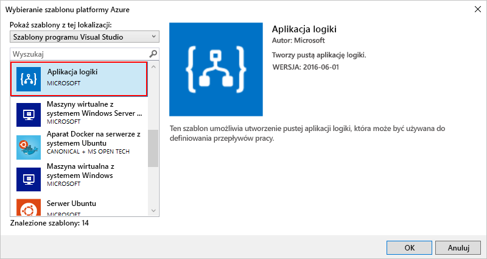
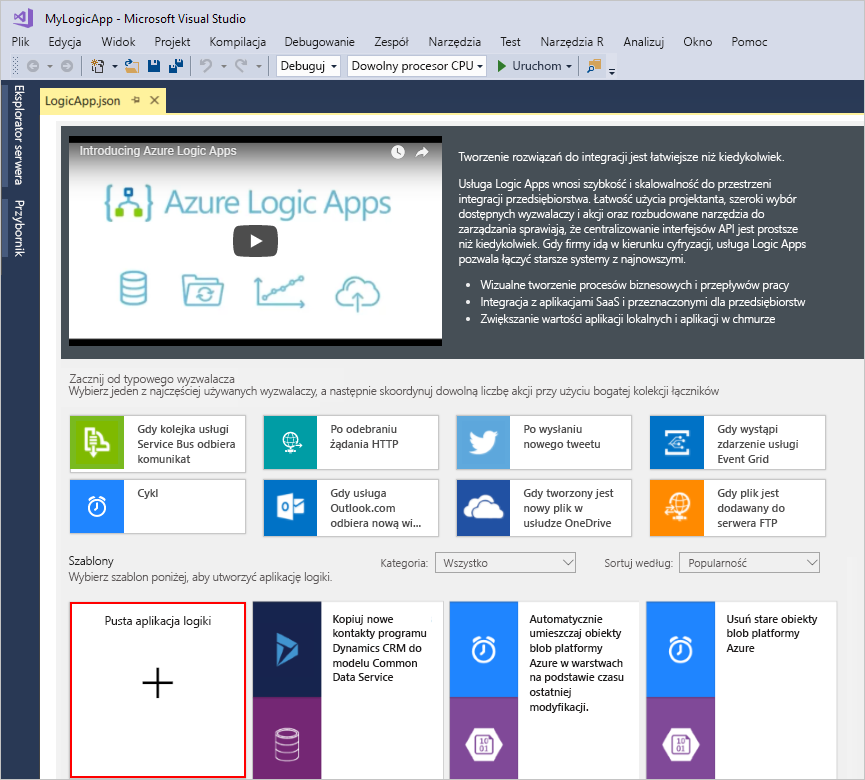
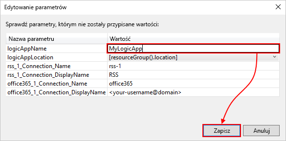

# Szybki start: tworzenie i automatyzacja zadań, procesów i przepływów pracy z usługą Azure Logic Apps — w programie Visual Studio

Za pomocą usługi [Azure Logic Apps](../logic-apps/logic-apps-overview.md) i programu Visual Studio można utworzyć przepływy pracy do automatyzacji zadań i procesów, które integrują aplikacje, dane, systemy i usługi w przedsiębiorstwach i organizacjach. W tym przewodniku Szybki start przedstawiono sposób projektowania i kompilowania tych przepływów pracy przez tworzenie aplikacji logiki w programie Visual Studio i wdrażanie ich na platformie <a href="https://docs.microsoft.com/azure/guides/developer/azure-developer-guide" target="_blank">Azure</a> w chmurze. I chociaż można wykonać te zadania w witrynie <a href="https://portal.azure.com" target="_blank">Azure Portal</a>, program Visual Studio umożliwia dodawanie aplikacji logiki do kontroli źródła, publikowanie różnych wersji i tworzenie szablonów usługi Azure Resource Manager dla różnych środowisk wdrożeń. 

Jeśli jesteś nowym użytkownikiem usługi Azure Logic Apps i potrzebujesz dostępu do podstawowych pojęć, wypróbuj w zamian [przewodnik Szybki Start dotyczący tworzenia aplikacji logiki w witrynie Azure Portal](../logic-apps/quickstart-create-first-logic-app-workflow.md). Projektant aplikacji logiki w witrynie Azure Portal i programie Visual Studio działa podobnie. 

W tym miejscu tworzysz tę samą aplikację logiki, co w przewodniku Szybki start dla witryny Azure Portal, ale przy użyciu programu Visual Studio. Ta aplikacja logiki monitoruje kanał informacyjny RSS witryny internetowej i wysyła wiadomość e-mail dla każdego nowego elementu opublikowanego w witrynie. Po ukończeniu aplikacja logiki będzie wyglądać jak ten ogólny przepływ pracy:

Przed rozpoczęciem upewnij się, że masz następujące elementy:

* Jeśli nie masz subskrypcji platformy Azure, <a href="https://azure.microsoft.com/free/" target="_blank">zarejestruj się w celu założenia bezpłatnego konta platformy Azure</a>.

* Pobierz i zainstaluj te narzędzia, jeśli jeszcze ich nie masz: 

  * <a href="https://www.visualstudio.com/downloads" target="_blank">Visual Studio 2017 lub Visual Studio 2015 — Community Edition lub nowszy</a>. 
  Ten przewodnik Szybki start używa bezpłatnego Visual Studio Community 2017.

  * <a href="https://azure.microsoft.com/downloads/" target="_blank">Zestaw Microsoft Azure SDK dla platformy .NET (2.9.1 lub nowszy)</a> i <a href="https://github.com/Azure/azure-powershell#installation" target="_blank">program Azure PowerShell</a>. 
  Dowiedz się więcej na temat <a href="https://docs.microsoft.com/dotnet/azure/dotnet-tools?view=azure-dotnet">zestawu Azure SDK dla platformy .NET</a>.

  * Narzędzia <a href="https://marketplace.visualstudio.com/items?itemName=VinaySinghMSFT.AzureLogicAppsToolsforVisualStudio-18551" target="_blank">Azure Logic Apps Tools for Visual Studio 2017</a> lub program <a href="https://marketplace.visualstudio.com/items?itemName=VinaySinghMSFT.AzureLogicAppsToolsforVisualStudio" target="_blank">Visual Studio 2015</a>
  
    Możesz pobrać i zainstalować narzędzia Azure Logic Apps Tools bezpośrednio z witryny Visual Studio Marketplace lub dowiedzieć się, <a href="https://docs.microsoft.com/visualstudio/ide/finding-and-using-visual-studio-extensions" target="_blank">jak zainstalować to rozszerzenie z poziomu programu Visual Studio</a>. 
    Upewnij się, że po zakończeniu instalacji program Visual Studio zostanie ponownie uruchomiony.

* Konto e-mail obsługiwane przez usługę Logic Apps, na przykład Office 365 Outlook, Outlook.com lub Gmail. W przypadku innych dostawców <a href="https://docs.microsoft.com/connectors/" target="_blank">przejrzyj tę listę łączników</a>. Ta aplikacja logiki korzysta z programu Office 365 Outlook. Jeśli używasz innego dostawcy, ogólne kroki będą takie same, ale interfejs użytkownika może się trochę różnić.

* Dostęp do Internetu podczas korzystania z osadzonego Projektanta aplikacji logiki

  Projektant wymaga połączenia internetowego do tworzenia zasobów na platformie Azure oraz odczytywania właściwości i danych z łączników w aplikacji logiki. 
  Jeśli na przykład używany jest łącznik usługi Dynamics CRM Online, projektant wyszukuje dostępne właściwości domyślne i niestandardowe w wystąpieniu CRM.

## Tworzenie projektu grupy zasobów platformy Azure

Aby rozpocząć, utwórz [projekt grupy zasobów platformy Azure](../azure-resource-manager/vs-azure-tools-resource-groups-deployment-projects-create-deploy.md). Dowiedz się więcej o [zasobach i grupach zasobów platformy Azure](../azure-resource-manager/resource-group-overview.md).

1. Uruchom program Visual Studio i zaloguj się przy użyciu konta platformy Azure.

2. W menu **Plik** wybierz pozycję **Nowy** > **Projekt**. (Klawiatura: Ctrl+Shift+N)

   

3. W obszarze **Zainstalowane** wybierz pozycję **Visual C#** lub **Visual Basic**. Wybierz pozycję **Chmura** > **Grupa zasobów platformy Azure**. Nazwij projekt, na przykład:

   

4. Wybierz szablon **Aplikacja logiki**. 

   

   Po utworzeniu projektu w programie Visual Studio Eksplorator rozwiązań otwiera i pokazuje rozwiązanie. 

   

   W rozwiązaniu plik **LogicApp.json** nie tylko przechowuje dane definicji dla aplikacji logiki, ale jest również szablonem usługi Azure Resource Manager, który można skonfigurować na potrzeby wdrożenia.

## Tworzenie pustej aplikacji logiki

Po utworzeniu projektu grupy zasobów platformy Azure utwórz i skompiluj aplikację logiki, zaczynając od szablonu **pustej aplikacji logiki**.

1. W Eksploratorze rozwiązań otwórz menu skrótów pliku **LogicApp.json**. Wybierz pozycję **Otwórz przy użyciu Projektanta aplikacji logiki**. (Klawiatura: Ctrl+L)

   

2. W polu **Subskrypcja** wybierz subskrypcję platformy Azure, która ma być używana. W obszarze **Grupa zasobów** wybierz pozycję **Utwórz nową...** w celu utworzenia nowej grupy zasobów platformy Azure. 

   

   Program Visual Studio potrzebuje subskrypcji i grupy zasobów platformy Azure do tworzenia i wdrażania zasobów skojarzonych z aplikacją logiki i połączeniami. 

   | Ustawienie | Przykładowa wartość | Opis | 
   | ------- | ------------- | ----------- | 
   | Lista profilów użytkowników | Contoso   jamalhartnett@contoso.com | Domyślnie konto używane do logowania | 
   | **Subskrypcja** | Płatność zgodnie z rzeczywistym użyciem   (jamalhartnett@contoso.com) | Nazwa Twojej subskrypcji platformy Azure i skojarzone konto |
   | **Grupa zasobów** | MyLogicApp-RG   (Zachodnie stany USA) | Grupa zasobów i lokalizacja platformy Azure na potrzeby przechowywania i wdrażania zasobów aplikacji logiki | 
   | **Lokalizacja** | MyLogicApp-RG2   (Zachodnie stany USA) | Inna lokalizacja, jeśli nie chcesz używać lokalizacji grupy zasobów |
   ||||

3. Zostanie otwarty Projektant aplikacji usługi Logic Apps wyświetlający stronę z wprowadzającym wideo i najczęściej używanymi wyzwalaczami. Przewiń poza wideo i wyzwalacze. W obszarze **Szablony** wybierz pozycję **Pusta aplikacja logiki**.

   

## Kompilowanie przepływu pracy aplikacji logiki

Następnie dodaj [wyzwalacz](../logic-apps/logic-apps-overview.md#logic-app-concepts), który będzie aktywowany po pojawieniu się nowego elementu w kanale informacyjnym RSS. Każda aplikacja logiki musi rozpoczynać się od wyzwalacza uruchamianego po spełnieniu określonych kryteriów spełnione. Po każdym aktywowaniu wyzwalacza aparat usługi Logic Apps tworzy wystąpienie aplikacji logiki uruchamiającej przepływ pracy.

1. W projektancie aplikacji logiki wprowadź ciąg „rss” w polu wyszukiwania. Wybierz następujący wyzwalacz: **Gdy element kanału informacyjnego jest publikowany**

   

   Wyzwalacz jest teraz wyświetlany w projektancie:

   

2. Aby zakończyć kompilowanie aplikacji logiki, wykonaj kroki dotyczące przepływu pracy z [przewodnika Szybki start dla witryny Azure Portal](../logic-apps/quickstart-create-first-logic-app-workflow.md#add-rss-trigger), a następnie wróć do tego artykułu.

   Gdy wszystko będzie gotowe, aplikacja logiki będzie wyglądać następująco: 

   

3. Aby zapisać aplikację logiki, zapisz rozwiązanie programu Visual Studio. (Klawiatura: Ctrl+S)

Teraz przed przetestowaniem aplikacji logiki wdróż aplikację na platformie Azure.

## Wdrażanie aplikacji logiki na platformie Azure

Przed uruchomieniem aplikacji logiki wdróż aplikację z programu Visual Studio na platformie Azure. Ten proces składa się z zaledwie kilku kroków.

1. W Eksploratorze rozwiązań w menu skrótów projektu wybierz pozycję **Wdróż** > **Nowy**. Po wyświetleniu monitu zaloguj się przy użyciu konta platformy Azure.

   

2. W przypadku tego wdrożenia zachowaj subskrypcję platformy Azure, grupę zasobów i inne ustawienia domyślne. Gdy wszystko będzie gotowe, wybierz pozycję **Wdróż**. 

   

3. Jeśli zostanie wyświetlone okno **Edytuj parametry**, podaj nazwę zasobu aplikacji logiki do użycia we wdrożeniu, a następnie zapisz ustawienia, na przykład:

   

   Po rozpoczęciu wdrażania stan wdrożenia aplikacji zostanie wyświetlony w oknie **Dane wyjściowe** programu Visual Studio. 
   Jeśli stan się nie pojawi, otwórz listę **Pokaż dane wyjściowe z** i wybierz grupę zasobów platformy Azure.

   

   Jeśli wybrane łączniki wymagają danych wejściowych od użytkownika, w tle może zostać otwarte okno programu PowerShell z monitem o wymagane hasła lub klucze tajne. Po wprowadzeniu tych informacji wdrażanie będzie kontynuowane.
   
   
   
   Po zakończeniu wdrożenia aplikacja logiki jest aktywna w witrynie Azure Portal i sprawdza kanał informacyjny RSS w oparciu o wybrany harmonogram (co minutę). 
   Jeśli źródło danych RSS będzie zawierać nowe elementy, aplikacja logiki wyśle wiadomość e-mail dla każdego nowego elementu. 
   W przeciwnym razie aplikacja logiki będzie czekać z ponownym sprawdzeniem do następnego interwału. 

   Oto przykładowe wiadomości e-mail wysyłane przez tę aplikację logiki. 
   Jeśli nie dostaniesz żadnych wiadomości e-mail, sprawdź folder wiadomości-śmieci. 

   

   Z technicznego punktu widzenia, gdy wyzwalacz sprawdza źródło danych RSS i znajduje nowe elementy, jest on wyzwalany, a aparat usługi Logic Apps tworzy wystąpienie przepływu pracy aplikacji logiki, które uruchamia akcje w ramach przepływu pracy.
   Jeśli wyzwalacz nie znajdzie nowych elementów, nie zostanie wyzwolony i pominie tworzenie wystąpienia przepływu pracy.

Gratulacje, aplikacja logiki została pomyślnie skompilowana i wdrożona przy użyciu programu Visual Studio. Aby zarządzać aplikacją logiki i przeglądać historię jej uruchomień, zobacz [Zarządzanie aplikacjami logiki w programie Visual Studio](../logic-apps/manage-logic-apps-with-visual-studio.md).

## Oczyszczanie zasobów

Gdy grupa zasobów zawierająca aplikację logiki i powiązane zasoby nie będzie już potrzebna, usuń ją.

1. Zaloguj się do witryny <a href="https://portal.azure.com" target="_blank">Azure Portal</a> za pomocą konta używanego do tworzenia aplikacji logiki. 

2. Z głównego menu platformy Azure wybierz pozycję **Grupy zasobów**.
Wybierz grupę zasobów aplikacji logiki, a następnie wybierz pozycję **Przegląd**.

3. Na stronie **Przegląd** wybierz pozycję **Usuń grupę zasobów**. Aby potwierdzić, wprowadź nazwę grupy zasobów, a następnie wybierz pozycję **Usuń**.

   

4. Usuń rozwiązanie programu Visual Studio z komputera lokalnego.

## Uzyskiwanie pomocy technicznej

* Jeśli masz pytania, odwiedź <a href="https://social.msdn.microsoft.com/Forums/en-US/home?forum=azurelogicapps" target="_blank">forum usługi Azure Logic Apps</a>.
* Aby przesłać pomysły dotyczące funkcji lub zagłosować na nie, odwiedź <a href="http://aka.ms/logicapps-wish" target="_blank">witrynę opinii użytkowników usługi Logic Apps</a>.

## Następne kroki

W tym artykule kompilowano, wdrożono i uruchomiono aplikację logiki przy użyciu programu Visual Studio. Aby dowiedzieć się więcej na temat wykonywania zaawansowanego wdrażania aplikacji logiki i zarządzania nim przy użyciu programu Visual Studio, zobacz następujące artykuły:

> [!div class="nextstepaction"]
> * [Zarządzanie aplikacjami logiki w programie Visual Studio](../logic-apps/manage-logic-apps-with-visual-studio.md)
> * [Create deployment templates for logic apps with Visual Studio](../logic-apps/logic-apps-create-deploy-template.md) (Tworzenie szablonów wdrożenia dla aplikacji logiki za pomocą programu Visual Studio)
