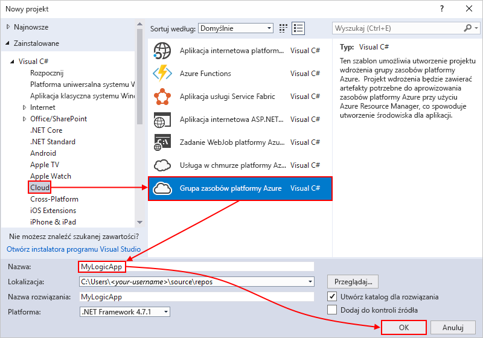
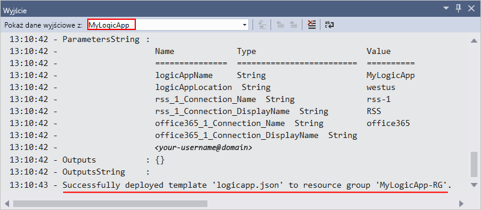

# Szybki start: tworzenie zautomatyzowanych zadań, procesów i przepływów pracy za pomocą aplikacji Azure Logic Apps — Visual Studio

Za pomocą usługi [Azure Logic Apps](../logic-apps/logic-apps-overview.md) i programu Visual Studio można utworzyć przepływy pracy do automatyzacji zadań i procesów, które integrują aplikacje, dane, systemy i usługi w przedsiębiorstwach i organizacjach. Ten przewodnik Szybki start pokazuje, jak projektować i tworzyć te przepływy pracy, tworząc aplikacje logiki w programie Visual Studio i wdrażając te aplikacje na platformie Azure. Chociaż można wykonywać te zadania w witrynie Azure portal, visual studio umożliwia dodawanie aplikacji logiki do kontroli źródła, publikowanie różnych wersji i tworzenie szablonów usługi Azure Resource Manager dla różnych środowisk wdrażania.

Jeśli jesteś nowym użytkownikiem usługi Azure Logic Apps i potrzebujesz tylko podstawowych pojęć, wypróbuj [przewodnik Szybki start do tworzenia aplikacji logiki w witrynie Azure portal.](../logic-apps/quickstart-create-first-logic-app-workflow.md) Projektant aplikacji logiki działa podobnie w witrynie Azure portal i visual studio.

W tym przewodniku Szybki start utworzysz tę samą aplikację logiki za pomocą programu Visual Studio, co przewodnik Szybki start w portalu Azure. Ta aplikacja logiki monitoruje kanał RSS witryny i wysyła wiadomości e-mail dla każdego nowego elementu w tym kanale. Twoja ukończona aplikacja logiki wygląda jak ten przepływ pracy wysokiego poziomu:

## Wymagania wstępne

* Subskrypcja platformy Azure. Jeśli nie masz subskrypcji, [zarejestruj się w celu założenia bezpłatnego konta platformy Azure](https://azure.microsoft.com/free/).

* Pobierz i zainstaluj te narzędzia, jeśli jeszcze ich nie masz:

  * [Visual Studio 2019, 2017 lub 2015 — wersja społecznościowa lub większa](https://aka.ms/download-visual-studio). Ten przewodnik Szybki start korzysta ze społeczności programu Visual Studio 2017.

    > [!IMPORTANT]
    > Podczas instalowania programu Visual Studio 2019 lub 2017 upewnij się, że wybierzesz obciążenie **deweloperskie platformy Azure.**

  * [Zestaw Microsoft Azure SDK dla platformy .NET (2.9.1 lub nowszych)](https://azure.microsoft.com/downloads/). Dowiedz się więcej na temat [zestawu Azure SDK dla platformy .NET](https://docs.microsoft.com/dotnet/azure/dotnet-tools?view=azure-dotnet).

  * [Azure PowerShell](https://github.com/Azure/azure-powershell#installation)

  * Najnowsze narzędzia azure logiki aplikacji dla rozszerzenia programu Visual Studio dla wersji, która ma:

    * [Visual Studio 2019](https://aka.ms/download-azure-logic-apps-tools-visual-studio-2019)

    * [Visual Studio 2017](https://aka.ms/download-azure-logic-apps-tools-visual-studio-2017)

    * [Visual Studio 2015](https://aka.ms/download-azure-logic-apps-tools-visual-studio-2015)
  
    Możesz pobrać i zainstalować narzędzia Azure Logic Apps Tools bezpośrednio z witryny Visual Studio Marketplace lub dowiedzieć się, [jak zainstalować to rozszerzenie z poziomu programu Visual Studio](https://docs.microsoft.com/visualstudio/ide/finding-and-using-visual-studio-extensions). Upewnij się, że po zakończeniu instalacji program Visual Studio zostanie ponownie uruchomiony.

* Dostęp do Internetu podczas korzystania z osadzonego Projektanta aplikacji logiki

  Projektant potrzebuje połączenia internetowego do tworzenia zasobów na platformie Azure i odczytywania właściwości i danych z łączników w aplikacji logiki. Na przykład w przypadku połączeń programu Dynamics CRM Online projektant sprawdza wystąpienie programu CRM pod kątem właściwości domyślnych i niestandardowych.

* Konto e-mail obsługiwane przez usługę Logic Apps, na przykład Office 365 Outlook, Outlook.com lub Gmail. W przypadku innych dostawców przejrzyj [listę łączników tutaj](https://docs.microsoft.com/connectors/). W tym przykładzie użyto usługi Office 365 Outlook. Jeśli używasz innego dostawcy, ogólne kroki będą takie same, ale interfejs użytkownika może się trochę różnić.

## Tworzenie projektu grupy zasobów platformy Azure

Aby rozpocząć, utwórz [projekt grupy zasobów platformy Azure](../azure-resource-manager/templates/create-visual-studio-deployment-project.md). Dowiedz się więcej o [zasobach i grupach zasobów platformy Azure](../azure-resource-manager/management/overview.md).

1. Uruchom program Visual Studio. Zaloguj się za pomocą konta platformy Azure.

1. W menu **Plik** wybierz pozycję **Nowy** > **Projekt**. (Klawiatura: Ctrl + Shift + N)

   

1. W obszarze **Zainstalowane** wybierz pozycję **Visual C#** lub **Visual Basic**. Wybierz**grupę zasobów platformy** **Cloud** > Azure . Nazwij projekt, na przykład:

   

   > [!NOTE]
   > Nazwy grup zasobów mogą zawierać tylko litery, cyfry,`.`kropki ( ), podkreślenia (`_`), łączniki (`-`i nawiasy (`(`, `)`), ale nie mogą *kończyć się* kropkami (`.`).
   >
   > Jeśli **chmura** lub **grupa zasobów platformy Azure** nie jest wyświetlana, upewnij się, że zainstalowano zestaw SDK platformy Azure dla programu Visual Studio.

   Jeśli używasz programu Visual Studio 2019, wykonaj następujące kroki:

   1. W polu **Utwórz nowy projekt** wybierz projekt **grupy zasobów platformy Azure** dla języka Visual C# lub Visual Basic. Wybierz **pozycję Dalej**.

   1. Podaj nazwę grupy zasobów platformy Azure, której chcesz użyć, i inne informacje o projekcie. Wybierz **pozycję Utwórz**.

1. Z listy szablonów wybierz szablon **aplikacji logiki.** Kliknij przycisk **OK**.

   

   Po utworzeniu projektu w programie Visual Studio Eksplorator rozwiązań otwiera i pokazuje rozwiązanie. W rozwiązaniu plik **LogicApp.json** nie tylko przechowuje definicję aplikacji logiki, ale jest również szablonem usługi Azure Resource Manager, którego można użyć do wdrożenia.

   

## Tworzenie pustej aplikacji logiki

Jeśli masz swój projekt grupy zasobów platformy Azure, utwórz aplikację logiki za pomocą szablonu **pustej aplikacji logiki.**

1. W Eksploratorze rozwiązań otwórz menu skrótów pliku **LogicApp.json.** Wybierz pozycję **Otwórz przy użyciu Projektanta aplikacji logiki**. (Klawiatura: Ctrl + L)

   

   > [!TIP]
   > Jeśli nie masz tego polecenia w programie Visual Studio 2019, sprawdź, czy masz najnowsze aktualizacje programu Visual Studio.

   Program Visual Studio monituje o subskrypcję platformy Azure i grupę zasobów platformy Azure do tworzenia i wdrażania zasobów dla aplikacji logiki i połączeń.

1. W przypadku **subskrypcji**wybierz subskrypcję platformy Azure. W przypadku **grupy zasobów**wybierz pozycję **Utwórz nowy,** aby utworzyć inną grupę zasobów platformy Azure.

   

   | Ustawienie | Przykładowa wartość | Opis |
   | ------- | ------------- | ----------- |
   | Konto użytkownika | Fabrikam   sophia-owen@fabrikam.com | Konto używane podczas logań w programie Visual Studio |
   | **Subskrypcja** | Płatność zgodnie z rzeczywistym użyciem   (sophia-owen@fabrikam.com) | Nazwa Twojej subskrypcji platformy Azure i skojarzone konto |
   | **Grupa zasobów** | MyLogicApp-RG   (Zachodnie stany USA) | Grupa zasobów platformy Azure i lokalizacja do przechowywania i wdrażania zasobów aplikacji logiki |
   | **Lokalizacja** | **Tak samo jak grupa zasobów** | Typ lokalizacji i określona lokalizacja do wdrażania aplikacji logiki. Typ lokalizacji to region platformy Azure lub istniejące [środowisko usługi integracji (ISE).](connect-virtual-network-vnet-isolated-environment.md) 
W przypadku tego przewodnika Szybki start należy zachować typ lokalizacji ustawiony na **Region** i lokalizację ustawioną na **Taką sam jak grupa zasobów**. 
**Uwaga:** Po utworzeniu projektu grupy zasobów można [zmienić typ lokalizacji i lokalizację,](manage-logic-apps-with-visual-studio.md#change-location)ale inny typ lokalizacji wpływa na aplikację logiki na różne sposoby. |
   ||||

1. Projektant aplikacji logiki otwiera stronę, która pokazuje wprowadzenie wideo i często używane wyzwalacze. Przewiń w dół obok klipu wideo i wyzwala do **szablonów**i wybierz **pustą aplikację logiki**.

   

## Kompilowanie przepływu pracy aplikacji logiki

Następnie dodaj [wyzwalacz](../logic-apps/logic-apps-overview.md#logic-app-concepts) RSS, który jest uruchamiany po wyświetleniu nowego elementu pliku danych. Każda aplikacja logiki rozpoczyna się od wyzwalacza, który jest uruchamiany po spełnieniu określonych kryteriów. Po każdym aktywowaniu wyzwalacza aparat usługi Logic Apps tworzy wystąpienie aplikacji logiki uruchamiającej przepływ pracy.

1. W logice app designer, w polu wyszukiwania, wybierz pozycję **Wszystkie**. W polu wyszukiwania wpisz "rss". Z listy wyzwalaczy wybierz ten wyzwalacz: **Po opublikowaniu elementu pliku danych**

   

1. Po wyświetleniu wyzwalacza w projektancie, zakończ tworzenie aplikacji logiki, wykonując kroki przepływu pracy w [przewodniku Szybki start witryny Azure Portal,](../logic-apps/quickstart-create-first-logic-app-workflow.md#add-rss-trigger)a następnie wróć do tego artykułu. Gdy wszystko będzie gotowe, aplikacja logiki będzie wyglądać następująco:

   

1. Zapisz rozwiązanie programu Visual Studio. (Klawiatura: Ctrl+S)

## Wdrażanie aplikacji logiki na platformie Azure

Przed uruchomieniem i przetestowaniem aplikacji logiki należy wdrożyć aplikację na platformie Azure z programu Visual Studio.

1. W Eksploratorze rozwiązań w menu skrótów projektu wybierz polecenie **Wdrażanie** > **nowego**. Po wyświetleniu monitu zaloguj się przy użyciu konta platformy Azure.

   

1. W przypadku tego wdrożenia zachowaj domyślną subskrypcję platformy Azure, grupę zasobów i inne ustawienia. Wybierz pozycję **Wdróż**.

   

1. Jeśli zostanie **wyświetlene** pole Edytuj parametry, podaj nazwę zasobu dla aplikacji logiki. Zapisz ustawienia.

   

   Po rozpoczęciu wdrażania stan wdrożenia aplikacji zostanie wyświetlony w oknie **Dane wyjściowe** programu Visual Studio. Jeśli stan się nie pojawi, otwórz listę **Pokaż dane wyjściowe z** i wybierz grupę zasobów platformy Azure.

   

   Jeśli wybrane łączniki wymagają danych wejściowych od Ciebie, w tle zostanie otwarte okno programu PowerShell z monitem o podanie niezbędnych haseł lub tajnych kluczy. Po wprowadzeniu tych informacji wdrażanie będzie kontynuowane.

   

   Po zakończeniu wdrażania aplikacja logiki jest dostępna w witrynie Azure portal i działa zgodnie z określonym harmonogramem (co minutę). Jeśli wyzwalacz znajdzie nowe elementy pliku danych, wyzwalacz jest uruchamiany, co tworzy wystąpienie przepływu pracy, które uruchamia akcje aplikacji logiki. Aplikacja logiki wysyła wiadomości e-mail dla każdego nowego elementu. W przeciwnym razie jeśli wyzwalacz nie znajdzie nowych elementów, wyzwalacz nie uruchamia się i "pomija" tworzenie wystąpienia przepływu pracy. Aplikacja logiki czeka do następnego interwału przed sprawdzeniem.

   Oto przykładowe wiadomości e-mail, które wysyła ta aplikacja logiki. Jeśli nie dostaniesz żadnych wiadomości e-mail, sprawdź folder wiadomości-śmieci.

   

Gratulacje, pomyślnie szesnasta i wdrożona aplikacja logiki w programie Visual Studio. Aby zarządzać aplikacją logiki i przeglądać historię jej uruchomień, zobacz [Zarządzanie aplikacjami logiki w programie Visual Studio](../logic-apps/manage-logic-apps-with-visual-studio.md).

## Dodawanie nowej aplikacji logiki

Jeśli masz istniejący projekt grupy zasobów platformy Azure, możesz dodać nową pustą aplikację logiki do tego projektu przy użyciu okna Konspekt JSON.

1. W Eksploratorze `<logic-app-name>.json` rozwiązań otwórz plik.

1. Z menu **Widok** wybierz polecenie Inne**konspekt JSON** **systemu Windows** > .

1. Aby dodać zasób do pliku szablonu, wybierz pozycję **Dodaj zasób** u góry okna Konspektu JSON. W oknie Konspektu JSON otwórz menu **skrótów zasobów** i wybierz pozycję **Dodaj nowy zasób**.

   

1. W oknie dialogowym **Dodawanie zasobu** w `logic app`polu wyszukiwania znajdź i wybierz pozycję **Aplikacja logiki**. Nazwij aplikację logiki i wybierz pozycję **Dodaj**.

   

## Oczyszczanie zasobów

Po zakończeniu pracy z aplikacją logiki usuń grupę zasobów, która zawiera aplikację logiki i powiązanych zasobów.

1. Zaloguj się do witryny [Azure Portal](https://portal.azure.com) za pomocą konta używanego do tworzenia aplikacji logiki.

1. W menu portalu azure wybierz pozycję **Grupy zasobów**lub wyszukaj i wybierz **grupy zasobów** z dowolnej strony. Wybierz grupę zasobów aplikacji logiki.

1. Na stronie **Przegląd** wybierz pozycję **Usuń grupę zasobów**. Wprowadź nazwę grupy zasobów jako potwierdzenie i wybierz pozycję **Usuń**.

   

1. Usuń rozwiązanie programu Visual Studio z komputera lokalnego.

## Następne kroki

W tym artykule kompilowano, wdrożono i uruchomiono aplikację logiki przy użyciu programu Visual Studio. Aby dowiedzieć się więcej na temat zarządzania zaawansowanym wdrażaniem aplikacji w programie Visual Studio i wykonywania ich, zobacz następujące artykuły:

> [!div class="nextstepaction"]
> [Zarządzanie aplikacjami logiki w programie Visual Studio](../logic-apps/manage-logic-apps-with-visual-studio.md)
