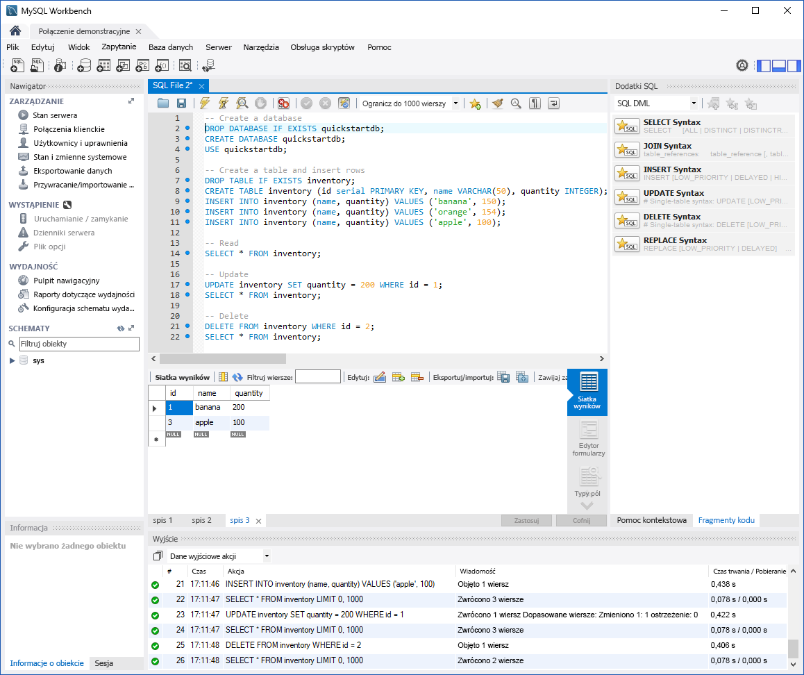

# <a name="azure-database-for-mariadb-use-mysql-workbench-to-connect-and-query-data"></a>Azure Database for MariaDB: nawiązywanie połączeń z danymi i wykonywanie na nich zapytań przy użyciu aplikacji MySQL Workbench

Ten przewodnik Szybki start przedstawia sposób łączenia z wystąpieniem usługi Azure Database for MariaDB przy użyciu aplikacji MySQL Workbench. 

## <a name="prerequisites"></a>Wymagania wstępne

Ten przewodnik Szybki start używa jako punktu wyjścia zasobów utworzonych w jednym z następujących przewodników:

- [Tworzenie serwera usługi Azure Database for MariaDB za pomocą witryny Azure Portal](./quickstart-create-mariadb-server-database-using-azure-portal.md)
- [Tworzenie serwera usługi Azure Database for MariaDB za pomocą interfejsu wiersza polecenia platformy Azure](./quickstart-create-mariadb-server-database-using-azure-cli.md)

## <a name="install-mysql-workbench"></a>Instalacja aplikacji MySQL Workbench

[Pobierz aplikację MySQL Workbench](https://dev.mysql.com/downloads/workbench/) i zainstaluj ją na komputerze.

## <a name="get-connection-information"></a>Pobieranie informacji o połączeniu

Pobierz informacje o połączeniu wymagane do nawiązania połączenia z wystąpieniem usługi Azure Database for MariaDB. Potrzebna jest w pełni kwalifikowana nazwa serwera i poświadczenia logowania.

1. Zaloguj się w witrynie [Azure Portal](https://portal.azure.com/).

2. W menu po lewej stronie w witrynie Azure Portal wybierz pozycję **Wszystkie zasoby**. Wyszukaj utworzony serwer (taki jak **mydemoserver**).

3. Wybierz nazwę serwera.

4. Na stronie **Przegląd** serwera zanotuj wartości pozycji **Nazwa serwera** i **Nazwa logowania administratora serwera**. Jeśli zapomnisz hasła, możesz także je zresetować na tej stronie.

 

## <a name="connect-to-the-server-by-using-mysql-workbench"></a>Nawiązywanie połączenia z serwerem za pomocą aplikacji MySQL Workbench

Aby nawiązać połączenie z serwerem usługi Azure Database for MariaDB przy użyciu aplikacji MySQL Workbench:

1.  Otwórz aplikację MySQL Workbench na komputerze. 

2.  W oknie dialogowym **Konfigurowanie nowego połączenia** na karcie **Parametry** wprowadź poniższe informacje:

    | Ustawienie | Sugerowana wartość | Opis pola |
    |---|---|---|
    |   Nazwa połączenia | **Połączenie demonstracyjne** | Podaj etykietę dla tego połączenia. |
    | Metoda połączenia | **Standardowa (TCP/IP)** | Metoda Standardowa (TCP/IP) jest wystarczająca. |
    | Nazwa hosta | *nazwa serwera* | Określ nazwę serwera użytą do utworzenia wystąpienia usługi Azure Database for MariaDB. Przykładowy serwer to **mydemoserver.mariadb.database.azure.com**. Użyj w pełni kwalifikowanej nazwy domeny (\*.mariadb.database.azure.com), tak jak pokazano w przykładzie. Jeśli nie pamiętasz nazwy serwera, wykonaj kroki w poprzedniej sekcji, aby uzyskać informacje dotyczące połączenia.  |
    | Port | **3306** | Zawsze używaj portu 3306 podczas łączenia z usługą Azure Database for MariaDB. |
    | Nazwa użytkownika |  *nazwa logowania administratora serwera* | Podaj nazwę logowania administratora serwera użytą do utworzenia wystąpienia usługi Azure Database for MariaDB. Przykładowa nazwa użytkownika to **myadmin@mydemoserver**. Jeśli nie pamiętasz nazwy logowania administratora serwera, wykonaj instrukcje w poprzedniej sekcji, aby uzyskać informacje dotyczące połączenia. Format to *username@servername*.
    | Hasło | *Twoje hasło* | Aby zapisać hasło, wybierz pozycję **Store in Vault** (Zapisz w magazynie). |

    

3.   Wybierz pozycję **Test Connection** (Testuj połączenie), aby sprawdzić, czy wszystkie parametry zostały poprawnie skonfigurowane. 

4.   Wybierz pozycję **OK**, aby zapisać połączenie. 

5.   W obszarze **Połączenia programu MySQL** wybierz kafelek odpowiadający używanemu serwerowi. Poczekaj na nawiązanie połączenia.

    Zostanie otwarta nowa karta SQL z pustym edytorem, w którym można wpisać swoje zapytania.
    
    > [!NOTE]
    > Domyślnie na serwerze usługi Azure Database for MariaDB zabezpieczenia SSL połączeń są wymagane i wymuszane. Mimo że zazwyczaj nawiązanie połączenia aplikacji MySQL Workbench z serwerem nie wymaga dodatkowej konfiguracji certyfikatów SSL, zalecamy powiązanie certyfikatu SSL urzędu certyfikacji z aplikacją MySQL Workbench. Jeśli zachodzi potrzeba wyłączenia protokołu SSL, na stronie przeglądu serwera w witrynie Azure Portal wybierz pozycję **Zabezpieczenia połączeń** z menu. Dla pozycji **Wymuszaj połączenie SSL** wybierz opcję **Wyłączone**.

## <a name="create-table-and-insert-read-update-and-delete-data"></a>Tworzenie tabeli oraz wstawianie, odczytywanie, aktualizowanie i usuwanie danych

1. Skopiuj i wklej następujący przykładowy kod SQL na stronie w pustej karcie SQL w celu zilustrowania przykładowych danych.

    Ten kod tworzy pustą bazę danych o nazwie **quickstartdb**. Następnie tworzy przykładową tabelę o nazwie **inventory**. Wstawia pewne wiersze, a następnie odczytuje wiersze. Zmienia dane za pomocą instrukcji update i odczytuje wiersze ponownie. Na końcu kod usuwa wiersz, po czym ponownie odczytuje wiersze.
    
    ```sql
    -- Create a database
    -- DROP DATABASE IF EXISTS quickstartdb;
    CREATE DATABASE quickstartdb;
    USE quickstartdb;
    
    -- Create a table and insert rows
    DROP TABLE IF EXISTS inventory;
    CREATE TABLE inventory (id serial PRIMARY KEY, name VARCHAR(50), quantity INTEGER);
    INSERT INTO inventory (name, quantity) VALUES ('banana', 150);
    INSERT INTO inventory (name, quantity) VALUES ('orange', 154);
    INSERT INTO inventory (name, quantity) VALUES ('apple', 100);
    
    -- Read
    SELECT * FROM inventory;
    
    -- Update
    UPDATE inventory SET quantity = 200 WHERE id = 1;
    SELECT * FROM inventory;
    
    -- Delete
    DELETE FROM inventory WHERE id = 2;
    SELECT * FROM inventory;
    ```

    Zrzut ekranu przedstawia przykładowy kod SQL w aplikacji MySQL Workbench i dane wyjściowe po jego uruchomieniu:
    
    

2. Aby uruchomić przykładowy kod SQL, wybierz ikonę pioruna na pasku narzędzi karty **SQL File** (Plik SQL).
3. Zwróć uwagę na trzy karty wyników w sekcji **Result Grid** (Siatka wyników) w środkowej części strony. 
4. Zwróć uwagę na listę **Output** (Dane wyjściowe) w dolnej części strony. Zawiera ona stan każdego polecenia. 

W ramach tego przewodnika Szybki start nawiązano połączenie z usługą Azure Database for MariaDB przy użyciu aplikacji MySQL Workbench i wykonano zapytanie o dane przy użyciu języka SQL.

<!--
## Next steps
> [!div class="nextstepaction"]
> [Migrate your database using Export and Import](./concepts-migrate-import-export.md)
-->
