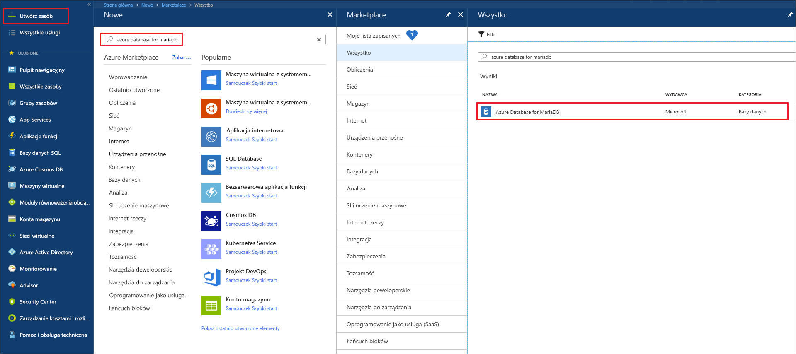
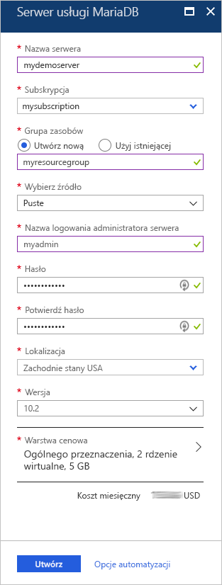
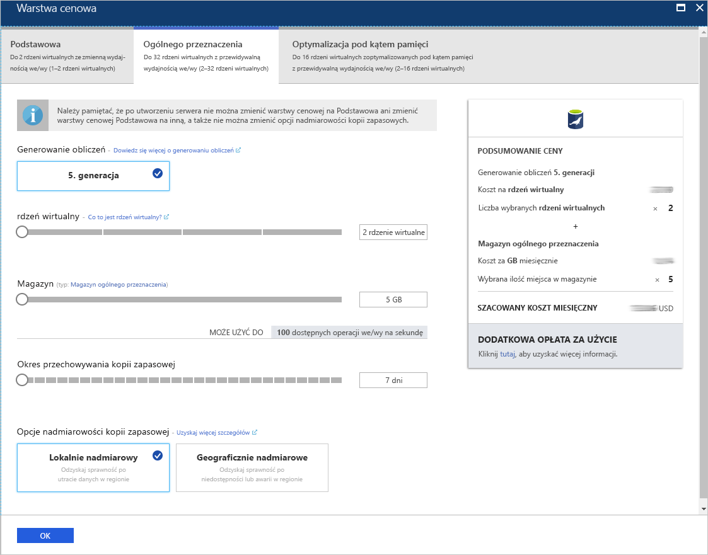

# <a name="create-an-azure-database-for-mariadb-server-by-using-the-azure-portal"></a>Tworzenie serwera usługi Azure Database for MariaDB za pomocą witryny Azure Portal

Azure Database for MariaDB to usługa zarządzana, która umożliwia uruchamianie i skalowanie w chmurze baz danych MariaDB o wysokiej dostępności oraz zarządzanie nimi. W tym przewodniku Szybki start przedstawiono, jak utworzyć serwer usługi Azure Database for MariaDB za pomocą witryny Azure Portal w ciągu okołu pięciu minut.  

Jeśli nie masz subskrypcji platformy Azure, przed rozpoczęciem utwórz [bezpłatne konto platformy Azure](https://azure.microsoft.com/free/).

## <a name="sign-in-to-the-azure-portal"></a>Logowanie się do witryny Azure Portal

Otwórz witrynę [Azure Portal](https://portal.azure.com/) w przeglądarce internetowej. Wprowadź swoje poświadczenia, aby zalogować się do portalu. Widok domyślny to pulpit nawigacyjny usług.

## <a name="create-an-azure-database-for-mariadb-server"></a>Tworzenie serwera usługi Azure Database for MariaDB

Serwer usługi Azure Database for MariaDB jest tworzony za pomocą zdefiniowanego zestawu [zasobów obliczeniowych i przestrzeni dyskowej](concepts-pricing-tiers.md). Serwer jest tworzony w ramach [grupy zasobów Azure](../azure-resource-manager/resource-group-overview.md).

Aby utworzyć serwer usługi Azure Database for MariaDB:

1. Wybierz przycisk **Utwórz zasób** (+) w lewym górnym rogu portalu.

2. Wpisz wartość **Azure Database for MariaDB** w polu wyszukiwania, aby znaleźć usługę.

   

3. Wprowadź lub wybierz poniższe szczegółowe informacje dotyczące serwera:
   
   

    Ustawienie | Sugerowana wartość | Opis
    ---|---|---
    Nazwa serwera | *unikatowa nazwa serwera* | Wybierz unikatową nazwę, która identyfikuje serwer usługi Azure Database for MariaDB. Na przykład **mydemoserver**. Nazwa domeny *.mariadb.database.azure.com* jest dołączana do wprowadzanej nazwy serwera. Nazwa serwera może zawierać tylko małe litery, cyfry i znaki łącznika (-). Musi zawierać od 3 do 63 znaków.
    Subskrypcja | *Twoja subskrypcja* | Wybierz subskrypcję platformy Azure, która ma być używana dla serwera. Jeśli masz wiele subskrypcji, wybierz tę, w ramach której są naliczane opłaty za ten zasób.
    Grupa zasobów | **myresourcegroup** | Wprowadź nazwę nowej grupy zasobów lub wybierz istniejącą grupę zasobów. 
    Wybierz źródło | **Puste** | Wybierz opcję **Puste**, aby utworzyć nowy serwer od początku. Opcję **Kopia zapasowa** należy wybrać w przypadku tworzenia serwera z geograficznej kopii zapasowej istniejącego serwera usługi Azure Database for MariaDB.
    Identyfikator logowania administratora serwera | **myadmin** | Konto logowania do użycia podczas łączenia z serwerem. Nazwą logowania administratora nie może być **azure_superuser**, **admin**, **administrator**, **root**, **guest** ani **public**.
    Hasło | *wartość wybrana przez użytkownika* | Wprowadź nowe hasło dla konta administratora serwera. Musi zawierać od 8 do 128 znaków. Hasło musi zawierać znaki z trzech z następujących kategorii: wielkie litery z alfabetu angielskiego, małe litery z alfabetu angielskiego, cyfry (0–9) i znaki inne niż alfanumeryczne (!, $, #, % i tak dalej).
    Potwierdź hasło | *wartość wybrana przez użytkownika*| Potwierdź hasło do konta administratora.
    Lokalizacja | *region najbliżej Twoich użytkowników*| Wybierz lokalizację najbliżej użytkowników lub innych aplikacji platformy Azure.
    Wersja | *najnowsza wersja*| Najnowsza wersja, chyba że z konkretnych powodów wymagana jest inna wersja.
    Warstwa cenowa | Patrz opis. | Konfiguracje obliczania, magazynu i kopii zapasowej dla nowego serwera. Wybierz pozycję **Warstwa cenowa** > **Ogólnego przeznaczenia**. Zachowaj wartości domyślne dla następujących ustawień:<br><ul><li>**Generacja obliczeń** (5. generacja)</li><li>**Rdzeń wirtualny** (2 rdzenie wirtualne)</li><li>**Magazyn** (5 GB)</li><li>**Okres przechowywania kopii zapasowej** (7 dni)</li></ul><br>Aby włączyć kopie zapasowe serwera w magazynie geograficznie nadmiarowym, w obszarze **Opcje nadmiarowości kopii zapasowej** wybierz pozycję **Geograficznie nadmiarowy**. <br><br>Aby zapisać tę wybraną warstwę cenową, wybierz przycisk **OK**. Następny zrzut ekranu przedstawia te wybory.
  
   > [!NOTE]
   > Jeśli niewielkie zasoby obliczeniowe i we/wy są wystarczające dla Twojego obciążenia, warto rozważyć użycie warstwy cenowej Podstawowa. Pamiętaj, że serwerów utworzonych w warstwie cenowej Podstawowa nie można później przeskalować do warstwy Ogólnego przeznaczenia lub Zoptymalizowana pod kątem pamięci. Przejdź na [stronę cennika](https://azure.microsoft.com/pricing/details/mariadb/), aby uzyskać więcej informacji.
   > 

   

4.  Wybierz pozycję **Utwórz**, aby aprowizować serwer. Aprowizowanie może zająć do 20 minut.
   
5.  Wybierz pozycję **Powiadomienia** (ikonę dzwonka) na pasku narzędzi, aby monitorować proces wdrażania.
   
Domyślnie na serwerze są tworzone następujące bazy danych: **information_schema**, **mysql**, **performance_schema** i **sys**.


## <a name="configure-firewall-rule"></a>Konfigurowanie reguły zapory na poziomie serwera

Usługa Azure Database for MariaDB tworzy zaporę na poziomie serwera. Ta zapora uniemożliwia zewnętrznym aplikacjom i narzędziom łączenie się z serwerem i wszelkimi bazami danych na tym serwerze, chyba że zostanie utworzona reguła zapory otwierająca zaporę dla konkretnych adresów IP. 

Aby utworzyć regułę zapory na poziomie serwera:

1.   Po zakończeniu wdrażania odszukaj serwer. Jeśli to konieczne, możesz go wyszukać. Na przykład w menu po lewej stronie wybierz pozycję **Wszystkie zasoby**. Następnie wprowadź nazwę serwera. Na przykład wprowadź wartość **mydemoserver**, aby wyszukać nowo utworzony serwer. Wybierz nazwę serwera z listy wyników wyszukiwania. Zostanie otwarta strona **Przegląd** dotycząca Twojego serwera. Na tej stronie możesz zmienić dodatkowe ustawienia.

2. Na stronie przeglądu serwera wybierz pozycję **Zabezpieczenia połączeń**.

3.  W obszarze **Reguły zapory** wybierz puste pole tekstowe w kolumnie **Nazwa reguły**, aby rozpocząć tworzenie reguły zapory. Podaj dokładny zakres adresów IP klientów, którzy będą nawiązywać połączenie z tym serwerem.
   
   

4. Na górnym pasku narzędzi strony **Zabezpieczenia połączeń** wybierz pozycję **Zapisz**. Przed kontynuowaniem zaczekaj na wyświetlenie powiadomienia z informacją, że aktualizacja została pomyślnie zakończona. 

   > [!NOTE]
   > Połączenia z usługą Azure Database for MariaDB korzystają z portu 3306. Jeśli próbujesz nawiązać połączenie z sieci firmowej, ruch wychodzący na porcie 3306 może być zablokowany. W takim przypadku w celu nawiązania połączenia z serwerem konieczne jest otwarcie portu 3306 przez Twój dział IT.
   > 

## <a name="get-connection-information"></a>Pobieranie informacji o połączeniu

Aby można było nawiązać połączenie z serwerem bazy danych, potrzebne są pełna nazwa serwera i poświadczenia logowania administratora. Być może te wartości zostały zanotowane wcześniej podczas pracy z tym artykułem. Jeśli tak się nie stało, możesz łatwo odnaleźć nazwę serwera i informacje dotyczące logowania na stronie **Przegląd** lub **Właściwości** serwera w witrynie Azure Portal:

1. Przejdź na stronę **Przegląd** serwera. Zanotuj wartości pól **Nazwa serwera** i **Nazwa logowania administratora serwera**. 

2. Aby skopiować te wartości, umieść kursor nad polem, którego wartość chcesz skopiować. Po prawej stronie tekstu pojawi się ikona kopiowania. Wybierz ikonę kopiowania, aby w razie potrzeby skopiować wartości.

W naszym przykładzie nazwa serwera to **mydemoserver.mariadb.database.azure.com**, a nazwa logowania administratora serwera to **myadmin@mydemoserver**.

## <a name="connect-to-azure-database-for-mariadb-by-using-the-mysql-command-line"></a>Nawiązywanie połączenia z usługą Azure Database for MariaDB przy użyciu wiersza polecenia mysql

Istnieje wiele aplikacji, za pomocą których można nawiązać połączenie z serwerem usługi Azure Database for MariaDB.

Użyjmy najpierw narzędzia wiersza polecenia [mysql](https://dev.mysql.com/doc/refman/5.7/en/mysql.html), aby zilustrować procedurę nawiązywania połączenia z serwerem. Możesz również użyć przeglądarki internetowej i usługi Azure Cloud Shell bez instalowania jakiegokolwiek oprogramowania. Jeśli masz zainstalowane lokalnie narzędzie mysql, możesz nawiązać połączenie także za jego pomocą.

1. Uruchom usługę Azure Cloud Shell za pomocą ikony terminalu (**>_**) znajdującej się na pasku narzędzi w prawej górnej części witryny Azure Portal.


2.  Usługa Azure Cloud Shell zostanie otwarta w przeglądarce. W ramach tej usługi możesz używać poleceń powłoki Bash.

   

3. W wierszu polecenia usługi Cloud Shell nawiąż połączenie z serwerem usługi Azure Database for MariaDB, przechodząc do wiersza polecenia mysql.

    Następujący format służy do łączenia z serwerem usługi Azure Database for MariaDB przy użyciu narzędzia mysql:

    ```bash
    mysql --host <fully qualified server name> --user <server admin login name>@<server name> -p
    ```

    Na przykład następujące polecenie umożliwia połączenie z przykładowym serwerem:

    ```azurecli-interactive
    mysql --host mydemoserver.mariadb.database.azure.com --user myadmin@mydemoserver -p
    ```

    Parametr narzędzia mysql |Sugerowana wartość|Opis
    ---|---|---
    --host | *nazwa serwera* | Nazwa serwera, która została użyta do utworzenia serwera usługi Azure Database for MariaDB. Przykładowy serwer to **mydemoserver.mariadb.database.azure.com**. Użyj w pełni kwalifikowanej nazwy domeny (**\*.mariadb.database.azure.com**), tak jak pokazano w przykładzie. Jeśli nie pamiętasz nazwy serwera, wykonaj kroki w poprzedniej sekcji, aby uzyskać informacje dotyczące połączenia.
    --user | *nazwa logowania administratora serwera* |Nazwa logowania administratora serwera, która została użyta do utworzenia serwera usługi Azure Database for MariaDB. Jeśli nie pamiętasz nazwy użytkownika, wykonaj kroki w poprzedniej sekcji, aby uzyskać informacje dotyczące połączenia. Format to *username@servername*.
    -p | *Twoje hasło*<br>(zaczekaj, aż zostanie wyświetlony monit) |Po wyświetleniu monitu wprowadź hasło, które zostało użyte do utworzenia serwera. Weź pod uwagę, że wpisywane znaki nie są wyświetlane w wierszu polecenia powłoki Bash. Po wprowadzeniu hasła naciśnij klawisz Enter.

   Po nawiązaniu połączenia w narzędziu mysql zostanie wyświetlony wiersz polecenia `mysql>`. W tym wierszu polecenia możesz wprowadzać polecenia. 

   Oto przykładowe dane wyjściowe narzędzia mysql:

    ```bash
    Welcome to the MySQL monitor.  Commands end with ; or \g.
    Your MySQL connection id is 65505
    Server version: 5.6.39.0 MariaDB Server
    
    Copyright (c) 2000, 2017, Oracle and/or its affiliates. All rights reserved.
    
    Oracle is a registered trademark of Oracle Corporation and/or its
    affiliates. Other names may be trademarks of their respective
    owners.

    Type 'help;' or '\h' for help. Type '\c' to clear the current input statement.
    
    mysql>
    ```
    
    > [!TIP]
    > Jeśli konfiguracja zapory nie umożliwia dostępu do adresu IP usługi Azure Cloud Shell, wystąpi następujący błąd:
    >
    >   BŁĄD 2003 (28000): Klient o adresie IP 123.456.789.0 nie może uzyskać dostępu do serwera.
    >
    > Aby naprawić ten błąd, upewnij się, że konfiguracja serwera jest zgodna z krokami opisanymi w sekcji [Konfigurowanie reguły zapory na poziomie serwera](#configure-firewall-rule).

4. Aby zweryfikować połączenie, w wierszu polecenia `mysql>` wprowadź polecenie **status** w celu sprawdzenia stanu serwera.

    ```sql
    status
    ```

   > [!TIP]
   > Aby zapoznać się z dodatkowymi poleceniami, zobacz [MySQL 5.7 Reference Manual - Chapter 4.5.1 (Podręcznik programu MySQL 5.7 — Rozdział 4.5.1)](https://dev.mysql.com/doc/refman/5.7/en/mysql.html).

5.  Utwórz pustą bazę danych, wpisując następujące polecenie w wierszu polecenia `mysql>`:

    ```sql
    CREATE DATABASE quickstartdb;
    ```
    Wykonanie polecenia może potrwać kilka minut. 

    Na serwerze usługi Azure Database for MariaDB można utworzyć jedną lub wiele baz danych. Możesz utworzyć jedną bazę danych na serwer w celu wykorzystania wszystkich zasobów. Możesz też utworzyć wiele baz danych współdzielących zasoby. Nie istnieje limit dotyczący maksymalnej liczby baz danych, które można utworzyć, ale w przypadku wielu baz danych są współdzielone te same zasoby serwera. 

6. Aby wyświetlić listę baz danych, w wierszu polecenia `mysql>` wprowadź następujące polecenie:

    ```sql
    SHOW DATABASES;
    ```

7.  Wprowadź polecenie **\q**, a następnie naciśnij klawisz ENTER, aby zamknąć narzędzie mysql. Następnie możesz zamknąć usługę Azure Cloud Shell.

Nawiązano połączenie z serwerem usługi Azure Database for MariaDB i utworzono pustą bazę danych użytkownika. W następnej sekcji nawiążesz połączenie z tym samym serwerem przy użyciu innego popularnego narzędzia — MySQL Workbench.

## <a name="connect-to-the-server-by-using-mysql-workbench"></a>Nawiązywanie połączenia z serwerem za pomocą aplikacji MySQL Workbench

Aby nawiązać połączenia z serwerem za pomocą aplikacji MySQL Workbench:

1. Otwórz aplikację MySQL Workbench na swoim komputerze klienckim. Aby pobrać i zainstalować aplikację MySQL Workbench, przejdź na [stronę pobierania aplikacji MySQL Workbench](https://dev.mysql.com/downloads/workbench/).

2. Aby utworzyć nowe połączenie, wybierz ikonę znaku plus (**+**) obok nagłówka **MySQL Connections** (Połączenia MySQL).

3. W oknie dialogowym **Setup New Connection** (Konfigurowanie nowego połączenia) wprowadź informacje dotyczące połączenia serwera na karcie **Parameters** (Parametry). Wartości zastępcze są wyświetlane jako przykład. Zamień wartości pól **Hostname** (Nazwa hosta), **Username** (Nazwa użytkownika) i **Password** (Hasło) własnymi wartościami.

   

    |Ustawienie |Sugerowana wartość|Opis pola|
    |---|---|---|
     Nazwa połączenia | **Połączenie demonstracyjne** | Etykieta dla tego połączenia. |
    Metoda połączenia | **Standardowa (TCP/IP)** | Metoda Standardowa (TCP/IP) jest wystarczająca. |
    Nazwa hosta | *nazwa serwera* | Nazwa serwera, która została użyta do utworzenia serwera usługi Azure Database for MariaDB. Przykładowy serwer to **mydemoserver.mariadb.database.azure.com**. Użyj w pełni kwalifikowanej nazwy domeny (**\*.mariadb.database.azure.com**), tak jak pokazano w przykładzie. Jeśli nie pamiętasz nazwy serwera, wykonaj kroki opisane wcześniej w tym artykule, aby uzyskać informacje dotyczące połączenia.|
     Port | 3306 | Port używany podczas nawiązywania połączenia z serwerem usługi Azure Database for MariaDB. |
    Nazwa użytkownika |  *nazwa logowania administratora serwera* | Informacje dotyczące logowania administratora serwera użyte do utworzenia serwera usługi Azure Database for MariaDB. Przykładowa nazwa użytkownika to **myadmin@mydemoserver**. Jeśli nie pamiętasz nazwy użytkownika, wykonaj kroki opisane wcześniej w tym artykule, aby uzyskać informacje dotyczące połączenia. Format to *username@servername*.
    Hasło | *Twoje hasło* | Aby zapisać hasło, wybierz pozycję **Store in Vault** (Zapisz w magazynie). |

4. Wybierz pozycję **Test Connection** (Testuj połączenie), aby sprawdzić, czy wszystkie parametry zostały poprawnie skonfigurowane. Następnie wybierz przycisk **OK**, aby zapisać połączenie. 

    > [!NOTE]
    > Domyślnie na serwerze wymuszany jest protokół SSL. W celu pomyślnego nawiązania połączenia wymagane jest wykonanie dodatkowych czynności konfiguracyjnych. Aby uzyskać więcej informacji, zobacz [Configure SSL connectivity in your application to securely connect to Azure Database for MySQL (Konfigurowanie łączności SSL w aplikacji w celu bezpiecznego nawiązywania połączeń z usługą Azure Database for MariaDB)](./howto-configure-ssl.md). Aby wyłączyć protokół SSL w ramach tego przewodnika Szybki start, na stronie przeglądu serwera w witrynie Azure Portal wybierz z menu pozycję **Zabezpieczenia połączeń**. Dla pozycji **Wymuszaj połączenie SSL** wybierz opcję **Wyłączone**.
    >

## <a name="clean-up-resources"></a>Oczyszczanie zasobów

Zasoby, które zostały utworzone w ramach tego przewodnika Szybki start, możesz wyczyścić na dwa sposoby. Możesz usunąć [grupę zasobów platformy Azure](../azure-resource-manager/resource-group-overview.md). Powoduje to usunięcie wszystkich zasobów w grupie zasobów. Jeśli chcesz zachować inne zasoby bez zmian, usuń tylko ten jeden zasób serwera.

> [!TIP]
> Inne przewodniki Szybki start w tej kolekcji bazują na tym przewodniku. Jeśli chcesz kontynuować pracę z przewodnikami Szybki start dotyczącymi usługi Azure Database for MariaDB, nie usuwaj zasobów utworzonych w tym przewodniku. Jeśli nie planujesz kontynuowania pracy, wykonaj następujące czynności, aby usunąć wszystkie zasoby utworzone w ramach tego przewodnika Szybki start.
>

Aby usunąć całą grupę zasobów łącznie z nowo utworzonym serwerem:

1.  Znajdź grupę zasobów w witrynie Azure Portal. W menu po lewej stronie wybierz pozycję **Grupy zasobów**, a następnie wybierz nazwę grupy zasobów (w naszym przykładzie to **myresourcegroup**).

2.  Na stronie grupy zasobów wybierz pozycję **Usuń**. Następnie wprowadź nazwę grupy zasobów (w naszym przykładzie to **myresourcegroup**), aby potwierdzić usunięcie. Wybierz pozycję **Usuń**.

Aby usunąć tylko nowo utworzony serwer:

1.  Znajdź serwer w witrynie Azure Portal, jeśli nie jest jeszcze otwarty. W menu po lewej stronie wybierz pozycję **Wszystkie zasoby**. Następnie wyszukaj utworzony serwer.

2.  Na stronie **Przegląd** wybierz pozycję **Usuń**. 

   

3.  Potwierdź nazwę serwera, który ma zostać usunięty. Spowoduje to wyświetlenie baz danych na tym serwerze, na które usunięcie będzie miało wpływ. Wprowadź nazwę serwera (w naszym przykładzie to **mydemoserver**), aby potwierdzić usunięcie. Wybierz pozycję **Usuń**.

## <a name="next-steps"></a>Następne kroki

- [Projektowanie pierwszej bazy danych usługi Azure Database for MariaDB](./tutorial-design-database-using-portal.md)
