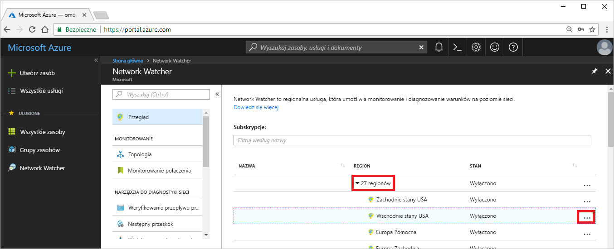
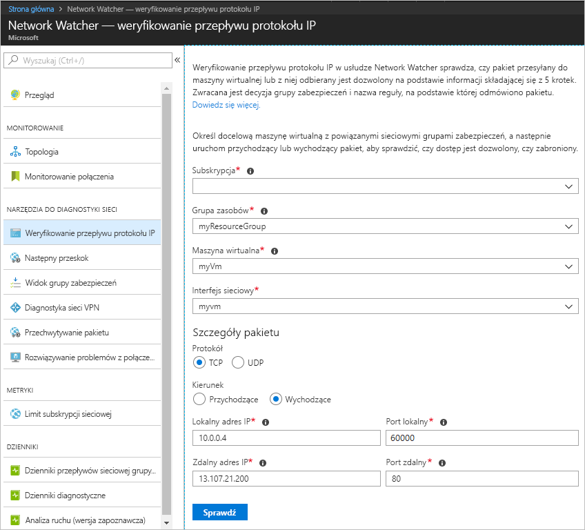

# Szybki start: diagnozowanie problemu z filtrowaniem ruchu sieciowego maszyny wirtualnej przy użyciu witryny Azure Portal

W tym przewodniku Szybki start wdrożysz maszynę wirtualną, a następnie sprawdzisz komunikację z adresem IP i adresem URL oraz komunikację z adresu IP. Określisz przyczynę niepowodzenia komunikacji oraz sposób rozwiązania problemu.

Jeśli nie masz subskrypcji platformy Azure, przed rozpoczęciem utwórz [bezpłatne konto](https://azure.microsoft.com/free/?WT.mc_id=A261C142F).

## Zaloguj się do platformy Azure.

Zaloguj się do witryny Azure Portal na stronie https://portal.azure.com.

## Tworzenie maszyny wirtualnej

1. W lewym górnym rogu witryny Azure Portal wybierz pozycję **+ Utwórz zasób**.
2. Wybierz pozycję **Compute**, a następnie wybierz pozycję **Windows Server 2016 Datacenter** lub wersję **Ubuntu Server**.
3. Wprowadź lub wybierz poniższe informacje, zaakceptuj wartości domyślne pozostałych ustawień, a następnie wybierz przycisk **OK**:

    |Ustawienie|Wartość|
    |---|---|
    |Nazwa|myVm|
    |Nazwa użytkownika| Wprowadź wybraną nazwę użytkownika.|
    |Hasło| Wprowadź wybrane hasło. Hasło musi mieć co najmniej 12 znaków i spełniać zdefiniowane wymagania dotyczące złożoności.|
    |Subskrypcja| Wybierz subskrypcję.|
    |Grupa zasobów| Wybierz pozycję **Utwórz nową**, a następnie wprowadź nazwę **myResourceGroup**.|
    |Lokalizacja| Wybierz **Wschodnie stany USA**|

4. Wybierz rozmiar maszyny wirtualnej, a następnie wybierz pozycję **Wybierz**.
5. W obszarze **Ustawienia** zaakceptuj wszystkie wartości domyślne i wybierz przycisk **OK**.
6. W obszarze **Utwórz** na stronie **Podsumowanie** wybierz pozycję **Utwórz**, aby rozpocząć wdrażanie maszyny wirtualnej. Wdrożenie maszyny wirtualnej potrwa kilka minut. Zanim przejdziesz do pozostałych kroków, poczekaj na zakończenie wdrażania maszyny wirtualnej.

## Testowanie komunikacji sieciowej

Aby przetestować komunikację sieciową za pomocą usługi Network Watcher, najpierw włącz usługę Network Watcher co najmniej w jednym regionie świadczenia usługi Azure, a następnie użyj możliwości weryfikowania przepływu adresów IP dostępnej w usłudze Network Watcher.

### Włączanie usługi Network Watcher

Jeśli masz już włączony obserwator sieciowy w co najmniej jednym regionie, przejdź do obszaru [Użyj weryfikacji przepływu IP](#use-ip-flow-verify).

1. W portalu wybierz pozycję **Wszystkie usługi**. W **polu filtru** wprowadź ciąg *Network Watcher*. Gdy w wynikach pojawi się nazwa **Network Watcher**, wybierz ją.
2. Włącz usługę Network Watcher w regionie Wschodnie stany USA, ponieważ to tam wdrożono maszynę wirtualną w poprzednim kroku. Wybierz węzeł **Regiony**, aby go rozwinąć, a następnie wybierz symbol **...** z prawej strony pozycji **Wschodnie stany USA**, jak pokazano na poniższej ilustracji:

    

3. Wybierz pozycję **Włącz usługę Network Watcher**.

### Korzystanie z weryfikowania przepływu adresów IP

Podczas tworzenia maszyny wirtualnej platforma Azure domyślnie zezwala na i blokuje ruch sieciowy do i z maszyny wirtualnej. Domyślne ustawienia platformy Azure można później zastąpić, aby zezwalać lub nie zezwalać na dodatkowe typy ruchu.

1. W portalu wybierz pozycję **Wszystkie usługi**. W polu *Filtr* **wszystkie usługi** wprowadź *Network Watcher*. Gdy w wynikach pojawi się nazwa **Network Watcher**, wybierz ją.
2. W obszarze **Narzędzia do diagnostyki sieci** wybierz pozycję **Weryfikowanie przepływu adresów IP**.
3. Wybierz subskrypcję, wpisz lub wybierz następujące wartości, a następnie wybierz pozycję **Sprawdź**, jak pokazano na poniższej ilustracji:

    |Ustawienie            |Wartość                                                                                              |
    |---------          |---------                                                                                          |
    | Grupa zasobów    | Wybierz pozycję myResourceGroup                                                                            |
    | Maszyna wirtualna   | Wybierz pozycję myVm                                                                                       |
    | Interfejs sieciowy | myvm — nazwa interfejsu sieciowego utworzonego w portalu podczas tworzenia maszyny wirtualnej jest inna. |
    | Protokół          | TCP                                                                                               |
    | Kierunek         | Wychodzący                                                                                          |
    | Lokalny adres IP  | 10.0.0.4                                                                                          |
    | Port lokalny      | 60000                                                                                                |
    | Zdalny adres IP | 13.107.21.200 — jeden z adresów dla <www.bing.com>.                                             |
    | Port zdalny       | 80                                                                                                |

    

    Wynik zwrócony po kilku sekundach informuje, że dostęp jest dozwolony dzięki regule zabezpieczeń o nazwie **AllowInternetOutbound**. Jeśli masz usługę Network Watcher w regionie innym niż Wschodnie stany USA, po uruchomieniu testu automatycznie jest tworzona usługa Network Watcher w regionie Wschodnie stany USA.
4. Wykonaj ponownie krok 3, ale wartość pola **Zdalny adres IP** zmień na **172.31.0.100**. Zwrócony wynik informuje o odmowie dostępu z powodu reguły zabezpieczeń o nazwie **DefaultOutboundDenyAll**.
5. Wykonaj ponownie krok 3, ale opcję **Kierunek** ustaw na **Przychodzący**, **Port lokalny** na **80**, a **Port zdalny** na **60000**. Zwrócony wynik informuje o odmowie dostępu z powodu reguły zabezpieczeń o nazwie **DefaultInboundDenyAll**.

Gdy już wiesz, które reguły zabezpieczeń zezwalają na ruch lub blokują ruch do lub z maszyny wirtualnej, możesz określić, jak rozwiązać problemy.

## Wyświetlanie szczegółów reguły zabezpieczeń

1. Aby ustalić, dlaczego reguły wymienione w krokach 3–5 sekcji **Korzystanie z weryfikowania przepływu adresów IP** zezwalają na komunikację lub ją blokują, zapoznaj się z aktywnymi regułami zabezpieczeń interfejsu sieciowego w maszynie wirtualnej. W polu wyszukiwania w górnej części portalu wpisz ciąg *myvm*. Gdy interfejs sieciowy **myvm** (lub interfejs sieciowy o innej nazwie) pojawi się w wynikach wyszukiwania, wybierz go.
2. Wybierz pozycję **Aktywne reguły zabezpieczeń** w obszarze **Pomoc techniczna i rozwiązywanie problemów**, jak pokazano na poniższej ilustracji:

    

    W kroku 3 sekcji **Korzystanie z weryfikowania przepływu adresów IP** okazało się, że komunikacja jest dozwolona dzięki regule **AllowInternetOutbound**. Na poprzedniej ilustracji widać, że **miejscem docelowym** dla tej reguły jest **Internet**. Nie jest jednak jasne, jak adres 13.107.21.200, który był testowany w kroku 3 sekcji **Korzystanie z weryfikowania przepływu adresów IP**, jest związany z **Internetem**.
3. Wybierz regułę **AllowInternetOutBound**, a następnie wybierz pozycję **Miejsce docelowe**, jak pokazano na poniższej ilustracji:

    

    Jednym z prefiksów na liście jest prefiks **12.0.0.0/6**, który obejmuje zakres adresów IP 12.0.0.1-15.255.255.254. Ponieważ adres 13.107.21.200 mieści się w tym zakresie adresów, reguła **AllowInternetOutBound** zezwala na ruch wychodzący. Ponadto na ilustracji w kroku 2 nie ma żadnych reguł o wyższym priorytecie (niższym numerze), które przesłaniają tę regułę. Zamknij okno **Prefiksy adresów**. Aby blokować komunikację wychodzącą z adresem 13.107.21.200, możesz dodać regułę zabezpieczeń o wyższym priorytecie, która blokuje ruch wychodzący na porcie 80 do tego adresu IP.
4. Gdy w kroku 4 sekcji **Korzystanie z weryfikowania przepływu adresów IP** uruchomiliśmy test ruchu wychodzącego do adresu 172.131.0.100, okazało się, że komunikacja została zablokowana przez regułę **DefaultOutboundDenyAll**. Ta reguła jest równoważna regule **DenyAllOutBound** pokazanej na ilustracji w kroku 2, w której jako **miejsce docelowe** podano prefiks **0.0.0.0/0**. Reguła blokuje komunikację wychodzącą z adresem 172.131.0.100, ponieważ ten adres nie mieści się w ramach prefiksu **Miejsce docelowe** żadnej innej **reguły ruchu wychodzącego** widocznej na ilustracji. Aby zezwolić na komunikację wychodzącą, możesz dodać regułę zabezpieczeń o wyższym priorytecie, która zezwala na ruch wychodzący na porcie 80 do adresu 172.131.0.100.
5. Gdy w kroku 5 sekcji **Korzystanie z weryfikowania przepływu adresów IP** uruchomiliśmy test ruchu przychodzącego z adresu 172.131.0.100, okazało się, że komunikacja została zablokowana przez regułę **DefaultInboundDenyAll**. Ta reguła jest równoważna regule **DenyAllInBound** pokazanej na ilustracji w kroku 2. Następuje wymuszenie reguły **DenyAllInBound**, ponieważ nie istnieje inna reguła o wyższym priorytecie, która zezwala na ruch przychodzący do maszyny wirtualnej na porcie 80 z adresu 172.31.0.100. Aby zezwolić na komunikację przychodzącą, możesz dodać regułę zabezpieczeń o wyższym priorytecie, która zezwala na ruch przychodzący na porcie 80 z adresu 172.31.0.100.

Za pomocą testów w tym przewodniku Szybki start przetestowano konfigurację platformy Azure. Jeśli testy zwróciły oczekiwane wyniki, ale nadal występują problemy z siecią, upewnij się, że między maszyną wirtualną a punktem końcowym, z którym się komunikujesz, nie znajduje się zapora oraz że system operacyjny maszyny wirtualnej nie ma zapory, która zezwala na komunikację lub ją blokuje.

## Czyszczenie zasobów

Gdy grupa zasobów i wszystkie znajdujące się w niej zasoby nie będą już potrzebne, usuń je:

1. Wprowadź ciąg *myResourceGroup* w polu **Szukaj** w górnej części portalu. Gdy pozycja **myResourceGroup** pojawi się w wynikach wyszukiwania, wybierz ją.
2. Wybierz pozycję **Usuń grupę zasobów**.
3. Wprowadź dla elementu *Webresourcename* **Typ Nazwa grupy zasobów:** a następnie wybierz pozycję **Usuń**.

## Następne kroki

W tym przewodniku Szybki utworzono maszynę wirtualną i zdiagnozowano filtry przychodzącego i wychodzącego ruchu sieciowego. Wiesz już, że reguły sieciowej grupy zabezpieczeń zezwalają na lub blokują ruch do i z maszyny wirtualnej. Dowiedz się więcej o [regułach zabezpieczeń](../virtual-network/security-overview.md?toc=%2fazure%2fnetwork-watcher%2ftoc.json) oraz [tworzeniu reguł zabezpieczeń](../virtual-network/manage-network-security-group.md?toc=%2fazure%2fnetwork-watcher%2ftoc.json#create-a-security-rule).

Nawet przy zastosowaniu odpowiednich filtrów ruchu sieciowego komunikacja z maszyną wirtualną może nadal kończyć się niepowodzeniem z powodu konfiguracji routingu. Aby dowiedzieć się, jak diagnozować problemy z routingiem sieci maszyny wirtualnej, zobacz [Diagnozowanie problemów z routingiem maszyny wirtualnej](diagnose-vm-network-routing-problem.md). Aby za pomocą jednego narzędzia diagnozować problemy z routingiem ruchu wychodzącego, opóźnieniem i filtrowaniem ruchu, zobacz [Rozwiązywanie problemów z połączeniami](network-watcher-connectivity-portal.md).
