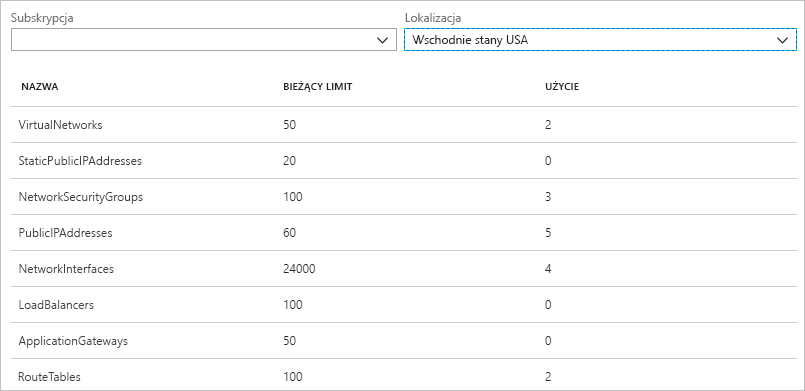
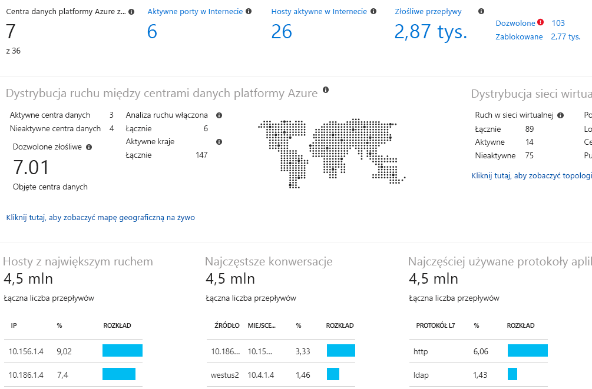

# Co to jest platforma Azure Network Watcher?

Usługa Azure Network Watcher udostępnia narzędzia do monitorowania, diagnozowania, wyświetlania metryk i włączania i wyłączania dzienników dla zasobów w sieci wirtualnej platformy Azure. Network Watcher zaprojektowano do monitorowania i naprawy kondycji sieci usług IaaS (infrastruktura jako usługa), w tym Virtual Machines, sieci wirtualnych, bram aplikacji, modułów równoważenia obciążenia itp. Uwaga: nie jest ona przeznaczona dla i nie będzie działała w przypadku monitorowania PaaS lub analizy sieci Web. 

## Monitorowanie

### Monitorowanie komunikacji między maszyną wirtualną a punktem końcowym

Punkty końcowe mogą być innymi maszynami wirtualnymi, w pełni kwalifikowaną nazwą domeny (FQDN), Uniform Resource Identifier (URI) lub adresem IPv4. Funkcja *monitor połączeń* monitoruje komunikację w regularnych odstępach czasu i informuje o zmianach, opóźnieniach i topologii sieci między maszyną wirtualną a punktem końcowym. Na przykład może być dostępna maszyna wirtualna serwera sieci Web, która komunikuje się z maszyną wirtualną serwera bazy danych. Ktoś w organizacji może, w nieznanym przypadku, zastosować niestandardową trasę lub regułę zabezpieczeń sieci do serwera sieci Web lub maszyny wirtualnej lub podsieci serwera bazy danych.

Jeśli punkt końcowy zostanie nieosiągalny, rozwiązywanie problemów z połączeniem informuje o przyczynie. Potencjalnymi przyczynami jest problem z rozpoznawaniem nazw DNS, procesor CPU, pamięć lub Zapora w ramach systemu operacyjnego maszyny wirtualnej lub typ przeskoku trasy niestandardowej lub reguła zabezpieczeń dla maszyny wirtualnej lub podsieci połączenia wychodzącego. Dowiedz się więcej o [regułach zabezpieczeń](../virtual-network/security-overview.md?toc=%2fazure%2fnetwork-watcher%2ftoc.json#security-rules) i [typach przeskoków tras](../virtual-network/virtual-networks-udr-overview.md?toc=%2fazure%2fnetwork-watcher%2ftoc.json) na platformie Azure.

Monitor połączeń zapewnia także minimalne, średnie i maksymalne opóźnienia zaobserwowane w czasie. Po pouczeniu się opóźnienia połączenia może się okazać, że można zmniejszyć opóźnienia, przenosząc zasoby platformy Azure do różnych regionów świadczenia usługi Azure. Dowiedz się więcej o określaniu [względnych opóźnień między regionami platformy Azure i dostawcami usług internetowych](#determine-relative-latencies-between-azure-regions-and-internet-service-providers) oraz o sposobie monitorowania komunikacji między maszyną wirtualną a punktem końcowym za pomocą [monitora połączeń](connection-monitor.md). Jeśli zamiast tego testujesz połączenie w danym momencie, zamiast monitorować połączenie w czasie, tak jak w przypadku monitora połączeń, użyj funkcji [rozwiązywania problemów z połączeniem](#connection-troubleshoot) .

Monitor wydajności sieci to oparte na chmurze rozwiązanie do monitorowania sieci hybrydowej, które ułatwia monitorowanie wydajności sieci między różnymi punktami w infrastrukturze sieci. Pomaga również monitorować łączność sieciową z punktami końcowymi usługi i aplikacji oraz monitorować wydajność usługi Azure ExpressRoute. Monitor wydajności sieci wykrywa problemy z siecią, takie jak ruch blackholing, błędy routingu i problemy, które nie są w stanie wykryć konwencjonalnych metod monitorowania sieci. Rozwiązanie generuje alerty i powiadamia o naruszeniu progu dla łącza sieciowego. Zapewnia również czasowe wykrywanie problemów z wydajnością sieci i lokalizowanie źródła problemu do określonego segmentu sieci lub urządzenia. Dowiedz się więcej o [monitorze wydajności sieci](../azure-monitor/insights/network-performance-monitor.md?toc=%2fazure%2fnetwork-watcher%2ftoc.json).

### Wyświetlanie zasobów w sieci wirtualnej i ich relacji

Po dodaniu zasobów do sieci wirtualnej może być trudno zrozumieć, jakie zasoby znajdują się w sieci wirtualnej i jak są one ze sobą powiązane. Funkcja *topologii* umożliwia generowanie graficznego diagramu zasobów w sieci wirtualnej oraz relacji między zasobami. Na poniższej ilustracji przedstawiono przykładowy diagram topologii dla sieci wirtualnej, która ma trzy podsieci, dwie maszyny wirtualne, interfejsy sieciowe, publiczne adresy IP, sieciowe grupy zabezpieczeń, tabele tras i relacje między zasobami:

Możesz pobrać edytowalną wersję obrazu w formacie SVG. Dowiedz się więcej o [widoku topologii](view-network-topology.md).

## Diagnostyka

### Diagnozuj problemy z filtrowaniem ruchu sieciowego do lub z maszyny wirtualnej

Podczas wdrażania maszyny wirtualnej platforma Azure stosuje do maszyny wirtualnej kilka domyślnych reguł zabezpieczeń, które zezwalają na ruch do lub z maszyny wirtualnej. Możesz zastąpić domyślne reguły platformy Azure lub utworzyć dodatkowe reguły. W pewnym momencie maszyna wirtualna może przestać komunikować się z innymi zasobami ze względu na regułę zabezpieczeń. Funkcja *weryfikacji przepływu IP* pozwala określić źródłowy i docelowy adres IPv4, port, protokół (TCP lub UDP) oraz kierunek ruchu (przychodzący lub wychodzący). Sprawdzenie przepływu IP umożliwia przetestowanie komunikacji i informowanie o tym, czy połączenie powiodło się lub nie powiedzie się. Jeśli połączenie nie powiedzie się, sprawdź, czy w ramach reguły zabezpieczeń zezwolono lub odmówiono komunikacji, aby można było rozwiązać ten problem. Dowiedz się więcej o sprawdzaniu przepływu IP, wykonując samouczek [problemu z filtrem sieci maszyny wirtualnej](diagnose-vm-network-traffic-filtering-problem.md) .

### Diagnozowanie problemów z routingiem sieciowym z poziomu maszyny wirtualnej

Podczas tworzenia sieci wirtualnej platforma Azure tworzy kilka domyślnych tras wychodzących dla ruchu sieciowego. Ruch wychodzący ze wszystkich zasobów, takich jak maszyny wirtualne, wdrożony w sieci wirtualnej, jest kierowany na podstawie domyślnych tras platformy Azure. Możesz zastąpić domyślne trasy platformy Azure lub utworzyć dodatkowe trasy. Może się okazać, że maszyna wirtualna nie będzie mogła komunikować się z innymi zasobami z powodu określonej trasy. Możliwość *następnego przeskoku* pozwala określić źródłowy i docelowy adres IPv4. Następnie w następnym przeskoku testuje komunikację i informuje, jaki typ następnego przeskoku jest używany do kierowania ruchu. Następnie można usunąć, zmienić lub dodać trasę, aby rozwiązać problem z routingiem. Dowiedz się więcej o możliwościach [następnego przeskoku](diagnose-vm-network-routing-problem.md) .

### Diagnozuj połączenia wychodzące z maszyny wirtualnej

Funkcja *rozwiązywania problemów z połączeniami* umożliwia testowanie połączenia między maszyną wirtualną a inną maszyną wirtualną, nazwą FQDN, identyfikatorem URI lub adresem IPv4. Test zwraca podobne informacje zwracane podczas korzystania z funkcji [monitora połączeń](#connection-monitor) , ale testuje połączenie w danym momencie, a nie monitorując je w miarę upływu czasu, jak monitor połączeń. Dowiedz się więcej na temat rozwiązywania problemów z połączeniami za pomocą [połączeń](network-watcher-connectivity-overview.md).

### Przechwyć pakiety do i z maszyny wirtualnej

Zaawansowane opcje filtrowania i precyzyjne kontrolki, takie jak możliwość ustawiania ograniczeń czasu i rozmiaru, zapewniają uniwersalność. Przechwytywanie może być przechowywane w usłudze Azure Storage, na dysku maszyny wirtualnej lub w obu tych przypadkach. Następnie można analizować plik przechwytywania za pomocą kilku standardowych narzędzi analizy przechwytywania sieciowego. Dowiedz się więcej o [funkcji przechwytywania pakietów](network-watcher-packet-capture-overview.md).

### Diagnozowanie problemów z bramą sieci wirtualnej platformy Azure i połączeniami

Bramy sieci wirtualnej zapewniają łączność między zasobami lokalnymi i sieciami wirtualnymi platformy Azure. Bramy monitorujące i ich połączenia mają kluczowe znaczenie dla zapewnienia, że komunikacja nie została przerwana. Funkcja *diagnostyki sieci VPN* umożliwia diagnozowanie bram i połączeń. Diagnostyka sieci VPN diagnozuje kondycję bramy lub połączenie z bramą, a także informuje o tym, czy są dostępne połączenia bramy i bramy. Jeśli Brama lub połączenie jest niedostępne, Diagnostyka sieci VPN informuje o tym, dlaczego można rozwiązać ten problem. Dowiedz się więcej na temat diagnostyki sieci VPN, wykonując w samouczku [diagnozowanie problemu z komunikacją między sieciami](diagnose-communication-problem-between-networks.md) .

### Określanie względnych opóźnień między regionami platformy Azure i dostawcami usług internetowych

Możesz wysyłać zapytania do Network Watcher informacji o opóźnieniu między regionami platformy Azure i dostawcami usług internetowych. Znając opóźnienia między regionami platformy Azure i dostawcami usług internetowych, można wdrożyć zasoby platformy Azure w celu zoptymalizowania czasu odpowiedzi sieci. Dowiedz się więcej na temat [opóźnień względnych](view-relative-latencies.md).

### Wyświetlanie reguł zabezpieczeń dla interfejsu sieciowego

Obowiązujące reguły zabezpieczeń interfejsu sieciowego są kombinacją wszystkich reguł zabezpieczeń zastosowanych do interfejsu sieciowego i podsieci, w której znajduje się interfejs sieciowy.  W *widoku grupy zabezpieczeń* są wyświetlane wszystkie reguły zabezpieczeń stosowane do interfejsu sieciowego, podsieć, w której znajduje się interfejs sieciowy, a ponadto agregacja obu tych elementów. Dzięki zrozumieniu, które reguły są stosowane do interfejsu sieciowego, można dodawać, usuwać lub zmieniać reguły, jeśli dopuszczają lub odrzucają ruch, który chcesz zmienić. Dowiedz się więcej o [widoku grupy zabezpieczeń](network-watcher-security-group-view-overview.md).

## Metryki

Istnieją [limity](../azure-subscription-service-limits.md?toc=%2fazure%2fnetwork-watcher%2ftoc.json#azure-resource-manager-virtual-networking-limits) dotyczące liczby zasobów sieciowych, które można tworzyć w ramach subskrypcji i regionu platformy Azure. Jeśli spełniasz limity, nie możesz utworzyć większej liczby zasobów w ramach subskrypcji lub regionu. Funkcja *Limit subskrypcji sieci* zawiera podsumowanie informacji o liczbie wszystkich zasobów sieciowych wdrożonych w ramach subskrypcji i regionu oraz o limicie dla zasobu. Na poniższej ilustracji przedstawiono częściowe dane wyjściowe zasobów sieciowych wdrożonych w regionie Wschodnie stany USA dla przykładowej subskrypcji:

Informacje te są przydatne podczas planowania przyszłych wdrożeń zasobów.

## Dziennik

### Analizowanie ruchu do sieciowej grupy zabezpieczeń lub z niej

Sieciowe grupy zabezpieczeń (sieciowej grupy zabezpieczeń) umożliwiają lub odrzucają ruch przychodzący lub wychodzący do interfejsu sieciowego na maszynie wirtualnej. Funkcja *rejestrowania przepływu sieciowej grupy zabezpieczeń* umożliwia rejestrowanie źródłowego i docelowego adresu IP, portu, protokołu oraz tego, czy ruch był dozwolony lub zabroniony przez sieciowej grupy zabezpieczeń. Dzienniki można analizować przy użyciu różnych narzędzi, takich jak usługi PowerBI i możliwości *analizy ruchu* . Analiza ruchu zawiera rozbudowane wizualizacje danych, które są zapisywane w dziennikach przepływu sieciowej grupy zabezpieczeń. Na poniższej ilustracji przedstawiono niektóre informacje i wizualizacje, które przedstawia Analiza ruchu z danych dziennika przepływu sieciowej grupy zabezpieczeń:

Dowiedz się więcej o dziennikach przepływu sieciowej grupy zabezpieczeń, kończąc [ruch sieciowy w sieci i z](network-watcher-nsg-flow-logging-portal.md) samouczka dotyczącego maszyny wirtualnej oraz jak zaimplementować [analizę ruchu](traffic-analytics.md).

### Wyświetlanie dzienników diagnostycznych dla zasobów sieciowych

Możesz włączyć rejestrowanie diagnostyczne dla zasobów sieciowych platformy Azure, takich jak sieciowe grupy zabezpieczeń, publiczne adresy IP, usługi równoważenia obciążenia, bramy sieci wirtualnej i bramy aplikacji. Funkcja *dzienników diagnostycznych* udostępnia jeden interfejs do włączania i wyłączania dzienników diagnostycznych zasobów sieciowych dla dowolnego istniejącego zasobu sieciowego, który generuje dziennik diagnostyczny. Dzienniki diagnostyczne można wyświetlać przy użyciu narzędzi takich jak Microsoft Power BI i Azure Monitor logs. Aby dowiedzieć się więcej na temat analizowania dzienników diagnostyki sieci platformy Azure, zobacz [rozwiązania sieciowe platformy Azure w dziennikach Azure monitor](../azure-monitor/insights/azure-networking-analytics.md?toc=%2fazure%2fnetwork-watcher%2ftoc.json).

## Network Watcher automatyczne włączanie
Po utworzeniu lub zaktualizowaniu sieci wirtualnej w ramach subskrypcji Network Watcher zostanie automatycznie włączona w regionie Virtual Network. Nie ma to wpływu na zasoby ani związany z nimi opłata za automatyczne włączanie Network Watcher. Aby uzyskać więcej informacji, zobacz [Network Watcher Create](network-watcher-create.md).

## Następne kroki

Masz teraz przegląd usługi Azure Network Watcher. Aby rozpocząć korzystanie z Network Watcher, Diagnozuj typowy problem z komunikacją do i z maszyny wirtualnej przy użyciu funkcji weryfikacji przepływu adresów IP. Aby dowiedzieć się, jak to zrobić, zobacz Przewodnik po [rozwiązaniu problemu z filtrem ruchu sieciowego maszyny wirtualnej](diagnose-vm-network-traffic-filtering-problem.md) .
