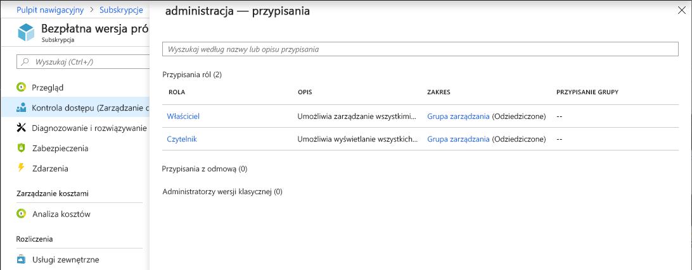

# Szybki start: wyświetlanie ról przypisanych do użytkownika za pomocą witryny Azure Portal

Za pomocą bloku **Kontrola dostępu (IAM)** w funkcji [kontroli dostępu opartej na rolach](overview.md) można wyświetlać przypisania ról dla wielu użytkowników, grup, jednostek usługi i tożsamości zarządzanych, ale czasami konieczne jest tylko szybkie wyświetlenie przypisań ról dla jednego użytkownika, grupy, jednostki usługi lub tożsamości zarządzanej. Najłatwiej można to zrobić przy użyciu funkcji **Sprawdź dostęp** w witrynie Azure Portal.

## Wyświetlanie przypisań ról

Wykonaj następujące kroki, aby wyświetlić przypisania ról dla jednego użytkownika, grupy, jednostki usługi lub tożsamości zarządzanej w zakresie subskrypcji.

1. W witrynie Azure Portal kliknij pozycję **Wszystkie usługi**, a następnie wybierz pozycję **Subskrypcje**.

1. Kliknij swoją subskrypcję.

1. Kliknij pozycję **Kontrola dostępu (IAM)**.

1. Kliknij kartę **Sprawdź dostęp**.

    

1. Na liście **Znajdź** wybierz typ podmiotu zabezpieczeń, dla którego chcesz sprawdzić dostęp.

1. W polu wyszukiwania wprowadź ciąg, aby wyszukać w katalogu nazwy wyświetlane, adresy e-mail lub identyfikatory obiektów.

    

1. Kliknij podmiot zabezpieczeń, aby otworzyć okienko **przypisania**.

    

    W tym okienku są wyświetlane role przypisane do wybranego podmiotu zabezpieczeń i zakresu. Jeśli istnieją przypisania odmowy występujące w tym zakresie lub dziedziczone przez ten zakres, zostaną wyświetlone.

## Następne kroki

> [!div class="nextstepaction"]
> [Samouczek: udzielanie dostępu użytkownikowi za pomocą kontroli RBAC i witryny Azure Portal](quickstart-assign-role-user-portal.md)
