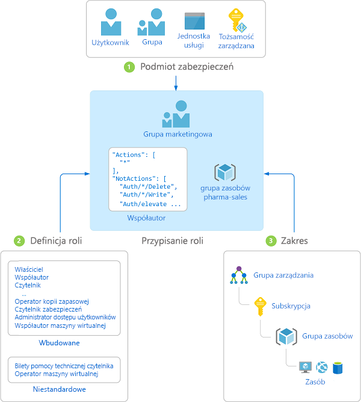
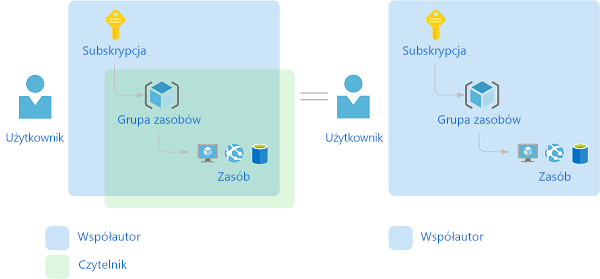

# Co to jest kontrola dostępu oparta na rolach (RBAC) dla zasobów platformy Azure?

Zarządzanie dostępem do zasobów w chmurze to kluczowa funkcja dla każdej organizacji korzystającej z chmury. Kontrola dostępu oparta na rolach ułatwia zarządzanie osobami mającymi dostęp do zasobów platformy Azure, czynnościami, jakie mogą wykonywać, oraz obszarami, do których mają dostęp.

Kontrola dostępu oparta na rolach stanowi system autoryzacji oparty na usłudze [Azure Resource Manager](../azure-resource-manager/resource-group-overview.md), umożliwiający szczegółowe zarządzanie dostępem do zasobów platformy Azure.

## Co można zrobić za pomocą kontroli dostępu opartej na rolach?

Poniżej przedstawiono kilka przykładów zastosowania kontroli dostępu opartej na rolach:

- Zezwalanie jednemu użytkownikowi na zarządzanie maszynami wirtualnymi w ramach subskrypcji, a innemu na zarządzanie sieciami wirtualnymi.
- Zezwalanie grupie administratorów baz danych na zarządzanie bazami danych SQL w ramach subskrypcji.
- Zezwalanie użytkownikowi na zarządzanie wszystkimi zasobami w grupie zasobów, w tym maszynami wirtualnymi, witrynami internetowymi i podsieciami.
- Zezwalanie aplikacji na dostęp do wszystkich zasobów w grupie zasobów.

## Najlepsze rozwiązania w przypadku używania funkcji RBAC

Przy użyciu kontroli dostępu opartej na rolach można przeprowadzić segregowanie zadań w ramach zespołu i nadać użytkownikom tylko takie uprawnienia dostępu, które są im niezbędne do wykonywania zadań. Zamiast przydzielać wszystkim użytkownikom nieograniczone uprawnienia do subskrypcji lub zasobów platformy Azure możesz zezwolić na wykonywanie w określonym zakresie tylko wybranych czynności.

Najlepszym rozwiązaniem podczas planowania strategii kontroli dostępu jest przyznanie użytkownikom najniższego uprawnienia, które muszą mieć, aby wykonać swoją pracę. Na poniższym diagramie przedstawiono sugerowany wzorzec korzystania z funkcji RBAC.

## Jak działa kontrola dostępu oparta na rolach

Jeśli korzystasz z kontroli dostępu opartej na rolach, sterowanie dostępem polega na tworzeniu przypisań ról. To kluczowa koncepcja, opisująca sposób egzekwowania uprawnień. Przypisanie roli składa się z trzech elementów: podmiotu zabezpieczeń, definicji roli i zakresu.

### Podmiot zabezpieczeń

*Podmiot zabezpieczeń* to obiekt reprezentujący użytkownika, grupę, jednostkę usługi lub tożsamość zarządzaną, które żądają dostępu do zasobów na platformie Azure.

- Użytkownik — osoba mająca profil w usłudze Azure Active Directory. Można również przypisywać role do użytkowników w innych dzierżawach. Aby uzyskać informacje na temat użytkowników w innych organizacjach, zobacz [Azure Active Directory B2B (Współpraca B2B w usłudze Azure Active Directory)](../active-directory/b2b/what-is-b2b.md).
- Grupa — zbiór użytkowników, utworzony w usłudze Azure Active Directory. W przypadku przypisania roli do grupy wszyscy użytkownicy w grupie otrzymają tę rolę. 
- Jednostka usługi — tożsamość zabezpieczeń używana przez aplikacje lub usługi w celu uzyskania dostępu do określonych zasobów platformy Azure. Można traktować ją jako odpowiednik *tożsamości użytkownika* (nazwy użytkownika i hasła lub certyfikatu) w przypadku aplikacji.
- Tożsamość zarządzana — tożsamość w usłudze Azure Active Directory, która jest automatycznie zarządzana przez platformę Azure. [Tożsamości zarządzanych](../active-directory/managed-identities-azure-resources/overview.md) używa się zazwyczaj podczas tworzenia aplikacji w chmurze w celu zarządzania poświadczeniami do uwierzytelniania w usługach platformy Azure.

### Definicja roli

*Definicja roli* to zbiór uprawnień. Czasami jest nazywana po prostu *rolą*. Definicja roli określa dozwolone operacje, na przykład odczyt, zapis, czy usuwanie. Role mogą być ogólne, na przykład „właściciel”, lub szczegółowe, na przykład „czytelnik maszyny wirtualnej”.

Na platformie Azure można korzystać z kilku [ról wbudowanych](built-in-roles.md). Poniżej wymieniono cztery podstawowe role wbudowane. Pierwsze trzy są stosowane do wszystkich typów zasobów.

- [Właściciel](built-in-roles.md#owner) — ma pełny dostęp do wszystkich zasobów i jest uprawniony do przydzielania dostępu innym osobom.
- [Współautor](built-in-roles.md#contributor) — może tworzyć wszystkie typy zasobów platformy Azure i zarządzać nimi, ale nie może przydzielać dostępu innym osobom.
- [Czytelnik](built-in-roles.md#reader) — może wyświetlać istniejące zasoby platformy Azure.
- [Administrator dostępu użytkowników](built-in-roles.md#user-access-administrator) — może zarządzać dostępem użytkowników do zasobów platformy Azure.

Pozostałe role wbudowane umożliwiają zarządzanie określonymi zasobami platformy Azure. Na przykład rola [współautora maszyny wirtualnej](built-in-roles.md#virtual-machine-contributor) umożliwia użytkownikowi tworzenie maszyn wirtualnych i zarządzanie nimi. Jeśli role wbudowane nie spełniają potrzeb Twojej organizacji, możesz tworzyć własne [role niestandardowe dla zasobów platformy Azure](custom-roles.md).

Platforma Azure zawiera operacje na danych, które umożliwiają udzielenie dostępu do danych w ramach obiektu. Jeśli na przykład użytkownik ma uprawnienie do odczytu na koncie magazynu, może odczytywać obiekty blob lub komunikaty na tym koncie magazynu. Aby uzyskać więcej informacji, zobacz [Omówienie definicji ról dla zasobów platformy Azure](role-definitions.md).

### Scope

*Zakres* to zestaw zasobów, w ramach którego jest przydzielany dostęp. Podczas przypisywania roli możesz dodatkowo ograniczyć dozwolone czynności, określając zakres. Jest to przydatne na przykład wówczas, gdy chcesz przypisać użytkownikowi rolę [współautora witryny internetowej](built-in-roles.md#website-contributor), ale tylko w jednej grupie zasobów.

Na platformie Azure można określić zakres na różnych poziomach: [grupy zarządzania](../governance/management-groups/index.md), subskrypcji, grupy zasobów lub zasobu. Zakresy mają strukturę relacji element nadrzędny-element podrzędny.

Gdy udzielisz dostępu w zakresie nadrzędnym, te uprawnienia są dziedziczone przez zakresy podrzędne. Na przykład:

- Jeśli przypiszesz użytkownikowi rolę [Właściciel](built-in-roles.md#owner) w zakresie grupy zarządzania, ten użytkownik będzie mógł zarządzać wszystkimi elementami we wszystkich subskrypcjach w grupie zarządzania.
- Jeśli przypiszesz rolę [czytelnika](built-in-roles.md#reader) do grupy na poziomie subskrypcji, członkowie tej grupy będą mogli wyświetlać wszystkie grupy zasobów i zasoby w ramach tej subskrypcji.
- Jeśli przypiszesz rolę [współautora](built-in-roles.md#contributor) do aplikacji na poziomie grupy zasobów, ta aplikacja będzie mogła zarządzać zasobami dowolnego typu w tej grupie zasobów, ale nie w innych grupach zasobów w ramach subskrypcji.

### Przypisania ról

*Przypisywanie roli* to proces dołączania definicji roli do użytkownika, grupy, jednostki usługi lub tożsamości zarządzanej w wybranym zakresie w celu udzielenia dostępu. Udzielenie dostępu polega na utworzeniu przypisania roli, a odwołanie dostępu — na usunięciu przypisania roli.

Na poniższym diagramie przedstawiono przykład przypisania roli. W tym przykładzie do grupy Marketing przypisano rolę [współautora](built-in-roles.md#contributor) w grupie zasobów pharma-sales. To oznacza, że użytkownicy należący do grupy Marketing mogą tworzyć dowolne zasoby platformy Azure w grupie zasobów pharma-sales i zarządzać nimi. Użytkownicy należący do grupy Marketing nie mają dostępu do zasobów spoza grupy zasobów pharma-sales, o ile nie przypisano do nich innej roli.

Przypisania ról można tworzyć, korzystając z witryny Azure Portal, interfejsu wiersza polecenia platformy Azure, programu Azure PowerShell, zestawów Azure SDK lub interfejsów API REST. W każdej grupie zarządzania można przyporządkować do **2000** ról w ramach każdej subskrypcji i przypisań ról **500** . Aby móc tworzyć i usuwać przypisania ról, potrzebne są uprawnienia `Microsoft.Authorization/roleAssignments/*`. Te uprawnienia można przyznać za pomocą ról [Właściciel](built-in-roles.md#owner) i [Administrator dostępu użytkowników](built-in-roles.md#user-access-administrator).

## Przypisania wielu ról

Co więc się dzieje w przypadku wielu nakładających się przypisań ról? RBAC jest modelem addytywnym, dzięki czemu Twoje czynne uprawnienia są dodatkiem do przypisań ról. Rozważmy poniższy przykład, w którym użytkownikowi przypisano rolę Współautor w zakresie subskrypcji i rolę Czytelnik w grupie zasobów. Dodanie uprawnień Współautor i Czytelnik daje faktycznie rolę Współautor dla grupy zasobów. Dlatego w tym przypadku przypisanie roli Czytelnik nie ma żadnego znaczenia.

## Przypisania odmowy

Poprzedni model kontroli dostępu opartego na rolach umożliwiał wyłącznie zezwolenie, bez możliwości odmowy. Obecny model obsługuje w ograniczony sposób również przypisania odmowy. Podobnie jak przypisanie roli *przypisanie odmowy* dołącza zestaw akcji odmowy do użytkownika, grupy, jednostki usługi lub tożsamości zarządzanej w określonym zakresie w celu odmowy dostępu. Przypisanie roli definiuje zestaw akcji, które są *dozwolone*, podczas gdy przypisanie odmowy definiuje zestaw akcji, które są *niedozwolone*. Innymi słowy przypisanie odmowy uniemożliwia użytkownikom wykonywanie określonych akcji, nawet jeśli przypisanie roli daje im taki dostęp. Przypisanie odmowy ma pierwszeństwo przed przypisaniem roli. Aby uzyskać więcej informacji, zobacz [Opis odmawiania przypisań dla zasobów platformy Azure](deny-assignments.md).

## W jaki sposób kontrola dostępu oparta na rolach określa, czy użytkownik ma dostęp do zasobu

Poniżej przedstawiono główne kroki wykorzystywane przez kontrolę dostępu opartą na rolach, aby określić, czy masz dostęp do zasobu na płaszczyźnie zarządzania. Warto je znać, jeśli próbujesz rozwiązać problem z dostępem.

1. Użytkownik (lub jednostka usługi) uzyskuje token dla usługi Azure Resource Manager.

    Ten token zawiera informację o członkostwie użytkownika w grupach (w tym przechodnim członkostwie w grupach).

1. Użytkownik tworzy wywołanie interfejsu API REST do usługi Azure Resource Manager, dołączając token.

1. Usługa Azure Resource Manager pobiera wszystkie przypisania roli lub odmowy, które dotyczą zasobu, wobec którego podejmowana jest akcja.

1. Usługa Azure Resource Manager zawęża przypisania roli, które dotyczą tego użytkownika lub jego grupy, i określa, jakie role posiada użytkownik względem tego zasobu.

1. Usługa Azure Resource Manager określa, czy akcja w wywołaniu interfejsu API należy do ról, jakie użytkownik posiada względem tego zasobu.

1. Jeśli użytkownik nie ma roli zawierającej daną akcję w wymaganym zakresie, następuje odmowa dostępu. W przeciwnym razie usługa Azure Resource Manager sprawdza, czy ma w tej sytuacji zastosowanie przypisanie odmowy.

1. Jeśli tak, dostęp jest blokowany. Jeśli nie, dostęp jest udzielany.

## Wymagania licencyjne

[!INCLUDE [Azure AD free license](../../includes/active-directory-free-license.md)]

## Następne kroki

- [Szybki start: Wyświetlanie informacji o dostępie użytkownika do zasobów platformy Azure przy użyciu witryny Azure Portal](check-access.md)
- [Zarządzanie dostępem do zasobów platformy Azure za pomocą kontroli dostępu opartej na rolach i witryny Azure Portal](role-assignments-portal.md)
- [Understand the different roles in Azure (Omówienie ról na platformie Azure)](rbac-and-directory-admin-roles.md)
- [Wdrożenie rozwiązania Enterprise Cloud: zarządzanie dostępem do zasobów na platformie Azure](/azure/architecture/cloud-adoption/governance/resource-consistency/azure-resource-access)
