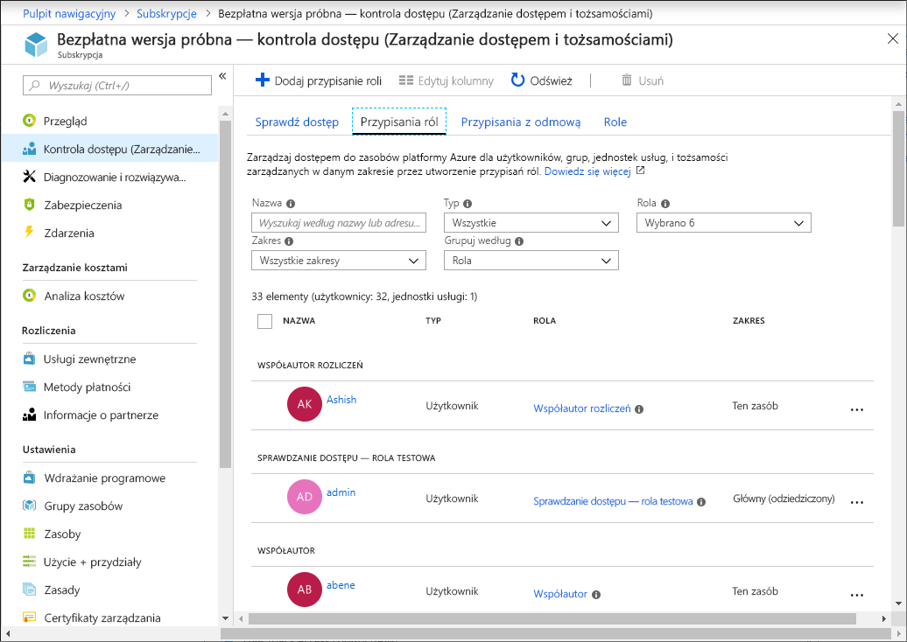
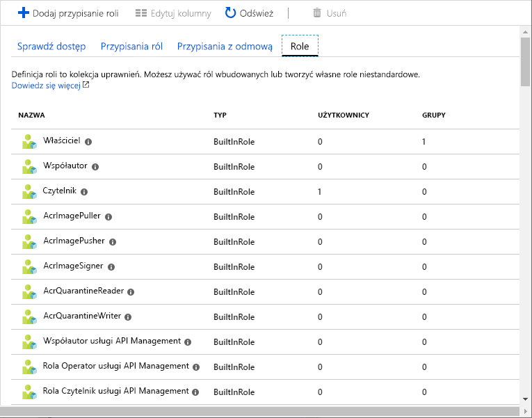
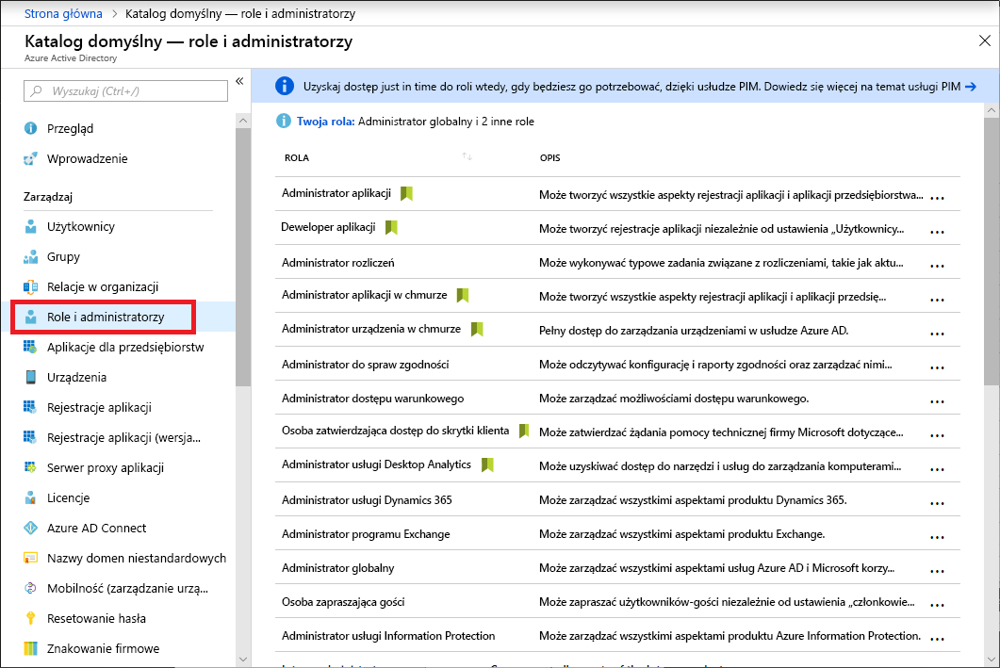

# Role administratora klasycznej subskrypcji, role platformy Azure i role usługi Azure AD

Jeśli dopiero zaczynasz korzystać z platformy Azure, zrozumienie poszczególnych ról może sprawiać pewne trudności. W tym artykule wyjaśniono następujące role i możliwości ich zastosowania:
- Role klasycznego administratora subskrypcji
- Role platformy Azure
- Role usługi Azure Active Directory (Azure AD)

## Jak role są powiązane ze sobą

Aby lepiej zrozumieć, na czym polegają role dostępne na platformie Azure, warto sięgnąć pamięcią nieco wstecz. W początkowej wersji platformy Azure dostępem do zasobów można było zarządzać przy użyciu trzech ról administratora: administratora konta, administratora usługi i współadministratora. Później została dodana kontrola dostępu oparta na rolach (Azure RBAC). Kontrola RBAC platformy Azure to nowszy system autoryzacji umożliwiający szczegółowe zarządzanie dostępem do zasobów platformy Azure. Usługa Azure RBAC obejmuje wiele wbudowanych ról, które mogą być przypisane do różnych zakresów i umożliwiają tworzenie własnych ról niestandardowych. Aby zarządzać zasobami w usłudze Azure AD, takimi jak użytkownicy, grupy i domeny, istnieje kilka ról usługi Azure AD.

Poniższy diagram stanowi ogólny widok sposobu, w jaki są powiązane role administratora klasycznej subskrypcji, role platformy Azure i role usługi Azure AD.

## Role klasycznego administratora subskrypcji

Administrator konta, administrator usługi i współadministrator to trzy role klasycznego administratora subskrypcji na platformie Azure. Klasyczni administratorzy subskrypcji mają pełny dostęp do subskrypcji platformy Azure. Mogą zarządzać zasobami przy użyciu witryny Azure Portal, interfejsów API usługi Azure Resource Manager i interfejsów API klasycznego modelu wdrożenia. Konto używane do rejestracji na platformie Azure zostanie automatycznie przypisane do administratora konta i administratora usługi. Następnie można dodać dodatkowych współadministratorów. Administrator usługi i współadministratorzy mają odpowiedni dostęp do użytkowników, którym przypisano rolę właściciela (rolę platformy Azure) w zakresie subskrypcji. Poniższa tabela zawiera różnice między tymi trzema klasycznymi rolami administracyjnymi subskrypcji.

| Klasyczny administrator subskrypcji | Limit | Uprawnienia | Uwagi |
| --- | --- | --- | --- |
| Administrator konta | 1 na konto platformy Azure | <ul><li>Zarządzanie rozliczeniami w [Azure Portal](https://portal.azure.com/#blade/Microsoft_Azure_Billing/SubscriptionsBlade)</li><li>Zarządzanie wszystkimi subskrypcjami na koncie</li><li>Tworzenie nowych subskrypcji</li><li>Anulowanie subskrypcji</li><li>Zmienianie rozliczeń dla subskrypcji</li><li>Zmienianie administratora usługi</li></ul> | Równoważny właścicielowi modelu rozliczania subskrypcji. Administrator konta nie ma dostępu do witryny Azure Portal. |
| Administrator usługi | 1 na subskrypcję platformy Azure | <ul><li>Zarządzanie usługami w [witrynie Azure Portal](https://portal.azure.com)</li><li>Anuluj subskrypcję</li><li>Przypisywanie użytkowników do roli współadministratora</li></ul> | W przypadku nowych subskrypcji administrator konta jest również domyślnie administratorem usługi. Administrator usługi ma takie same uprawnienia dostępu co użytkownik, któremu przypisano rolę właściciela w zakresie subskrypcji. Administrator usługi ma pełny dostęp do witryny Azure Portal. |
| Współadministrator | 200 na subskrypcję | <ul><li>Takie same uprawnienia dostępu jak administrator usługi, ale bez możliwości zmiany skojarzenia subskrypcji do katalogów platformy Azure</li><li>Przypisywanie użytkowników do roli współadministratora, ale bez możliwości zmiany administratora usługi</li></ul> | Współadministrator ma takie same uprawnienia dostępu co użytkownik, któremu przypisano rolę właściciela w zakresie subskrypcji. |

W witrynie Azure Portal można zarządzać współadministratorami lub wyświetlać administratora usługi za pomocą karty **Klasyczni administratorzy**.

W witrynie Azure Portal możesz wyświetlić lub zmienić administratora usługi albo wyświetlić administratora konta w bloku właściwości Twojej subskrypcji.

Aby uzyskać więcej informacji, zobacz [Klasyczni administratorzy subskrypcji platformy Azure](classic-administrators.md).

### Konto platformy Azure i subskrypcje platformy Azure

Konto platformy Azure reprezentuje relację rozliczeniową. Konto platformy Azure składa się z tożsamości użytkownika, co najmniej jednej subskrypcji platformy Azure oraz ze skojarzonego zestawu zasobów platformy Azure. Osoba, która tworzy konto, jest jego administratorem dla wszystkich subskrypcji utworzonych w ramach tego konta. Osoba ta jest również domyślnym administratorem usługi dla subskrypcji.

Subskrypcje platformy Azure pozwalają organizować dostęp do zasobów platformy Azure. Subskrypcje te ułatwiają również zarządzanie raportowaniem i rozliczaniem użycia zasobów oraz regulowaniem płatności za to użycie. Poszczególne subskrypcje mogą mieć różne ustawienia rozliczeń i płatności, co pozwala na korzystanie z wielu subskrypcji i planów dostosowanych do potrzeb konkretnych biur, działów, projektów itp. Każda usługa należy do subskrypcji, a identyfikator subskrypcji może być wymagany podczas wykonywania operacji programistycznych.

Każda subskrypcja jest skojarzona z katalogiem usługi Azure AD. Aby znaleźć katalog, z którym jest skojarzona subskrypcja, Otwórz pozycję **subskrypcje** w Azure Portal a następnie wybierz subskrypcję, aby wyświetlić katalog.

Konta i subskrypcje są zarządzane w [Azure Portal](https://portal.azure.com/#blade/Microsoft_Azure_Billing/SubscriptionsBlade).

## Role platformy Azure

Kontrola dostępu oparta na rolach (RBAC) platformy Azure stanowi system autoryzacji oparty na usłudze [Azure Resource Manager](../azure-resource-manager/management/overview.md), umożliwiający szczegółowe zarządzanie dostępem do zasobów platformy Azure, takich jak zasoby obliczeniowe i magazynowe. Kontrola RBAC platformy Azure obejmuje ponad 70 wbudowanych ról. Istnieją cztery podstawowe role platformy Azure. Pierwsze trzy mają zastosowanie do wszystkich typów zasobów:

| Rola na platformie Azure | Uprawnienia | Uwagi |
| --- | --- | --- |
| [Właściciel](built-in-roles.md#owner) | <ul><li>Pełny dostęp do wszystkich zasobów</li><li>Delegowanie dostępu do innych osób</li></ul> | Do administratora usługi i współadministratorów jest przypisana rola właściciela w zakresie subskrypcji Dotyczy wszystkich typów zasobów. |
| [Współautor](built-in-roles.md#contributor) | <ul><li>Tworzenie wszystkich typów zasobów platformy Azure i zarządzanie nimi</li><li>Tworzenie nowej dzierżawy w usłudze Azure Active Directory</li><li>Brak możliwości przyznawania dostępu innym osobom</li></ul> | Dotyczy wszystkich typów zasobów. |
| [Czytelnik](built-in-roles.md#reader) | <ul><li>Wyświetlanie zasobów platformy Azure</li></ul> | Dotyczy wszystkich typów zasobów. |
| [Administrator dostępu użytkowników](built-in-roles.md#user-access-administrator) | <ul><li>Zarządzanie dostępem użytkowników do zasobów platformy Azure</li></ul> |  |

Pozostałe role wbudowane umożliwiają zarządzanie określonymi zasobami platformy Azure. Na przykład rola [współautora maszyny wirtualnej](built-in-roles.md#virtual-machine-contributor) pozwala użytkownikom na tworzenie maszyn wirtualnych i zarządzanie nimi. Aby uzyskać listę wszystkich wbudowanych ról, zobacz [role wbudowane platformy Azure](built-in-roles.md).

Tylko Azure Portal i interfejsy API Azure Resource Manager obsługują rolę RBAC platformy Azure. Użytkownicy, grupy i aplikacje, które są przypisane do ról platformy Azure, nie mogą używać [interfejsów API klasycznego modelu wdrażania platformy Azure](../azure-resource-manager/management/deployment-models.md).

W Azure Portal przypisania ról korzystające z usługi Azure RBAC są wyświetlane w bloku **kontroli dostępu (IAM)** . Ten blok można znaleźć w portalu, takich jak grupy zarządzania, subskrypcje, grupy zasobów i różne zasoby.

Po kliknięciu karty **Role** zostanie wyświetlona lista wbudowanych i niestandardowych ról.

Aby uzyskać więcej informacji, zobacz [Dodawanie lub usuwanie przypisań ról platformy Azure przy użyciu Azure Portal](role-assignments-portal.md).

## Role usługi Azure AD

Role usługi Azure AD służą do zarządzania zasobami usługi Azure AD w katalogu, takim jak tworzenie i edytowanie użytkowników, przypisywanie ról administracyjnych do innych, resetowanie haseł użytkowników, zarządzanie licencjami użytkowników i Zarządzanie domenami. W poniższej tabeli opisano kilka najważniejszych ról usługi Azure AD.

| Rola usługi Azure AD | Uprawnienia | Uwagi |
| --- | --- | --- |
| [Administrator globalny](../active-directory/users-groups-roles/directory-assign-admin-roles.md#company-administrator-permissions) | <ul><li>Zarządzanie dostępem do wszystkich funkcji administracyjnych w usłudze Azure Active Directory, a także usług, które są sfederowane z usługą Azure Active Directory</li><li>Przypisywanie ról administratorów do innych osób</li><li>Resetowanie haseł wszystkich użytkowników oraz wszystkich innych administratorów</li></ul> | Osoba, która zarejestruje się dla dzierżawy usługi Azure Active Directory, staje się administratorem globalnym. |
| [Administrator użytkowników](../active-directory/users-groups-roles/directory-assign-admin-roles.md#user-administrator) | <ul><li>Tworzenie i zarządzanie wszystkimi aspektami użytkowników i grup</li><li>Zarządzanie biletami pomocy technicznej</li><li>Monitorowanie kondycji usługi</li><li>Zmienianie haseł użytkowników, administratorów pomocy technicznej i innych administratorów użytkowników</li></ul> |  |
| [Administrator rozliczeń](../active-directory/users-groups-roles/directory-assign-admin-roles.md#billing-administrator) | <ul><li>Dokonywanie zakupów</li><li>Zarządzanie subskrypcjami</li><li>Zarządzanie biletami pomocy technicznej</li><li>Monitorowanie kondycji usługi</li></ul> |  |

W Azure Portal można zobaczyć listę ról usługi Azure AD w bloku **role i Administratorzy** . Aby uzyskać listę wszystkich ról usługi Azure AD, zobacz [uprawnienia roli administrator w Azure Active Directory](../active-directory/users-groups-roles/directory-assign-admin-roles.md).

## Różnice między rolami platformy Azure i rolami usługi Azure AD

Na wysokim poziomie role platformy Azure kontrolują uprawnienia do zarządzania zasobami platformy Azure, podczas gdy role usługi Azure AD kontrolują uprawnienia do zarządzania zasobami Azure Active Directory. W poniższej tabeli porównano niektóre różnice.

| Role platformy Azure | Role usługi Azure Active Directory |
| --- | --- |
| Zarządzanie dostępem do zasobów platformy Azure | Zarządzanie dostępem do zasobów usługi Azure Active Directory |
| Obsługa ról niestandardowych | Obsługa ról niestandardowych |
| Możliwość określenia zakresu na wielu poziomach (grupa zarządzania, subskrypcja, grupa zasobów, zasób) | Zakres znajduje się na poziomie dzierżawy |
| Informacje o rolach można uzyskać w witrynie Azure Portal, interfejsie wiersza polecenia platformy Azure, programie Azure PowerShell, szablonach usługi Azure Resource Manager, interfejsie API REST | Dostęp do informacji o rolach można uzyskać w portalu administracyjnym platformy Azure, Microsoft 365 centrum administracyjnym, Microsoft Graph, AzureAD PowerShell |

### Czy role platformy Azure i role usługi Azure AD nakładają się?

Domyślnie role platformy Azure i role usługi Azure AD nie obejmują platformy Azure i usługi Azure AD. Jeśli jednak Administrator globalny Podnieś poziom dostępu, wybierając w Azure Portal przełącznik **Zarządzanie dostępem dla zasobów platformy Azure** , Administrator globalny otrzyma rolę [administratora dostępu użytkowników](built-in-roles.md#user-access-administrator) (rolę platformy Azure) we wszystkich subskrypcjach dla danej dzierżawy. Rola administratora dostępu użytkowników pozwala użytkownikom udzielać innym użytkownikom dostępu do zasobów platformy Azure. Ten przełącznik może być przydatny w odzyskaniu dostępu do subskrypcji. Aby uzyskać więcej informacji, zobacz [Podnieś poziom dostępu do zarządzania wszystkimi subskrypcjami i grupami zarządzania platformy Azure](elevate-access-global-admin.md).

Kilka ról usługi Azure AD obejmuje usługę Azure AD i Microsoft 365, takie jak role administratora globalnego i administratora. Na przykład jeśli jesteś członkiem roli administratora globalnego, masz uprawnienia administratora globalnego w usłudze Azure AD i Microsoft 365, takie jak wprowadzanie zmian w programie Microsoft Exchange i Microsoft SharePoint. Jednak domyślnie administrator globalny nie ma dostępu do zasobów platformy Azure.

## Następne kroki

- [Co to jest kontrola dostępu oparta na rolach na platformie Azure (Azure RBAC)?](overview.md)
- [Uprawnienia roli administratora w usłudze Azure Active Directory](../active-directory/users-groups-roles/directory-assign-admin-roles.md)
- [Klasyczni administratorzy subskrypcji platformy Azure](classic-administrators.md)
