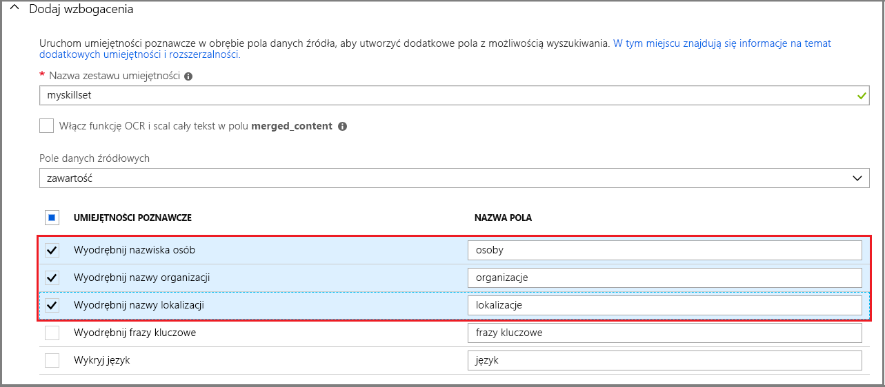
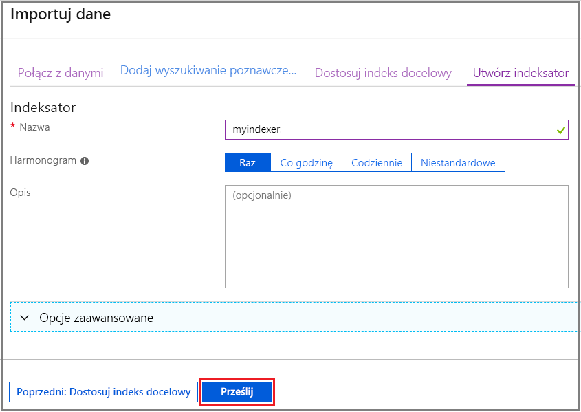
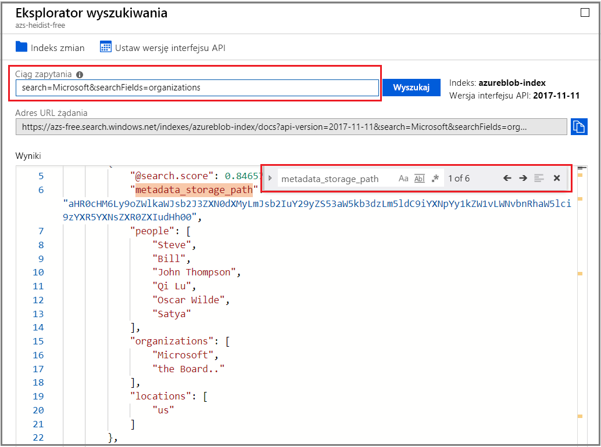

# Szybki start: Tworzenie potoku wzbogacania AI przy użyciu umiejętności poznawczych w Azure Search

Azure Search integruje się z [Cognitive Services](https://azure.microsoft.com/services/cognitive-services/), dodając wyodrębnianie zawartości, przetwarzanie języka naturalnego (NLP) oraz umiejętności przetwarzania obrazów do Azure Searchego potoku indeksowania, dzięki czemu zawartość nie może być wyszukiwana lub bez struktury. 

Wiele zasobów Cognitive Services, takich jak [OCR](cognitive-search-skill-ocr.md), [wykrywanie języka](cognitive-search-skill-language-detection.md), [rozpoznawanie jednostek](cognitive-search-skill-entity-recognition.md) do nazwy kilku — może być dołączane do procesu indeksowania. Algorytmy sztucznej inteligencji usług Cognitive Services są używane do znajdowania wzorców, funkcji i cech charakterystycznych w danych źródłowych, zwracając struktury i zawartości tekstowe, które można wykorzystać w rozwiązaniach wyszukiwania pełnotekstowego opartych na usłudze Azure Search.

W tym przewodniku Szybki start utworzysz swój pierwszy potok wzbogacania w witrynie [Azure Portal](https://portal.azure.com), zanim napiszesz jakikolwiek wiersz kodu:

> [!div class="checklist"]
> * Rozpocznij z przykładowymi danymi w usłudze Azure Blob Storage.
> * Skonfiguruj [**Kreatora importu danych**](search-import-data-portal.md) na potrzeby indeksowania poznawczego i wzbogacania 
> * Uruchom kreatora (umiejętność rozpoznawania jednostek wykrywa osoby, lokalizacje i organizacje).
> * Użyj [**Eksploratora wyszukiwania**](search-explorer.md), aby wykonywać zapytania wyszukujące wzbogacone dane

Ten przewodnik Szybki Start jest uruchamiany w ramach bezpłatnej usługi, ale liczba bezpłatnych transakcji jest ograniczona do 20 dokumentów dziennie. Jeśli chcesz uruchomić ten przewodnik Szybki Start więcej niż raz dziennie, użyj mniejszego zestawu plików, aby można było zmieścić więcej uruchomień.

> [!NOTE]
> Podczas rozszerzania zakresu przez zwiększenie częstotliwości przetwarzania, Dodawanie większej liczby dokumentów lub Dodawanie algorytmów AI, należy [dołączyć Cognitive Services rozliczanego zasobu](cognitive-search-attach-cognitive-services.md). Opłaty naliczane podczas wywoływania interfejsów API w Cognitive Services oraz do wyodrębniania obrazów w ramach etapu łamania dokumentu w Azure Search. Nie są naliczane opłaty za Wyodrębnianie tekstu z dokumentów.
>
> Do wykonania wbudowanych umiejętności są naliczane opłaty za istniejące [Cognitive Services cena płatność zgodnie z rzeczywistym](https://azure.microsoft.com/pricing/details/cognitive-services/)użyciem. Cennik wyodrębniania obrazów został opisany na [stronie cennika Azure Search](https://go.microsoft.com/fwlink/?linkid=2042400).

Jeśli nie masz subskrypcji platformy Azure, przed rozpoczęciem utwórz [bezpłatne konto](https://azure.microsoft.com/free/?WT.mc_id=A261C142F).

## Wymagania wstępne

[Utwórz usługę Azure Search](search-create-service-portal.md) lub [Znajdź istniejącą usługę](https://ms.portal.azure.com/#blade/HubsExtension/BrowseResourceBlade/resourceType/Microsoft.Search%2FsearchServices) w ramach bieżącej subskrypcji. Możesz użyć bezpłatnej usługi dla tego przewodnika Szybki Start.

[Cognitive Services](https://azure.microsoft.com/services/cognitive-services/) zapewnia AI. Ten przewodnik Szybki Start zawiera kroki umożliwiające dodanie tych zasobów w trybie online podczas określania potoku. Nie jest konieczne skonfigurowanie kont z góry.

Usługi platformy Azure są wymagane do udostępnienia danych wejściowych potoku indeksowania. Można użyć dowolnego źródła danych obsługiwanego przez [Azure Search indeksatorów](search-indexer-overview.md). Ten przewodnik Szybki Start używa [usługi Azure Blob Storage](https://azure.microsoft.com/services/storage/blobs/) jako kontenera plików danych źródłowych. 

### Konfigurowanie usługi Azure Blob Service i ładowanie przykładowych danych

1. [Pobierz przykładowe dane](https://1drv.ms/f/s!As7Oy81M_gVPa-LCb5lC_3hbS-4) składające się z małego zestawu plików różnych typów. 

1. [Zarejestruj się w usłudze Azure Blob Storage](https://docs.microsoft.com/azure/storage/common/storage-quickstart-create-account?tabs=azure-portal), Utwórz konto magazynu, Otwórz strony usługi BLOB Services i Utwórz kontener.  Utwórz konto magazynu w tym samym regionie co Azure Search.

1. W utworzonym kontenerze kliknij pozycję **Przekaż**, aby przekazać przykładowe pliki pobrane w poprzednim kroku.

   

## Tworzenie potoku wzbogacania

Wróć do strony pulpitu nawigacyjnego usługi Azure Search i na pasku poleceń kliknij pozycję **Importuj dane**, aby skonfigurować wzbogacanie poznawcze w czterech krokach.

  

### Krok 1: Utwórz źródło danych

W obszarze **Nawiązywanie połączenia z danymi** wybierz opcję **Magazyn obiektów blob Azure**, a następnie wybierz konto i utworzony kontener. Podaj nazwę źródła danych i użyj wartości domyślnych dla pozostałych ustawień. 

  

Przejdź do następnej strony.

  

### Krok 2: Dodawanie umiejętności poznawczych

Następnie dodaj kroki wzbogacenia do potoku indeksowania. Jeśli nie masz zasobu usług Cognitive Services, możesz zarejestrować się w bezpłatnej wersji, która umożliwia wykonywanie 20 transakcji dziennie. Przykładowe dane składają się z 14 plików, co oznacza, że po uruchomieniu tego kreatora dzienny przydział zostanie w większości wykorzystany.

1. Rozwiń węzeł **Dołącz usługę Cognitive Services**, aby wyświetlić opcje obsługi zasobów interfejsów API usług Cognitive Services. Na potrzeby tego samouczka możesz wybrać zasób **Bezpłatny**.

   

2. Rozwiń węzeł **Dodaj wzbogacenia** i wybierz umiejętności, które realizują przetwarzanie języka naturalnego. W ramach tego przewodnika Szybki start wybierz rozpoznawanie jednostek dla osób, organizacji i lokalizacji.

   

   Portal oferuje wbudowane umiejętności do przetwarzania OCR i analizy tekstu. W portalu zestaw umiejętności pracuje na jednym polu źródła. Może się to wydawać małym celem, ale w przypadku obiektów blob platformy Azure pole `content` zawiera większość dokumentu obiektu blob (na przykład dokument programu Word lub pokaz slajdów programu PowerPoint). Z tego względu to pole jest idealnym polem wejściowym, ponieważ obejmuje całą zawartość obiektu blob.

3. Przejdź do następnej strony.

   

> [!NOTE]
> Umiejętności przetwarzania języka naturalnego pracują na zawartości tekstowej w przykładowym zestawie danych. Ponieważ nie wybrano żadnej opcji OCR, w tym przewodniku Szybki start pliki JPEG i PNG znalezione w przykładowym zestawie danych nie będą przetwarzane. 

### Krok 3: Konfigurowanie indeksu

Kreator może zazwyczaj wnioskować, korzystając z domyślnego indeksu. W tym kroku możesz wyświetlić wygenerowany schemat indeksu i masz możliwość poprawienia dowolnych ustawień. Poniżej znajduje się domyślny indeks utworzony dla demonstracyjnego zestawu danych obiektów blob.

W przypadku tego przewodnika Szybki start kreator wykonuje dobrą pracę, ustawiając rozsądne wartości domyślne: 

+ Nazwa domyślna to *azureblob-index* w przypadku tego źródła danych. 

+ Domyślne pola opierają się na oryginalnym polu danych źródłowych (`content`) oraz polach danych wyjściowych (`people`, `organizations`, i `locations`) utworzonych przez potok poznawczy. Domyślne typy danych są wnioskowane na podstawie próbkowania metadanych i danych.

+ Klucz domyślny to *metadata_storage_path* (to pole zawiera unikatowe wartości).

+ Atrybuty domyślne tych pól to **Możliwość pobierania** i **Możliwość wyszukiwania**. Atrybut **Możliwość wyszukiwania** wskazuje, że pole może być przeszukiwane. Atrybut **Możliwość pobierania** oznacza, że może ono być zwracane w wynikach. W kreatorze przyjęto założenie, że chcesz, aby te pola oferowały możliwości pobierania i wyszukiwania, ponieważ zostały utworzone za pośrednictwem zestawu umiejętności.

  

Zwróć uwagę na przekreślenie i znak zapytania w atrybucie **Możliwość pobierania** obok pola `content`. W przypadku dokumentów obiektów blob z dużą ilością tekstu pole `content` zawiera większą część pliku, która może potencjalnie składać się z tysięcy wierszy. Jeśli musisz przekazać zawartość pliku do kodu klienta, upewnij się, że opcja **Możliwość pobierania** pozostanie wybrana. W przeciwnym razie rozważ wyczyszczenie tego atrybutu w elemencie `content`, jeśli wyodrębnione elementy (`people`, `organizations` i `locations`) są wystarczające dla Twoich celów.

Oznaczenie pola jako **Możliwość pobierania** nie oznacza, że pole *musi* znajdować się w wynikach wyszukiwania. Można precyzyjnie kontrolować wyniki wyszukiwania za pomocą parametru zapytania **$select** w celu wybrania pól do uwzględnienia. W przypadku pól zawierających dużo tekstu, takich jak `content`, parametr **$select** to rozwiązanie, które oferuje użytkownikom aplikacji łatwe w zarządzaniu wyniki wyszukiwania, gwarantując jednocześnie, że kod klienta ma dostęp do wszystkich wymaganych informacji za pośrednictwem atrybutu **Możliwość pobierania**.
  
Przejdź do następnej strony.

  

### Krok 4: Konfigurowanie indeksatora

Indeksator jest procesem wysokiego poziomu sterującym procesem indeksowania. Określa on nazwę źródła danych, docelowy indeks oraz częstotliwość wykonywania. Wynik końcowy kreatora **Import danych** zawsze jest indeksatorem, który można wywoływać wielokrotnie.

Na stronie **Indeksator** możesz zaakceptować domyślną nazwę i użyć opcji harmonogramu **Uruchom raz**, aby od razu go uruchomić. 

  

Kliknij przycisk **Prześlij**, aby utworzyć i od razu uruchomić indeksator.

## Monitorowanie indeksowania

Kroki wzbogacania wydłużają czas wykonywania operacji w porównaniu ze zwykłym indeksowaniem na podstawie tekstu. Kreator powinien otworzyć listę Indeksator na stronie przeglądu, co pozwala na śledzenie postępu. W przypadku samodzielnej nawigacji przejdź do strony Przegląd i kliknij opcję **Indeksatory**.

Zostanie wyświetlone ostrzeżenie, ponieważ pliki JPG i PNG są plikami obrazów, a my pominęliśmy w tym potoku umiejętność OCR. Zobaczysz również powiadomienia o obcięciu danych. Usługa Azure Search w ramach warstwy Bezpłatna ogranicza wyodrębnianie do 32 000 znaków.

  

Indeksowanie i wzbogacenie może potrwać, dlatego na potrzeby wcześniejszej eksploracji zaleca się użycie mniejszych zestawów danych. 

## Zapytanie w Eksploratorze wyszukiwania

Po utworzeniu indeksu możesz przesyłać zapytania, aby zwrócić dokumenty z indeksu. W portalu użyj **Eksploratora wyszukiwania**, aby uruchomić zapytania i wyświetlić wyniki. 

1. Na stronie pulpitu nawigacyjnego usługi wyszukiwania kliknij pozycję **Eksplorator wyszukiwania** na pasku poleceń.

1. Kliknij pozycję **Zmień indeks** u góry, aby wybrać utworzony indeks.

1. Wprowadź ciąg wyszukiwania, aby wykonać zapytanie względem indeksu, np. `search=Microsoft&searchFields=organizations`.

Wyniki są zwracane w formacie JSON, który może zawierać wiele danych i być trudny do odczytania, szczególnie w przypadku dużych dokumentów pochodzących z obiektów blob platformy Azure. Jeśli nie można łatwo skanować wyników, wyszukaj dane w dokumentach za pomocą klawiszy CTRL+F. Dla tego zapytania możesz wyszukać określone terminy w zawartości JSON. 

Użycie klawiszy CTRL+F może również ułatwić określenie liczby dokumentów znajdujących się w danym zestawie wyników. Dla obiektów blob platformy Azure portal wybiera klucz „metadata_storage_path”, ponieważ każda wartość jest unikatowa dla dokumentu. Przy użyciu klawiszy CTRL+F wyszukaj ciąg „metadata_storage_path”, aby uzyskać liczbę dokumentów. 

  

## Wnioski

Pierwsze ćwiczenie dotyczące wzbogaconego indeksowania poznawczego zostało ukończone. Celem tego przewodnika Szybki start było przedstawienie ważnych pojęć i przeprowadzenie użytkownika przez proces kreatora, aby umożliwić mu szybkie prototypowanie rozwiązania do wyszukiwania poznawczego przy użyciu własnych danych.

Niektóre kluczowe założenia, które, mamy nadzieję, zostały wychwycone, obejmują zależności od źródeł danych platformy Azure. Wzbogacenie wyszukiwania poznawczego jest powiązane z indeksatorami, a indeksatory są specyficzne dla źródła i platformy Azure. Mimo że w tym przewodniku Szybki start jest używana usługa Azure Blob Storage, możliwe są inne źródła danych platformy Azure. Aby uzyskać więcej informacji, zobacz [Indeksatory w usłudze Azure Search](search-indexer-overview.md).

Innym ważnym pojęciem jest to, że umiejętności działają na polach danych wejściowych. W portalu należy wybrać pojedyncze pole źródłowe dla wszystkich umiejętności. W kodzie danymi wejściowymi mogą być inne pola lub dane wyjściowe nadrzędnej umiejętności.

 Dane wejściowe umiejętności są mapowane na pola danych wyjściowych w indeksie. Wewnętrznie portal konfiguruje [adnotacje](cognitive-search-concept-annotations-syntax.md) i definiuje [zestaw umiejętności](cognitive-search-defining-skillset.md), ustanawiając kolejność operacji i ogólny przepływ. Te kroki są ukryte w portalu, ale po rozpoczęciu pisania kodu te koncepcje stają się istotne.

Wiesz już także, że wyświetlanie wyników jest osiągane przez wykonywanie zapytań względem indeksu. W rezultacie usługa Azure Search zapewnia indeks wyszukiwania, w którym można wykonywać zapytania przy użyciu [prostej](https://docs.microsoft.com/rest/api/searchservice/simple-query-syntax-in-azure-search) lub [w pełni rozszerzonej składni zapytania](https://docs.microsoft.com/rest/api/searchservice/lucene-query-syntax-in-azure-search). Indeks zawierający wzbogacone pola jest taki sam, jak każdy inny. Jeśli chcesz uwzględnić standardowe lub [niestandardowe analizatory](search-analyzers.md), [ocenianie profili](https://docs.microsoft.com/rest/api/searchservice/add-scoring-profiles-to-a-search-index), [synonimy](search-synonyms.md), [filtry aspektowe](search-filters-facets.md), wyszukiwanie geograficzne lub dowolną inną funkcję usługi Azure Search, na pewno możesz to zrobić.

## Czyszczenie

Gdy pracujesz nad własną subskrypcją, dobrym pomysłem jest zakończenie projektu w celu ustalenia, czy nadal potrzebujesz utworzonych zasobów. Zasoby po lewej stronie mogą być kosztowne. Możesz usunąć zasoby pojedynczo lub usunąć grupę zasobów, aby usunąć cały zestaw zasobów.

Zasoby można znaleźć w portalu i zarządzać nimi za pomocą linku **wszystkie zasoby** lub **grupy zasobów** w okienku nawigacji po lewej stronie.

Jeśli używasz bezpłatnej usługi, pamiętaj, że masz ograniczone do trzech indeksów, indeksatorów i źródeł danych. Możesz usunąć poszczególne elementy w portalu, aby zachować limit. 

## Następne kroki

W zależności od sposobu aprowizowania zasobu usług Cognitive Services możesz eksperymentować z indeksowaniem i wzbogacaniem poprzez ponowne uruchomienie kreatora z różnymi umiejętnościami i polami danych źródłowych. Aby ponownie wykonać kroki, usuń indeks i indeksator, a następnie ponownie utwórz indeksator przy użyciu nowej kombinacji opcji.

+ W obszarze **Przegląd** > **Indeksy** wybierz utworzony indeks, a następnie kliknij pozycję **Usuń**.

+ Na stronie **Przegląd** kliknij dwukrotnie kafelek **Indeksatory**. Znajdź utworzony indeksator i usuń go.

Możesz również ponownie wykorzystać przykładowe dane i utworzone usługi, aby dowiedzieć się, jak programowo wykonywać te same zadania w następnym samouczku. 

> [!div class="nextstepaction"]
> [Samouczek: korzystanie z interfejsów API REST wyszukiwania poznawczego](cognitive-search-tutorial-blob.md)
