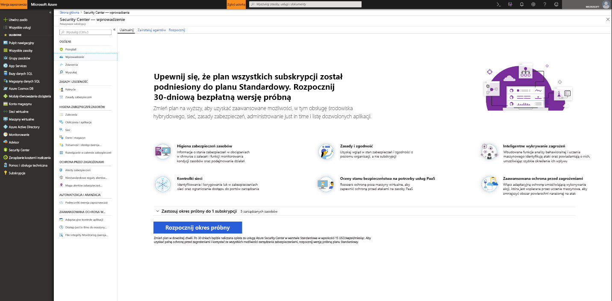
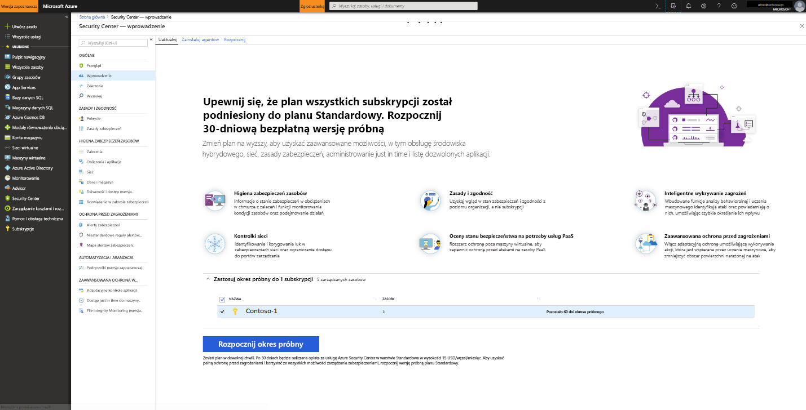

# Dołączanie do Azure Security Center Standard w celu zapewnienia zwiększonych zabezpieczeń
Uaktualnij do wersji Standard Security Center, aby korzystać z ulepszonych funkcji zarządzania zabezpieczeniami i ochrony przed zagrożeniami dla obciążeń chmury hybrydowej. Możesz wypróbować usługę w warstwie Standardowa. Aby uzyskać więcej informacji, zobacz [stronę z cennikiem](https://azure.microsoft.com/pricing/details/security-center/) Security Center.

Standard Security Center obejmuje:

- **Bezpieczeństwo hybrydowe** — Uzyskaj ujednolicony widok zabezpieczeń we wszystkich obciążeniach lokalnych i w chmurze. Stosuj zasady zabezpieczeń i stale oceniaj bezpieczeństwo obciążeń chmury hybrydowej w celu zapewnienia zgodności ze standardami zabezpieczeń. Zbieranie, wyszukiwanie i analizowanie danych zabezpieczeń z różnych źródeł, w tym zapór i innych rozwiązań partnerskich.
- **Zaawansowane wykrywanie zagrożeń** — Użyj zaawansowanej analizy i Microsoft Intelligent Security Graph, aby uzyskać krawędzie przed rozwojem ataków cybernetycznymi. Wykorzystaj wbudowaną analizę behawioralną i uczenie maszynowe do identyfikowania ataków i luk typu zero day. Monitoruj sieci, maszyny i usługi w chmurze pod kątem przychodzących ataków i działań po naruszeniu zabezpieczeń. Usprawnij badanie dzięki interaktywnym narzędziom i kontekstowej analizie zagrożeń.
- **Kontrola dostępu i aplikacji** — Zablokuj złośliwe oprogramowanie i inne niechciane aplikacje, stosując zalecenia listy dozwolonych dostosowane do konkretnych obciążeń i obsługiwane przez uczenie maszynowe. Zmniejszenie podatności na ataki sieci z dostępem just-in-Time do portów zarządzania na maszynach wirtualnych platformy Azure, co znacząco zmniejsza narażenie na odżycie i inne ataki sieciowe.

## Wykrywanie zasobów niechronionych
Usługa Security Center automatycznie wykrywa wszelkie subskrypcje i obszary robocze platformy Azure nie włączone do standardu usługi Security Center. Obejmuje to subskrypcje platformy Azure korzystające z usługi Security Center w warstwie bezpłatnej oraz obszary robocze, które nie mają włączonego rozwiązania w zakresie zabezpieczeń.

Możesz uaktualnić całą subskrypcję platformy Azure do warstwy Standardowa, która jest dziedziczona przez wszystkie obsługiwane zasoby w ramach subskrypcji. Zastosowanie warstwy Standardowa do obszaru roboczego dotyczy wszystkich zasobów raportowanych do obszaru roboczego.

> [!NOTE]
> Możesz chcieć zarządzać kosztami i ograniczyć ilość danych zbieranych dla rozwiązania, ograniczając je do określonego zestawu agentów. [Określanie celu rozwiązania](../operations-management-suite/operations-management-suite-solution-targeting.md) pozwala zastosować zakres do rozwiązania i określić podzestaw komputerów w obszarze roboczym. W przypadku korzystania z funkcji określania wartości docelowej rozwiązania Security Center zawiera listę obszarów roboczych bez rozwiązania.
>
>

## Uaktualnianie subskrypcji lub obszaru roboczego platformy Azure
Aby uaktualnić subskrypcję lub obszar roboczy do warstwy Standardowa:
1. W menu głównym usługi Security Center wybierz pozycję **Wprowadzenie**.
  
2. W obszarze **Uaktualnienie** usługa Security Center wyświetla listę subskrypcji i obszarów roboczych, które kwalifikują się do dołączenia. 
   - Możesz kliknąć listę rozwijaną **Zastosuj wersję próbną**, aby wyświetlić listę wszystkich subskrypcji i obszarów roboczych ze stanem kwalifikacji do korzystania z wersji próbnej.
   -    Możesz uaktualnić subskrypcje i obszary robocze, które nie kwalifikują się do korzystania z wersji próbnej.
   -    Możesz wybrać kwalifikujące się obszary robocze i subskrypcje i rozpocząć korzystanie z wersji próbnej.
3.  Kliknij przycisk **Rozpocznij okres próbny**, aby rozpocząć okres próbny w ramach wybranych subskrypcji.
  

   > [!NOTE]
   > Bezpłatne możliwości Security Center są stosowane wyłącznie do maszyn wirtualnych platformy Azure i VMSS. Bezpłatne możliwości nie są stosowane do komputerów spoza platformy Azure. W przypadku wybrania opcji standardowe funkcje standardowe są stosowane do wszystkich maszyn wirtualnych platformy Azure, zestawów skalowania maszyn wirtualnych i komputerów spoza platformy Azure, które są raportowane do obszaru roboczego. Zalecamy zastosowanie standardu, aby zapewnić zaawansowane zabezpieczenia dla zasobów platformy Azure i innych niż Azure.
   >

## Dołączanie komputerów spoza platformy Azure
Usługa Security Center może monitorować stan bezpieczeństwa komputerów nienależących do platformy Azure, ale musisz najpierw dołączyć te zasoby. Komputery spoza platformy Azure można dodawać z bloku **wprowadzenie** lub w bloku **obliczenia** . Przeprowadzimy obie metody.

### Dodaj nowe komputery spoza platformy Azure od **początku**

1. Wróć do **początku**.
2. Wybierz kartę **Rozpoczęcie pracy**.

   

3. Kliknij przycisk **Konfiguruj** w obszarze **Dodaj nowe komputery spoza platformy Azure**. Zostanie wyświetlona lista obszarów roboczych usługi Log Analytics. Jeśli ma to zastosowanie, lista zawiera domyślny obszar roboczy utworzony przez usługę Security Center po włączeniu automatycznej aprowizacji. Wybierz ten obszar roboczy lub inny obszar roboczy, którego chcesz użyć.

   ![Dodawanie komputera spoza platformy Azure][7]

Jeśli masz istniejące obszary robocze, są one wyświetlane w obszarze **Dodaj nowe komputery spoza platformy Azure**. Możesz dodać komputery do istniejącego obszaru roboczego lub utworzyć nowy obszar roboczy. Aby utworzyć nowy obszar roboczy, wybierz łącze **Dodaj nowy obszar roboczy**.

### Dodaj nowe komputery spoza platformy Azure z **obliczeń**

**Tworzenie nowego obszaru roboczego i Dodawanie komputera**

1. W obszarze **Dodaj nowe komputery spoza platformy Azure**wybierz pozycję **Dodaj nowy obszar roboczy**.

   ![Dodaj nowy obszar roboczy][4]

2. W obszarze **Security and Audit**wybierz pozycję **obszar roboczy pakietu OMS** , aby utworzyć nowy obszar roboczy.
   > [!NOTE]
   > Obszary robocze OMS są teraz nazywane obszarami roboczymi usługi Log Analytics.
3. W obszarze **obszar roboczy pakietu OMS**wprowadź informacje dotyczące obszaru roboczego.
4. W obszarze **obszar roboczy pakietu OMS**wybierz pozycję **OK**. Po wybraniu przycisku OK zostanie wyświetlony link umożliwiający pobranie agenta i kluczy systemu Windows lub Linux dla identyfikatora obszaru roboczego do użycia podczas konfigurowania agenta.
5. W obszarze **Security and Audit**wybierz pozycję **OK**.

**Wybierz istniejący obszar roboczy i Dodaj komputer**

Komputer można dodać, wykonując przepływ **pracy z**dołączania, jak pokazano powyżej. Komputer można również dodać, wykonując przepływ pracy z zasobów **obliczeniowych**. W tym przykładzie używamy **obliczeń**.

1. Wróć do menu głównego i pulpitu nawigacyjnego **przeglądu** Security Center.

   ![Omówienie][5]

2. Wybierz pozycję **obliczenia & aplikacje**.
3. W obszarze **obliczeniowe & aplikacje**wybierz pozycję **Dodaj komputery**.

   ![Blok Obliczanie][6]

4. W obszarze **Dodaj nowe komputery spoza platformy Azure**wybierz obszar roboczy, z którym chcesz połączyć komputer, a następnie kliknij pozycję **Dodaj komputery**.

   ![Dodaj komputery][7]

   Blok **bezpośredni Agent** zawiera link do pobierania agenta systemu Windows lub Linux oraz identyfikator obszaru roboczego i klucze do użycia podczas konfigurowania agenta.

## Następne kroki
W tym artykule przedstawiono sposób dołączania zasobów platformy Azure i spoza platformy Azure w celu skorzystania z zaawansowanych zabezpieczeń Security Center. Aby dowiedzieć się więcej o zasobach dołączanych, zobacz

- [Włączanie zbierania danych](security-center-enable-data-collection.md)
- [Raport analizy zagrożeń](security-center-threat-report.md)
- [Dostęp just in time do maszyny wirtualnej](security-center-just-in-time.md)

<!--Image references-->
[1]: ./media/security-center-onboarding/onboard.png
[2]: ./media/security-center-onboarding/onboard-subscription.png
[3]: ./media/security-center-onboarding/get-started.png
[4]: ./media/security-center-onboarding/create-workspace.png
[5]: ./media/security-center-onboarding/overview.png
[6]: ./media/security-center-onboarding/compute-blade.png
[7]: ./media/security-center-onboarding/add-computer.png
[8]: ./media/security-center-onboarding/onboard-workspace.png
