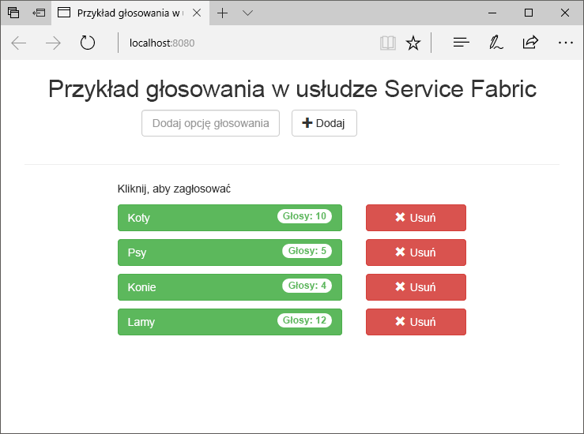
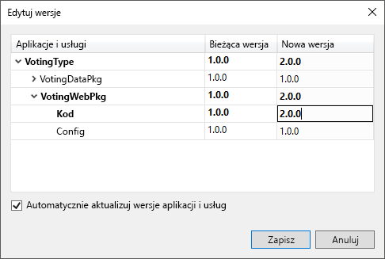

# <a name="create-a-net-service-fabric-application-in-azure"></a>Tworzenie aplikacji sieci szkieletowej usług .NET na platformie Azure
Usługa Azure Service Fabric to platforma systemów rozproszonych ułatwiająca pakowanie i wdrażanie skalowalnych oraz niezawodnych mikrousług i kontenerów, a także zarządzanie nimi. 

Ta opcja szybkiego startu przedstawia sposób wdrażanie pierwszej aplikacji .NET sieci szkieletowej usług. Po zakończeniu, masz aplikację do głosowania z frontonu, który zapisuje wyniki głosowania stanowe usługi zaplecza w klastrze sieci web platformy ASP.NET Core.



Za pomocą tej aplikacji, możesz dowiedzieć się, jak:
> [!div class="checklist"]
> * Tworzenie aplikacji przy użyciu platformy .NET i sieci szkieletowej usług
> * Użyj jako frontonu sieci web platformy ASP.NET core
> * Przechowywanie danych aplikacji w usługi stanowej
> * Debugowanie aplikacji lokalnie
> * Wdrażanie aplikacji do klastra w systemie Azure
> * Skalowalny w poziomie aplikacji w różnych węzłach
> * Uaktualnienie stopniowe aplikacji

## <a name="prerequisites"></a>Wymagania wstępne
Aby ukończyć ten przewodnik Szybki Start:
1. [Zainstaluj program Visual Studio 2017](https://www.visualstudio.com/) z **Azure programowanie** i **ASP.NET i sieć web development** obciążeń.
2. [Zainstaluj oprogramowanie Git](https://git-scm.com/)
3. [Zainstaluj zestaw SDK sieci szkieletowej usług Microsoft Azure](http://www.microsoft.com/web/handlers/webpi.ashx?command=getinstallerredirect&appid=MicrosoftAzure-ServiceFabric-CoreSDK)
4. Uruchom następujące polecenie w celu włączenia programu Visual Studio do wdrożenia na lokalny klaster sieci szkieletowej usług:
    ```powershell
    Set-ExecutionPolicy -ExecutionPolicy Unrestricted -Force -Scope CurrentUser
    ```

## <a name="download-the-sample"></a>Pobierz przykład
W oknie poleceń uruchom następujące polecenie sklonować repozytorium przykładowej aplikacji na komputerze lokalnym.
```
git clone https://github.com/Azure-Samples/service-fabric-dotnet-quickstart
```

## <a name="run-the-application-locally"></a>Uruchamianie aplikacji lokalnie
Kliknij prawym przyciskiem myszy ikonę programu Visual Studio w Start Menu i wybierz polecenie **Uruchom jako administrator**. Aby dołączyć debuger do usługi, należy uruchomić program Visual Studio jako administrator.

Otwórz **Voting.sln** rozwiązania Visual Studio z sklonowanego repozytorium.

Aby wdrożyć aplikację, naciśnij klawisz **F5**.

> [!NOTE]
> Podczas pierwszego uruchomienia i wdrażanie aplikacji Visual Studio tworzy lokalny klaster na potrzeby debugowania. Ta operacja może potrwać pewien czas. Stan tworzenia klastra jest wyświetlany w oknie danych wyjściowych programu Visual Studio.

Po zakończeniu wdrażania Uruchom przeglądarkę i otwórz tę stronę: `http://localhost:8080` -frontonu aplikacji sieci web.


Można teraz dodać zestaw głosowania opcje i Rozpocznij tworzenie głosów. Aplikacja jest uruchamiana i przechowuje wszystkie dane w klastrze usługi sieć szkieletowa, bez konieczności oddzielnej bazy danych.

## <a name="walk-through-the-voting-sample-application"></a>Przewodnik po głosowanie przykładowej aplikacji
Aplikację do głosowania składa się z dwóch usług:
- Usługa frontonu (VotingWeb) sieci Web — ASP.NET Core usługa frontonu, który służy do strony sieci web i ujawnia sieci web API, aby komunikować się z usługą wewnętrznej bazy danych.
- Usługi zaplecza (VotingData) — usługi sieci web platformy ASP.NET Core, która uwidacznia interfejs API do przechowywania wyników głosowanie w słowniku niezawodnej utrwalony na dysku.


Po głosowanie w aplikacji występują następujące zdarzenia:
1. JavaScript wysyła żądanie głosowania dotyczącego do interfejsu API sieci web usługi frontonu sieci web jako żądanie HTTP PUT.

2. Usługa frontonu sieci web używa serwera proxy, aby zlokalizować i przesyła żądanie HTTP PUT do usługi zaplecza.

3. Usługi zaplecza przyjmuje żądania przychodzącego, a następnie przechowuje zaktualizowanego wyniku w niezawodnej słownik, który pobiera replikowane na wielu węzłach w klastrze i utrwalony na dysku. Dane wszystkich aplikacji znajduje się w klastrze, więc nie bazy danych nie jest wymagane.

## <a name="debug-in-visual-studio"></a>Debugowanie w programie Visual Studio
Podczas debugowania aplikacji w programie Visual Studio, czy używasz klastra lokalnego Projektowanie sieci szkieletowej usług. Użytkownik może dostosować środowiska debugowania do danego scenariusza. W tej aplikacji są przechowywane dane w naszej usługi zaplecza przy użyciu niezawodnych słownika. Po zatrzymaniu debugera programu Visual Studio spowoduje usunięcie aplikacji na domyślne. Usunięcie aplikacji powoduje, że dane w usłudze zaplecza do także zostaną usunięte. Aby zachować dane między sesji debugowania, można zmienić **tryb debugowania aplikacji** jako właściwość **głosowania** projektu programu Visual Studio.

Aby przyjrzeć się, co się stanie w kodzie, wykonaj następujące kroki:
1. Otwórz **VotesController.cs** pliku i ustaw punkt przerwania w sieci web interfejsu API **Put** — metoda (linii 47) — możesz wyszukać plik w Eksploratorze rozwiązań w programie Visual Studio.

2. Otwórz **VoteDataController.cs** pliku i ustaw punkt przerwania w tym składnika web API **Put** — metoda (wiersz 50).

3. Wróć do przeglądarki i kliknij opcję głosu lub dodać nową opcję głosu. Trafień jest pierwszy punkt przerwania w kontroler interfejsu api sieci web przodu end firmy.
    - Jest to, gdzie JavaScript w przeglądarce wysyła żądanie do kontrolera interfejsu API sieci web frontonu usługi.
    
    

    - Najpierw możemy utworzyć adres URL, który ReverseProxy dla naszej usługi zaplecza **(1)**.
    - Następnie możemy wysłać umieść żądanie HTTP do ReverseProxy **(2)**.
    - Na koniec zostanie zwrócona odpowiedź z usługi zaplecza do klienta **(3)**.

4. Naciśnij klawisz **F5** aby kontynuować
    - To jest punkt przerwania w usłudze zaplecza.
    
    

    - W pierwszym wierszu w metodzie **(1)** używamy `StateManager` do pobrania lub dodać słownika niezawodnej o nazwie `counts`.
    - Wszystkie interakcje z wartości w słowniku niezawodnej wymagają transakcji, za pomocą tej instrukcji **(2)** tworzy tej transakcji.
    - W transakcji, możemy następnie zaktualizuj tę wartość klucza odpowiednich opcji głosu i zatwierdza operacji **(3)**. Po aktualizacji w słowniku zwraca metoda zatwierdzania, dane i replikowane do innych węzłów w klastrze. Dane, teraz są bezpiecznie przechowywane w klastrze, a usługi zaplecza może zostać przeniesiony do innych węzłów, nadal o dostępnych danych.
5. Naciśnij klawisz **F5** aby kontynuować

Aby zatrzymać sesję debugowania, naciśnij klawisz **Shift + F5**.

## <a name="deploy-the-application-to-azure"></a>Wdrażanie aplikacji na platformie Azure
Aby wdrożyć aplikację do klastra na platformie Azure, albo można do utworzenia własnego klastra lub używania klastra strony.

Klastry testowe to bezpłatne, ograniczone czasowo klastry usługi Service Fabric hostowane na platformie Azure i uruchamiane przez zespół usługi Service Fabric, w których każdy może wdrażać aplikacje i poznawać platformę. Aby uzyskać dostęp do klastra testowego, [postępuj zgodnie z instrukcjami](http://aka.ms/tryservicefabric). 

Aby uzyskać informacje na temat tworzenia własnego klastra, zobacz [Tworzenie pierwszego klastra usługi Service Fabric na platformie Azure](service-fabric-get-started-azure-cluster.md).

> [!Note]
> Usługa frontonu sieci web jest skonfigurowane do nasłuchiwania na porcie 8080 dla ruchu przychodzącego. Upewnij się, że port w klastrze został otwarty. Jeśli używasz klastra strona ten port jest otwarty.
>

### <a name="deploy-the-application-using-visual-studio"></a>Wdrażanie aplikacji przy użyciu programu Visual Studio
Kiedy aplikacja jest gotowa, można wdrożyć ją w klastrze bezpośrednio z programu Visual Studio.

1. Kliknij prawym przyciskiem myszy **głosowania** w Eksploratorze rozwiązań i wybierz polecenie **publikowania**. Zostanie wyświetlone okno dialogowe Publikowanie.

    

2. Wpisz punkt końcowy połączenia klastra w polu **Punkt końcowy połączenia**, a następnie kliknij przycisk **Publikuj**. Podczas rejestracji dla klastra firm, punktu końcowego połączenia jest dostępna w przeglądarce. — na przykład `winh1x87d1d.westus.cloudapp.azure.com:19000`.

3. Otwórz przeglądarkę i typ w foolowed adres klastra przez ": 8080', aby uzyskać dostęp do aplikacji w klastrze — na przykład `http://winh1x87d1d.westus.cloudapp.azure.com:8080`. Powinna zostać wyświetlona aplikacja była uruchomiona w klastrze na platformie Azure.


## <a name="scale-applications-and-services-in-a-cluster"></a>Skalowanie aplikacji i usług w klastrze
Łatwo można skalować usługi Service Fabric w klastrze, aby uwzględnić zmiany w obciążenia w ramach usług. Skalowanie usługi odbywa się przez zmienianie liczby wystąpień uruchomionych w klastrze. Istnieje wiele sposobów skalowania usługi, możesz użyć skryptów lub poleceń programu PowerShell lub interfejsu wiersza polecenia usługi sieci szkieletowej (sfctl). W tym przykładzie użyto Service Fabric Explorer.

Service Fabric Explorer działa we wszystkich klastrach sieci szkieletowej usług i jest dostępny z poziomu przeglądarki, przechodząc do portu zarządzania klastrami HTTP (19080), na przykład `http://winh1x87d1d.westus.cloudapp.azure.com:19080`.

Aby skalować usługę internetową frontonu, wykonaj następujące czynności:

1. Otwórz narzędzie Service Fabric Explorer w klastrze — na przykład `http://winh1x87d1d.westus.cloudapp.azure.com:19080`.
2. Kliknij wielokropek (wielokropek) obok pozycji **fabric: / głosowania/VotingWeb** węzła w elemencie treeview i wybierz polecenie **skali usługi**.

    

    Teraz możesz skalować liczbę wystąpień usługi internetowej frontonu.

3. Zmień liczbę na **2** i kliknij pozycję **Skaluj usługę**.
4. Polecenie **fabric: / głosowania/VotingWeb** węzeł w widoku drzewa i rozwiń węzeł partycji (reprezentowane przez identyfikator GUID).

    

    Usługa ma dwa wystąpienia, czy w widoku drzewa Zobacz węzły, których wystąpienia Uruchom na będą teraz widoczne.

Wykonując to proste zadanie zarządzania, podwoiliśmy zasoby dostępne dla naszej usługi frontonu w celu przetworzenia obciążenia użytkownika. Ważne jest, aby zrozumieć, że nie musisz mieć wielu wystąpień usługi, aby działała ona niezawodnie. W przypadku niepowodzenia usługi usługa Service Fabric zapewnia, że nowe wystąpienie usługi jest uruchamiane w klastrze.

## <a name="perform-a-rolling-application-upgrade"></a>Uaktualnienie stopniowe aplikacji
Podczas wdrażania nowych aktualizacji aplikacji, usługi Service Fabric zbiera i wydaje aktualizację w bezpieczny sposób. Uaktualnień stopniowych daje bez przestojów podczas uaktualniania oraz automatycznego wycofywania powinien wystąpić błędy.

Aby uaktualnić aplikację, wykonaj następujące czynności:

1. Otwórz **Index.cshtml** pliku w Visual Studio — można wyszukać plik w Eksploratorze rozwiązań w programie Visual Studio.
2. Zmień nagłówka na stronie przez dodanie tekstem — na przykład.
    ```html
        <div class="col-xs-8 col-xs-offset-2 text-center">
            <h2>Service Fabric Voting Sample v2</h2>
        </div>
    ```
3. Zapisz plik.
4. Kliknij prawym przyciskiem myszy **głosowania** w Eksploratorze rozwiązań i wybierz polecenie **publikowania**. Zostanie wyświetlone okno dialogowe Publikowanie.
5. Kliknij przycisk **wersji manifestu** przycisk, aby zmienić wersję usługi i aplikacje.
6. Zmień wersję **kod** elementu w obszarze **VotingWebPkg** do "2.0.0", na przykład, a następnie kliknij przycisk **zapisać**.

    
7. W **publikowania aplikacji sieci szkieletowej usług** okna dialogowego wyboru uaktualnienia wyboru aplikacji i kliknij **publikowania**.

    
8. Otwórz przeglądarkę i przejdź do adresu klastra na porcie 19080 — na przykład `http://winh1x87d1d.westus.cloudapp.azure.com:19080`.
9. Polecenie **aplikacji** węzeł w widoku drzewa, a następnie **uaktualnień w toku** w okienku po prawej stronie. Możesz sprawdzić sposób uaktualniania przedstawia za pośrednictwem domen uaktualnienia w klastrze, upewniając się, że każdej domeny jest w dobrej kondycji przed przejściem do następnej.
    

    Sieć szkieletowa usług pozwala uaktualnienia bezpieczne oczekuje dwóch minut po uaktualnieniu usługi na każdym węźle w klastrze. Oczekiwać, że cały aktualizacji zajmie około osiem minut.

10. Podczas uaktualniania, można nadal używać aplikacji. Ponieważ dwa wystąpienia usługi uruchomiona w klastrze, niektóre żądania mogą wystąpić uaktualnionej wersji aplikacji, podczas gdy inne osoby, może nadal otrzymywać starą wersję.

## <a name="next-steps"></a>Następne kroki
W tym przewodniku Szybki start zawarto informacje na temat wykonywania następujących czynności:

> [!div class="checklist"]
> * Tworzenie aplikacji przy użyciu platformy .NET i sieci szkieletowej usług
> * Użyj jako frontonu sieci web platformy ASP.NET core
> * Przechowywanie danych aplikacji w usługi stanowej
> * Debugowanie aplikacji lokalnie
> * Wdrażanie aplikacji do klastra w systemie Azure
> * Skalowalny w poziomie aplikacji w różnych węzłach
> * Uaktualnienie stopniowe aplikacji

Aby dowiedzieć się więcej na temat sieci szkieletowej usług i .NET, Przyjrzyjmy się w tym samouczku:
> [!div class="nextstepaction"]
> [Aplikacji .NET w sieci szkieletowej usług](service-fabric-tutorial-create-dotnet-app.md)