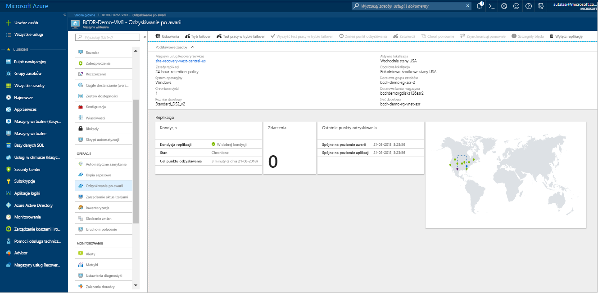

# Konfigurowanie odzyskiwania po awarii do regionu pomocniczego platformy Azure dla maszyny wirtualnej platformy Azure 

Usługa [Azure Site Recovery](site-recovery-overview.md) stanowi część strategii związanej z ciągłością biznesową i odzyskiwaniem po awarii przez zapewnienie niezawodnego działania aplikacji biznesowych podczas planowanych i nieplanowanych przestojów. Usługa Site Recovery zarządza odzyskiwaniem po awarii maszyn lokalnych i maszyn wirtualnych platformy Azure, a także organizuje to odzyskiwanie. Obejmuje to replikację, przechodzenie w tryb failover i odzyskiwanie.

W tym samouczku Szybki start opisano sposób replikowania maszyny wirtualnej platformy Azure w innym regionie platformy Azure.

Jeśli nie masz subskrypcji platformy Azure, przed rozpoczęciem utwórz [bezpłatne konto](https://azure.microsoft.com/free/?WT.mc_id=A261C142F).

> [!NOTE]
> Ten artykuł prowadzi nowego użytkownika przez środowisko usługi Azure Site Recovery, przy czym używane są opcje domyślne, a dostosowywanie jest minimalne. Aby dowiedzieć się więcej o różnych ustawieniach, które można dostosować, zapoznaj się z [samouczkiem dotyczącym włączania replikacji maszyn wirtualnych platformy Azure](azure-to-azure-tutorial-enable-replication.md)

## Zaloguj się do platformy Azure.

Zaloguj się do witryny Azure Portal na stronie http://portal.azure.com.

## Włączanie replikacji maszyny wirtualnej platformy Azure

1. W witrynie Azure Portal kliknij pozycję **Maszyny wirtualne** i wybierz tę, którą chcesz zreplikować.
2. W obszarze **Operacje** kliknij pozycję **Odzyskiwanie po awarii**.
3. W obszarze **Konfigurowanie odzyskiwania po awarii** > **Region docelowy** wybierz region docelowy, w którym maszyna będzie replikowana.
4. W przypadku tego przewodnika Szybki Start należy zaakceptować ustawienia domyślne.
5. Kliknij pozycję **Włącz replikację**. Spowoduje to uruchomienie zadania włączającego replikację dla maszyny wirtualnej.

    

## Weryfikowanie ustawień

Po zakończeniu zadania replikacji można sprawdzić stan replikacji, zmodyfikować ustawienia replikacji i przetestować wdrożenie.

1. W menu maszyny wirtualnej kliknij pozycję **Odzyskiwanie po awarii**.
2. Można sprawdzić kondycję replikacji, utworzone punkty odzyskiwania oraz regiony źródłowy i docelowy na mapie.

   

## Oczyszczanie zasobów

Replikowanie maszyny wirtualnej w regionie podstawowym jest zatrzymywane w przypadku wyłączenia dla niej replikacji:

- Ustawienia replikacji źródła są automatycznie czyszczone. Pamiętaj, że rozszerzenie usługi Site Recovery, które jest instalowane w ramach replikacji, nie jest usuwane i należy je usunąć ręcznie. 
- Zatrzymywane jest też rozliczanie usługi Site Recovery dla danej maszyny wirtualnej.

Zatrzymaj replikację w następujący sposób

1. Wybierz maszynę wirtualną.
2. W obszarze **Odzyskiwanie po awarii** kliknij pozycję **Wyłącz replikację**.

   

## Następne kroki

W tym samouczku Szybki start zreplikowano pojedynczą maszynę wirtualną w regionie pomocniczym. Teraz możesz poznać więcej opcji i spróbować przeprowadzić replikowanie zestawu maszyn wirtualnych platformy Azure przy użyciu planu odzyskiwania.

> [!div class="nextstepaction"]
> [Konfigurowanie odzyskiwania po awarii dla maszyn wirtualnych platformy Azure](azure-to-azure-tutorial-enable-replication.md)
