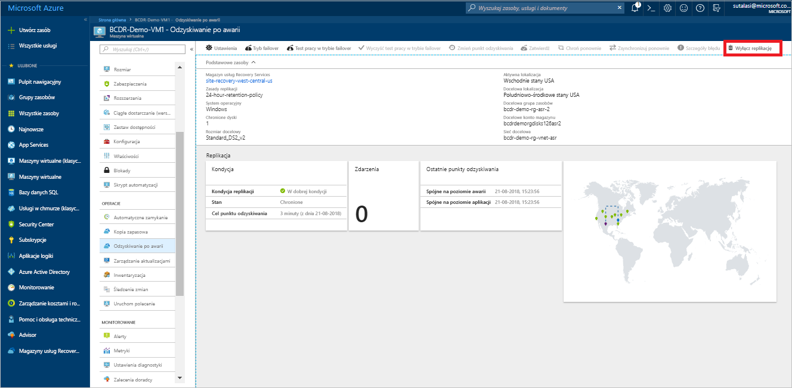

# Konfigurowanie odzyskiwania po awarii do regionu pomocniczego platformy Azure dla maszyny wirtualnej platformy Azure        

Usługa [Azure Site Recovery](site-recovery-overview.md) stanowi część strategii związanej z ciągłością biznesową i odzyskiwaniem po awarii przez zapewnienie niezawodnego działania aplikacji biznesowych podczas planowanych i nieplanowanych przestojów. Usługa Site Recovery zarządza odzyskiwaniem po awarii maszyn lokalnych i maszyn wirtualnych platformy Azure, a także organizuje to odzyskiwanie. Obejmuje to replikację, przechodzenie w tryb failover i odzyskiwanie.

W tym przewodniku szybki start opisano sposób konfigurowania odzyskiwania po awarii dla maszyny wirtualnej platformy Azure przez replikację do innego regionu platformy Azure.

Jeśli nie masz subskrypcji platformy Azure, przed rozpoczęciem utwórz [bezpłatne konto](https://azure.microsoft.com/free/?WT.mc_id=A261C142F).

> [!NOTE]
> Ten artykuł stanowi krótki przewodnik dla nowych użytkowników. Używa najprostszej ścieżki z opcjami domyślnymi i minimalnym dostosowaniem.  Aby zapoznać się z [naszym samouczkiem, zobacz nasz samouczek](azure-to-azure-tutorial-enable-replication.md).

## Zaloguj się do platformy Azure.

Zaloguj się do witryny Azure Portal na stronie https://portal.azure.com.

## Włączanie replikacji maszyny wirtualnej platformy Azure

1. W menu Azure Portal wybierz pozycję **maszyny wirtualne**lub Wyszukaj i wybierz pozycję *maszyny wirtualne* na dowolnej stronie. Wybierz maszynę wirtualną, którą chcesz replikować.
2. W obszarze **Operacja** wybierz pozycję **Odzyskiwanie po awarii**.
3. W obszarze **Konfigurowanie odzyskiwania po awarii** > **Region docelowy** wybierz region docelowy, w którym maszyna będzie replikowana.
4. W przypadku tego przewodnika Szybki Start należy zaakceptować ustawienia domyślne.
5. Wybierz kolejno pozycje **Recenzja + Uruchom replikację**. Następnie wybierz pozycję **Rozpocznij replikację** , aby uruchomić zadanie umożliwiające REPLIKACJĘ maszyny wirtualnej.

    

## Weryfikowanie ustawień

Po zakończeniu zadania replikacji można sprawdzić stan replikacji, zmodyfikować ustawienia replikacji i przetestować wdrożenie.

1. W menu Azure Portal wybierz pozycję **maszyny wirtualne**lub Wyszukaj i wybierz pozycję *maszyny wirtualne* na dowolnej stronie. Wybierz maszynę wirtualną, którą chcesz zweryfikować.
2. W obszarze **Operacja** wybierz pozycję **Odzyskiwanie po awarii**.

   Można sprawdzić kondycję replikacji, utworzone punkty odzyskiwania oraz regiony źródłowy i docelowy na mapie.

   

## Oczyszczanie zasobów

Replikowanie maszyny wirtualnej w regionie podstawowym jest zatrzymywane w przypadku wyłączenia dla niej replikacji:

- Ustawienia replikacji źródła są automatycznie czyszczone. Rozszerzenie Site Recovery zainstalowane na maszynie wirtualnej w ramach replikacji nie jest usuwane i należy je usunąć ręcznie. 
- Rozliczanie Site Recovery dla maszyny wirtualnej zostanie zatrzymane.

Zatrzymaj replikację w następujący sposób

1. W menu Azure Portal wybierz pozycję **maszyny wirtualne**lub Wyszukaj i wybierz pozycję *maszyny wirtualne* na dowolnej stronie. Wybierz maszynę wirtualną, którą chcesz zmodyfikować.
2. W obszarze **odzyskiwanie po awarii**wybierz pozycję **Wyłącz replikację**.

   

## Następne kroki

W tym samouczku Szybki start zreplikowano pojedynczą maszynę wirtualną w regionie pomocniczym. Teraz spróbuj przeprowadzić replikację wielu maszyn wirtualnych platformy Azure przy użyciu planu odzyskiwania.

> [!div class="nextstepaction"]
> [Konfigurowanie odzyskiwania po awarii dla maszyn wirtualnych platformy Azure](azure-to-azure-tutorial-enable-replication.md)
