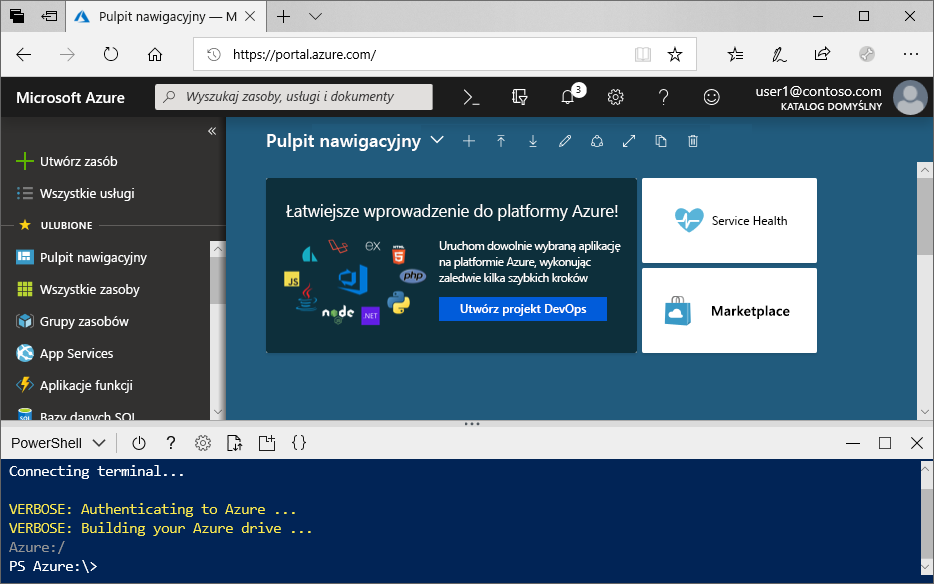
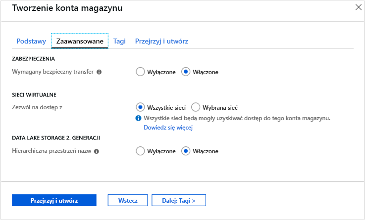

# <a name="quickstart-create-an-azure-data-lake-storage-gen2-storage-account"></a>Szybki start: Tworzenie konta usługi Azure Data Lake Storage 2. generacji

Usługa Azure Data Lake Storage 2. generacji [obsługuje usługę hierarchicznych przestrzeni nazw](data-lake-storage-introduction.md), która udostępnia natywny system plików oparty na katalogach przystosowany do pracy z rozproszonym systemem plików usługi Hadoop (HDFS, Hadoop Distributed File System). Dostęp do danych usługi Data Lake Storage 2. generacji z systemu plików HDFS można uzyskiwać za pośrednictwem [sterownika ABFS](data-lake-storage-abfs-driver.md).

W tym przewodniku Szybki start przedstawiono sposób tworzenia konta przy użyciu [witryny Azure Portal](https://portal.azure.com/) lub [programu Azure PowerShell](https://docs.microsoft.com/powershell/azure/overview) albo za pośrednictwem [interfejsu wiersza polecenia platformy Azure](https://docs.microsoft.com/cli/azure?view=azure-cli-latest).

## <a name="prerequisites"></a>Wymagania wstępne

Jeśli nie masz subskrypcji platformy Azure, przed rozpoczęciem utwórz [bezpłatne konto](https://azure.microsoft.com/free/). 

|           | Wymagania wstępne |
|-----------|--------------|
|Portal     | Brak         |
|PowerShell | Dla tego przewodnika Szybki start jest wymagany moduł PowerShell Az.Storage w wersji **0.7** lub nowszej. Aby określić bieżącą wersję, uruchom polecenie `Get-Module -ListAvailable Az.Storage`. Jeśli po uruchomieniu tego polecenia nie zostaną wyświetlone wyniki lub wyświetlona zostanie wersja inna niż **0.7**, należy uaktualnić moduł programu Powershell. Zobacz sekcję [Uaktualnianie modułu PowerShell](#upgrade-your-powershell-module) w tym przewodniku.
|Interfejs wiersza polecenia        | Możesz zalogować się do platformy Azure i uruchomić polecenia interfejsu wiersza polecenia platformy Azure w jeden z dwóch sposobów: <ul><li>Polecenia interfejsu wiersza polecenia platformy Azure możesz uruchamiać z poziomu witryny Azure Portal w usłudze Azure Cloud Shell </li><li>Możesz zainstalować interfejs wiersza polecenia i uruchamiać jego polecenia lokalnie</li></ul>|

Podczas pracy w wierszu polecenia masz opcję uruchamiania powłoki chmury platformy Azure lub instalowania interfejsu wiersza polecenia lokalnie.

### <a name="use-azure-cloud-shell"></a>Używanie usługi Azure Cloud Shell

Usługa Azure Cloud Shell jest bezpłatną powłoką Bash, którą można uruchamiać bezpośrednio w witrynie Azure Portal. Ma ona wstępnie zainstalowany interfejs wiersza polecenia platformy Azure skonfigurowany do użycia z Twoim kontem. Kliknij przycisk **Cloud Shell** w menu w prawym górnym rogu witryny Azure Portal:

[](https://portal.azure.com)

Ten przycisk służy do uruchamiania interaktywnej powłoki, której możesz używać do wykonywania kroków opisanych w tym przewodniku Szybki start:

[](https://portal.azure.com)

### <a name="install-the-cli-locally"></a>Instalowanie interfejsu wiersza polecenia lokalnie

Interfejs wiersza polecenia platformy Azure możesz również zainstalować i używać go lokalnie. Ten przewodnik Szybki start wymaga interfejsu wiersza polecenia platformy Azure w wersji 2.0.38 lub nowszej. Uruchom polecenie `az --version`, aby dowiedzieć się, jaka wersja jest używana. Jeśli konieczna będzie instalacja lub uaktualnienie interfejsu, zobacz [Instalowanie interfejsu wiersza polecenia platformy Azure](/cli/azure/install-azure-cli).

## <a name="create-a-storage-account-with-azure-data-lake-storage-gen2-enabled"></a>Tworzenie konta magazynu z włączoną usługą Azure Data Lake Storage Gen2

Przed utworzeniem konta musisz najpierw utworzyć grupę zasobów, która działa jako kontener logiczny tworzonych kont magazynu lub innych zasobów platformy Azure. Jeśli chcesz oczyścić zasoby utworzone w tym przewodniku Szybki start, możesz po prostu usunąć grupę zasobów. Usunięcie grupy zasobów powoduje również usunięcie skojarzonego konta magazynu i wszystkich innych zasobów skojarzonych z tą grupą zasobów. Aby uzyskać więcej informacji dotyczących grup zasobów, zobacz [Omówienie usługi Azure Resource Manager](../../azure-resource-manager/resource-group-overview.md).

> [!NOTE]
> Aby korzystać z zalet funkcji usługi Data Lake Storage 2. generacji, należy tworzyć nowe konta magazynu jako typ **StorageV2 (ogólnego przeznaczenia w wersji 2)**.  

Aby uzyskać więcej informacji dotyczących kont magazynu, zobacz temat [Azure Storage account overview](../common/storage-account-overview.md) (Omówienie konta usługi Azure Storage).

Podczas określania nazwy konta magazynu należy pamiętać o następujących regułach:

- Nazwy kont usługi Storage muszą mieć długość od 3 do 24 znaków i mogą zawierać tylko cyfry i małe litery.
- Nazwa konta magazynu musi być unikatowa w obrębie platformy Azure. Każde konto magazynu musi mieć inną nazwę.

## <a name="create-an-account-using-the-azure-portal"></a>Tworzenie konta przy użyciu witryny Azure Portal

Zaloguj się do witryny [Azure Portal](https://portal.azure.com).

### <a name="create-a-resource-group"></a>Tworzenie grupy zasobów

Aby utworzyć grupę zasobów w witrynie Azure Portal, wykonaj następujące kroki:

1. W witrynie Azure Portal rozwiń menu po lewej stronie, aby otworzyć menu usług, a następnie wybierz pozycję **Grupy zasobów**.
2. Kliknij przycisk **Dodaj**, aby dodać nową grupę zasobów.
3. Wprowadź nazwę nowej grupy zasobów.
4. Wybierz subskrypcję, w ramach której chcesz utworzyć nową grupę zasobów.
5. Wybierz lokalizację grupy zasobów.
6. Kliknij przycisk **Utwórz**.  

   

### <a name="create-a-general-purpose-v2-storage-account"></a>Tworzenie konta magazynu ogólnego przeznaczenia w wersji 2

Aby utworzyć konto magazynu ogólnego przeznaczenia w wersji 2 w witrynie Azure Portal, wykonaj następujące kroki:

> [!NOTE]
> Hierarchiczna przestrzeń nazw jest obecnie dostępna we wszystkich regionach publicznych. Jest ona obecnie niedostępna w suwerennych chmurach.

1. W witrynie Azure Portal rozwiń menu po lewej stronie, aby otworzyć menu usług, a następnie wybierz pozycję **Wszystkie usługi**. Następnie przewiń w dół do pozycji **Storage** i wybierz pozycję **Konta magazynu**. W oknie **Konta magazynu**, które zostanie wyświetlone, wybierz pozycję **Dodaj**.
2. Wybierz **subskrypcję** i **grupę zasobów**, które zostały utworzone wcześniej.
3. Wprowadź nazwę konta magazynu.
4. Ustaw pole **Lokalizacja** na **Zachodnie stany USA 2**.
5. Pozostaw w tych polach wartości domyślne: **Wydajność**, **Rodzaj konta**, **Replikacja** i **Warstwa dostępu**.
6. Wybierz subskrypcję, w ramach której chcesz utworzyć konto magazynu.
7. Wybierz pozycję **Dalej: Zaawansowane >**
8. Pozostaw wartości domyślne w polach **ZABEZPIECZENIA** i **SIECI WIRTUALNE**.
9. W sekcji **Data Lake Storage 2. generacji (wersja zapoznawcza)** ustaw pole na **Hierarchiczna przestrzeń nazw** na **Włączono**.
10. Kliknij pozycję **Przeglądanie + tworzenie**, aby utworzyć konto magazynu.

    

Konto magazynu zostało utworzone za pośrednictwem portalu.

### <a name="clean-up-resources"></a>Oczyszczanie zasobów

Aby usunąć grupę zasobów za pomocą witryny Azure Portal:

1. W witrynie Azure Portal rozwiń menu po lewej stronie, aby otworzyć menu usług, a następnie wybierz pozycję **Grupy zasobów**, aby wyświetlić listę grup zasobów.
2. Znajdź grupę zasobów do usunięcia, a następnie kliknij prawym przyciskiem myszy przycisk **Więcej** (**...** ) po prawej stronie listy.
3. Wybierz pozycję **Usuń grupę zasobów** i potwierdź.

## <a name="create-an-account-using-powershell"></a>Tworzenie konta przy użyciu programu PowerShell

Najpierw zainstaluj najnowszą wersję modułu [PowerShellGet](https://docs.microsoft.com/powershell/gallery/installing-psget).

Następnie uaktualnij moduł programu PowerShell, zaloguj się do subskrypcji platformy Azure, utwórz grupę zasobów i utwórz konto magazynu.

### <a name="upgrade-your-powershell-module"></a>Uaktualnianie modułu PowerShell

[!INCLUDE [updated-for-az](../../../includes/updated-for-az.md)]

Aby zapewnić interakcję z usługą Data Lake Storage 2. generacji przy użyciu programu PowerShell, należy zainstalować moduł Az.Storage w wersji **0.7** lub nowszej.

Rozpocznij od otwarcia sesji programu PowerShell z podwyższonym poziomem uprawnień.

Instalacja modułu Az.Storage

```powershell
Install-Module Az.Storage -Repository PSGallery -RequiredVersion 0.7.0 -AllowPrerelease -AllowClobber -Force
```

> [!NOTE]
> Moduły Azure Powershell Az są preferowanymi modułami podczas pracy z usługami platformy Azure w programie Powershell. Aby dowiedzieć się więcej, zobacz [Wprowadzenie do nowego modułu Az programu Azure PowerShell](https://docs.microsoft.com/powershell/azure/new-azureps-module-az).

### <a name="log-in-to-your-azure-subscription"></a>Logowanie się do subskrypcji platformy Azure

Użyj polecenia `Login-AzAccount`, a następnie postępuj zgodnie z instrukcjami wyświetlanymi na ekranie w celu uwierzytelnienia.

```powershell
Login-AzAccount
```

### <a name="create-a-resource-group"></a>Tworzenie grupy zasobów

Aby utworzyć nową grupę zasobów za pomocą programu PowerShell, użyj polecenia [New-AzResourceGroup](/powershell/module/az.resources/new-azresourcegroup): 

> [!NOTE]
> Hierarchiczna przestrzeń nazw jest obecnie dostępna we wszystkich regionach publicznych. Jest ona obecnie niedostępna w suwerennych chmurach.

```powershell
# put resource group in a variable so you can use the same group name going forward,
# without hardcoding it repeatedly
$resourceGroup = "storage-quickstart-resource-group"
$location = "westus2"
New-AzResourceGroup -Name $resourceGroup -Location $location
```

### <a name="create-a-general-purpose-v2-storage-account"></a>Tworzenie konta magazynu ogólnego przeznaczenia w wersji 2

Aby utworzyć konto magazynu ogólnego przeznaczenia w wersji 2 z poziomu programu PowerShell przy użyciu magazynu lokalnie nadmiarowego (LRS), użyj polecenia [New-AzStorageAccount](/powershell/module/az.storage/New-azStorageAccount):

```powershell
$location = "westus2"

New-AzStorageAccount -ResourceGroupName $resourceGroup `
  -Name "storagequickstart" `
  -Location $location `
  -SkuName Standard_LRS `
  -Kind StorageV2 `
  -EnableHierarchicalNamespace $True
```

### <a name="clean-up-resources"></a>Oczyszczanie zasobów

Aby usunąć grupę zasobów i skojarzone z nią zasoby, w tym nowe konto magazynu, użyj polecenia [Remove-AzResourceGroup](/powershell/module/az.resources/remove-azresourcegroup): 

```powershell
Remove-AzResourceGroup -Name $resourceGroup
```

## <a name="create-an-account-using-azure-cli"></a>Tworzenie konta przy użyciu interfejsu wiersza polecenia platformy Azure

Aby uruchomić usługę Azure Cloud Shell, zaloguj się do witryny [Azure Portal](https://portal.azure.com).

Aby zalogować się do lokalnej instalacji interfejsu wiersza polecenia, uruchom polecenie logowania:

```cli
az login
```

### <a name="add-the-cli-extension-for-azure-data-lake-gen-2"></a>Dodawanie rozszerzenia wiersza polecenia dla usługi Azure Data Lake 2. generacji

Aby zapewnić interakcję z usługą Data Lake Storage 2. generacji przy użyciu interfejsu wiersza polecenia, dodaj rozszerzenie do powłoki.

W tym celu wprowadź następujące polecenie przy użyciu usługi Cloud Shell lub powłoki lokalnej: `az extension add --name storage-preview`

### <a name="create-a-resource-group"></a>Tworzenie grupy zasobów

Aby utworzyć nową grupę zasobów za pomocą interfejsu wiersza polecenia platformy Azure, użyj polecenia [az group create](/cli/azure/group#az_group_create).

```azurecli-interactive
az group create `
    --name storage-quickstart-resource-group `
    --location westus2
```

> [!NOTE]
> > Hierarchiczna przestrzeń nazw jest obecnie dostępna we wszystkich regionach publicznych. Jest ona obecnie niedostępna w suwerennych chmurach.

### <a name="create-a-general-purpose-v2-storage-account"></a>Tworzenie konta magazynu ogólnego przeznaczenia w wersji 2

Aby utworzyć konto magazynu ogólnego przeznaczenia w wersji 2 z poziomu interfejsu wiersza polecenia platformy Azure przy użyciu magazynu lokalnie nadmiarowego, użyj polecenia [az storage account create](/cli/azure/storage/account).

```azurecli-interactive
az storage account create `
    --name storagequickstart `
    --resource-group storage-quickstart-resource-group `
    --location westus2 `
    --sku Standard_LRS `
    --kind StorageV2 `
    --hierarchical-namespace true
```

### <a name="clean-up-resources"></a>Oczyszczanie zasobów

Aby usunąć grupę zasobów i skojarzone z nią zasoby, w tym nowe konto magazynu, użyj polecenia [az group delete](/cli/azure/group).

```azurecli-interactive
az group delete --name myResourceGroup
```

## <a name="next-steps"></a>Następne kroki

W tym przewodniku Szybki start utworzono konto magazynu z funkcjami usługi Data Lake Storage Gen2. Aby dowiedzieć się, jak przekazywać i pobierać obiekty blob z konta magazynu i do niego, zobacz następujący temat.

* [AzCopy V10](https://docs.microsoft.com/azure/storage/common/storage-use-azcopy-v10?toc=%2fazure%2fstorage%2fblobs%2ftoc.json)
