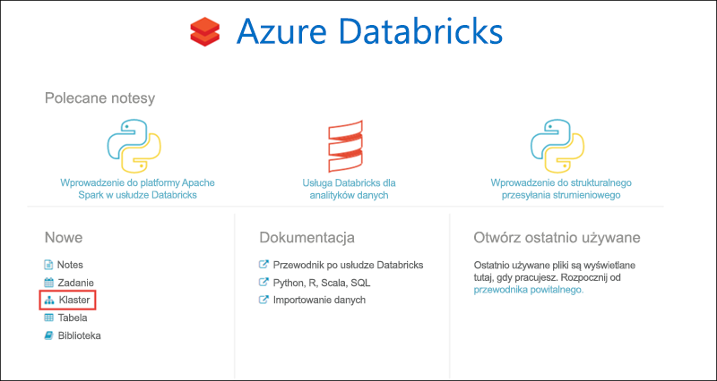
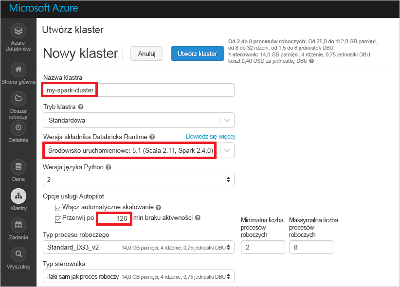
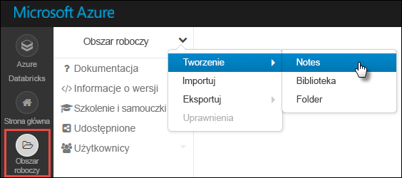
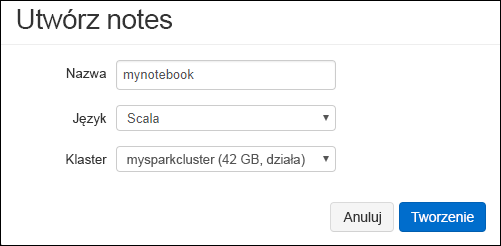
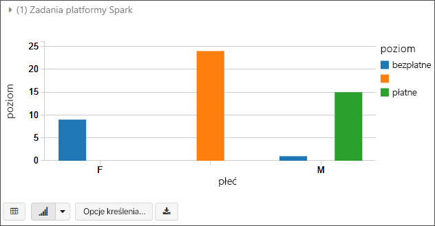
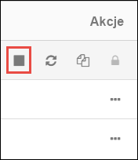

# <a name="quickstart-analyze-data-in-azure-data-lake-storage-gen2-by-using-azure-databricks"></a>Szybki start: Analizowanie danych usługi Azure Data Lake Storage Gen2 przy użyciu usługi Azure Databricks

W tym przewodniku Szybki start pokazano, jak uruchomić zadanie Apache Spark przy użyciu usługi Azure Databricks w celu przeprowadzenia analizy danych przechowywanych na koncie magazynu z włączoną usługą Azure Data Lake Storage Gen2.

W ramach zadania Spark przeanalizujesz dane subskrypcji kanałów radiowych, aby na podstawie danych demograficznych uzyskać szczegółowe informacje dotyczące korzystania z usług płatnych/bezpłatnych.

Jeśli nie masz subskrypcji platformy Azure, przed rozpoczęciem [utwórz bezpłatne konto](https://azure.microsoft.com/free/).

## <a name="prerequisites"></a>Wymagania wstępne

* Utwórz konto magazynu usługi Data Lake Gen2. Zobacz [Szybki start: Tworzenie konta usługi Azure Data Lake Storage Gen2](data-lake-storage-quickstart-create-account.md)

  Wklej nazwę konta magazynu do pliku tekstowego. Wkrótce będziesz jej potrzebować.

* Tworzenie jednostki usługi. Zobacz [Instrukcje: używanie portalu do tworzenia aplikacji usługi Azure AD i jednostki usługi w celu uzyskiwania dostępu do zasobów](https://docs.microsoft.com/azure/active-directory/develop/howto-create-service-principal-portal).

  Jest kilka rzeczy, o których należy pamiętać podczas wykonywania kroków przedstawionych w tym artykule.

  :heavy_check_mark: Wykonując kroki opisane w sekcji [Przypisywanie aplikacji do roli](https://docs.microsoft.com/azure/active-directory/develop/howto-create-service-principal-portal#assign-the-application-to-a-role) tego artykułu, upewnij się, że przypisano rolę **Współautor danych obiektu blob magazynu** do jednostki usługi.

  > [!IMPORTANT]
  > Upewnij się, że przypisano rolę w zakresie konta magazynu usługi Data Lake Storage Gen2. Możesz przypisać rolę do nadrzędnej grupy zasobów lub subskrypcji, ale będzie zgłaszany błąd dotyczący uprawnień do momentu rozpropagowania przypisań roli do konta magazynu.

  :heavy_check_mark: Wykonując kroki opisane w [pobieranie wartości do logowania](https://docs.microsoft.com/azure/active-directory/develop/howto-create-service-principal-portal#get-values-for-signing-in) części artykułu, wklej identyfikator dzierżawy, identyfikator aplikacji i wartości hasła do pliku tekstowego. Wkrótce będą potrzebne.

## <a name="create-an-azure-databricks-workspace"></a>Tworzenie obszaru roboczego usługi Azure Databricks

W tej sekcji utworzysz obszar roboczy usługi Azure Databricks przy użyciu witryny Azure Portal.

1. W witrynie Azure Portal wybierz pozycję **Utwórz zasób** > **Analiza** > **Azure Databricks**.

    

2. W obszarze **Usługa Azure Databricks** podaj wartości umożliwiające utworzenie obszaru roboczego usługi Databricks.

    

    Podaj następujące wartości:

    |Właściwość  |Opis  |
    |---------|---------|
    |**Nazwa obszaru roboczego**     | Podaj nazwę obszaru roboczego usługi Databricks.        |
    |**Subskrypcja**     | Z listy rozwijanej wybierz subskrypcję platformy Azure.        |
    |**Grupa zasobów**     | Określ, czy chcesz utworzyć nową grupę zasobów, czy użyć istniejącej grupy. Grupa zasobów to kontener, który zawiera powiązane zasoby dla rozwiązania platformy Azure. Aby uzyskać więcej informacji, zobacz [Omówienie usługi Azure Resource Manager](../../azure-resource-manager/resource-group-overview.md). |
    |**Lokalizacja**     | Wybierz pozycję **Zachodnie stany USA 2**. Jeśli wolisz, możesz wybrać inny region publiczny.        |
    |**Warstwa cenowa**     |  Wybierz warstwę **Standardowa** lub **Premium**. Aby uzyskać więcej informacji o tych warstwach, zobacz [stronę usługi Databricks](https://azure.microsoft.com/pricing/details/databricks/).       |

3. Tworzenie konta potrwa kilka minut. Stan operacji można monitorować za pomocą paska postępu znajdującego się u góry.

4. Wybierz pozycję **Przypnij do pulpitu nawigacyjnego**, a następnie pozycję **Utwórz**.

## <a name="create-a-spark-cluster-in-databricks"></a>Tworzenie klastra Spark w usłudze Databricks

1. W witrynie Azure Portal przejdź do utworzonego obszaru roboczego usługi Databricks, a następnie wybierz pozycję **Uruchom obszar roboczy**.

2. Nastąpi przekierowanie do portalu usługi Azure Databricks. W portalu wybierz pozycję **Nowy** > **Klaster**.

    

3. Na stronie **Nowy klaster** podaj wartości, aby utworzyć klaster.

    

    Zaakceptuj pozostałe wartości domyślne poza następującymi:

    * Wprowadź nazwę klastra.
    * Utwórz klaster, używając środowiska uruchomieniowego w wersji **5.1**.
    * Upewnij się, że pole wyboru **Zakończ po 120 min aktywności** zostało zaznaczone. Podaj czas (w minutach), po jakim działanie klastra ma zostać zakończone, jeśli nie jest używany.

4. Wybierz pozycję **Utwórz klaster**. Po uruchomieniu klastra możesz dołączyć do niego notesy i uruchamiać zadania Spark.

Aby uzyskać więcej informacji na temat tworzenia klastrów, zobacz [Create a Spark cluster in Azure Databricks](https://docs.azuredatabricks.net/user-guide/clusters/create.html) (Tworzenie klastra Spark w usłudze Azure Databricks).

## <a name="create-storage-account-file-system"></a>Tworzenie systemu plików konta magazynu

W tej sekcji utworzysz notes w obszarze roboczym usługi Azure Databricks, a następnie uruchomisz fragmenty kodu, aby skonfigurować konto magazynu.

1. W witrynie [Azure Portal](https://portal.azure.com) przejdź do utworzonego obszaru roboczego usługi Azure Databricks, a następnie wybierz pozycję **Uruchom obszar roboczy**.

2. W lewym okienku wybierz pozycję **Obszar roboczy**. Z listy rozwijanej **Obszar roboczy** wybierz pozycję **Utwórz** > **Notes**.

    

3. W oknie dialogowym**Tworzenie notesu** wprowadź nazwę notesu. Jako język wybierz pozycję **Scala**, a następnie wybierz utworzony wcześniej klaster Spark.

    

    Wybierz pozycję **Utwórz**.

4. Skopiuj i wklej następujący blok kodu do pierwszej komórki, ale jeszcze nie uruchamiaj kodu.

   ```scala
   spark.conf.set("fs.azure.account.auth.type.<storage-account-name>.dfs.core.windows.net", "OAuth")
   spark.conf.set("fs.azure.account.oauth.provider.type.<storage-account-name>.dfs.core.windows.net", "org.apache.hadoop.fs.azurebfs.oauth2.ClientCredsTokenProvider")
   spark.conf.set("fs.azure.account.oauth2.client.id.<storage-account-name>.dfs.core.windows.net", "<appID>")
   spark.conf.set("fs.azure.account.oauth2.client.secret.<storage-account-name>.dfs.core.windows.net", "<password>")
   spark.conf.set("fs.azure.account.oauth2.client.endpoint.<storage-account-name>.dfs.core.windows.net", "https://login.microsoftonline.com/<tenant-id>/oauth2/token")
   spark.conf.set("fs.azure.createRemoteFileSystemDuringInitialization", "true")
   dbutils.fs.ls("abfss://<file-system-name>@<storage-account-name>.dfs.core.windows.net/")
   spark.conf.set("fs.azure.createRemoteFileSystemDuringInitialization", "false")

   ```

    > [!NOTE]
    > Ten blok kodu uzyskuje bezpośredni dostęp do punktu końcowego usługi Data Lake Gen2 przy użyciu protokołu OAuth, ale istnieją też inne sposoby łączenia obszaru roboczego usługi Databricks z kontem usługi Data Lake Storage Gen2. Możesz na przykład zainstalować system plików przy użyciu protokołu OAuth lub użyć dostępu bezpośredniego z kluczem wspólnym. <br>Aby zapoznać się z przykładami tych metod, zobacz artykuł na temat usługi [Azure Data Lake Storage Gen2](https://docs.azuredatabricks.net/spark/latest/data-sources/azure/azure-datalake-gen2.html) w witrynie internetowej usługi Azure Databricks.

5. W tym bloku kodu zamień symbole zastępcze `storage-account-name`, `appID`, `password` i `tenant-id` na wartości zebrane podczas tworzenia jednostki usługi. Ustaw wartość symbolu zastępczego `file-system-name` na dowolną nazwę, którą chcesz nadać systemowi plików.

    > [!NOTE]
    > W środowisku produkcyjnym rozważ przechowywanie klucza uwierzytelniania w usłudze Azure Databricks. Następnie dodaj do bloku kodu klucz wyszukiwania zamiast klucza uwierzytelniania. Po zakończeniu tego samouczka Szybki start zobacz artykuł na temat usługi [Azure Data Lake Storage Gen2](https://docs.azuredatabricks.net/spark/latest/data-sources/azure/azure-datalake-gen2.html) w witrynie internetowej usługi Azure Databricks, aby zapoznać się z przykładami tego podejścia.

6. Naciśnij klawisze **SHIFT+ENTER**, aby uruchomić kod w tym bloku.

## <a name="ingest-sample-data"></a>Pozyskiwanie przykładowych danych

Przed przystąpieniem do pracy z tą sekcją musisz zapewnić spełnienie następujących wymagań wstępnych:

Wprowadź następujący kod w komórce notesu:

    %sh wget -P /tmp https://raw.githubusercontent.com/Azure/usql/master/Examples/Samples/Data/json/radiowebsite/small_radio_json.json

W tej komórce naciśnij klawisze **SHIFT + ENTER**, aby uruchomić kod.

Teraz w nowej komórce pod tą komórką wprowadź następujący kod, zastępując wartości w nawiasach tymi samymi wartościami, których użyto wcześniej:

    dbutils.fs.cp("file:///tmp/small_radio_json.json", "abfss://<file-system>@<account-name>.dfs.core.windows.net/")

W tej komórce naciśnij klawisze **SHIFT + ENTER**, aby uruchomić kod.

## <a name="run-a-spark-sql-job"></a>Uruchamianie zadania Spark SQL

Aby uruchomić zadanie Spark SQL w danych, wykonaj poniższe zadania.

1. Uruchom instrukcję SQL, aby utworzyć tabelę tymczasową przy użyciu danych z przykładowego pliku danych JSON, **small_radio_json.json**. W poniższym fragmencie kodu zamień wartości symboli zastępczych na właściwe nazwy systemu plików i konta magazynu. Za pomocą utworzonego wcześniej notesu wklej ten fragment w nowej komórce kodu w notesie, a następnie naciśnij klawisze SHIFT+ENTER.

    ```sql
    %sql
    DROP TABLE IF EXISTS radio_sample_data;
    CREATE TABLE radio_sample_data
    USING json
    OPTIONS (
     path  "abfss://<file-system-name>@<storage-account-name>.dfs.core.windows.net/small_radio_json.json"
    )
    ```

    Po pomyślnym wykonaniu polecenia wszystkie dane z pliku JSON znajdą się w tabeli w klastrze usługi Databricks.

    Magiczne polecenie języka `%sql` umożliwia uruchamianie kodu SQL z notesu, nawet jeśli notes jest innego typu. Aby uzyskać więcej informacji, zobacz [Mixing languages in a notebook](https://docs.azuredatabricks.net/user-guide/notebooks/index.html#mixing-languages-in-a-notebook) (Łączenie języków w notesie).

2. Przyjrzyjmy się migawce przykładowych danych JSON, aby lepiej zrozumieć uruchamiane zapytanie. Wklej poniższy fragment kodu w komórce kodu i naciśnij klawisze **SHIFT+ENTER**.

    ```sql
    %sql
    SELECT * from radio_sample_data
    ```

3. Pojawią się tabelaryczne dane wyjściowe, takie jak pokazano na poniższym zrzucie ekranu (przedstawiono tu tylko niektóre kolumny):

    

    W danych przykładowych jest rejestrowana między innymi płeć odbiorców kanału radiowego (nazwa kolumny **gender** — „płeć”) i informacja o tym, czy subskrypcja jest bezpłatna, czy płatna (nazwa kolumny **level** — „poziom”).

4. Teraz utworzysz reprezentację wizualną tych danych w celu pokazania, ilu użytkowników każdej płci ma konta bezpłatne, a ilu opłaca subskrypcję. U dołu tabelarycznych danych wyjściowych kliknij ikonę **Wykres słupkowy**, a następnie pozycję **Opcje wykresu**.

    

5. W obszarze **Dostosowywanie wykresu** przeciągnij i upuść wartości, jak pokazano na zrzucie ekranu.

    

    - W obszarze **Klucze** ustaw wartość **gender** (płeć).
    - W obszarze **Grupowania serii** ustaw wartość **level** (poziom).
    - W obszarze **Wartości** ustaw wartość **level** (poziom).
    - W obszarze **Agregacja** ustaw wartość **LICZBA**.

6. Kliknij przycisk **Zastosuj**.

7. Wynikiem będzie reprezentacja wizualna przedstawiona na zrzucie ekranu:

     

## <a name="clean-up-resources"></a>Oczyszczanie zasobów

Gdy skończysz pracować z tym artykułem, możesz zakończyć działanie klastra. W obszarze roboczym usługi Azure Databricks wybierz pozycję **Klastry** i znajdź klaster, którego działanie chcesz zakończyć. Przesuń kursor myszy na wielokropek w kolumnie **Akcje** i wybierz ikonę **Przerwij**.



Jeśli nie zakończysz działania klastra ręcznie, zostanie on automatycznie zatrzymany, o ile podczas tworzenia klastra zaznaczono pole wyboru **Zakończ po \_\_ min nieaktywności**. Jeśli ustawisz tę opcję, klaster zatrzyma się po upłynięciu wyznaczonego okresu nieaktywności.

## <a name="next-steps"></a>Kolejne kroki

W tym artykule utworzono klaster Spark w usłudze Azure Databricks i uruchomiono zadanie Spark przy użyciu danych na koncie magazynu z włączoną usługą Data Lake Storage Gen2. Aby dowiedzieć się, jak zaimportować dane z innych źródeł danych do usługi Azure Databricks, zobacz [Spark data sources](https://docs.azuredatabricks.net/spark/latest/data-sources/index.html) (Źródła danych platformy Spark). Przejdź do następnego artykułu, aby dowiedzieć się, jak wykonać operację ETL (wyodrębnianie, przekształcanie i ładowanie danych) przy użyciu usługi Azure Databricks.

> [!div class="nextstepaction"]
>[Wyodrębnianie, przekształcanie i ładowanie danych przy użyciu usługi Azure Databricks](../../azure-databricks/databricks-extract-load-sql-data-warehouse.md)
